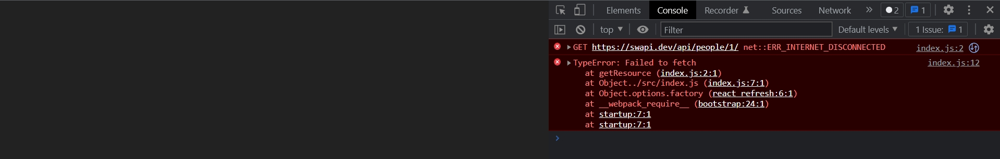
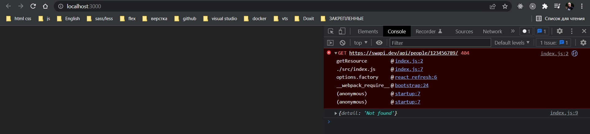
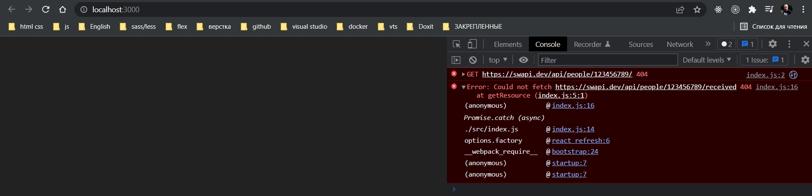

# 005_Обработка_ошибок_в_Fetch_API

У нас может быть два типа ошибок. 

Первый тип ошибок это сетевые ошибки. Мы попробовали вызвать сервер, но сервер не ответил. Возможно у нас проблемы с инернентом. Возможно сервер недоступен.

В этом случае в response нам прелитит статус, и promise будет rejected.

Для того что бы обработать ощибку мы должны в цепочку промисов добавить блок catch.

На секунду отключаю internet.

```js
const getResource = async (url) => {
  const response = await fetch(url); //получаю ответ с сервера
  const body = await response.json(); // получаю тело запроса
  return body;
};

getResource("https://swapi.dev/api/people/1/")
  .then((body) => {
    console.log(body);
  })
  .catch((error) => {
    console.error(error);
  });

```



<br/>
<br/>
<br/>

Но существует еще и второй тип ошибок. Это те ошибки, которые сообщает нам сервер. К примеру если персонаж с этим id не был найден, сервер должен вернуть 404

```js
const getResource = async (url) => {
  const response = await fetch(url); //получаю ответ с сервера
  const body = await response.json(); // получаю тело запроса
  return body;
};

getResource("https://swapi.dev/api/people/123456789/")
  .then((body) => {
    console.log(body);
  })
  .catch((error) => {
    console.error(error);
  });

```


404 - это ошибка которую выдал нам сервер. Но в качестве результата мы получили detail:"Not found". Т.е. наш блок catch не сработал. Сработал наш блок then.

Почему наш код не выкинул ошибку учитывая то что сервер ответил 404. 

Логика fetch в этом случае очень простая. Мы вызвали сервер. мы получили response, код у этого ответа 404. Но при этом сервер вернул какой-то валидный ответ. У нас есть тело ответа. detail:"Not found".

С точки зрения fetch его функция выполнена отлично. Мы послали запрос. Мы получили ответ.

А вот интерпретация этого ответа - это вопрос клиентского кода.

В большинстве приложение которые вы будуте писать, вы захотите что бы ошибочные коды сервера давали точно такой же результат как и ошибка сети.

Написать такой код совсем не сложно.

Если результат один из 200 кодов, то промис resolve.ok, то response будет true. иначе он будет false.

```js
const getResource = async (url) => {
    const response = await fetch(url); //получаю ответ с сервера
    //Обработка ошибки на клиенте
    if (!response.ok) {
        throw new Error(`Could not fetch ${url}` + `received ${response.status}`);
    }
    const body = await response.json(); // получаю тело запроса
    return body;
};

getResource("https://swapi.dev/api/people/123456789/")
    .then((body) => {
        console.log(body);
    })
    .catch((error) => {
        console.error(error);
    });

```



Таким образом наша функция getResource будет отклонять promise и в том случае когда у нас была сетевая ошибка, и в том случае кода сервер вернул какой-нибудь код кроме 200 - х кодов. 

На основании этого маленького кусочка кода мы сможем написать полноценный API клиен.

> Fetch отклоняет (reject) Promise, только если произошла ошибка сети(сервер не доступен)
> 
> Что бы проверить код результата можно использовать result.status
> 
> result.ok содержит true, если result.status содержит один из  ОК-статусов(200-299)