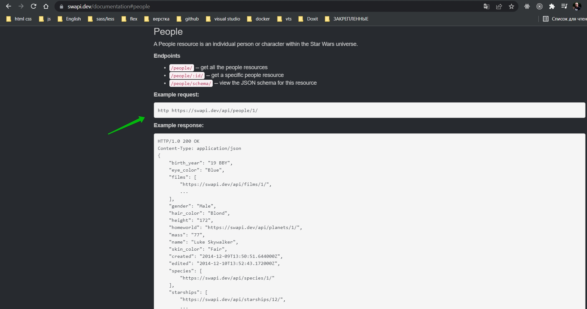
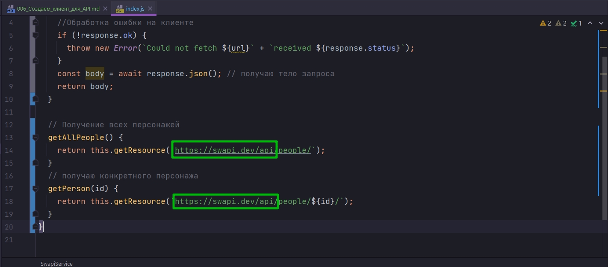
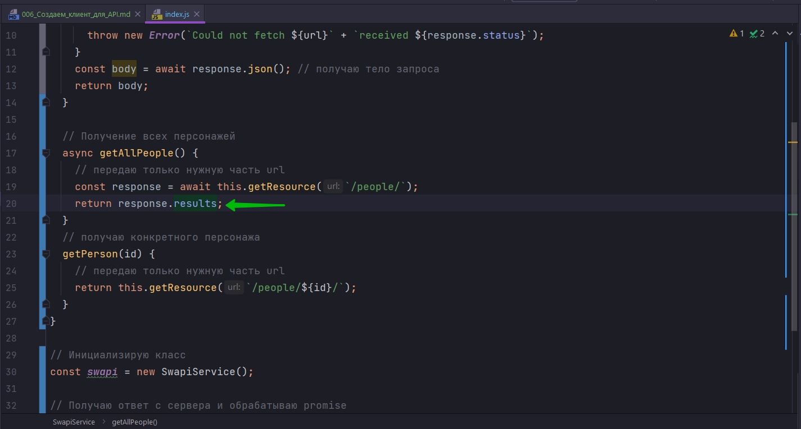
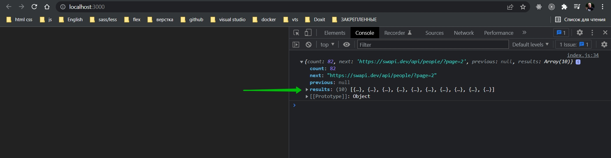
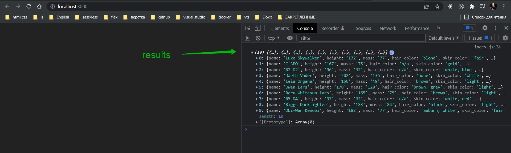

# 006_Создаем_клиент_для_API

Создаем полноценный класс клиент для Stat Wars API.

Называю класс SwapiService. Этот класс я буду использовать для того что бы инкапсулировать весь сетевой код и изолировать этот код от остальных частей приложения.

Классы сервисы это очень хорошая практика при разработке больших приложений. Таким образом весь код работы с данными находится в одном месте. И в будущем мы можем проще реализовать что-то вроде кэширования, или сменить источник данных. Или реализовать дополнительную логику фильтрации.

Для остальнго приложения SwapiService это просто асинхронный источник данных. А все особенности работы с этими данными инкапсулированы внутри. Их будет легко обновлять или тестировать, не касаясь при этом остальных частей приложения.

И так если я зайду в документацию и посмотрю Resources <https://swapi.dev/documentation>


Нас интересуют ресурсы People, StarShips, Planets.

И так посмотрим [People](https://swapi.dev/documentation#people) 



People у нас доступен по такому адресу: <http https://swapi.dev/api/people/1/>

и так же мы видим из чего у нас может состоять url строка. И мод каждую url строку реализую конкретные методы в своем классе.

```js
class SwapiService {
  async getResource() {
    const response = await fetch(url); //получаю ответ с сервера
    //Обработка ошибки на клиенте
    if (!response.ok) {
      throw new Error(`Could not fetch ${url}` + `received ${response.status}`);
    }
    const body = await response.json(); // получаю тело запроса
    return body;
  }

  // Получение всех персонажей
  getAllPeople() {
    return this.getResource(`https://swapi.dev/api/people/`);
  }
  // получаю конкретного персонажа
  getPerson(id) {
    return this.getResource(`https://swapi.dev/api/people/${id}/`);
  }
}

```

Метод getAllPeople возвращает функцию getResource, в которой идет вся логика обработки запроса на сервер. В эту функцию передаю url.

Далее метод получения конкретного персонажа getPerson на вход принимает конкретный id пользователя которого мы хотим найти. И далее в вызов функции getResource я передаю строку с конкретным id пользователя которого я хочу найти.



Вынесу в отдельную константу.

Мне не очень нравится что везде нужно писать одну и туже часть url строки. Выношу ее в константу.

```js
class SwapiService {
    // базовый url
    API_BASE = `https://swapi.dev/api`;

    async getResource(url) {
        // составляю строку из базового url и того url что прилетает из методов
        const response = await fetch(`${this.API_BASE}${url}`);
        //Обработка ошибки на клиенте
        if (!response.ok) {
            throw new Error(`Could not fetch ${url}` + `received ${response.status}`);
        }
        const body = await response.json(); // получаю тело запроса
        return body;
    }

    // Получение всех персонажей
    getAllPeople() {
        // передаю только нужную часть url
        return this.getResource(`/people/`);
    }
    // получаю конкретного персонажа
    getPerson(id) {
        // передаю только нужную часть url
        return this.getResource(`/people/${id}/`);
    }
}

// Код обработки данных


// Инициализирую класс
const swapi = new SwapiService();

// Получаю ответ с сервера и обрабатываю promise
swapi.getAllPeople().then((response) => {
    console.log(response);
});

```


Теперь сделаю что бы getAllPeople просто возвращал маасив людей.





```js
class SwapiService {
  // базовый url
  API_BASE = `https://swapi.dev/api`;

  async getResource(url) {
    // составляю строку из базового url и того url что прилетает из методов
    const response = await fetch(`${this.API_BASE}${url}`);
    //Обработка ошибки на клиенте
    if (!response.ok) {
      throw new Error(`Could not fetch ${url}` + `received ${response.status}`);
    }
    const body = await response.json(); // получаю тело запроса
    return body;
  }

  // Получение всех персонажей
  async getAllPeople() {
    // передаю только нужную часть url
    const response = await this.getResource(`/people/`);
    return response.results;
  }
  // получаю конкретного персонажа
  getPerson(id) {
    // передаю только нужную часть url
    return this.getResource(`/people/${id}/`);
  }
}

// Код обработки данных


// Инициализирую класс
const swapi = new SwapiService();

// Получаю ответ с сервера и обрабатываю promise
swapi.getAllPeople().then((response) => {
  console.log(response);
});

```



И теперь я могу обработать промис и к примеру вывести имена.

```js
class SwapiService {
  // базовый url
  API_BASE = `https://swapi.dev/api`;

  async getResource(url) {
    // составляю строку из базового url и того url что прилетает из методов
    const response = await fetch(`${this.API_BASE}${url}`);
    //Обработка ошибки на клиенте
    if (!response.ok) {
      throw new Error(`Could not fetch ${url}` + `received ${response.status}`);
    }
    const body = await response.json(); // получаю тело запроса
    return body;
  }

  // Получение всех персонажей
  async getAllPeople() {
    // передаю только нужную часть url
    const response = await this.getResource(`/people/`);
    return response.results;
  }
  // получаю конкретного персонажа
  getPerson(id) {
    // передаю только нужную часть url
    return this.getResource(`/people/${id}/`);
  }
}

// Код обработки данных

// Инициализирую класс
const swapi = new SwapiService();

// Получаю ответ с сервера и обрабатываю promise
swapi.getAllPeople().then((people) => {
  people.forEach((person) => {
    console.log(person.name);
  });
});

```


И так же проверяю как работает getPerson.

```js
class SwapiService {
    // базовый url
    API_BASE = `https://swapi.dev/api`;

    async getResource(url) {
        // составляю строку из базового url и того url что прилетает из методов
        const response = await fetch(`${this.API_BASE}${url}`);
        //Обработка ошибки на клиенте
        if (!response.ok) {
            throw new Error(`Could not fetch ${url}` + `received ${response.status}`);
        }
        const body = await response.json(); // получаю тело запроса
        return body;
    }

    // Получение всех персонажей
    async getAllPeople() {
        // передаю только нужную часть url
        const response = await this.getResource(`/people/`);
        return response.results;
    }
    // получаю конкретного персонажа
    async getPerson(id) {
        // передаю только нужную часть url
        return await this.getResource(`/people/${id}/`);
    }
}

// Код обработки данных


// Инициализирую класс
const swapi = new SwapiService();

// Получаю ответ с сервера и обрабатываю promise
swapi.getPerson(3).then((people) => {
    people.forEach((person) => {
        console.log(person.name);
    });
});

```


Мой вывод: теперь я обращаюсь к конкретному объекту массива. Мне не нужно перебирать массив.

```js
class SwapiService {
  // базовый url
  API_BASE = `https://swapi.dev/api`;

  async getResource(url) {
    // составляю строку из базового url и того url что прилетает из методов
    const response = await fetch(`${this.API_BASE}${url}`);
    //Обработка ошибки на клиенте
    if (!response.ok) {
      throw new Error(`Could not fetch ${url}` + `received ${response.status}`);
    }
    const body = await response.json(); // получаю тело запроса
    return body;
  }

  // Получение всех персонажей
  async getAllPeople() {
    // передаю только нужную часть url
    const response = await this.getResource(`/people/`);
    return response.results;
  }
  // получаю конкретного персонажа
  async getPerson(id) {
    // передаю только нужную часть url
    return await this.getResource(`/people/${id}/`);
  }
}

// Код обработки данных

// Инициализирую класс
const swapi = new SwapiService();

// Получаю ответ с сервера и обрабатываю promise
swapi.getPerson(3).then((person) => {
  console.log(person.name);
});

```


Закметьте что код который обрабатывает данные, он не знает ничего откуда эти данные беруться т.е. сетевой код полностью скрыт.

И следуюя этому паттерну, мы можем создать дополнительные функции для планет

```js
class SwapiService {
  // базовый url
  API_BASE = `https://swapi.dev/api`;

  async getResource(url) {
    // составляю строку из базового url и того url что прилетает из методов
    const response = await fetch(`${this.API_BASE}${url}`);
    //Обработка ошибки на клиенте
    if (!response.ok) {
      throw new Error(`Could not fetch ${url}` + `received ${response.status}`);
    }
    const body = await response.json(); // получаю тело запроса
    return body;
  }

  // Персонажи

  // Получение всех персонажей
  async getAllPeople() {
    // передаю только нужную часть url
    const response = await this.getResource(`/people/`);
    return response.results;
  }
  // получаю конкретного персонажа
  async getPerson(id) {
    // передаю только нужную часть url
    const response = await this.getResource(`/people/${id}/`);
    return response;
  }

  // Планеты

  // Получаю все планеты
  async getAllPlanets() {
    const response = await this.getResource(`/planets/`);
    return response;
  }
  //Получаю планету
  async getPlanet(id) {
    const response = await this.getResource(`/planets/${id}/`);
    return response;
  }

  //Космические корабли

  // Получаю все корабли
  async getAllStarShips() {
    const response = await this.getResource(`/starships/`);
    return response;
  }

  //Получаю космический корабль
  async getStarship(id) {
    const response = await this.getResource(`/starships/${id}/`);
    return response;
  }
}

// Код обработки данных

// Инициализирую класс
const swapi = new SwapiService();

// Получаю ответ с сервера и обрабатываю promise
swapi.getPerson(3).then((person) => {
  console.log(person.name);
});

```

> API - клиент
> 
> Код, который работает с сетью лучше изолировать в отдельный класс-сервис
> 
> Компоненты не должны знать откуда беруться данные
> 
> Такой подход упростит тестирование и поддержку кода, который работате с API