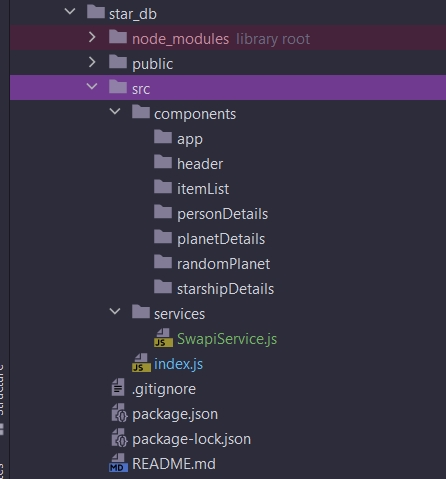
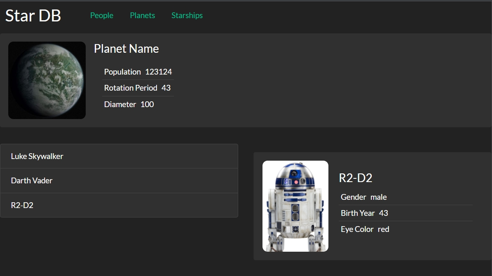

# 007_Создаем_компоненты_StarDB

Теперь когда у нас есть API клиент. Мы можем создавать наше приложение.

Когда я ачинаю писать новый React проект, как правило я начинаю с того что я создаю необходимые компоненты. И пускай они даже не работают с реальными данными. Пускай они даже еще не выполняют свои функции. Но по крайней мере я делаю так что бы визуально компоненты быди наместе.

Подумаем какие нам нужны компоненты. А затем создадим структуру файлов и папок для этих компонентов. Для того затем что бы все что нам оставалось сделать - это добавить поведение к нашим компонентам.

1. У нас в приложении явно прослеживается Header.
2. Следующий блок это блок случайная планета. Время от времени этот блок обновляется и показывает эту планету с данными про эту планету.
3. У нас есть список персонажей и соотвтетственно детали персонажа.
4. Так же у нас дублируется на других страницах Список планет и детали планеты. Список звездных кораблей и детали звездного корабля.


Пока создадим наши компоненты, пока не давая им никакого поведения. В последующем мы возьмем эту структуру проекта и начнем делать так что бы компоненты выполняли реальную работу.


Перенесем SwapiService в отдельный файл. создаю папку services и в ней файл SwapiService.js

```js
// src/services/SwapiService.js
export default class SwapiService {
    // базовый url
    API_BASE = `https://swapi.dev/api`;

    async getResource(url) {
        // составляю строку из базового url и того url что прилетает из методов
        const response = await fetch(`${this.API_BASE}${url}`);
        //Обработка ошибки на клиенте
        if (!response.ok) {
            throw new Error(`Could not fetch ${url}` + `received ${response.status}`);
        }
        const body = await response.json(); // получаю тело запроса
        return body;
    }

    // Персонажи

    // Получение всех персонажей
    async getAllPeople() {
        // передаю только нужную часть url
        const response = await this.getResource(`/people/`);
        return response.results;
    }
    // получаю конкретного персонажа
    async getPerson(id) {
        // передаю только нужную часть url
        const response = await this.getResource(`/people/${id}/`);
        return response;
    }

    // Планеты

    // Получаю все планеты
    async getAllPlanets() {
        const response = await this.getResource(`/planets/`);
        return response;
    }
    //Получаю планету
    async getPlanet(id) {
        const response = await this.getResource(`/planets/${id}/`);
        return response;
    }

    //Космические корабли

    // Получаю все корабли
    async getAllStarShips() {
        const response = await this.getResource(`/starships/`);
        return response;
    }

    //Получаю космический корабль
    async getStarship(id) {
        const response = await this.getResource(`/starships/${id}/`);
        return response;
    }
}

// Код обработки данных

// Инициализирую класс
const swapi = new SwapiService();

// Получаю ответ с сервера и обрабатываю promise
swapi.getPerson(3).then((person) => {
    console.log(person.name);
});

```




И теперь напишем заглужки для компонентов.

Компонентов заглушек ну прям очень много. И еще это займет много места если просто здесь разместить их код. Смотри в папке example код компонентов заглушек. А вот соответственно и сама страница созданная их этих компонентов заглушек.



> Компоненты StarDB
> 
> Начинать разработку React приложения удобно с создания разметки компонентов.
> Такие компоненты ничего не делают, они просто отображают данные
> 
> В финальной версии приложения разбивка на компоненты может измениться, но такой шаблон на React - хорошее начало.
