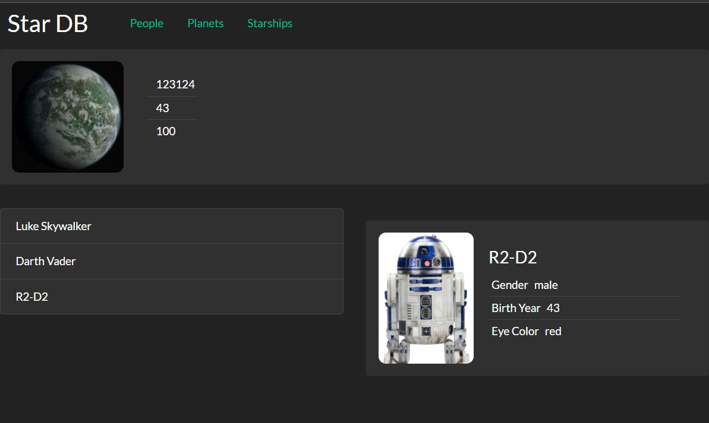
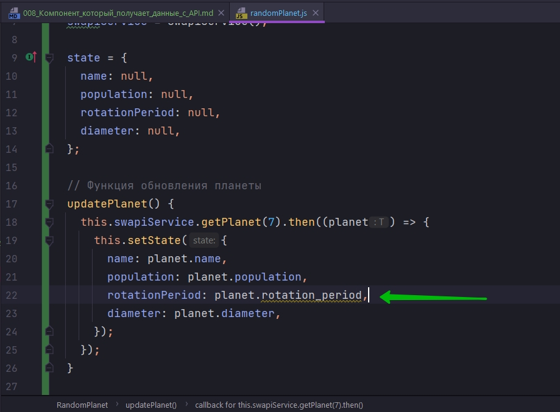
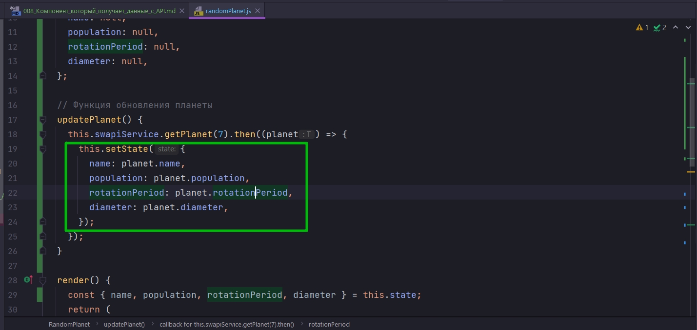
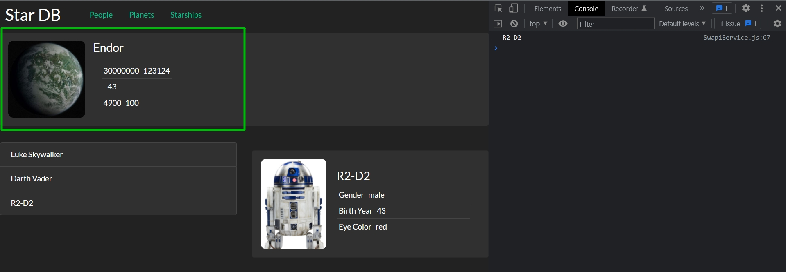
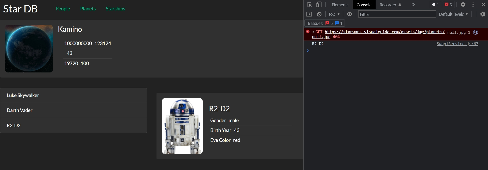

# 008_Компонент_который_получает_данные_с_API

Теперь когда у нас есть необходимые компоненты давайте сделаем так что бы один из компонентов начинал реально работать с сервером. 

В качестве примера мы возьмем компонент randomPlanet который должен показывать информацию о случайной планете каждые несколько сеунд. 

Для начало, в этом видео мы сделаем так, что бы randomPlanet просто получал данные о планете с сервиса.

Вот как сейчас выглядит этот компонент

```js
import React, { Component } from "react";
import "./randomPlanet.css";

class RandomPlanet extends Component {
  render() {
    return (
      <div className="random-planet jumbotron rounded">
        
        <div>
          <h4>Planet Name</h4>
          <ul className="list-group list-group-flush">
            <li className="list-group-item">
              <span className="term">Population</span>
              <span>123124</span>
            </li>
            <li className="list-group-item">
              <span className="term">Rotation Period</span>
              <span>43</span>
            </li>
            <li className="list-group-item">
              <span className="term">Diameter</span>
              <span>100</span>
            </li>
          </ul>
        </div>
      </div>
    );
  }
}

export default RandomPlanet;

```

Он говорит что в своих React проектах после того как есть такой компонент заглушка, который ничего не делает. 

Следующий шаг это определить какой будет state у этого компоента. state состоит из нескольких параметров. Во-первых это картинка с изображением планеты. Нам нужно население Population, нам нужен период ротации Rotation Period, нам нужен диаметр.

```js
import React, { Component } from "react";
import "./randomPlanet.css";

class RandomPlanet extends Component {
  state = {
    population: null,
    rotationPeriod: null,
    diameter: null,
  };
  render() {
    return (
      <div className="random-planet jumbotron rounded">
        
        <div>
          <h4>Planet Name</h4>
          <ul className="list-group list-group-flush">
            <li className="list-group-item">
              <span className="term">Population</span>
              <span>123124</span>
            </li>
            <li className="list-group-item">
              <span className="term">Rotation Period</span>
              <span>43</span>
            </li>
            <li className="list-group-item">
              <span className="term">Diameter</span>
              <span>100</span>
            </li>
          </ul>
        </div>
      </div>
    );
  }
}

export default RandomPlanet;

```

Для начало name, population, rotationPeriod, diameter будут null поскольку мы еще не получили этих данных. И мы хотим изменить этот null на !null когда мы получим ответ сервера с реальными данными.

Теперь обновлю функцию render для того что бы обновить захордкоженные данные.

```js
import React, { Component } from "react";
import "./randomPlanet.css";

class RandomPlanet extends Component {
  state = {
    name: null,
    population: null,
    rotationPeriod: null,
    diameter: null,
  };
  render() {
    const { name, population, rotationPeriod, diameter } = this.state;
    return (
      <div className="random-planet jumbotron rounded">
        
        <div>
          <h4>{name}</h4>
          <ul className="list-group list-group-flush">
            <li className="list-group-item">
              <span className="term">{population}</span>
              <span>123124</span>
            </li>
            <li className="list-group-item">
              <span className="term">{rotationPeriod}</span>
              <span>43</span>
            </li>
            <li className="list-group-item">
              <span className="term">{diameter}</span>
              <span>100</span>
            </li>
          </ul>
        </div>
      </div>
    );
  }
}

export default RandomPlanet;

```

Если я посмотрю на приложение, то увижу что те данные которые я использую из state они попросу не выводяться, как бы логично.



А теперь попробуем обновить нашу планету и получить данные с сервера. Напишем функцию updatePlanet.

Для начало что бы эта функция заработала, нам нужен наш API клиент т.е. SwapiService.

```js
import React, { Component } from "react";
import SwapiService from "../../services/SwapiService";
import "./randomPlanet.css";

class RandomPlanet extends Component {
    //Инициализирую API
    swapiService = new SwapiService();

    state = {
        name: null,
        population: null,
        rotationPeriod: null,
        diameter: null,
    };

    // Функция обновления планеты
    updatePlanet(){};

    render() {
        const { name, population, rotationPeriod, diameter } = this.state;
        return (
            <div className="random-planet jumbotron rounded">
                
                <div>
                    <h4>{name}</h4>
                    <ul className="list-group list-group-flush">
                        <li className="list-group-item">
                            <span className="term">{population}</span>
                            <span>123124</span>
                        </li>
                        <li className="list-group-item">
                            <span className="term">{rotationPeriod}</span>
                            <span>43</span>
                        </li>
                        <li className="list-group-item">
                            <span className="term">{diameter}</span>
                            <span>100</span>
                        </li>
                    </ul>
                </div>
            </div>
        );
    }
}

export default RandomPlanet;

```

Теперь в фукции updatePlanet обращаюсь к инстансу класса swapiService и вызываю функцию getPlanet. И просто раюи того проверить работает это или нет передаю рандомный id. После чего я облабатываю полученный promise. В функции callback передаю planet которую я получил. И далее в теле функции вызываю setState для того что бы поменять state. Поскольку наш state не зависит от предыдущего state, мы используем весию setState когда мы просто передаем объект с измененными полями.

В этом месте может быть у вас возникает вопрос. А зачем нам нужно копировать значения из planet, из того объекта который мы получили от API в state объекта.

В действительности это не обязательно. мы просто можем присвоить весь объект planet, полученный в callback при обработке promise, текущему значению state.

Но часто бывает так, и то что мы написали это отличный пример, когда формат API не совсем подходит к нашему формату приложения. 

К примеру в Star Wars API, для того что бы разделять слова используется знак нижнего подчеркивания. А мы используем Convention CamelCase. И мы должны помнить что в значении мы присваиваем данные с API, а ключ мы уже обзываем как хотим.



Ну и вторая причина - этот блок кода



позволяет мне контролировать какие именно значения я копирую. Таким образом в моем state не будет ничего такого, чего я там не ожидаю.


Следующий вопрос. А где же нам вызвать этот код updatePlanet? Одно из возможных мест это конструктор. Действительно. А почему бы нам не отправлять запрос к серверу каждый раз когда мы создаем новый компонент. Таким образом компонент будет сам себя обновлять.

```js
import React, { Component } from "react";
import SwapiService from "../../services/SwapiService";
import "./randomPlanet.css";

class RandomPlanet extends Component {
    //Инициализирую API
    swapiService = new SwapiService();

  state = {
    name: null,
    population: null,
    rotationPeriod: null,
    diameter: null,
  };

  constructor() {
    super();
    this.updatePlanet();
  }

  // Функция обновления планеты
  updatePlanet() {
    this.swapiService.getPlanet(7).then((planet) => {
      this.setState({
        name: planet.name,
        population: planet.population,
        rotationPeriod: planet.rotationPeriod,
        diameter: planet.diameter,
      });
    });
  }

  render() {
    const { name, population, rotationPeriod, diameter } = this.state;
    return (
      <div className="random-planet jumbotron rounded">
        
        <div>
          <h4>{name}</h4>
          <ul className="list-group list-group-flush">
            <li className="list-group-item">
              <span className="term">{population}</span>
              <span>123124</span>
            </li>
            <li className="list-group-item">
              <span className="term">{rotationPeriod}</span>
              <span>43</span>
            </li>
            <li className="list-group-item">
              <span className="term">{diameter}</span>
              <span>100</span>
            </li>
          </ul>
        </div>
      </div>
    );
  }
}

export default RandomPlanet;

```




И вот я получаю планету Andor.

Следующий шаг который я хоу сделать. Это обновть картинку планеты.

Для того что бы получить изображение персонажей, планет и космических кораблей я нашел отдельный website который называется <https://starwars-visualguide.com>. Дело в том что Star Wars API не содержит ни каких картинок вообще. По этому я нашел картинки на другом ресурсе. Кароче эти две апишки идентичны по айдишникам даже!!!

Соответственно если мы буем хранить id в state, нам будет совершенно не сложно найти подходящую картинку.

```js
import React, { Component } from "react";
import SwapiService from "../../services/SwapiService";
import "./randomPlanet.css";

class RandomPlanet extends Component {
  //Инициализирую API
  swapiService = new SwapiService();

  state = {
    id: null,
    name: null,
    population: null,
    rotationPeriod: null,
    diameter: null,
  };

  constructor() {
    super();
    this.updatePlanet();
  }

  // Функция обновления планеты
  updatePlanet() {
    const id = 10;
    this.swapiService.getPlanet(id).then((planet) => {
      this.setState({
        id: id,
        name: planet.name,
        population: planet.population,
        rotationPeriod: planet.rotationPeriod,
        diameter: planet.diameter,
      });
    });
  }

  render() {
    const { id, name, population, rotationPeriod, diameter } = this.state;
    return (
      <div className="random-planet jumbotron rounded">
        
        <div>
          <h4>{name}</h4>
          <ul className="list-group list-group-flush">
            <li className="list-group-item">
              <span className="term">{population}</span>
              <span>123124</span>
            </li>
            <li className="list-group-item">
              <span className="term">{rotationPeriod}</span>
              <span>43</span>
            </li>
            <li className="list-group-item">
              <span className="term">{diameter}</span>
              <span>100</span>
            </li>
          </ul>
        </div>
      </div>
    );
  }
}

export default RandomPlanet;

```



Про ошибу пока ничего.

И для того что бы сделать этот компонент действительно RandomPlanet нам нужно выбрать id случайным образом.

```js
import React, { Component } from "react";
import SwapiService from "../../services/SwapiService";
import "./randomPlanet.css";

class RandomPlanet extends Component {
  //Инициализирую API
  swapiService = new SwapiService();

  state = {
    id: null,
    name: null,
    population: null,
    rotationPeriod: null,
    diameter: null,
  };

  constructor() {
    super();
    this.updatePlanet();
  }

  // Функция обновления планеты
  updatePlanet() {
    const id = Math.floor(Math.random() * 25) + 2; //Округляю и устанавливаю диапазон случайных планет
    this.swapiService.getPlanet(id).then((planet) => {
      this.setState({
        id: id,
        name: planet.name,
        population: planet.population,
        rotationPeriod: planet.rotationPeriod,
        diameter: planet.diameter,
      });
    });
  }

  render() {
    const { id, name, population, rotationPeriod, diameter } = this.state;
    return (
      <div className="random-planet jumbotron rounded">
        
        <div>
          <h4>{name}</h4>
          <ul className="list-group list-group-flush">
            <li className="list-group-item">
              <span className="term">{population}</span>
              <span>123124</span>
            </li>
            <li className="list-group-item">
              <span className="term">{rotationPeriod}</span>
              <span>43</span>
            </li>
            <li className="list-group-item">
              <span className="term">{diameter}</span>
              <span>100</span>
            </li>
          </ul>
        </div>
      </div>
    );
  }
}

export default RandomPlanet;

```

Теперь у нас есть первый компонент который работает с настоящими данными настоящего сервера.

В тот момент когда компонент создается в constructor мы отправляем запрос на сервер, получаем назад ответ и отображаем этот ответ на страничке нашего приложения. Ну а дальше я попробую сделать что бы компонент обновлялся с переодичностью в несколько секунд.

> Как отобразит данные из API
> 
> В конструкторе компонента вызываем сервис, который получает данные
> 
> в then() обновляем состояние компонента
