# 009_Трансформация_данных_API

Посмотрим на код функции updatePlanet и подумаем как можно сделать этот код лучше. 

Давайте представим что вот эти данные которые мы здесь копируем и трансформируем

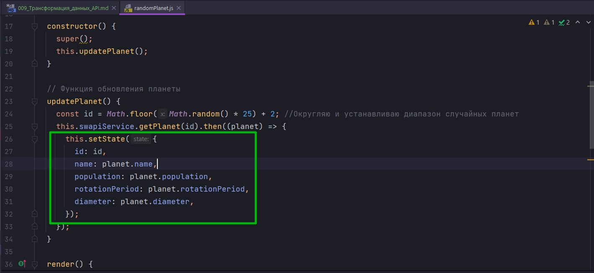

будут нужны еще не в одном месте в нашем приложении.

Какая у нас возникнет проблема? Нам в каждом месте придется копировать код трансформации данных.

Что происходит в этом коде?


Мы берем те данные, которые мы получаем от API, и затем трансформируем их в модель данных которую мы хотим получить внутри компонента.

И чем эта модель данных отличается от модели данных API ?

Во-первых нам далеко нужны не все поля, нам нужны только эти четыре поля


Но такие же операции нам придется делать в любом месте, в котором мы будем работать с планетой.

Так почему бы нам не использовать нашу замечательную фичу, класс SwapiService для того что бы здесть провесть трансформацию данных, которая нам нужна. И затем в любом компоненте нашего приложения мы будем знать что данные которые мы получаем от SwapiService уже подготовленные и уже трансформированны в тот формат в котором мы хотим их видеть.

Теперь в SwapiService создаю функцию transformPlanet. Эта функция будет принимать на вход planet т.е. ту планету которую мы получили от API а возвращать она будет объект с даными.

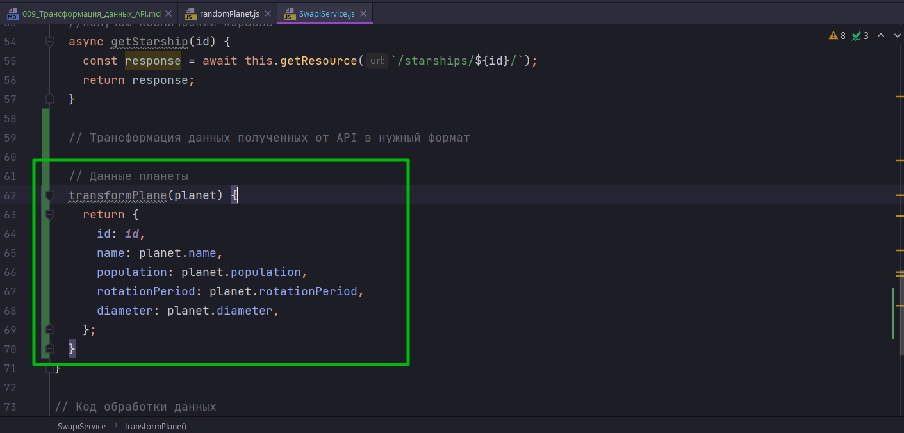

И затем эту функцию мы можем исспользовать в getPlanet и getAllPlanets

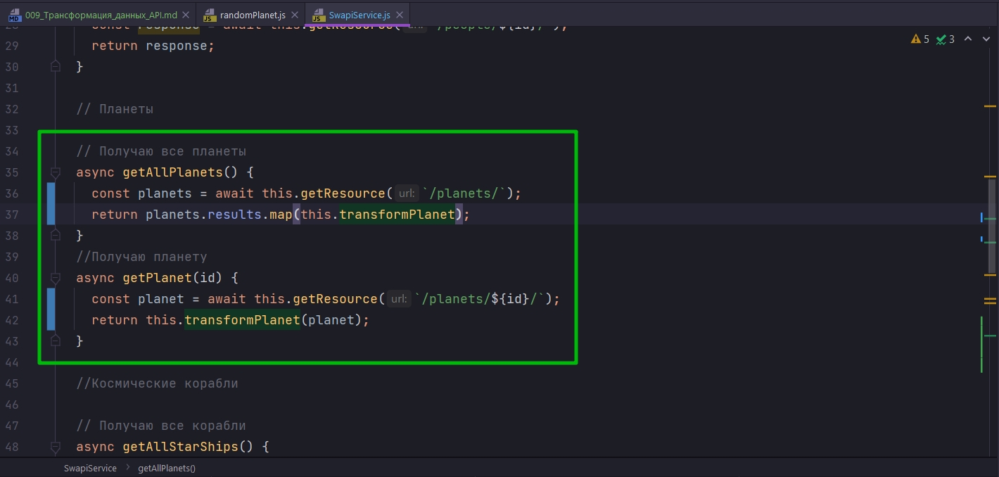

Когда мы получаем коллекцию планет getAllPlanets мы не хотим получать коллекцию планет прямо от API а мы хотим передавать измененную коллекцию this.transformPlanet - это наш метод который будет нашу коллекцию трансформировать.


Остался один крошечный нюанс. Тот API который мы используем не использует внутренний id, он не публикует внутренние индентификаторы.

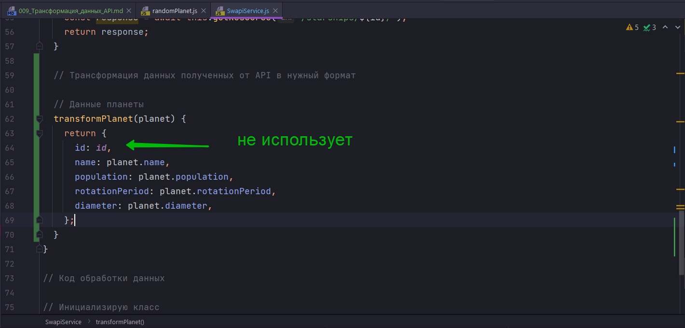

Что я имею ввиду?

Когда мы вызваем getPlanet мы не получаем id. Мы получаем только url планеты.

Если я зайду в Network и посмотрю какой запрос мы отправляем то я не найду даже чего то похожего на id.

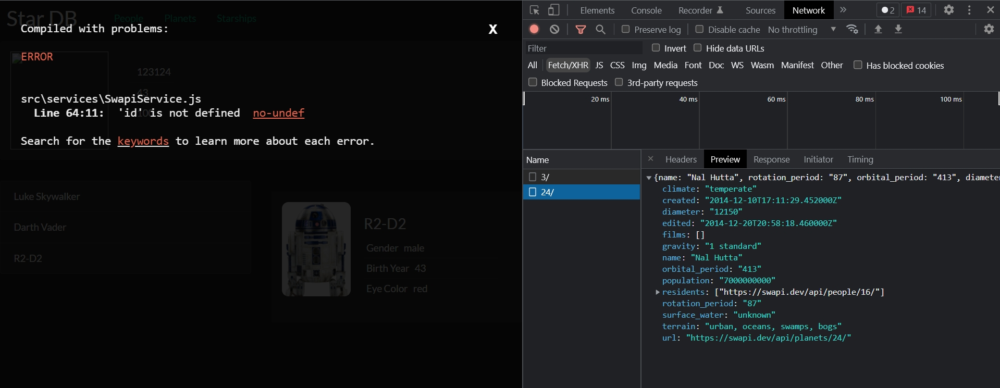

Зато в каждой сущности, в каждом объекте Star Wars API есть url. url - это ссылка на самого себя в этом API. И если посмотреть на этот url то здесь в конце этого url есть id.

Хорошее это решение использовать url или нет. Отдавать клиентам этого API id это тема для совсем другой дискуссии. 

Но в реальном мире, в реальных production проектах часто случается так что у нас нет контроля над API и нам нужно работать с тем что у нас есть.

И так нам нужно из url достать число что бы использовать его как id в каждой из сущностей в Планетах, в Людях, в всем. 

Такая вот трансформация данных у нас получается!!!!

Для того что бы достать этот id нужно написать регулярное выражение.

Статейка по регуларкам: <https://habr.com/ru/post/545150/>

Для написания регулярного выражения использую инструмент: <https://regex101.com/>

Ввожу ту тестовую строку которую я хочу использовать.

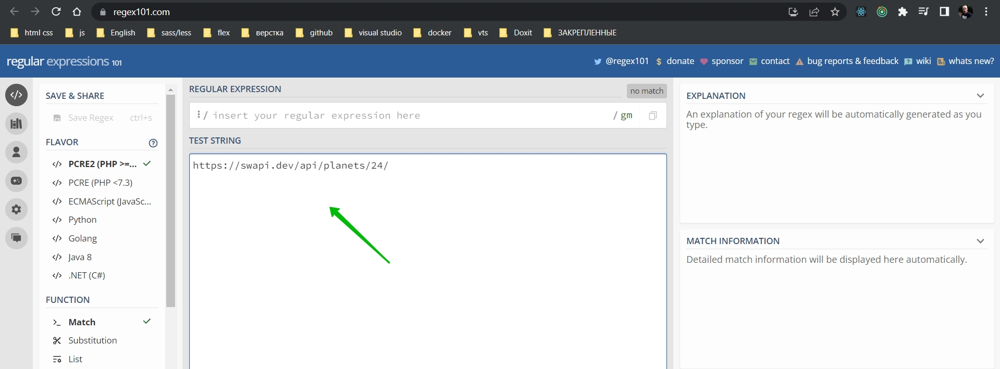

Затем начинаю писать регулярное выражение. 

Нам нужно найти группу цифр которая стоит в последней позиции между двумя слешами.

Для начало найду последний слэш

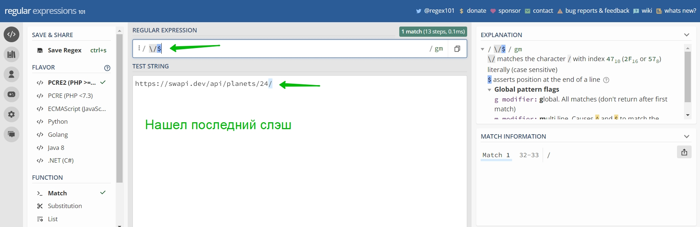

Этот $ скажет конец строки.

Теперь перед этим слешом стоит та группа которую мы хотим поймать. Это часла от 0-9 и их может быть сколькото *

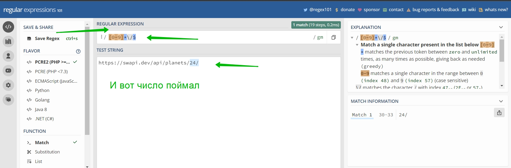

Ну и для того что бы совсем не ошибится поймаю еще предыдущий слеш.

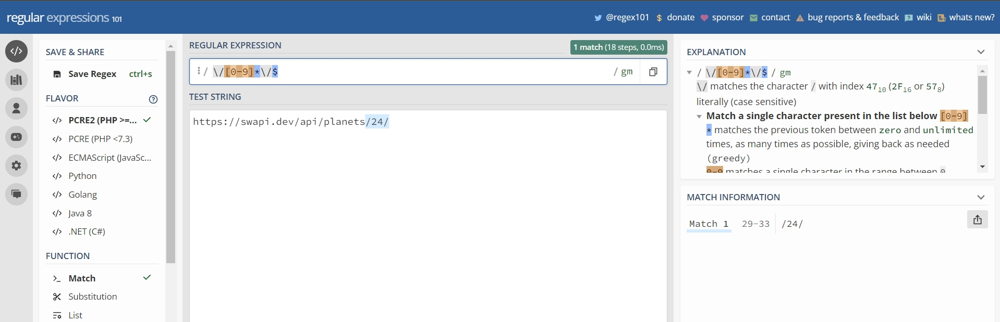

Теперь группу 0-9 и звездочку мы должны взять в круглые скобки для того что бы регулярка выделила этот кусок в отдельное значение

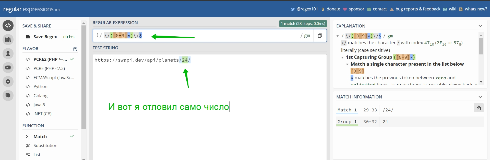

Теперь наша Group 1 содержит именно то значение которое нам нужно.

Тепер я могу использовать регуларку в собственном коде.

Возвращаюсь в transformPlanet

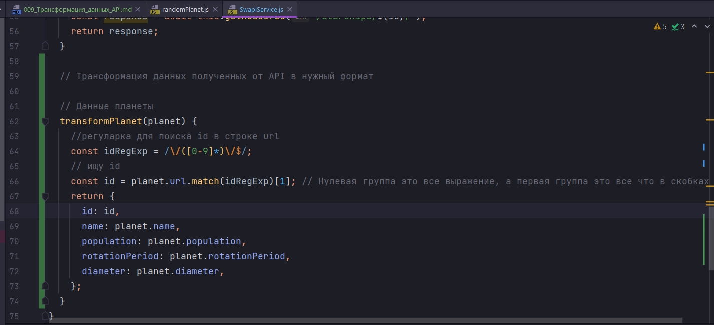

```js
// src/services/SwapiService.js
export default class SwapiService {
  // базовый url
  API_BASE = `https://swapi.dev/api`;

  async getResource(url) {
    // составляю строку из базового url и того url что прилетает из методов
    const response = await fetch(`${this.API_BASE}${url}`);
    //Обработка ошибки на клиенте
    if (!response.ok) {
      throw new Error(`Could not fetch ${url}` + `received ${response.status}`);
    }
    const body = await response.json(); // получаю тело запроса
    return body;
  }

  // Персонажи

  // Получение всех персонажей
  async getAllPeople() {
    // передаю только нужную часть url
    const response = await this.getResource(`/people/`);
    return response.results;
  }
  // получаю конкретного персонажа
  async getPerson(id) {
    // передаю только нужную часть url
    const response = await this.getResource(`/people/${id}/`);
    return response;
  }

  // Планеты

  // Получаю все планеты
  async getAllPlanets() {
    const planets = await this.getResource(`/planets/`);
    return planets.results.map(this.transformPlanet);
  }
  //Получаю планету
  async getPlanet(id) {
    const planet = await this.getResource(`/planets/${id}/`);
    return this.transformPlanet(planet);
  }

  //Космические корабли

  // Получаю все корабли
  async getAllStarShips() {
    const response = await this.getResource(`/starships/`);
    return response;
  }

  //Получаю космический корабль
  async getStarship(id) {
    const response = await this.getResource(`/starships/${id}/`);
    return response;
  }

  // Трансформация данных полученных от API в нужный формат

  // Данные планеты
  transformPlanet(planet) {
    //регуларка для поиска id в строке url
    const idRegExp = /\/([0-9]*)\/$/;
    // ищу id
    const id = planet.url.match(idRegExp)[1]; // Нулевая группа это все выражение, а первая группа это все что в скобках
    return {
      id: id,
      name: planet.name,
      population: planet.population,
      rotationPeriod: planet.rotationPeriod,
      diameter: planet.diameter,
    };
  }
}

// Код обработки данных

// Инициализирую класс
const swapi = new SwapiService();

// Получаю ответ с сервера и обрабатываю promise
swapi.getPerson(3).then((person) => {
  console.log(person.name);
});

```

Замечательно!!! Мы только что научились проводит трансформацию данных которую мы получаем от API. Мы изменяем name Convention в полях. Фильтруем поля т.е. выбираем только те поля которые нам нужны. И искуственно добавляем id который нам не дает API.

Поскольку вот этот код может использоваться не только для персонажей, но и для космических кораблей

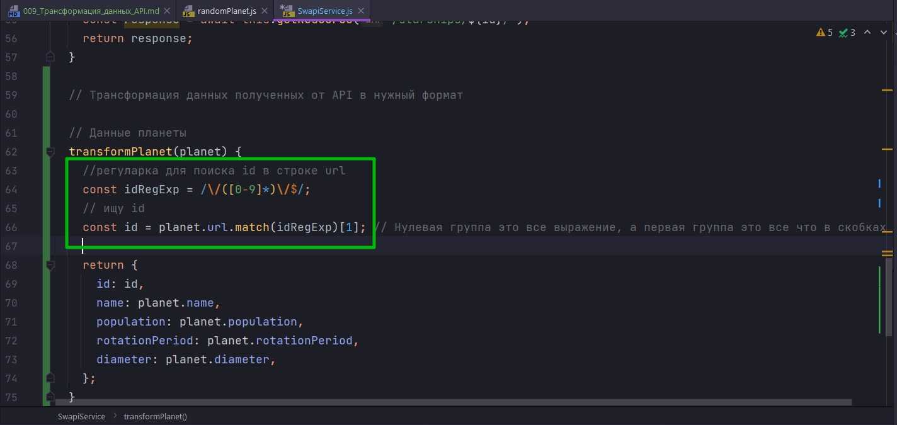

Я выделю его в отдельную функцию.

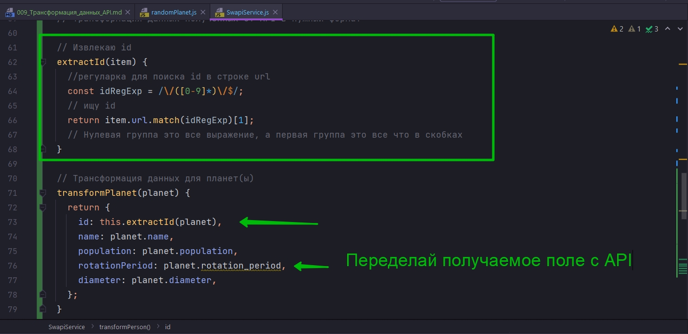

Точно так же мы сможем использовать функцию extractId для Людей и для Космических кораблей.

```js
// src/services/SwapiService.js
export default class SwapiService {
  // базовый url
  API_BASE = `https://swapi.dev/api`;

  async getResource(url) {
    // составляю строку из базового url и того url что прилетает из методов
    const response = await fetch(`${this.API_BASE}${url}`);
    //Обработка ошибки на клиенте
    if (!response.ok) {
      throw new Error(`Could not fetch ${url}` + `received ${response.status}`);
    }
    const body = await response.json(); // получаю тело запроса
    return body;
  }

  // Персонажи

  // Получение всех персонажей
  async getAllPeople() {
    // передаю только нужную часть url
    const response = await this.getResource(`/people/`);
    return response.results;
  }
  // получаю конкретного персонажа
  async getPerson(id) {
    // передаю только нужную часть url
    const response = await this.getResource(`/people/${id}/`);
    return response;
  }

  // Планеты

  // Получаю все планеты
  async getAllPlanets() {
    const planets = await this.getResource(`/planets/`);
    return planets.results.map(this.transformPlanet);
  }
  //Получаю планету
  async getPlanet(id) {
    const planet = await this.getResource(`/planets/${id}/`);
    return this.transformPlanet(planet);
  }

  //Космические корабли

  // Получаю все корабли
  async getAllStarShips() {
    const response = await this.getResource(`/starships/`);
    return response;
  }

  //Получаю космический корабль
  async getStarship(id) {
    const response = await this.getResource(`/starships/${id}/`);
    return response;
  }

  // Трансформация данных полученных от API в нужный формат

  // Извлекаю id
  extractId(item) {
    //регуларка для поиска id в строке url
    const idRegExp = /\/([0-9]*)\/$/;
    // ищу id
    const id = item.url.match(idRegExp)[1]; // Нулевая группа это все выражение, а первая группа это все что в скобках
    return id;
  }

  // Данные планеты
  transformPlanet(planet) {
    return {
      id: this.extractId(),
      name: planet.name,
      population: planet.population,
      rotationPeriod: planet.rotationPeriod,
      diameter: planet.diameter,
    };
  }
}

// Код обработки данных

// Инициализирую класс
const swapi = new SwapiService();

// Получаю ответ с сервера и обрабатываю promise
swapi.getPerson(3).then((person) => {
  console.log(person.name);
});

```

Теперь я добавлю эту функцию еще в две функции которые я создам. transformPerson и transformStarShip. Для того что бы все сущности API с которыми мы работаем они проходили через этот этап трансформации.

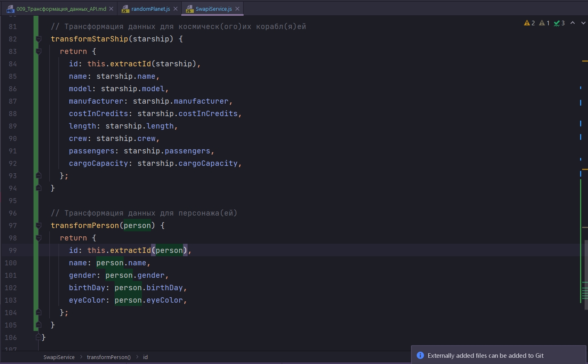

Теперь эти функции мы можем добавить в соответствующие getters в нашем SwapiService.

```js
// src/services/SwapiService.js
export default class SwapiService {
  // базовый url
  API_BASE = `https://swapi.dev/api`;

  async getResource(url) {
    // составляю строку из базового url и того url что прилетает из методов
    const response = await fetch(`${this.API_BASE}${url}`);
    //Обработка ошибки на клиенте
    if (!response.ok) {
      throw new Error(`Could not fetch ${url}` + `received ${response.status}`);
    }
    const body = await response.json(); // получаю тело запроса
    return body;
  }

  // Персонажи

  // Получение всех персонажей
  async getAllPeople() {
    // передаю только нужную часть url
    const response = await this.getResource(`/people/`);
    return response.results.map(this.transformPerson);
  }
  // получаю конкретного персонажа
  async getPerson(id) {
    // передаю только нужную часть url
    const person = await this.getResource(`/people/${id}/`);
    return this.transformPerson(person);
  }

  // Планеты

  // Получаю все планеты
  async getAllPlanets() {
    const planets = await this.getResource(`/planets/`);
    return planets.results.map(this.transformPlanet);
  }
  //Получаю планету
  async getPlanet(id) {
    const planet = await this.getResource(`/planets/${id}/`);
    return this.transformPlanet(planet);
  }

  //Космические корабли

  // Получаю все корабли
  async getAllStarShips() {
    const response = await this.getResource(`/starships/`);
    return response.results.map(this.transformStarShip);
  }

  //Получаю космический корабль
  async getStarship(id) {
    const starship = await this.getResource(`/starships/${id}/`);
    return this.transformStarShip(starship);
  }

  // Трансформация данных полученных от API в нужный формат

  // Извлекаю id
  extractId(item) {
    //регуларка для поиска id в строке url
    const idRegExp = /\/([0-9]*)\/$/;
    // ищу id
    const id = item.url.match(idRegExp)[1]; // Нулевая группа это все выражение, а первая группа это все что в скобках
    return id;
  }

  // Трансформация данных для планет(ы)
  transformPlanet(planet) {
    return {
      id: this.extractId(planet),
      name: planet.name,
      population: planet.population,
      rotationPeriod: planet.rotationPeriod,
      diameter: planet.diameter,
    };
  }

  // Трансформация данных для космическ(ого)их корабл(я)ей
  transformStarShip(starship) {
    return {
      id: this.extractId(starship),
      name: starship.name,
      model: starship.model,
      manufacturer: starship.manufacturer,
      costInCredits: starship.costInCredits,
      length: starship.length,
      crew: starship.crew,
      passengers: starship.passengers,
      cargoCapacity: starship.cargoCapacity,
    };
  }

  // Трансформация данных для персонажа(ей)
  transformPerson(person) {
    return {
      id: this.extractId(person),
      name: person.name,
      gender: person.gender,
      birthDay: person.birthDay,
      eyeColor: person.eyeColor,
    };
  }
}

// Код обработки данных

// Инициализирую класс
const swapi = new SwapiService();

// Получаю ответ с сервера и обрабатываю promise
swapi.getPerson(3).then((person) => {
  console.log(person.name);
});

```

Теперь код нашего SwapiService готов. И теперь мы можем отрефакторить наш RandomPlanet и сделать этот код еще более удобным и более читабельным.

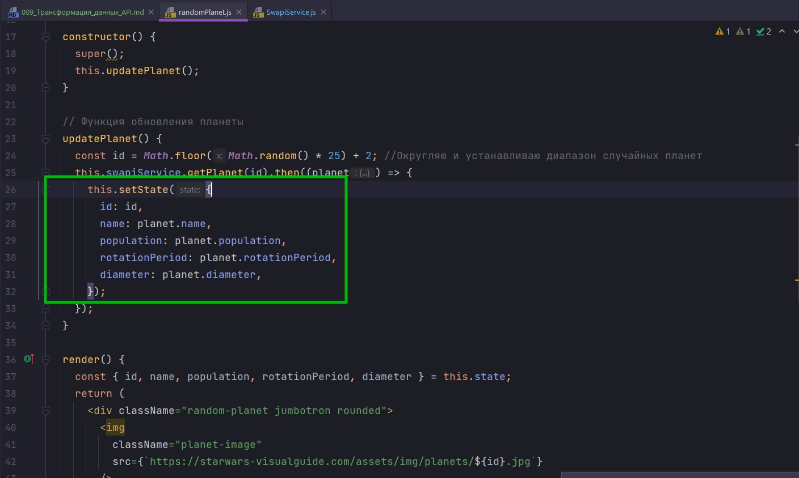

Вот этот код я вынесу в отдельную функцию и сделаю его как бы eventListener. 

Действительно SwapiService фактически генерирует для нас event и то что мы отлавливаем этот event в then а не в какой-нибудь функции onPerson или в какой-нибудь другой функции. Это уже детали реализации.

По сути мы получаем асинхронное событие и в результате мы хотим на это событие реагировать.

Создаю функцию загрузки планет. Использую функцию стрелку поскольку мы будем передавать эту функцию в другую функцию, как event, нам нужно быть осторожными со значением this.

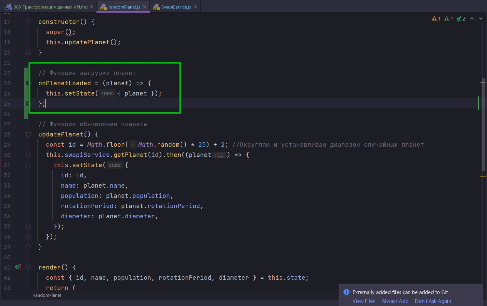

Мы будем просто устанавливать planet. Теперь, когда мы точно знаем что данные в planet это именно те данные которые нам нужны, мы можем поставить в наш state весь объект целиком, вместо того что бы копировать каждое значение по очереди.

И теперь в then мы можем просто передать этот event.

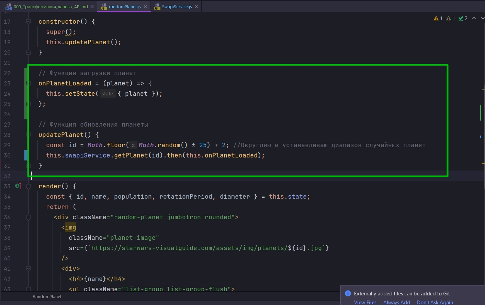

И теперь нам нужно обновить объект state и указать в нем единственное значение planet:null. Хотя для начало сделаю planet:{} для того что бы наш код деструктуризации не ругался на null.


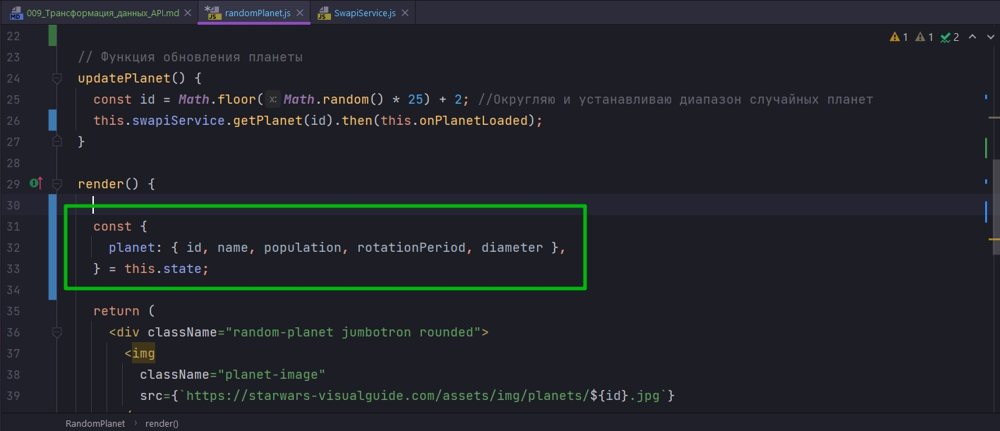

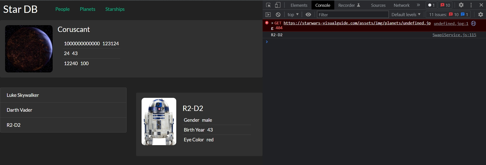

В этом видео мы смогли сделать две очень полезные вещи.

1. Мы отрефакторили наш код updatePlanet. Он теперь читается на много проще, по сравнению стем как он был написан до этого.
2. Мы изолировали все трансформации данных в нашем классе сервисе SwapiService. И таким способом мы гарантировали что любой компонент который использует SwapiService будет корректно получать корректные и подготовленные данные.

Видео было сложноватым для меня по этому исходник в папке example.

> Трансформация данных API
> 
> Изолируйте код который обрабатывает данные
> 
> Отделяйте модель данных API от модели данных приложения
> 
> Такая практика чаще применяется для крупных проектов со сложными моделями данных, которые могут изменяться

И так вот что значит не тестировать свой код сразу!!!  Поймал ошибку в следующем разделе. 

Функции трансформации данных а именно transformPlanet, transformStarShip,  transformPerson я передаю как eventListener. Здесь я их написал как обычные функции, а значит this у них динамический а не лексический. 

А вот ошибка

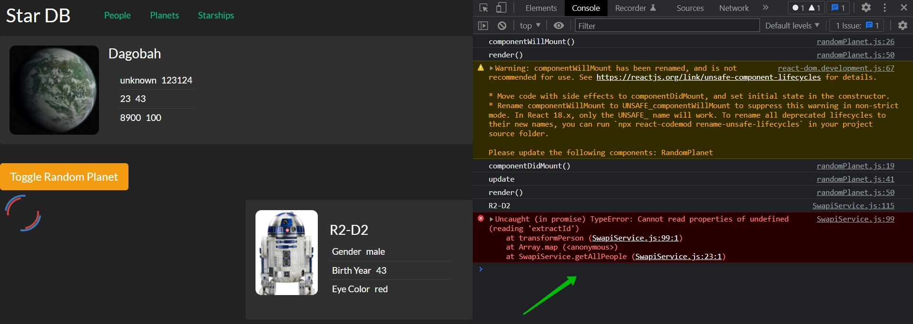

Делаю их функциями стрелками