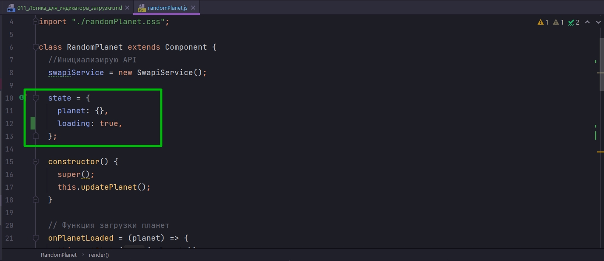
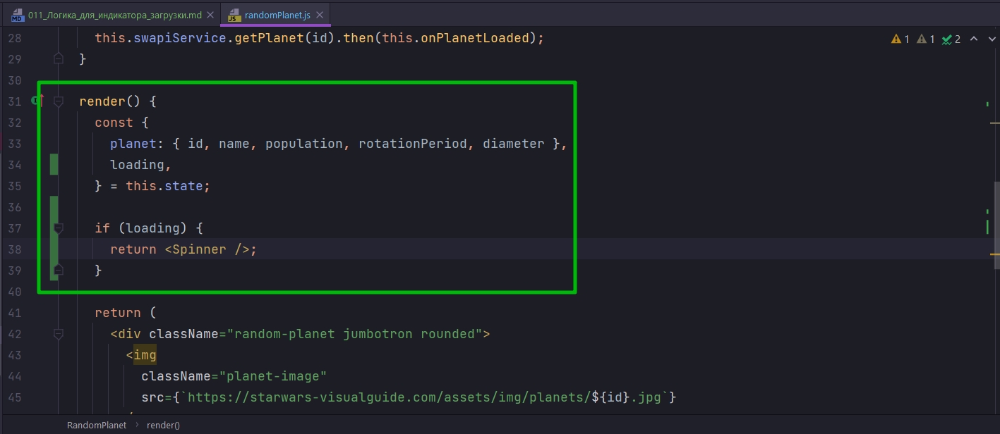
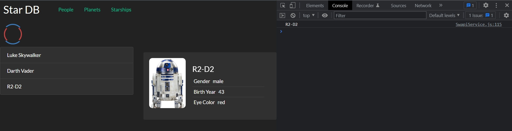
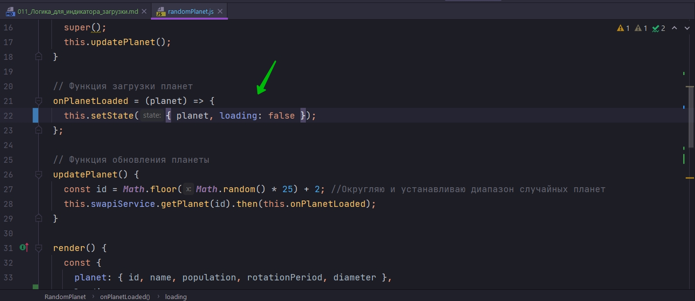
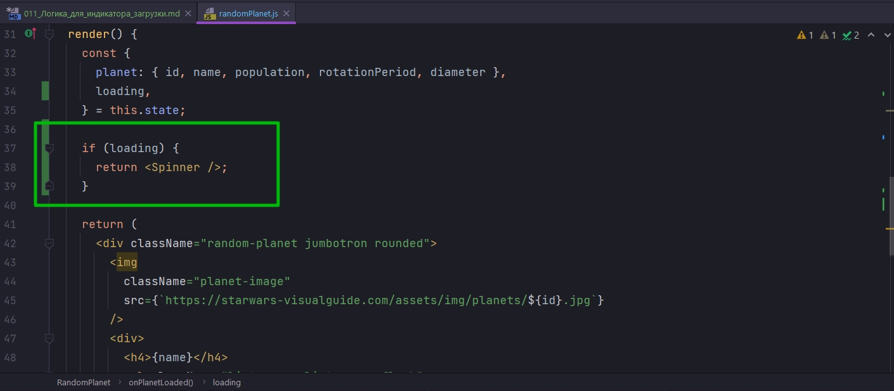
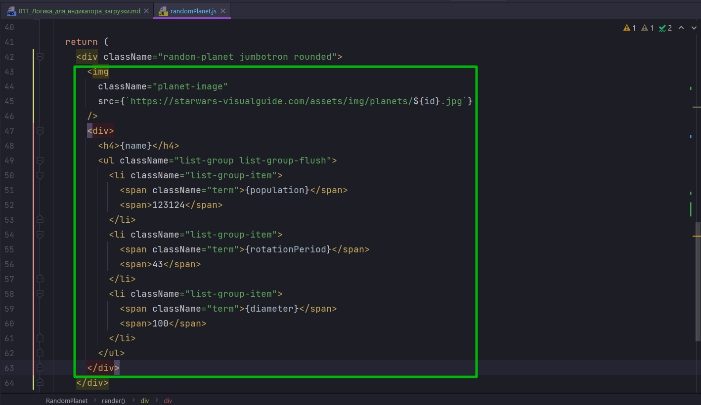

# 011_Логика_для_индикатора_загрузки

Для того что бы это сделать в наш state мы добавим еще одно поле и назовем его loading:true. true потому что как только компонент инициализируется мы начинаем загружать следующие данные и параводим loading:false. Соответственно сначало компонент должен прорисоваться с loader-ом.







Давайте теперь сделаем так что бы спинер пропадал когда данные появляются. Это сделать совсем не сложно.

Мы кроме того что устанавливаем планету, мы еще установим значение loading в false



Не успеваю заскринить. Пропадает весь компонент и появляется спиннер. 

А я хочу что бы компонент оставался и спиннер крутился внутри него.


Это уже сделать сложнее.

Дело в том что нам теперь нужно с этим условием



отображать спиннер внутри компонента который отображает контент.

Мы можем начать писать уродливый код внутри JSX, но самый аккуратный и правильный подход будет вынести эти два элемента в отдельный React компонент. Вот это вынести



При этом нам сейчас не обязательно создавать отдельную папку и делать этот компонент общедоступным. Это будет наш приватный компонент который будет использоваться исключительно внутри дирректории randomPlanet для того что бы организовать код лучше.

И так вынес в отдельный компонент. Теперь в компоненте RandomPlanet есть тег PlanetView в который в пропс я передаю объект planet

```js
import React, { Component } from "react";
import SwapiService from "../../services/SwapiService";
import Spinner from "../spinner/spinner";
import PlanetView from "./planetView/planetView";
import "./randomPlanet.css";

class RandomPlanet extends Component {
  //Инициализирую API
  swapiService = new SwapiService();

  state = {
    planet: {},
    loading: true,
  };

  constructor() {
    super();
    this.updatePlanet();
  }

  // Функция загрузки планет
  onPlanetLoaded = (planet) => {
    this.setState({ planet, loading: false });
  };

  // Функция обновления планеты
  updatePlanet() {
    const id = Math.floor(Math.random() * 25) + 2; //Округляю и устанавливаю диапазон случайных планет
    this.swapiService.getPlanet(id).then(this.onPlanetLoaded);
  }

  render() {
    const { planet, loading } = this.state;

    if (loading) {
      return <Spinner />;
    }

    return (
      <div className="random-planet jumbotron rounded">
        <PlanetView planet={planet} />
      </div>
    );
  }
}

export default RandomPlanet;

```

После чего я в PlanetView деструктурирую из пропс planet, а уже из planet деструктурирую интересующие меня поля.

```js
import React from "react";

const PlanetView = ({ planet }) => {
  const { id, name, population, rotationPeriod, diameter } = planet;
  return (
    <>
      
      <div>
        <h4>{name}</h4>
        <ul className="list-group list-group-flush">
          <li className="list-group-item">
            <span className="term">{population}</span>
            <span>123124</span>
          </li>
          <li className="list-group-item">
            <span className="term">{rotationPeriod}</span>
            <span>43</span>
          </li>
          <li className="list-group-item">
            <span className="term">{diameter}</span>
            <span>100</span>
          </li>
        </ul>
      </div>
    </>
  );
};

export default PlanetView;

```

Теперь закончить этот код будет совсем не сложно. Я воспользуюсь свойством JSX что null внутри JSX разметки попросту игнорируется и он не будет создавать ни каких ошибок.

По этому я создам элемент spinner который будет либо loading т.е. если мы загружаемся и loading:true то будет отобразаться Spinner иначе будет null.

И точно так же создаю переменную content. Если !loading т.е. если loading false, то покажи мне PlanetView, а иначе null.

```js
import React, { Component } from "react";
import SwapiService from "../../services/SwapiService";
import Spinner from "../spinner/spinner";
import PlanetView from "./planetView/planetView";
import "./randomPlanet.css";

class RandomPlanet extends Component {
  //Инициализирую API
  swapiService = new SwapiService();

  state = {
    planet: {},
    loading: true,
  };

  constructor() {
    super();
    this.updatePlanet();
  }

  // Функция загрузки планет
  onPlanetLoaded = (planet) => {
    this.setState({ planet, loading: false });
  };

  // Функция обновления планеты
  updatePlanet() {
    const id = Math.floor(Math.random() * 25) + 2; //Округляю и устанавливаю диапазон случайных планет
    this.swapiService.getPlanet(id).then(this.onPlanetLoaded);
  }

  render() {
    const { planet, loading } = this.state;

    const spinner = loading ? <Spinner /> : null;
    const content = !loading ? <PlanetView planet={planet} /> : null;

    return (
      <div className="random-planet jumbotron rounded">
        {spinner}
        {content}
      </div>
    );
  }
}

export default RandomPlanet;

```

По мере того как мы улучшаем наш код, по мере того как мы делаем его более понятным и структурированным, у нас начинает прослеживаться один паттерн.

Те компоненты которые мы создаем начинают разделяться на два категории.

Одни компоненты как RandomPlanet начинают отвечать за логику того что происходит.

В то время как PlanetView занимается исключительно отображением данных, они не знают ничего откуда эти данные берутся.

Этот подход полностью соответствует програмно-инженерному принципу separation of concerns Разделение ответственности <https://ru.wikipedia.org/wiki/%D0%A0%D0%B0%D0%B7%D0%B4%D0%B5%D0%BB%D0%B5%D0%BD%D0%B8%D0%B5_%D0%BE%D1%82%D0%B2%D0%B5%D1%82%D1%81%D1%82%D0%B2%D0%B5%D0%BD%D0%BD%D0%BE%D1%81%D1%82%D0%B8> 

> Логика индикатора загрузки
> 
> "Состояние" загрузки можно хранить в state
> 
> В зависимости от этого состояния рендерим индикатор загрузки или содержимое компонента (уже с данными)
> 
> Старайтесь разделять логику и рендеринг
> 
> React.Fragment позволяет группировать элементы не создавая лишних DOM-объектов
