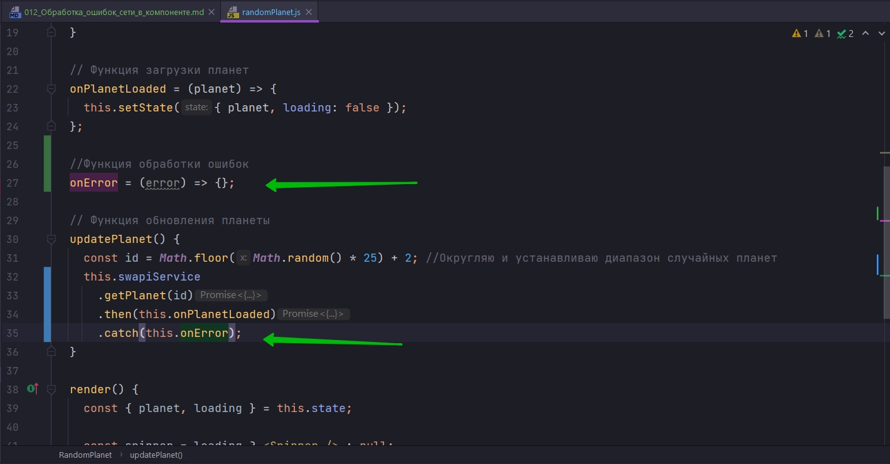
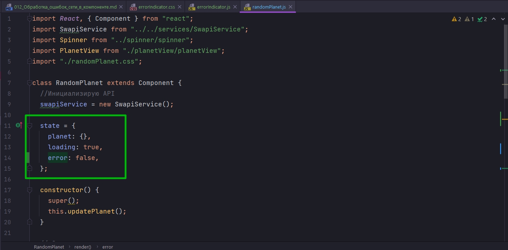
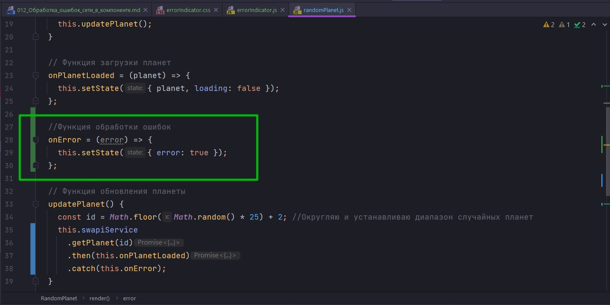
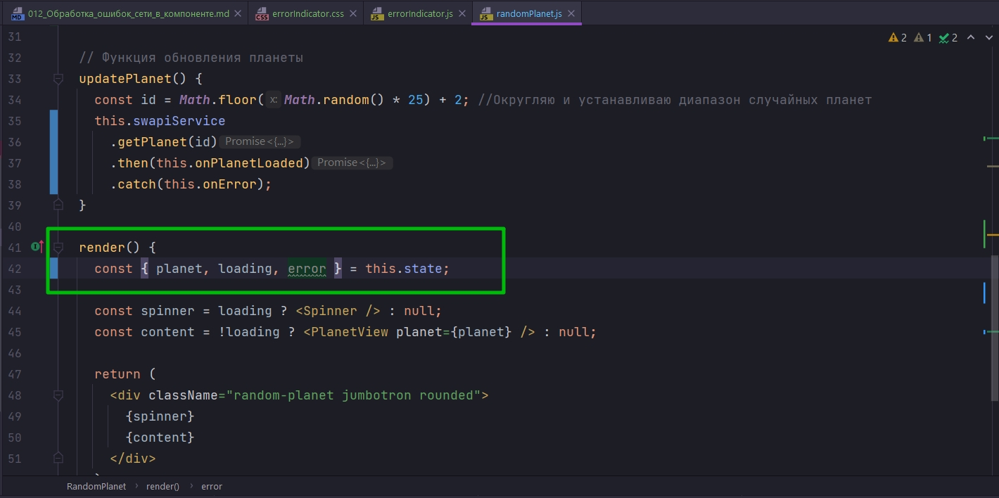
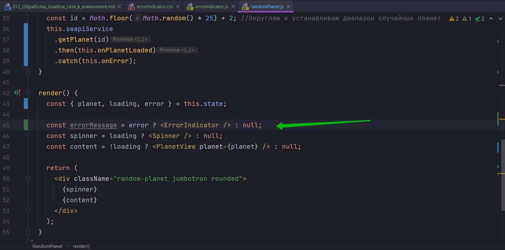
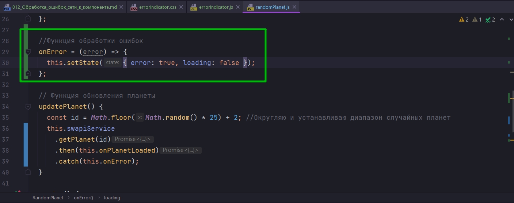
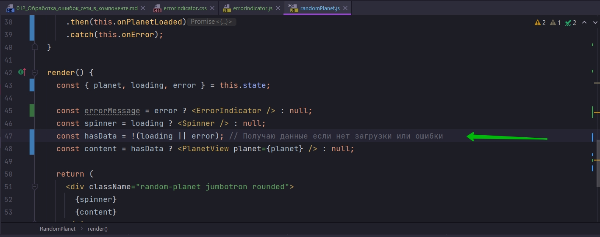
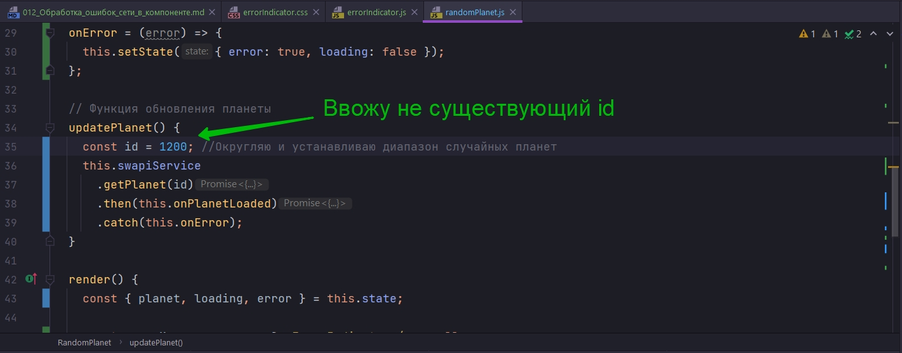

# 012_Обработка_ошибок_сети_в_компоненте

Когда мы выполняем совершенно любую асинхронную операцию, которая чисто теоретически может привести к ошибке. Нам нужно эту ошибку обработать и добавить блок catch к обработке нашего promise.


Создаю функцию onError -эта функция будет принимать ошибку которая произошла error



Пока так оставляю. Создаю компонент обработки ошибок.

```js
import React from "react";

import "./errorIndicator.css";
import icon from "./death-star.png";

const ErrorIndicator = () => {
  return (
    <div className="error-indicator">
      
      <span className="boom">BOOM!</span>
      <span>something has gone terribly wrong</span>
      <span>(but we already sent droids to fix it)</span>
    </div>
  );
};

export default ErrorIndicator;

```

```css
.error-indicator {
    width: 100%;
    display: flex;
    flex-direction: column;
    align-items: center;
    color: #c78f22;
}

.error-indicator img {
    margin-bottom: 1rem;
}

.error-indicator .boom {
    font-size: 1.7rem;
}

```

Теперь мы можем использовать этот компонент точно так же как loader компонент для того что бы показать ошибку, если эта ошибка происходит. Для этого в state мы добавим еще одно состояние error.







Теперь я могу создать переменную errorMessage и говорим что мы ее показываем тогда когда есть error.



Теперь что делать с loading? Если подумать логически, если мы получили ошибку, значит loading уже закончен. Для этого в функции onError в состояние передаю loading:false. И таким образом у нас никогда не будет ситуации когда у нас error и loading одновременно true.



Однако теперь для корректной загрузки контента необходимо что бы небыло не ошибки и не загрузки. 

Создаю переменную hasData в которую помещаю оба этих условия.



```js
import React, { Component } from "react";
import SwapiService from "../../services/SwapiService";
import Spinner from "../spinner/spinner";
import PlanetView from "./planetView/planetView";
import "./randomPlanet.css";
import ErrorIndicator from "../errorIndicator/errorIndicator";

class RandomPlanet extends Component {
  //Инициализирую API
  swapiService = new SwapiService();

  state = {
    planet: {},
    loading: true,
    error: false,
  };

  constructor() {
    super();
    this.updatePlanet();
  }

  // Функция загрузки планет
  onPlanetLoaded = (planet) => {
    this.setState({ planet, loading: false });
  };

  //Функция обработки ошибок
  onError = (error) => {
    this.setState({ error: true, loading: false });
  };

  // Функция обновления планеты
  updatePlanet() {
    const id = Math.floor(Math.random() * 25) + 2; //Округляю и устанавливаю диапазон случайных планет
    this.swapiService
      .getPlanet(id)
      .then(this.onPlanetLoaded)
      .catch(this.onError);
  }

  render() {
    const { planet, loading, error } = this.state;

    const errorMessage = error ? <ErrorIndicator /> : null;
    const spinner = loading ? <Spinner /> : null;
    const hasData = !(loading || error); // Получаю данные если нет загрузки или ошибки
    const content = hasData ? <PlanetView planet={planet} /> : null;

    return (
      <div className="random-planet jumbotron rounded">
        {errorMessage}
        {spinner}
        {content}
      </div>
    );
  }
}

export default RandomPlanet;

```




В любом месте где у вас есть асинхронная функция у вас обязательно должен быть catch.

И немножечко сложнее состоит дело с async await. Дело в том что когда мы пишете await у нас как бы нет then. И часто бывает такое что вы попросу не осознаете что блок кода с ключевым словом await должен быть обернут в try{}catch(){} на тот случай promise который передают в await, он будет отклонен, он будет rejected.

> Обработка ошибок
> 
> В state добавляем поле гда будем хранить флаг: нужно ли отображать ошибку.
> 
> В зависимостиот этого флага, отображаем ошибку, или нормальное содержимое компонента
> 
> Будьте бдительны с async/await - код await может выбросить Error