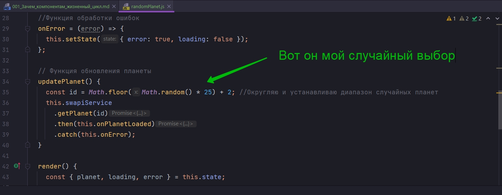
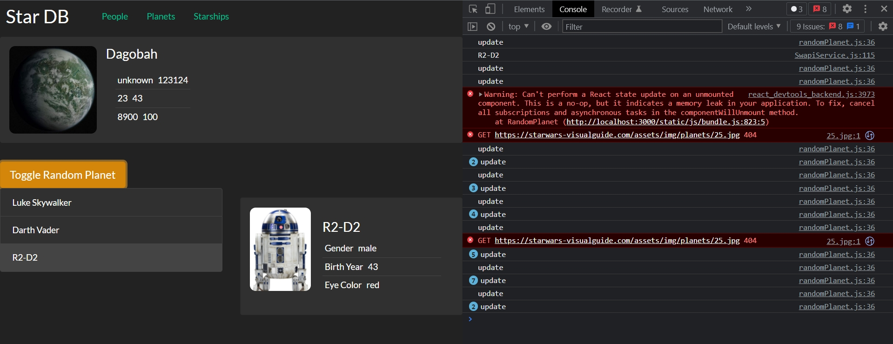
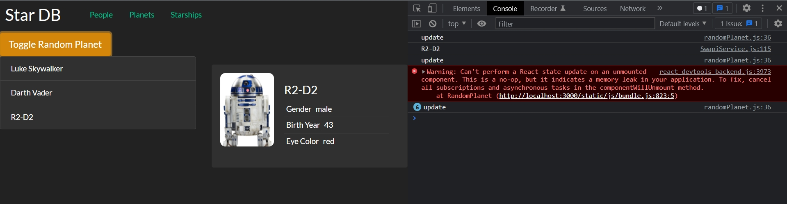
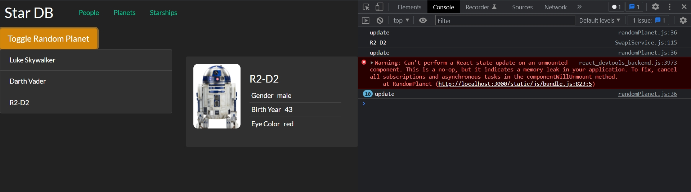
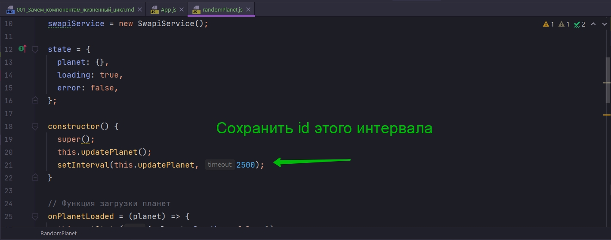
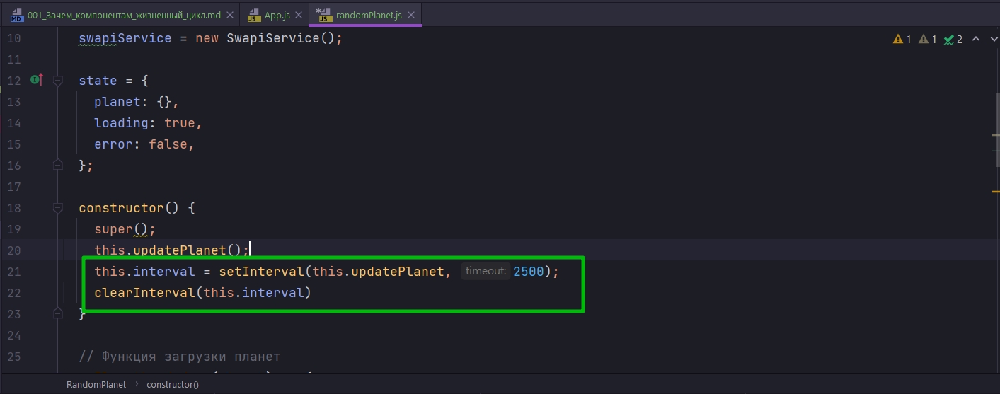

# 001_Зачем_компонентам_жизненный_цикл


В этом разделе мы будем говорить про жизненный цикл React компонентов. Но для того что бы лучше понять что такое жизненный цикл, как он работает и какие задачи он решает, давайте попробуем посмотреть с точки зрения весьма конкретной задачи.

Посмотрим на компонент RandomPlanet тот компонент который должен показывать случайную планету. Мы дошли до того что этот компонент весьма не плохо показывает одну планету. У нас есть спиннер. Этот компонент может отображать ошибки если эти ошибки произойдут. Но все таки этот компонент не показывает случайную планету.


В этом уроке мы посмотрим как реализовать подобный функционал и заодно посмотрим какие могут быть проблемы если мы попробуем реализовать этот функционал в лоб.



Давайте сделаем так что бы наш компонент регулярно обновлял планеты.

Теперь для того что бы я мог передать функцию updatePlanet как eventListener я делаю ее стрелочной. И после чего в конструкторе вызываю setInterval в который передаю функцию updatePlanet и говорю что ее буду вызывать каждые 1,5 сек.

```js
import React, { Component } from "react";
import SwapiService from "../../services/SwapiService";
import Spinner from "../spinner/spinner";
import PlanetView from "./planetView/planetView";
import "./randomPlanet.css";
import ErrorIndicator from "../errorIndicator/errorIndicator";

class RandomPlanet extends Component {
    //Инициализирую API
    swapiService = new SwapiService();

    state = {
        planet: {},
        loading: true,
        error: false,
    };

    constructor() {
        super();
        this.updatePlanet();
        setInterval(this.updatePlanet, 1500);
    }

    // Функция загрузки планет
    onPlanetLoaded = (planet) => {
        this.setState({ planet, loading: false });
    };

    //Функция обработки ошибок
    onError = (error) => {
        this.setState({ error: true, loading: false });
    };

    // Функция обновления планеты
    updatePlanet = () => {
        const id = Math.floor(Math.random() * 25) + 2; //Округляю и устанавливаю диапазон случайных планет
        this.swapiService
            .getPlanet(id)
            .then(this.onPlanetLoaded)
            .catch(this.onError);
    };

    render() {
        const { planet, loading, error } = this.state;

        const errorMessage = error ? <ErrorIndicator /> : null;
        const spinner = loading ? <Spinner /> : null;
        const hasData = !(loading || error); // Получаю данные если нет загрузки или ошибки
        const content = hasData ? <PlanetView planet={planet} /> : null;

        return (
            <div className="random-planet jumbotron rounded">
                {errorMessage}
                {spinner}
                {content}
            </div>
        );
    }
}

export default RandomPlanet;

```

Теперь добавлю в updatePlanet console.log что бы мы видели когда у нас обновляется планета.

```js
import React, { Component } from "react";
import SwapiService from "../../services/SwapiService";
import Spinner from "../spinner/spinner";
import PlanetView from "./planetView/planetView";
import "./randomPlanet.css";
import ErrorIndicator from "../errorIndicator/errorIndicator";

class RandomPlanet extends Component {
  //Инициализирую API
  swapiService = new SwapiService();

  state = {
    planet: {},
    loading: true,
    error: false,
  };

  constructor() {
    super();
    this.updatePlanet();
    setInterval(this.updatePlanet, 2500);
  }

  // Функция загрузки планет
  onPlanetLoaded = (planet) => {
    this.setState({ planet, loading: false });
  };

  //Функция обработки ошибок
  onError = (error) => {
    this.setState({ error: true, loading: false });
  };

  // Функция обновления планеты
  updatePlanet = () => {
    console.log("update");
    const id = Math.floor(Math.random() * 25) + 2; //Округляю и устанавливаю диапазон случайных планет
    this.swapiService
      .getPlanet(id)
      .then(this.onPlanetLoaded)
      .catch(this.onError);
  };

  render() {
    const { planet, loading, error } = this.state;

    const errorMessage = error ? <ErrorIndicator /> : null;
    const spinner = loading ? <Spinner /> : null;
    const hasData = !(loading || error); // Получаю данные если нет загрузки или ошибки
    const content = hasData ? <PlanetView planet={planet} /> : null;

    return (
      <div className="random-planet jumbotron rounded">
        {errorMessage}
        {spinner}
        {content}
      </div>
    );
  }
}

export default RandomPlanet;

```

И еще добавлю в app компоненте кнопку включения и выключения компонента рандомной планеты.

```js
//src/component/app?App.js
import React, { Component } from "react";
import Header from "../header/header";
import ItemList from "../itemList/itemList";
import ItemDetails from "../itemDetails/itemDetails";
import RandomPlanet from "../randomPlanet/randomPlanet";
import "./App.css";

class App extends Component {
  state = {
    showRandomPlanet: true,
  };

  //Функция включения и выключения компонента рандомной планеты
  toggleRandomPlanet = () => {
    this.setState((state) => {
      return {
        showRandomPlanet: !state.showRandomPlanet,
      };
    });
  };
  render() {
    const planet = this.state.showRandomPlanet ? <RandomPlanet /> : null;
    return (
      <div>
        <Header />
        {planet}
        <button
          className="toggle-planet btn btn-warning btn-lg"
          onClick={this.toggleRandomPlanet}
        >
          Toggle Random Planet
        </button>
        <div className="row mb2">
          <div className="col-md-6">
            <ItemList />
          </div>
          <div className="col-md-6">
            <ItemDetails />
          </div>
        </div>
      </div>
    );
  }
}

export default App;

```



Когда я кликаю на кнопку включения и отключения компонента функция updatePlanet вызывается чаще чем setInterval вызывает функцию updatePlanet. По мере того как я начинаю кликать функция updatePlanet вызывается все быстрее и быстрее.

Каждый updatePlanet это вызов API, это сетевой запрос.

Если мосмотреть на код, то здесь все просто. Мы вызываем setInterval и говорим что каждые 2500 миллисекунды мы будем обновлять пленету.

Где мы вызываем эту функцию? 

Мы вызываем эту функцию в constructor. Т.е. когда мы создаем новый компонент, мы вызываем функцию setInterval и говорим что давайка каждые 2500 миллисекунды мы будем искать новую планету.

Что происходит когда мы включаем/выключаем компонент? 

Компонент пропадает, а затем создается новый инстанс компонента. Каждый раз у нас создается новый компонент, у нас вызывается constructor, и каждый конструктор говорит, давайте внутри себя каждые 2500 миллисекунды мы будем искать новую планету.

Таким образом мы сделали Memory Life фактически. Наш компонент создает ссылку на свой метод в setInterval, и даже после того как этот компонент пропадает естественно эта ссылка не очищается, т.е. setInterval продолжает работать .





Для того что бы решить эту проблему нужно всего лишь выполнить два действия.

1. Нам нужно сохранить id этого интервала



т.е. id этой задачи которой JS выполняет каждые 2500 миллисекунды.

Мы можем результат setInterval присвоить this.interval. Таким образом мы получим какое-нибудь число, по которому мы когда-нибудь потом сможем вызываю clearInterval() и передать туда this.interval и интервал очистится



Но вот вопрос. А где собственно вызвать этот код?

Было бы логично вызвать этот код прямо перед тем моментом когда компонент станет не нужен, когда мы его удалим.

Но прямо сейчас у нашего компонента нет той самой возможности узнать, когда наступает тот самый момент, когда он становится не нужен и он может очистить все свои подписки, все свои индервалы, таймауты и другие вещи которые нужно за собой почистить. Или сделать еще какую-нибудь полезную работу которую нужно делать прямо перед тем как компонент будет удален.

И конечно же в React у компонента есть способ получить эту информацию и исправить эту проблему с interval. И для этого компонент может использовать свои методы жизненного цикла.

> Жизненный цикл
> 
> Компонентам нужно выполнять код в определенные моменты своей жизни
> К примеру, перед тем, как компонент будет удален, необходимо очистить ресурсы
> 
> В React для этого есть механизм - методы жизненного цикла(lifecycle hooks)

