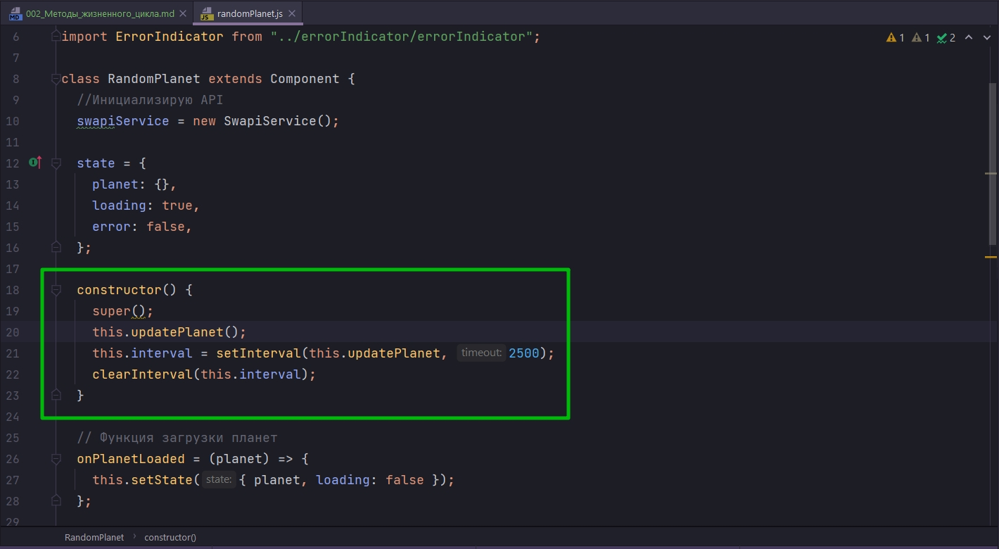
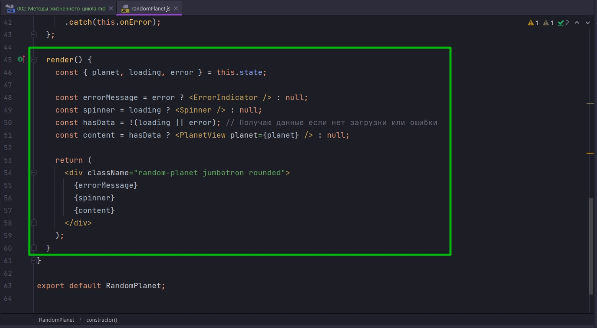
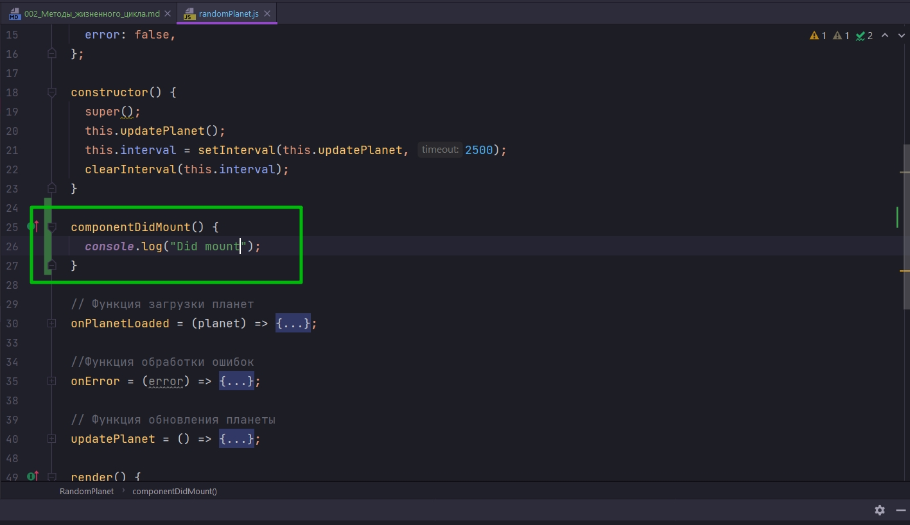
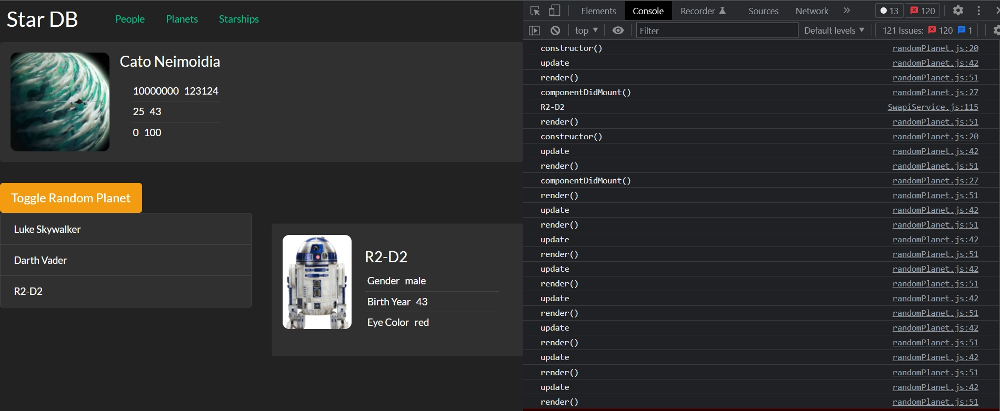
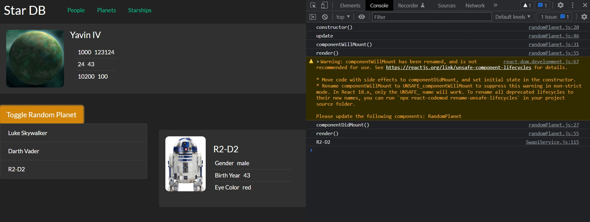
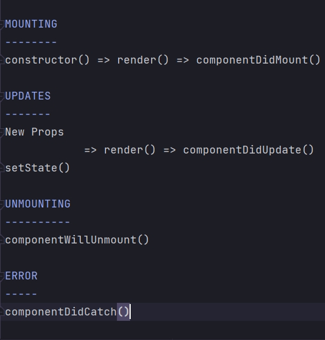

# 002_Методы_жизненного_цикла

В React каждый компонент проходит через несколько этапов. Сперва компонент создается через constructor. Вызывается функция constructor.



Затем React вызывает функцию render.



Функция render возвращает дерево React-элементов. Эти элементы превращаются в DOM элементы которые потом добавляются к DOM дереву на странице.

Затем компонент может некоторое время обновляться.

Каким образом компонент может обновиться?

Может произойти одно из двух событий.

1. Компонент может получить новое свойство props, и тогда React придется снова вызвать функцию render для того что бы получить новое представление элементов.
2. Либо в результате какого-нибудь события компонент вызывает setState и это приводит к такому же эфекту. Вызывается функция render, полученное дерево JSX-элементов превращаются в DOM - элементы, DOM дерево обновляется.

В какой-то момент компонент становится больше не нужен. Он больше не отображается на странице. Тогда созданные для компонента DOM nodes удаляются со страницы и компонент уничтожается.

Все эти этапы которые мы рассмотрим в следующих видео называются жизненным циклом компонента или life cycle.

И на каждом этапе жизненного цикла React вызывает одну из специальных функций компонента. Эти функции называются общим термином lifecycle hooks.

К примеру если мы объявим в нашем компоненте функция componentDidMount()




React исполнит этот код, код функции componentDidMount, сразу после того как компонент отобразится на странице в первый раз

```js
import React, { Component } from "react";
import SwapiService from "../../services/SwapiService";
import Spinner from "../spinner/spinner";
import PlanetView from "./planetView/planetView";
import "./randomPlanet.css";
import ErrorIndicator from "../errorIndicator/errorIndicator";

class RandomPlanet extends Component {
  //Инициализирую API
  swapiService = new SwapiService();

  state = {
    planet: {},
    loading: true,
    error: false,
  };

  constructor() {
    super();
    console.log("constructor()");
    this.updatePlanet();
    this.interval = setInterval(this.updatePlanet, 5000);
    // clearInterval(this.interval);
  }

  componentDidMount() {
    console.log("componentDidMount()");
  }

  // Функция загрузки планет
  onPlanetLoaded = (planet) => {
    this.setState({ planet, loading: false });
  };

  //Функция обработки ошибок
  onError = (error) => {
    this.setState({ error: true, loading: false });
  };

  // Функция обновления планеты
  updatePlanet = () => {
    console.log("update");
    const id = Math.floor(Math.random() * 25) + 2; //Округляю и устанавливаю диапазон случайных планет
    this.swapiService
      .getPlanet(id)
      .then(this.onPlanetLoaded)
      .catch(this.onError);
  };

  render() {
    console.log("render()");
    const { planet, loading, error } = this.state;

    const errorMessage = error ? <ErrorIndicator /> : null;
    const spinner = loading ? <Spinner /> : null;
    const hasData = !(loading || error); // Получаю данные если нет загрузки или ошибки
    const content = hasData ? <PlanetView planet={planet} /> : null;

    return (
      <div className="random-planet jumbotron rounded">
        {errorMessage}
        {spinner}
        {content}
      </div>
    );
  }
}

export default RandomPlanet;

```



Сперва вызывается constructor(), затем мы обновляем состояние нашей планеты update мы отправляем запрос на сервер, первый раз вызывается функция render(), далее вызывается componentDidMount() т.е. в этот момент DOM дерево уже является частью дерева страницы, затем приходять данные с сервера мы снова вызываем render() и затем идуд циклы обновления update.

Есть еще одна функция физненного цикла componentWillUnmount(). React будет вызывать эту функцию перед тем как компонент удалится со страницы. т.е. это тот момент когда компонент уничтожается.

```js
import React, { Component } from "react";
import SwapiService from "../../services/SwapiService";
import Spinner from "../spinner/spinner";
import PlanetView from "./planetView/planetView";
import "./randomPlanet.css";
import ErrorIndicator from "../errorIndicator/errorIndicator";

class RandomPlanet extends Component {
  //Инициализирую API
  swapiService = new SwapiService();

  state = {
    planet: {},
    loading: true,
    error: false,
  };

  constructor() {
    super();
    console.log("constructor()");
    this.updatePlanet();
    this.interval = setInterval(this.updatePlanet, 10000);
    // clearInterval(this.interval);
  }

  componentDidMount() {
    console.log("componentDidMount()");
  }

  componentWillMount() {
    console.log(`componentWillMount()`);
  }

  // Функция загрузки планет
  onPlanetLoaded = (planet) => {
    this.setState({ planet, loading: false });
  };

  //Функция обработки ошибок
  onError = (error) => {
    this.setState({ error: true, loading: false });
  };

  // Функция обновления планеты
  updatePlanet = () => {
    console.log("update");
    const id = Math.floor(Math.random() * 25) + 2; //Округляю и устанавливаю диапазон случайных планет
    this.swapiService
      .getPlanet(id)
      .then(this.onPlanetLoaded)
      .catch(this.onError);
  };

  render() {
    console.log("render()");
    const { planet, loading, error } = this.state;

    const errorMessage = error ? <ErrorIndicator /> : null;
    const spinner = loading ? <Spinner /> : null;
    const hasData = !(loading || error); // Получаю данные если нет загрузки или ошибки
    const content = hasData ? <PlanetView planet={planet} /> : null;

    return (
      <div className="random-planet jumbotron rounded">
        {errorMessage}
        {spinner}
        {content}
      </div>
    );
  }
}

export default RandomPlanet;

```

Он у меня не срабатывает должным образом т.к. его не рекомендуется больше использовать



Эта та функция в которую мы бы могли поместить очистку нашего таймера.


Теперь посмотрим на те функции которые React будет вызывать на разных этапах жизненного цикла.

1. Первый этап это MOUNTING это то когда компонент создается и он первый раз отображается на странице.
2. Второй этап это после того как наш компонент отобразился, он работает и он может получать обновления, UPDATES
3. Третий этап это UNMOUNTING - это когда компонент становится не нужен и он удаляется со страницы.
4. И последний отдельный этап - это этап ошибки ERROR когда компонент получает какую-нибудь ошибку, которая не была поймана раньше.

И на каждом этом этапе у нас есть несколько функций жизненного цикла.


MOUNTING
--------
constructor() => render() => componentDidMount()

UPDATES
-------
New Props
            => render() => componentDidUpdate()
setState()

UNMOUNTING
----------
componentWillUnmount()

ERROR
-----
componentDidCatch()



MOUNTING сперва вызывается constructor(), затем React вызывает render() и затем componentDidMount()

UPDATES - обновление может проходить благодаря двум событиям, 1) пришли новые пропсы 2) или  вызвался setState() благодаря какому-нибудь событию. Любое из этих событий приводит к тому что вызывается функция render() т.е. мы получаем новое дерево DOM элементов, и затем вызывается функция componentDidUpdate() т.е. React дает нам шанс сделать что-то после того как компонент обновился.

UNMOUNTING - все очень просто, когда компонент становится не нужным componentWillUnmount()

ERROR - componentDidCatch() когда происходит ошибка которая не была поймана, React вызовет componentDidCatch()

Вот эти методы componentDidMount(), componentDidUpdate(), componentWillUnmount(), componentDidCatch() называются жизненными циклами React компонента. ЭТО НЕ ПОЛНЫЙ СПИСОК ЖИЗНЕННЫХ ЦИКЛОВ REACT КОМПОНЕНТА. Но остальные методы используются довольно редко, в некоторых экзотических случаях.

В следующем блоке мы подробнее остановимся на этих функциях  и посмотрим какие типичные задачи можно решать с их помощью.


> Методы жизненного цикла
> 
> componentDidMount() - компонент подключен (DOM элементы уже на странице)
> 
> componentDidUpdate() - компонент обновился
> 
> componentWillUnMount() - компонент будет удален (но DOM еще на странице)
> 
> componentDidCatch() - когда в компоненте (или в его child-компонентах) произошла ошибка