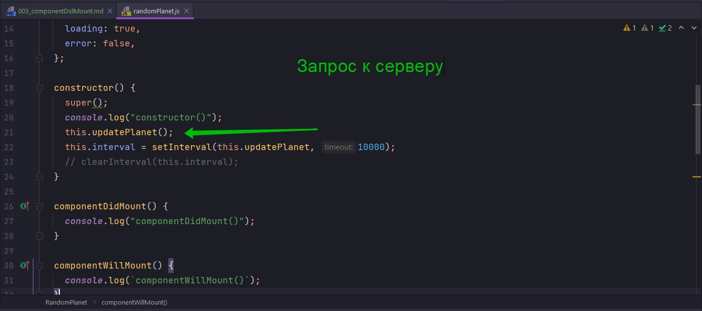
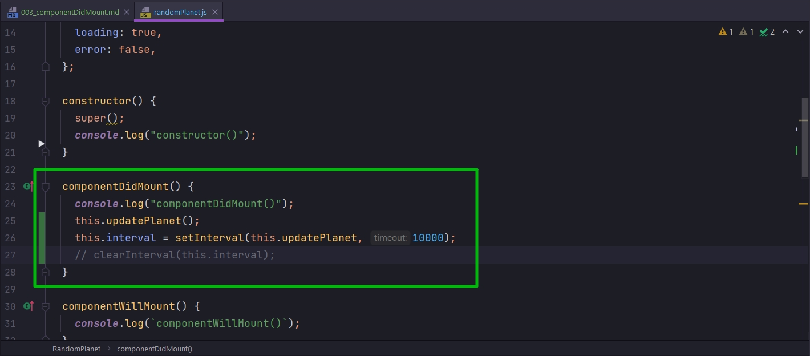
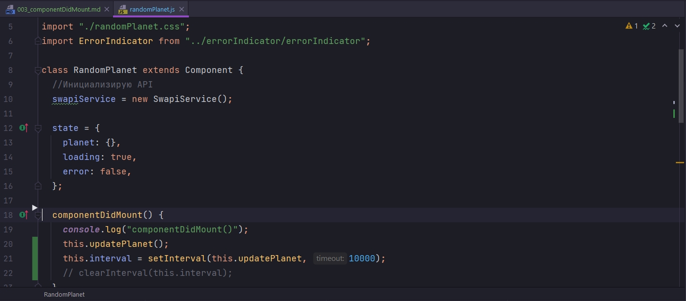
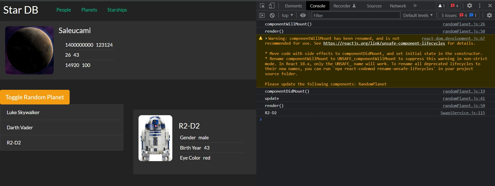

# 003_componentDidMount

Этот метод вызывается после того как компонент в первый раз удачно проинициалиизировался и отрисовался на странице.

Что нужно делать в этом методе?

Этот метод самое подходящее место для того что бы проводить первоначальную инициализацию компонента или делать какие-нибудь запросы к API и начинать асинхронное получение данных.

В нашем примере когда мы писали класс RandomPlanet мы использовали для этого constructor.

Но такой подход не очень хорош. В ООП, не только в React, а в ООП вообще, считается очень плохой практикой когда constructor имеет сайт эфекты. Например начинает делать запросы к серверу.



Когда у объекта такой конструктор, его сложнее тестировать и с ним впринципе сложнее работать.

Вторая причина - это до того как React вызывает componentDidMount(), компоненте считается UNMOUNTED т.е. он находится в таком себе подвешенном состоянии т.е. полностью не смонтирован. У вас объект уже создан, но он еще не до конца проинициализирован в дереве компонентов приложения. И до того как компонент станет MOUNTED т.е. будет вызван componentDidMount(), вызывать к примеру setState() нельзя. React будет давать вам большие красные предупреждения в консоли и говорить что такой вызов к setState он не будет иметь ни какого эффекта. 

По этому инициализацию компонентов, которые зависят от внешних источников данных лючше проводить в componentDidMount.

Т.е. если мы будем следовать хорошим практикам, мы уберем constructor полностью из RandomPlanet, и перенесем код из constructor в componentDidMount.



Теперь этот компонент написан более правильно с точки зрения React.


Второй важный момент для componentDidMount(). Когда этот метод вызван - это означает что DOM элементы гарантированно находятся на странице и они проинициализированы. И если вы работаете над компонентом который работает со сторонними библиотеками, с библиотеками которые работают непосредственно с DOM, в этом месте вы можете быть уверены что DOM уже создан и те самые другиее библиотеки могут начать свою инициализацию используя уже готовые элементы DOM дерева.

Большую часть времени в компонентах классах я не использую constructor вообще.



Я инициализирую необходимые поля прямо в теле класса, когда такая инициализация не создает ни каких сайт эфектов, а когда нужно вызвать API, я использую метод componentDidMount.

```js
import React, { Component } from "react";
import SwapiService from "../../services/SwapiService";
import Spinner from "../spinner/spinner";
import PlanetView from "./planetView/planetView";
import "./randomPlanet.css";
import ErrorIndicator from "../errorIndicator/errorIndicator";

class RandomPlanet extends Component {
  //Инициализирую API
  swapiService = new SwapiService();

  state = {
    planet: {},
    loading: true,
    error: false,
  };

  componentDidMount() {
    console.log("componentDidMount()");
    this.updatePlanet();
    this.interval = setInterval(this.updatePlanet, 10000);
    // clearInterval(this.interval);
  }

  componentWillMount() {
    console.log(`componentWillMount()`);
  }

  // Функция загрузки планет
  onPlanetLoaded = (planet) => {
    this.setState({ planet, loading: false });
  };

  //Функция обработки ошибок
  onError = (error) => {
    this.setState({ error: true, loading: false });
  };

  // Функция обновления планеты
  updatePlanet = () => {
    console.log("update");
    const id = Math.floor(Math.random() * 25) + 2; //Округляю и устанавливаю диапазон случайных планет
    this.swapiService
      .getPlanet(id)
      .then(this.onPlanetLoaded)
      .catch(this.onError);
  };

  render() {
    console.log("render()");
    const { planet, loading, error } = this.state;

    const errorMessage = error ? <ErrorIndicator /> : null;
    const spinner = loading ? <Spinner /> : null;
    const hasData = !(loading || error); // Получаю данные если нет загрузки или ошибки
    const content = hasData ? <PlanetView planet={planet} /> : null;

    return (
      <div className="random-planet jumbotron rounded">
        {errorMessage}
        {spinner}
        {content}
      </div>
    );
  }
}

export default RandomPlanet;

```




> componentDidMount()
> 
> componentDidMount() - компонент подключен (DOM элементы уже на странице)
> 
> Используется для инициализации (получение данных, работа с DOM, и т.д.)
> 
> Не используйте constructor, для кода, который создает побочные эффекты.