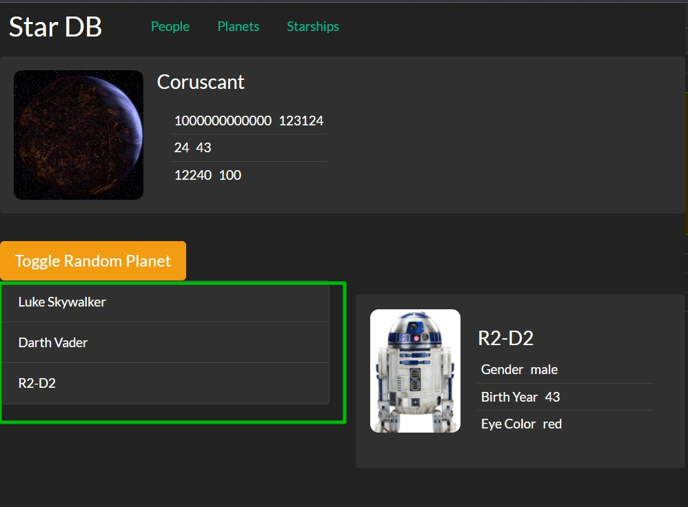

# 004_Используем_на_практике_componentDidMount

Попрактикуемся с componentDidMount и стем как создавать сетевые компоненты.

У нас есть отличный компонент что бы на нем потренироваться это itemList который в этом случае показывает список персонажей, а на других страницах он будет показывать список планет или список кораблей.



Пока что это единственный компонент itemList который мы будем изменять и делать его таки что бы он показывал список персонажей, а не других сущностей.

А затем мы с вами посмотрим как можно этот itemList расширить так что бы он умел работать и с планетами и со звездными кораблями.

```js
//src/components/itemList/itemList.js
import React, { Component } from "react";
import "./itemList.css";

class ItemList extends Component {
  render() {
    return (
      <ul className="item-list list-group">
        <li className="list-group-item">Luke Skywalker</li>
        <li className="list-group-item">Darth Vader</li>
        <li className="list-group-item">R2-D2</li>
      </ul>
    );
  }
}

export default ItemList;

```

И теперь давайте подумаем как мы можем обновить ItemList для того что бы он был хорошим, красивым сетевым компонентом?

Начнем как всегда со state. И скажем что он должен знать что такое peopleList: null.

Теперь в функции componentDidMount, а не в constructor, мы скажем что мы хотим получить данные о списке персонажей из нашего API. 

Для того что бы это сделать нам нужен наш SwapiService. Импортирую его. И инициализирую класс swapiService для того что бы инкапсулировать работу с данными.

```js
//src/components/itemList/itemList.js
import React, { Component } from "react";
import SwapiService from "../../services/SwapiService";
import "./itemList.css";

class ItemList extends Component {
  //инициализирую класс для того что бы инкапсулировать работу с данными API
  swapiService = new SwapiService();

  state = {
    peopleList: null,
  };

  componentDidMount() {
    this.swapiService.getAllPeople().then((peopleList) => {
      this.setState({
        peopleList,
      });
    });
  }

  render() {
    return (
      <ul className="item-list list-group">
        <li className="list-group-item">Luke Skywalker</li>
        <li className="list-group-item">Darth Vader</li>
        <li className="list-group-item">R2-D2</li>
      </ul>
    );
  }
}

export default ItemList;

```

Если плохо понятно почему у нас одно состояние peopleList, и при изменении я тоже передаю peopleList. То смотри трансформацию данных на клиенете которые я получаю с API а точнее класс SwapiService

```js
// src/services/SwapiService.js
export default class SwapiService {
  // базовый url
  API_BASE = `https://swapi.dev/api`;

  async getResource(url) {
    // составляю строку из базового url и того url что прилетает из методов
    const response = await fetch(`${this.API_BASE}${url}`);
    //Обработка ошибки на клиенте
    if (!response.ok) {
      throw new Error(`Could not fetch ${url}` + `received ${response.status}`);
    }
    const body = await response.json(); // получаю тело запроса
    return body;
  }

  // Персонажи

  // Получение всех персонажей
  async getAllPeople() {
    // передаю только нужную часть url
    const response = await this.getResource(`/people/`);
    return response.results.map(this.transformPerson);
  }
  // получаю конкретного персонажа
  async getPerson(id) {
    // передаю только нужную часть url
    const person = await this.getResource(`/people/${id}/`);
    return this.transformPerson(person);
  }

  // Планеты

  // Получаю все планеты
  async getAllPlanets() {
    const planets = await this.getResource(`/planets/`);
    return planets.results.map(this.transformPlanet);
  }
  //Получаю планету
  async getPlanet(id) {
    const planet = await this.getResource(`/planets/${id}/`);
    return this.transformPlanet(planet);
  }

  //Космические корабли

  // Получаю все корабли
  async getAllStarShips() {
    const response = await this.getResource(`/starships/`);
    return response.results.map(this.transformStarShip);
  }

  //Получаю космический корабль
  async getStarship(id) {
    const starship = await this.getResource(`/starships/${id}/`);
    return this.transformStarShip(starship);
  }

  // Трансформация данных полученных от API в нужный формат

  // Извлекаю id
  extractId(item) {
    //регуларка для поиска id в строке url
    const idRegExp = /\/([0-9]*)\/$/;
    // ищу id
    return item.url.match(idRegExp)[1];
    // Нулевая группа это все выражение, а первая группа это все что в скобках
  }

  // Трансформация данных для планет(ы)
  transformPlanet(planet) {
    return {
      id: this.extractId(planet),
      name: planet.name,
      population: planet.population,
      rotationPeriod: planet.rotation_period,
      diameter: planet.diameter,
    };
  }

  // Трансформация данных для космическ(ого)их корабл(я)ей
  transformStarShip(starship) {
    return {
      id: this.extractId(starship),
      name: starship.name,
      model: starship.model,
      manufacturer: starship.manufacturer,
      costInCredits: starship.costInCredits,
      length: starship.length,
      crew: starship.crew,
      passengers: starship.passengers,
      cargoCapacity: starship.cargoCapacity,
    };
  }

  // Трансформация данных для персонажа(ей)
  transformPerson(person) {
    return {
      id: this.extractId(person),
      name: person.name,
      gender: person.gender,
      birthDay: person.birthDay,
      eyeColor: person.eyeColor,
    };
  }
}

// Код обработки данных

// Инициализирую класс
const swapi = new SwapiService();

// Получаю ответ с сервера и обрабатываю promise
swapi.getPerson(3).then((person) => {
  console.log(person.name);
});

```

При получении данных с сервера я не буду описывать блок catch и обрабатывать ошибки.

Теперь я могу написать в render простую логику для того что бы обрабатывать этот peopleList.

```js
// src/services/SwapiService.js
export default class SwapiService {
  // базовый url
  API_BASE = `https://swapi.dev/api`;

  async getResource(url) {
    // составляю строку из базового url и того url что прилетает из методов
    const response = await fetch(`${this.API_BASE}${url}`);
    //Обработка ошибки на клиенте
    if (!response.ok) {
      throw new Error(`Could not fetch ${url}` + `received ${response.status}`);
    }
    const body = await response.json(); // получаю тело запроса
    return body;
  }

  // Персонажи

  // Получение всех персонажей
  async getAllPeople() {
    // передаю только нужную часть url
    const response = await this.getResource(`/people/`);
    return response.results.map(this.transformPerson);
  }
  // получаю конкретного персонажа
  async getPerson(id) {
    // передаю только нужную часть url
    const person = await this.getResource(`/people/${id}/`);
    return this.transformPerson(person);
  }

  // Планеты

  // Получаю все планеты
  async getAllPlanets() {
    const planets = await this.getResource(`/planets/`);
    return planets.results.map(this.transformPlanet);
  }
  //Получаю планету
  async getPlanet(id) {
    const planet = await this.getResource(`/planets/${id}/`);
    return this.transformPlanet(planet);
  }

  //Космические корабли

  // Получаю все корабли
  async getAllStarShips() {
    const response = await this.getResource(`/starships/`);
    return response.results.map(this.transformStarShip);
  }

  //Получаю космический корабль
  async getStarship(id) {
    const starship = await this.getResource(`/starships/${id}/`);
    return this.transformStarShip(starship);
  }

  // Трансформация данных полученных от API в нужный формат

  // Извлекаю id
  extractId(item) {
    //регуларка для поиска id в строке url
    const idRegExp = /\/([0-9]*)\/$/;
    // ищу id
    return item.url.match(idRegExp)[1];
    // Нулевая группа это все выражение, а первая группа это все что в скобках
  }

  // Трансформация данных для планет(ы)
  transformPlanet = (planet) => {
    return {
      id: this.extractId(planet),
      name: planet.name,
      population: planet.population,
      rotationPeriod: planet.rotation_period,
      diameter: planet.diameter,
    };
  };

  // Трансформация данных для космическ(ого)их корабл(я)ей
  transformStarShip = (starship) => {
    return {
      id: this.extractId(starship),
      name: starship.name,
      model: starship.model,
      manufacturer: starship.manufacturer,
      costInCredits: starship.costInCredits,
      length: starship.length,
      crew: starship.crew,
      passengers: starship.passengers,
      cargoCapacity: starship.cargoCapacity,
    };
  };

  // Трансформация данных для персонажа(ей)
  transformPerson = (person) => {
    return {
      id: this.extractId(person),
      name: person.name,
      gender: person.gender,
      birthDay: person.birthDay,
      eyeColor: person.eyeColor,
    };
  };
}

// Код обработки данных

// Инициализирую класс
const swapi = new SwapiService();

// Получаю ответ с сервера и обрабатываю promise
swapi.getPerson(3).then((person) => {
  console.log(person.name);
});

```

И получаю ошибку


Все дело в том что в функциях трансформации данных,transformPlanet transformStarShip transformPerson, я использую простые функции а не стрелочные. this не лексическия а динамический. Для того что бы исправить делаю стрелочными функциями функции трансформации данных. В соответствующем разделе все поправил, но и здесь упоминаю.

```js
// src/services/SwapiService.js
export default class SwapiService {
  // базовый url
  API_BASE = `https://swapi.dev/api`;

  async getResource(url) {
    // составляю строку из базового url и того url что прилетает из методов
    const response = await fetch(`${this.API_BASE}${url}`);
    //Обработка ошибки на клиенте
    if (!response.ok) {
      throw new Error(`Could not fetch ${url}` + `received ${response.status}`);
    }
    const body = await response.json(); // получаю тело запроса
    return body;
  }

  // Персонажи

  // Получение всех персонажей
  async getAllPeople() {
    // передаю только нужную часть url
    const response = await this.getResource(`/people/`);
    return response.results.map(this.transformPerson);
  }
  // получаю конкретного персонажа
  async getPerson(id) {
    // передаю только нужную часть url
    const person = await this.getResource(`/people/${id}/`);
    return this.transformPerson(person);
  }

  // Планеты

  // Получаю все планеты
  async getAllPlanets() {
    const planets = await this.getResource(`/planets/`);
    return planets.results.map(this.transformPlanet);
  }
  //Получаю планету
  async getPlanet(id) {
    const planet = await this.getResource(`/planets/${id}/`);
    return this.transformPlanet(planet);
  }

  //Космические корабли

  // Получаю все корабли
  async getAllStarShips() {
    const response = await this.getResource(`/starships/`);
    return response.results.map(this.transformStarShip);
  }

  //Получаю космический корабль
  async getStarship(id) {
    const starship = await this.getResource(`/starships/${id}/`);
    return this.transformStarShip(starship);
  }

  // Трансформация данных полученных от API в нужный формат

  // Извлекаю id
  extractId(item) {
    //регуларка для поиска id в строке url
    const idRegExp = /\/([0-9]*)\/$/;
    // ищу id
    return item.url.match(idRegExp)[1];
    // Нулевая группа это все выражение, а первая группа это все что в скобках
  }

  // Трансформация данных для планет(ы)
  transformPlanet = (planet) => {
    return {
      id: this.extractId(planet),
      name: planet.name,
      population: planet.population,
      rotationPeriod: planet.rotation_period,
      diameter: planet.diameter,
    };
  };

  // Трансформация данных для космическ(ого)их корабл(я)ей
  transformStarShip = (starship) => {
    return {
      id: this.extractId(starship),
      name: starship.name,
      model: starship.model,
      manufacturer: starship.manufacturer,
      costInCredits: starship.costInCredits,
      length: starship.length,
      crew: starship.crew,
      passengers: starship.passengers,
      cargoCapacity: starship.cargoCapacity,
    };
  };

  // Трансформация данных для персонажа(ей)
  transformPerson = (person) => {
    return {
      id: this.extractId(person),
      name: person.name,
      gender: person.gender,
      birthDay: person.birthDay,
      eyeColor: person.eyeColor,
    };
  };
}

// Код обработки данных

// Инициализирую класс
const swapi = new SwapiService();

// Получаю ответ с сервера и обрабатываю promise
swapi.getPerson(3).then((person) => {
  console.log(person.name);
});

```

Ок. Спиннер отображается. И пока что я отображаю копмпонент с теми данными которые мы пока что не достаем из state.

```js
//src/components/itemList/itemList.js
import React, { Component } from "react";
import SwapiService from "../../services/SwapiService";
import "./itemList.css";
import Spinner from "../spinner/spinner";

class ItemList extends Component {
  //инициализирую класс для того что бы инкапсулировать работу с данными API
  swapiService = new SwapiService();

  state = {
    peopleList: null,
  };

  componentDidMount() {
    this.swapiService.getAllPeople().then((peopleList) => {
      this.setState({
        peopleList,
      });
    });
  }

  render() {
    const { peopleList } = this.state;

    if (!peopleList) {
      return <Spinner />;
    }

    return (
      <ul className="item-list list-group">
        <li className="list-group-item">Luke Skywalker</li>
        <li className="list-group-item">Darth Vader</li>
        <li className="list-group-item">R2-D2</li>
      </ul>
    );
  }
}

export default ItemList;

```


И теперь все что мы должны сделать это используя данные из peopleList отрисовать элементы списка. И затем добавить eventListener который позволит сказать что мы кликнули по одному из персонажей.

```js
//src/components/itemList/itemList.js
import React, { Component } from "react";
import SwapiService from "../../services/SwapiService";
import "./itemList.css";
import Spinner from "../spinner/spinner";

class ItemList extends Component {
  //инициализирую класс для того что бы инкапсулировать работу с данными API
  swapiService = new SwapiService();

  state = {
    peopleList: null,
  };

  componentDidMount() {
    this.swapiService.getAllPeople().then((peopleList) => {
      this.setState({
        peopleList,
      });
    });
  }

  renderItems(arr) {
    return arr.map(({ id, name }) => {
      return (
        <li
          className="list-group-item"
          key={id}
          // onClick={()=>this.props.onItemSelected(id)}
        >
          {name}
        </li>
      );
    });
  }

  render() {
    const { peopleList } = this.state;

    if (!peopleList) {
      return <Spinner />;
    }

    const items = this.renderItems(peopleList);

    return <ul className="item-list list-group">{items}</ul>;
  }
}

export default ItemList;

```

Теперь  вместо трех захардкоженных элементов, мы получаем список из десятка разных персонажей.


Теперь я хочу по клику зделать так что бы срабатывал event onItemSelected, и сделать так что бы App знал что мы выбираем одного из персонажей.

В App создаю функцию выбора персонажа onPersonSelected которая принимает id. В теле функции вызываю setState в который передаю объект с полем selectedPerson: id. В state selectedPerson инициализирую как null.

Теперь в тег ItemList передаю пропс onItemSelected и сказать что это будет функция this.onPersonSelected.

И еще selectedPerson мы могли бы сразу передать в компонент который называется ItemDetails. ItemDetails в свою очередь будет заниматься загрузкой информации о выбранном персонаже. Передаю пропс personId={this.state.selectedPerson}.

```js
//src/component/app?App.js
import React, {Component} from "react";
import Header from "../header/header";
import ItemList from "../itemList/itemList";
import ItemDetails from "../itemDetails/itemDetails";
import RandomPlanet from "../randomPlanet/randomPlanet";
import "./App.css";

class App extends Component {
    state = {
        showRandomPlanet: true,
        selectedPerson: null,
    };

    //Функция включения и выключения компонента рандомной планеты
    toggleRandomPlanet = () => {
        this.setState((state) => {
            return {
                showRandomPlanet: !state.showRandomPlanet,
            };
        });
    };

    //Функция выбора персонажа
    onPersonSelected = (id) => {
        this.setState({
            selectedPerson: id,
        });
    };

    render() {
        const planet = this.state.showRandomPlanet ? <RandomPlanet/> : null;
        return (
            <div>
                <Header/>
                {planet}
                <button
                    className="toggle-planet btn btn-warning btn-lg"
                    onClick={this.toggleRandomPlanet}
                >
                    Toggle Random Planet
                </button>
                <div className="row mb2">
                    <div className="col-md-6">
                        <ItemList onItemSelected={this.onPersonSelected}/>
                    </div>
                    <div className="col-md-6">
                        <ItemDetails itemId={this.state.selectedPerson}/>
                    </div>
                </div>
            </div>
        );
    }
}

export default App;

```

Теперь что бы закончить эту функциональнось в последующем нудно написать код для компонента ItemDetails.


Итог: Если в нашем компоненте нужно вызвать API, самое лучшее место для того что бы это сделать - это функция componentDidMount() поскольку React когда вызывает эту функцию - это означает что компонент полностью проинициализирован и на нем можно вызывать методы вроде setState.

В constructor это будет уже не так.  Ну и короме того сайт эффекты типа вызова сервера из конструктора считается достаточно плохой практикой в ООП.

> componentDidMount() - хорошее место для того что бы плучать данные