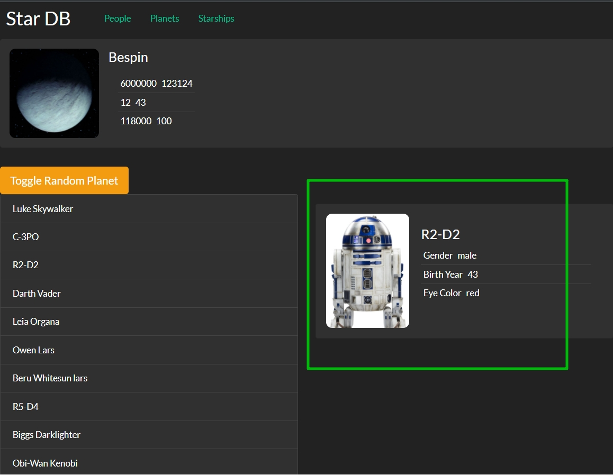
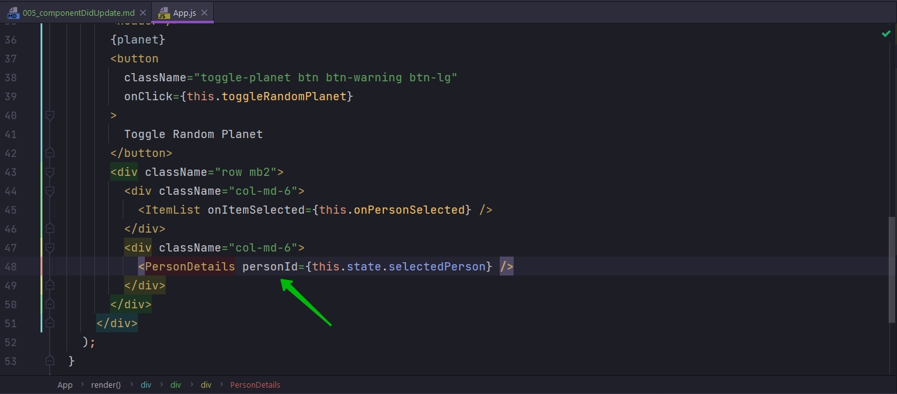
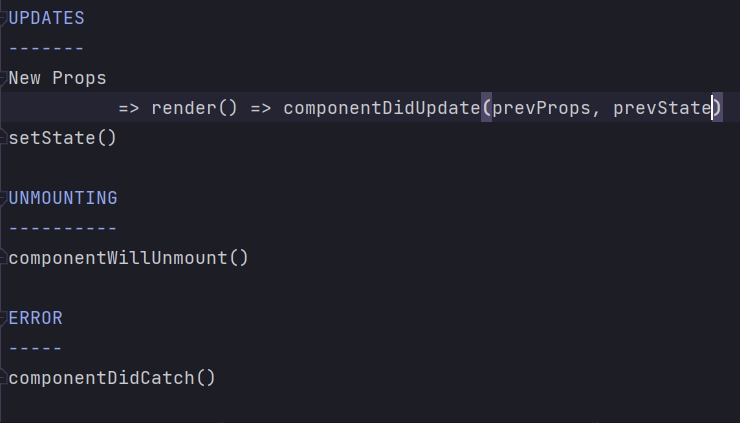

# 005_componentDidUpdate

Этот метод вызывается сразу после того как компонент обновился в результате того что он получил новые props или он вызвал setState и получил новый state.

Важная особенность!!!! Первая инициализация компонента т.е. монтирование компонента constructor() => render() => componentDidUnmount(), они не считаются обновлением, по этому в первый раз componentDidUpdate() не вызывается.

Он вызывается действительно для обновленных свойств.

Когда следует использовать этот метод?

Этот метод хорошо использовать тогда, когда компоненту нужно обновляться в результате обновления свойств т.е. он не напрямую зависит от свойств, а ему еще что-то нужно сделать.

Посмотрим на компонент ItemDetails 

Этот компонент самостоятельно занимается своими сетевыми вызовами и он получает только свойства personId

Т.е. в нашем коде, когда App получает новый selectedPerson он будет обновлять свойство personId у компонента ItemDetails. И React вызовет наш код в тот момент, когда personId будет будет обновлен. И в нашем компоненте ItemDetails мы смогли бы сделать запрос на сервер и обновить данные персонажа в соответствии с тем кого сейчас выбирает пользователь.

Эта функция componentDidUpdate() принимает два аргумента это prevProps и prevState

UPDATES
-------
New Props
          => render() => componentDidUpdate(prevProps, prevState)
setState()

UNMOUNTING
----------
componentWillUnmount()

ERROR
-----
componentDidCatch()

Заметьте когда componentDidUpdate()  исполняется state уже обновлен т.е. функция render сработала, и state уже имеет новое состояние. И prevProps и prevState это соответственно предыдущие версии пропс и стейт которые мы можем использовать для того что бы строить логику в componentDidUpdate.

> componentDidUpdate()
> 
> componentDidUpdate() - вызывается после того, как компонент обновился
> 
> Компонент обновляется после того, как получает новые свойства или state
> 
> Этот метод вызывается после render() - в нем к примеру можно запрашивать новые данные для обновленных свойств.