# 006_Практика_componentDidUpdate

ItemDetails должен обновляться каждый раз когда он получает новый id персонажа. Он должен делать запрос на сервер, получать данные этого персонажа и перересовывать себя.

Подготовим этот компонент для того что бы работать с данными сервера.

Все вот это понятно создаю состояние, инциализирую класс swapiService и т.д.


Создаю функцию updatePerson. В теле этой функции деструктурирую id из props. И так как personId у нас может быть null делаю проверку, и в случае если он null ничего не возвращаю.

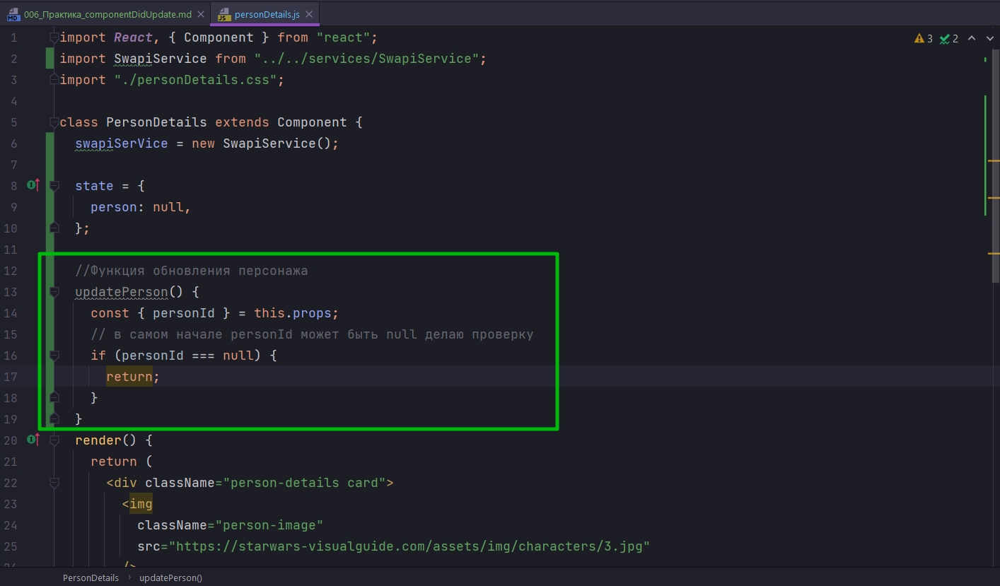

Теперь когда мы уверены что personId не null и пользователь действительно кого-то выбрал мы можем использовать swapiService для того что бы получить детали этого персонажа.

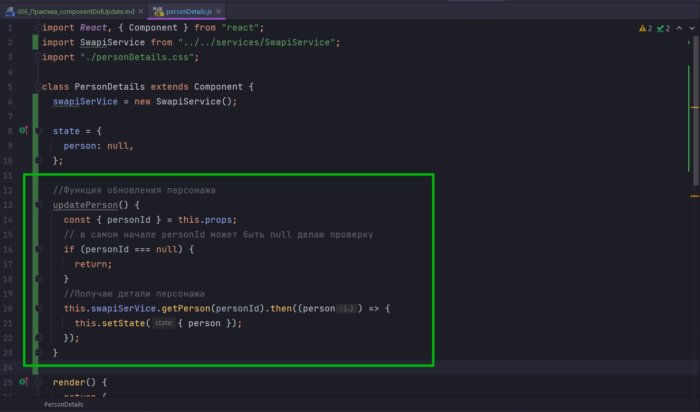

```js
import React, { Component } from "react";
import SwapiService from "../../services/SwapiService";
import "./itemDetails.css";

class ItemDetails extends Component {
  swapiSerVice = new SwapiService();

  state = {
    person: null,
  };

  //Функция обновления персонажа
  updatePerson() {
    const { personId } = this.props;
    // в самом начале personId может быть null делаю проверку
    if (personId === null) {
      return;
    }
    //Получаю детали персонажа
    this.swapiSerVice.getPerson(personId).then((person) => {
      this.setState({ person });
    });
  }

  render() {
    return (
      <div className="person-details card">
        

        <div className="card-body">
          <h4>R2-D2</h4>
          <ul className="list-group list-group-flush">
            <li className="list-group-item">
              <span className="term">Gender</span>
              <span>male</span>
            </li>
            <li className="list-group-item">
              <span className="term">Birth Year</span>
              <span>43</span>
            </li>
            <li className="list-group-item">
              <span className="term">Eye Color</span>
              <span>red</span>
            </li>
          </ul>
        </div>
      </div>
    );
  }
}

export default ItemDetails;

```

Теперь у нас есть простенькая но удобная функция updatePerson которую мы можем использовать каждый раз когда нам нужно будет обновлять персонажа.

Первый раз мы это сделаем в componentDidMount. Действительно Этот компонент уже может быть проинициализирован с каким-то id персонажем. 

Тогда нам следует обновить персонажа т.е. получить данные персонажа прямо в тот момент когда компонент был создан.

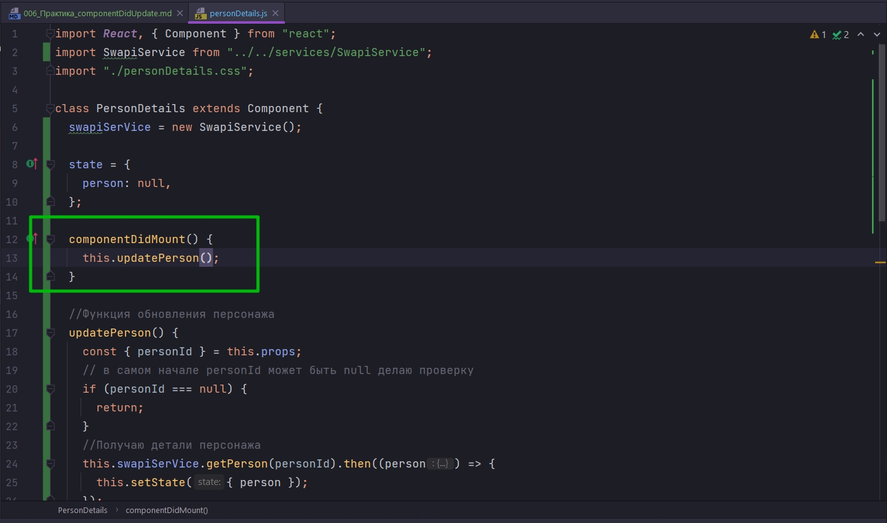

И теперь мне нужно начать получать данные из state в функции render. И вот обновленный код

```js
import React, { Component } from "react";
import SwapiService from "../../services/SwapiService";
import "./itemDetails.css";

class ItemDetails extends Component {
  swapiSerVice = new SwapiService();

  state = {
    person: null,
  };

  componentDidMount() {
    this.updatePerson();
  }

  //Функция обновления персонажа
  updatePerson() {
    const { personId } = this.props;
    // в самом начале personId может быть null делаю проверку
    if (personId === null) {
      return;
    }
    //Получаю детали персонажа
    this.swapiSerVice.getPerson(personId).then((person) => {
      this.setState({ person });
    });
  }

  render() {
    if (!this.state.person) {
      return <span>Select a person from a list</span>;
    }
    const { id, name, gender, birthYear, eyeColor } = this.state.person;

    return (
      <div className="person-details card">
        

        <div className="card-body">
          <h4>{name}</h4>
          <ul className="list-group list-group-flush">
            <li className="list-group-item">
              <span className="term">Gender</span>
              <span>{gender}</span>
            </li>
            <li className="list-group-item">
              <span className="term">Birth Year</span>
              <span>{birthYear}</span>
            </li>
            <li className="list-group-item">
              <span className="term">Eye Color</span>
              <span>{eyeColor}</span>
            </li>
          </ul>
        </div>
      </div>
    );
  }
}

export default ItemDetails;

```

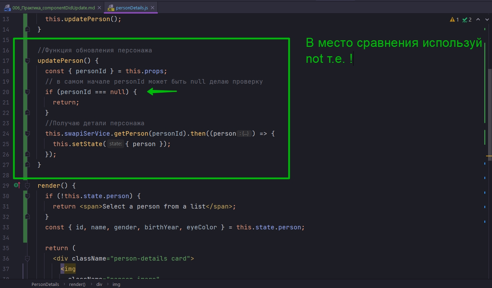


Теперь в App мы скажем что выбранный  персонаж с самого начала будет нпример с 5 id.

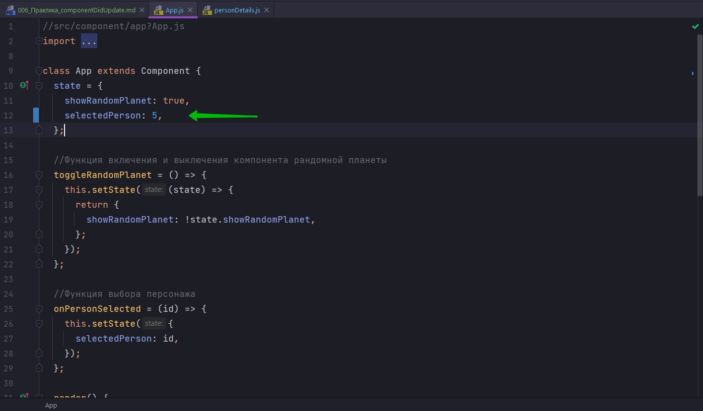

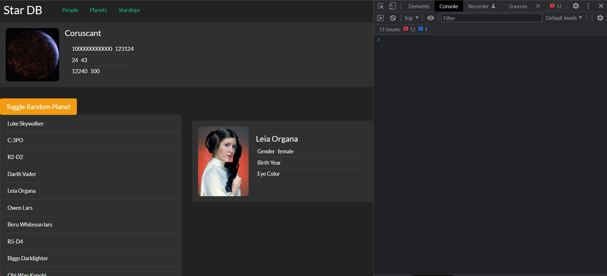

Единственный нюанс! Если мы сейчас будем менять personId, т.е. кликать по списку персонажей, то ничего происходить не будет.

И вот здесь на помощь к нам приходит componentDidUpdate. Это то самое место в котором мы можем загрузить нового персонажа если id обновился.

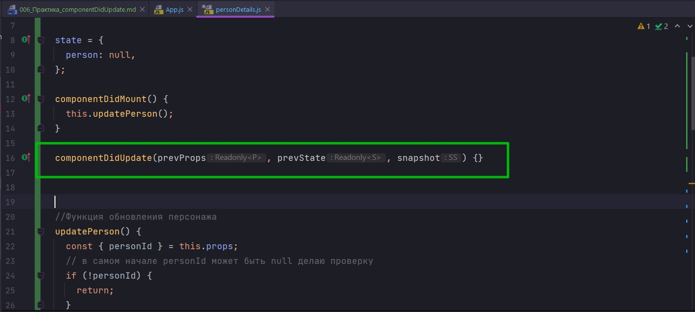

И теперь очеень-очень важный момент. Если вы собираетесь в componentDidUpdate запускать какие-то действия которые в конечном счете приведут к setState т.е. вы рано или позно измените state в componentDidUpdate. Вам обязательно нужно обернуть этот код в условие. Т.е. мы должны сравнить this.props.personId !== prevProps.personId

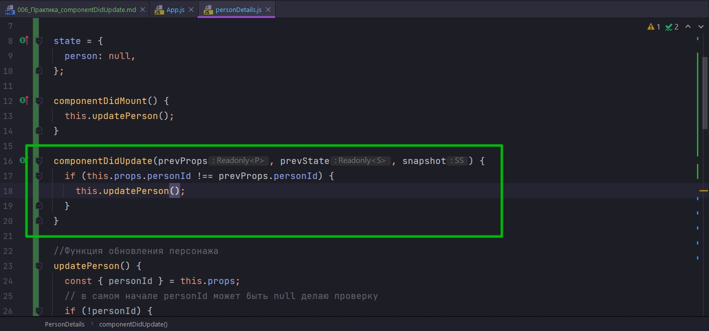

Зачем это нужно?

Дело в том что setState сам приведет к тому что компонент обновится и React для нас вызовет componentDidUpdate поскольку state обновился. И если в componentDidUpdate не будет условия, то вы в цикле снова начнете обновлять персонажа this.updatePerson() - эта функция в свою очередь приведет к setState, setState приведет к componentDidUpdate. И это будет бесконечный цикл обновления компонента.

По этому нужно проверить что действительно изменилось то свойство компонента за которым мы слеедим.

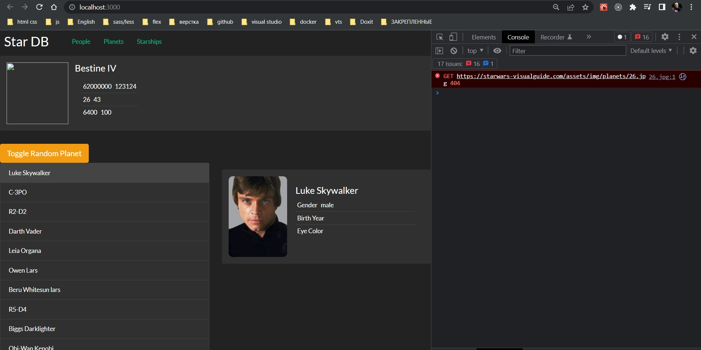

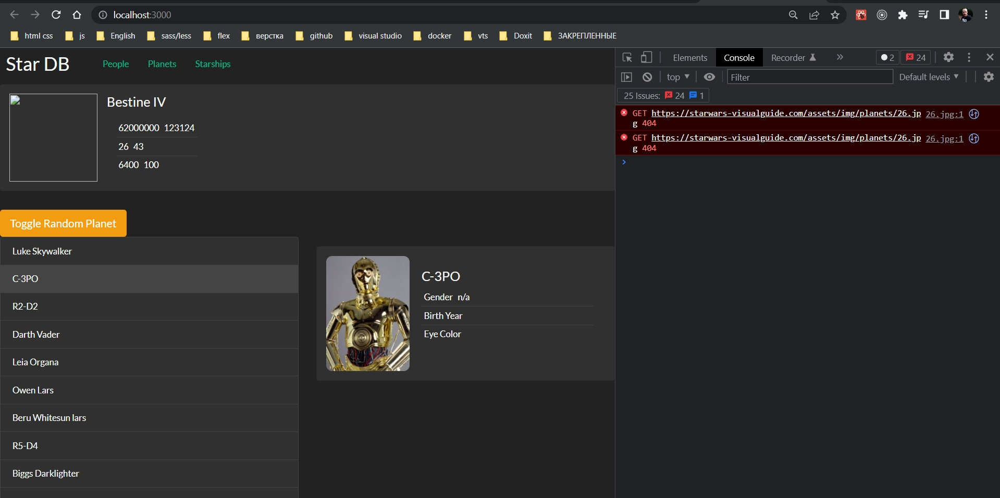

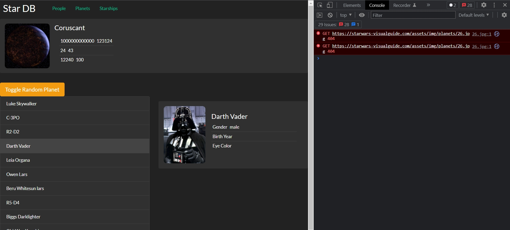

Все это мы получили благодаря одной маленькой функции componentDidUpdate, тело которой заняло пару строк кода.

```js
import React, { Component } from "react";
import SwapiService from "../../services/SwapiService";
import "./itemDetails.css";

class ItemDetails extends Component {
  swapiSerVice = new SwapiService();

  state = {
    person: null,
  };

  componentDidMount() {
    this.updatePerson();
  }

  componentDidUpdate(prevProps, prevState, snapshot) {
    if (this.props.personId !== prevProps.personId) {
      this.updatePerson();
    }
  }

  //Функция обновления персонажа
  updatePerson() {
    const { personId } = this.props;
    // в самом начале personId может быть null делаю проверку
    if (!personId) {
      return;
    }
    //Получаю детали персонажа
    this.swapiSerVice.getPerson(personId).then((person) => {
      this.setState({ person });
    });
  }

  render() {
    if (!this.state.person) {
      return <span>Select a person from a list</span>;
    }
    const { id, name, gender, birthYear, eyeColor } = this.state.person;

    return (
      <div className="person-details card">
        

        <div className="card-body">
          <h4>{name}</h4>
          <ul className="list-group list-group-flush">
            <li className="list-group-item">
              <span className="term">Gender</span>
              <span>{gender}</span>
            </li>
            <li className="list-group-item">
              <span className="term">Birth Year</span>
              <span>{birthYear}</span>
            </li>
            <li className="list-group-item">
              <span className="term">Eye Color</span>
              <span>{eyeColor}</span>
            </li>
          </ul>
        </div>
      </div>
    );
  }
}

export default ItemDetails;

```

> componentDidUpdate()
> 
> Мы использовали этот метод, что бы подгрузить новые данные, когда personId изменился
> 
> ОЧЕНЬ ВАЖНО: если в этом методе может изменяться state - обязательно проверять, какое именно свойство изменилось, иначе компонент рискует уйти в бесконечный цикл обновления компонента.
