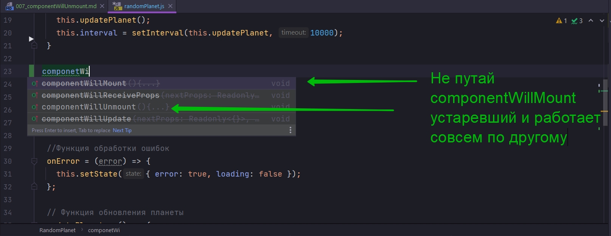
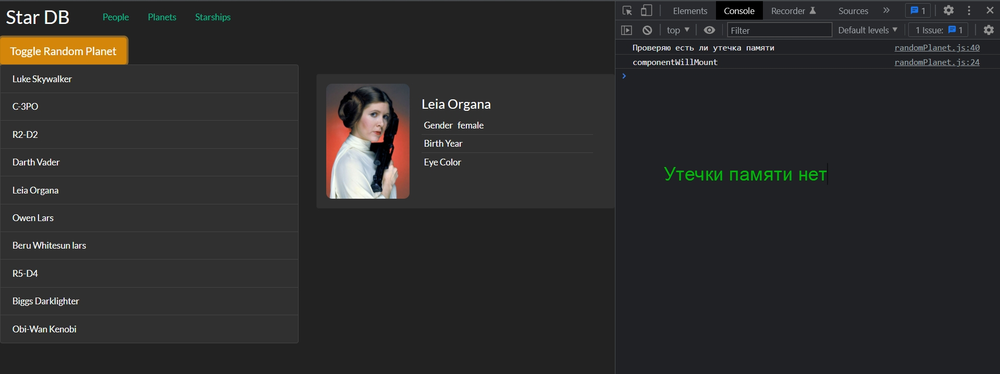

# 007_componentWillUnmount



Он вызывается перед тем как компонент окончательно очиститься. Т.е. в тот момент когда мы вызываем componentWillUnmount DOM дерево этого компонента все еще находитя на странице.

Ну и вполне очевидно что этот метод жизненного цикла используется для того что бы чистить те ресурсы с которыми работал компонент.

К примеру если у вас есть запущенный setInterval(), то метод componentWillUnmount самое хорошее место что бы его очистить.

В componentWillUnmount можно отменять текущие запросы к серверу или отписыватся от webSocket-ов.

Кроме того если ваш компонент работает со сторонней библиотекой и этой библиотеке нужно сделать свою собственную очистку перед тем как DOM удалиться, то componentWillUnmount это самое лучшее место что бы записать туда такой код.

На практике этот метод используется намного реже чем componentDidMount поскольку в действительности в web не так много компонентов, которые будут создавать такие ресурсы, которые затем нужно очищать.

Но в нашем приложении если посмотреть на практическую сторону компонента RandomPlanet дождался момента что бы очистить setInterval() и соответственно устранить Memory Link  т.е. утечку памяти.

Добавляю  clearInterval(this.interval); в componentWillUnmount и проверяю есть ли утечка в памяти. Добавляю  console.log('Проверяю есть ли утечка памяти') в updatePlanet

```js
import React, { Component } from "react";
import SwapiService from "../../services/SwapiService";
import Spinner from "../spinner/spinner";
import PlanetView from "./planetView/planetView";
import "./randomPlanet.css";
import ErrorIndicator from "../errorIndicator/errorIndicator";

class RandomPlanet extends Component {
    //Инициализирую API
    swapiService = new SwapiService();

    state = {
        planet: {},
        loading: true,
        error: false,
    };

    componentDidMount() {
        this.updatePlanet();
        this.interval = setInterval(this.updatePlanet, 10000);
    }

    componentWillUnmount() {
        console.log(`componentWillMount`);
        clearInterval(this.interval);
    }

    // Функция загрузки планет
    onPlanetLoaded = (planet) => {
        this.setState({ planet, loading: false });
    };

    //Функция обработки ошибок
    onError = (error) => {
        this.setState({ error: true, loading: false });
    };

    // Функция обновления планеты
    updatePlanet = () => {
        console.log("Проверяю есть ли утечка памяти");
        const id = Math.floor(Math.random() * 25) + 2; //Округляю и устанавливаю диапазон случайных планет
        this.swapiService
            .getPlanet(id)
            .then(this.onPlanetLoaded)
            .catch(this.onError);
    };

    render() {
        const { planet, loading, error } = this.state;

        const errorMessage = error ? <ErrorIndicator /> : null;
        const spinner = loading ? <Spinner /> : null;
        const hasData = !(loading || error); // Получаю данные если нет загрузки или ошибки
        const content = hasData ? <PlanetView planet={planet} /> : null;

        return (
            <div className="random-planet jumbotron rounded">
                {errorMessage}
                {spinner}
                {content}
            </div>
        );
    }
}

export default RandomPlanet;


```



componentWillUnmount - вызывается прямо перед тем как компонент исчезнет из DOM дерева. Соответственно в этом методе мы очищаем тот интервал который содавал нам проблемы.

Итоги: componentWillUnmount - вызывается прямо перед тем как компонент будет удален. 

В тот момент когда исполняется код из componentWillUnmount DOM дерево все еще содержит компонент.

Соответсвенно в componentWillUnmount можно проводить любую очистку связанную в том числе и с очисткой DOM.

И используется этот метод чаще всего для очистки ресурсов вроде clearInterval или для отмены запросов к серверу которые сейчас идут, но их результаты болше не нужны поскольку компонент больше не будет виден на экране.

> componentWillUnmount
> 
> componentWillUnmount() - компонент будет удален
> 
> Используется для очистки ресурсов 
> (таймеры, интервалы, запросы к серверу)
> 
> В момент вызова DOM узлы все еще находятся на странице