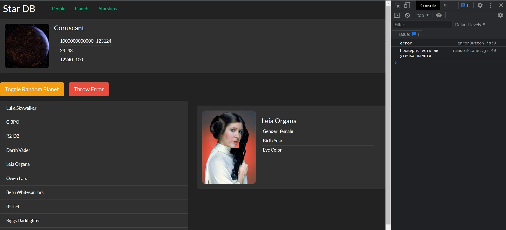
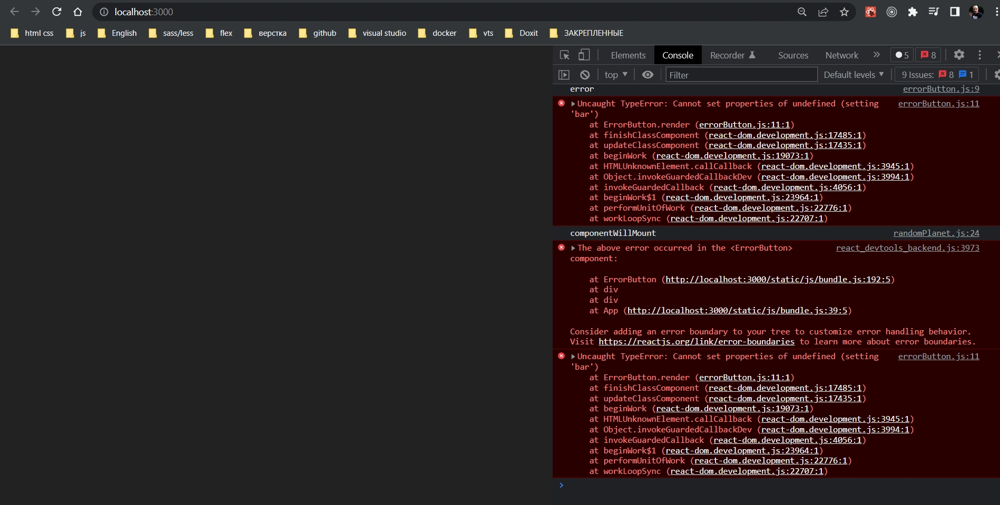
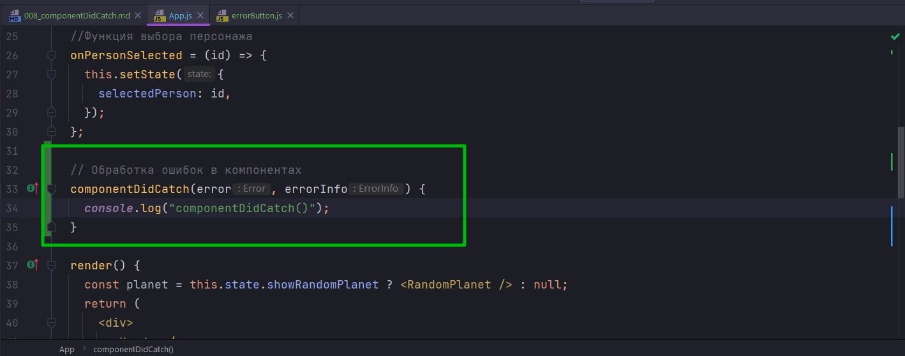
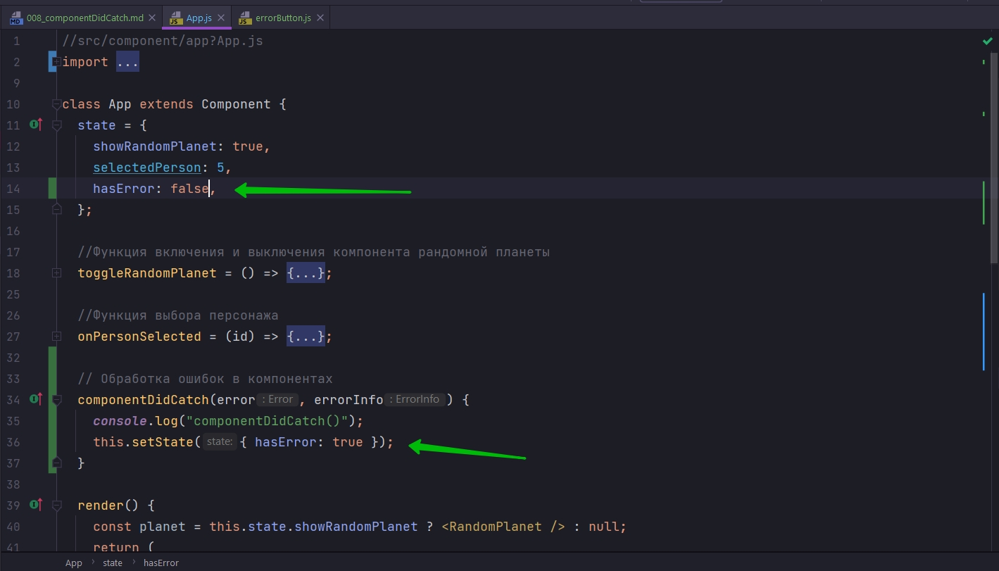
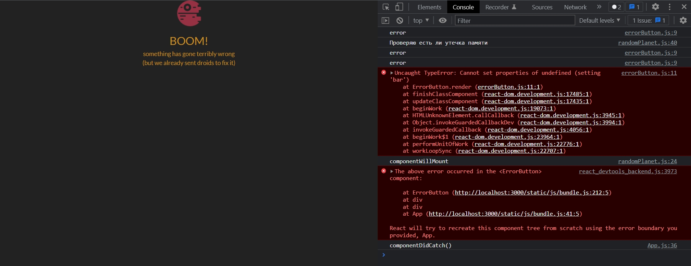
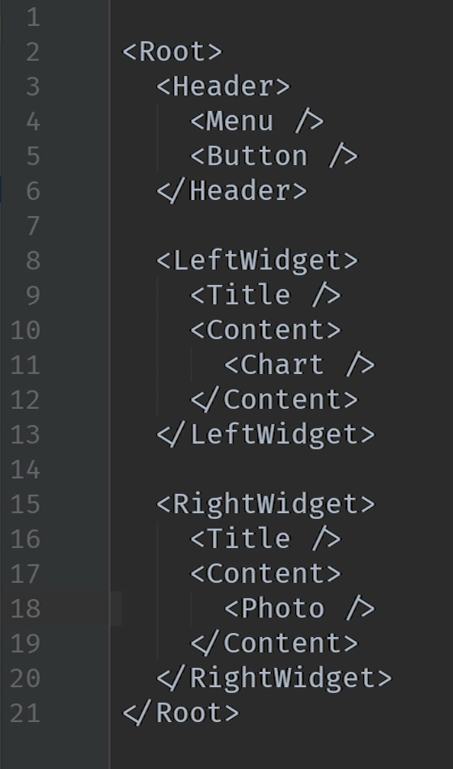

# 008_componentDidCatch

Этот метод отличается от остальных. Его задача обработка не пойманных ошибок в других жизненных циклах React компонента. В фунциях setState, render, componentDidUpdate, componentDidMount и всех остальных методах которые мы рассмотрели в этом блоке.

Другими словами componentDidCatch отлавливает ошибки из функций которые отвечают за корректный рендеринг компонента, за корректное состояние компонента.

И перед тем как мы перейдем к самому методу, давайте посмотрим что будет делать React если в одном из методов жизненного цикла возникнет ошибка.

Специально для того что бы провести этот маленький эксперемент создаю маленький вредоносный компонент. Этот компонент называется errorButton.

```js
import React, { Component } from "react";
import "./errorButton.css";

class ErrorButton extends Component {
  state = {
    renderError: false,
  };
  render() {
    console.log("error");
    if (this.state.renderError) {
      this.foo.bar = 0;
    }
    return (
      <button
        className="error-button btn btn-danger btn-lg"
        onClick={() => this.setState({ renderError: true })}
      >
        Throw Error
      </button>
    );
  }
}

export default ErrorButton;

```

```js
//src/component/app?App.js
import React, {Component} from "react";
import Header from "../header/header";
import ItemList from "../itemList/itemList";
import ItemDetails from "../itemDetails/itemDetails";
import RandomPlanet from "../randomPlanet/randomPlanet";
import "./App.css";
import ErrorButton from "../errorButton/errorButton";

class App extends Component {
    state = {
        showRandomPlanet: true,
        selectedPerson: 5,
    };

    //Функция включения и выключения компонента рандомной планеты
    toggleRandomPlanet = () => {
        this.setState((state) => {
            return {
                showRandomPlanet: !state.showRandomPlanet,
            };
        });
    };

    //Функция выбора персонажа
    onPersonSelected = (id) => {
        this.setState({
            selectedPerson: id,
        });
    };

    render() {
        const planet = this.state.showRandomPlanet ? <RandomPlanet/> : null;
        return (
            <div>
                <Header/>
                {planet}
                <div className="row mb2 button-row">
                    <button
                        className="toggle-planet btn btn-warning btn-lg"
                        onClick={this.toggleRandomPlanet}
                    >
                        Toggle Random Planet
                    </button>
                    <ErrorButton/>
                </div>

                <div className="row mb2">
                    <div className="col-md-6">
                        <ItemList onItemSelected={this.onPersonSelected}/>
                    </div>
                    <div className="col-md-6">
                        <ItemDetails itemId={this.state.selectedPerson}/>
                    </div>
                </div>
            </div>
        );
    }
}

export default App;

```



И теперь если я кликаю по кнопке



Overlay у меня не запустился, ошибки только в консоли. Мое приложение себя ведет как build т.е. собранное для production и выдает пустой экран.

До React 16 поведение было другим. Приложение оставалось в поломанном состоянии. Но разработчики пришли к выводу  что это поведение довольно опасно. Если UI оставить в не консистентном состоянии, то пользователь приложения, может к примеру отослать сообщение не тому собеседнику поскольку UI не обновился и не изменил имя адесата. А пользователь финансового приложения может увидеть не верные цифры.

По этому концепция к которой пришел React, если render-инг поломался, то лучше вообще уничтожить все приложение чем надеятся на то что поломанное приложение будет работать как нужно.

И под рендерингом мы понимаем любые жизненные циклы React компонента, все действия оторые должны обновить состояние компонента.

Ну и конечно если в одной из этих функций происходит ошибка, то мы можем с уверенностью сказать что состояние компонента поломано.

Но с другой стороны React 16 дает возможность обрабатывать такие ошибки и ограничивать область их действия. И именно для этого был добавлен метод жизненного цикла componentDidCatch().


Посмотрим как этот метод будет работать.


Мы добавим его к компоненту верхнего уровня App.



И теперь используя наш стандартный паттерн давайте в этом компоненте мы скажем что если где-то снизу произошла ошибка, то мы отобразим компонент ошибки.

Для этого в state прописываю hasError: false - это флаг по которому мы будем говорить произошла ошибка или нет.



Теперь как только мы поймали ошибку от компонента снизу,  мы бдем говорить OK, у нас есть ошибка.

И в функции render мы можем сделать вот такой код. Если у нас есть ошибка, то мы даже не пытаемся отрисовать делево компонентов. Мы с вами сразу возвращаем ErrorIndicator.

```js
//src/component/app?App.js
import React, {Component} from "react";
import Header from "../header/header";
import ItemList from "../itemList/itemList";
import ItemDetails from "../itemDetails/itemDetails";
import RandomPlanet from "../randomPlanet/randomPlanet";
import "./App.css";
import ErrorButton from "../errorButton/errorButton";
import ErrorIndicator from "../errorIndicator/errorIndicator";

class App extends Component {
    state = {
        showRandomPlanet: true,
        selectedPerson: 5,
        hasError: false,
    };

    //Функция включения и выключения компонента рандомной планеты
    toggleRandomPlanet = () => {
        this.setState((state) => {
            return {
                showRandomPlanet: !state.showRandomPlanet,
            };
        });
    };

    //Функция выбора персонажа
    onPersonSelected = (id) => {
        this.setState({
            selectedPerson: id,
        });
    };

    // Обработка ошибок в компонентах
    componentDidCatch(error, errorInfo) {
        console.log("componentDidCatch()");
        this.setState({hasError: true});
    }

    render() {
        //Если есть ошибка в компонентах
        if (this.state.hasError) {
            return <ErrorIndicator/>;
        }

        const planet = this.state.showRandomPlanet ? <RandomPlanet/> : null;
        return (
            <div>
                <Header/>
                {planet}
                <div className="row mb2 button-row">
                    <button
                        className="toggle-planet btn btn-warning btn-lg"
                        onClick={this.toggleRandomPlanet}
                    >
                        Toggle Random Planet
                    </button>
                    <ErrorButton/>
                </div>

                <div className="row mb2">
                    <div className="col-md-6">
                        <ItemList onItemSelected={this.onPersonSelected}/>
                    </div>
                    <div className="col-md-6">
                        <ItemDetails itemId={this.state.selectedPerson}/>
                    </div>
                </div>
            </div>
        );
    }
}

export default App;

```



Таким образом мы улучшили user Experience.

Но тем не менее как и раньше ошибка рендеринга ломает все React приложение. 

Но мы могли б определить метод componentDidCatch не не самом высоком уровне приложения, а немного ниже. Так что бы мы могли отлавливать ошибки на более низком уровне и что бы части приложения все же продолжали работать.


Рассмотрим на примере абстракции. Предположим у нас есть вот такое приложение.



У этого приложения есть левй виджет и правый виджет.

Как мы только что видели мы можем добавить componentDidCatch на самый высокий уровень приложения. И тогда если в любом из элементов приложения, на любом уровне который находится ниже App произойдет ошибка в render или в componentDidMount, componentDidUpdate, componentWillUnmount или в любом другом методе жизненного цикла, то наш компонент App поймает эту ошибку и сможет заменить все приложение на сообщение об ошибке.

А теперь давайте на секуду представим что нащи кмпонеты LeftWidget и RightWidget - это независимые виджеты и каждый из них сам по себе представляет какую-то ценность для пользователя. Т.е. если один из них перестанет работать. Пользователь все еще может использовать приложение, потому что может быть в другом виджете есть полезная информация с которой пользователь работает.

Тогда мы могли бы добавить componentDidCatch не тольо на верхний уровень а еще на уровень LeftWidget и RightWidget


Таким способом мы определим нвые границы обработки ошибок.

Теперь к примеру если в LeftWidget произойдет ошибка к примеру в компоненте Chart. Эта ошибка пройдет по делеву компонентов React, найдет первый компонент у которого определен componentDidCatch и вызовет этот метод позволяя своему компоненту уничтожить содержимое т.е. child nodes, но при этом сохранить остаток приложения. Потому что выше эта ошибка уже не пойдет. Т.е. компонент App в таком сценарии не узнает что была ошибка.

Но если с другой стороны ошибка произошла где-нибудь в header например. То ближайший ErrorBoundary будет компонент App и тогда схлопнется все приложение.

Компоненты которые содержат componentDidCatch называются ErrorBoundary или границей ошибок. 

Поскольку они ловят ошибки ниже себя по иерархии и как бы огданичивают область действия этих ошибок.

Если посмотреть как работает componentDidCatch, то очень похоже на обычный try{}catch(error){}. Если в нашем JS коде происходит какая-то ошибка, то ее отлавливает ближайший блок try catch.

И кстати по аналогии с try catch, когда componentDidCatch будет обрабатывать ошибку в нем произойдет exception, то этот exception пойдет в селедующий componentDidCatch находяжийся выше.

ЕСТЬ ДВА ОЧЕНЬ ВАЖНЫХ АСПЕКТА!!!!

ПЕРВЫЙ АСПЕКТ

1. componentDidCatch() - работает только с ошибками в методах жизненного цикла (render, componentDidMount, componentDidUpdate и т.д.) т.е. с теми ошибками которые непосредственно влияют на состояние компонента и на rendering. И ошибки в eventListener-ах, например в той функции которую вы передете в onClick, ОНИ НЕ БУДУТ ОБРАБАТЫВАТЬСЯ в componentDidCatch.
2. Точно так же ошибки не будут обрабатываться в асинхронных callback-ах, даже если асинхронный вызов был инициирован в методе жизненного цикла. К примеру componentDidMount мы часто запрашиваем данные с сервера. И вот если в этом сценарии сервер нам вернул 404 и мы отклонили промис т.е. он стал rejected. Эта ошибка не будет обрабатываться componentDidCatch.


componentDidCatch работает для ошибок rendering и ошибок в жизненном цикле реакт компонента.

ВТОРОЙ АСПЕКТ

Который часто воспринимается не верно. componentDidCatch - это не замена стандартым проверкам, это не замена валидации данных. РОЛЬ ЭТОГО МЕТОДА ЛОВИТЬ ТЕ ОШИБКИ КОТОРЫЕ ВЫ ДЕЙСТВИТЕЛЬНО НЕ ПРЕДВИДЕЛИ ВО ВРЕМЯ РАЗРАБОТКИ. Т.е. этот метод в идеале вообще не должен срабатывать.

Это как гирметичные шлюзы на космическом корабле которые защищают от пожара. Вы рассчитываете что пажара не будет и этими шлюзами никогда не придеться пользоваться.

Но если уж так произошло что все остальные методы предосторожности не помогли и корабль все равно загореля, при помощи этих шлюзов мы можем сделать так что бы сгорел только один отсек, а не весь космический корабль.

Ну точно так же наши ErrorBoundary они позволяют одному компоненту потерпеть крах, но при этом все остальное приложение будет продолжать работать.

> componentDidCatch()
> 
> componentDidCatch() - отлавливает ошибки, которые произошли в методах жизненного цикла ниже по иерархии
> 
> Принцип работы похож на try/catch - ошибку отлавливает ближайший блок
> 
> НЕ обрабаатываются ошибки в event listener-ах и в асинхронном коде(запросы к серверу и т.п.)
