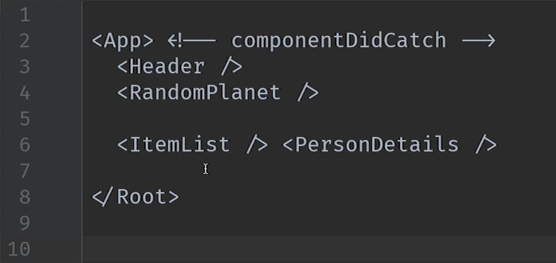
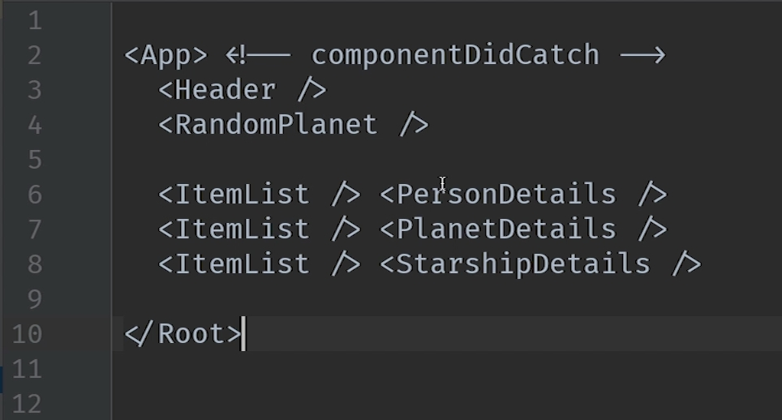
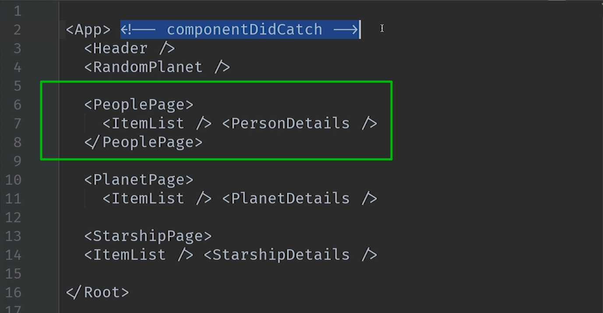
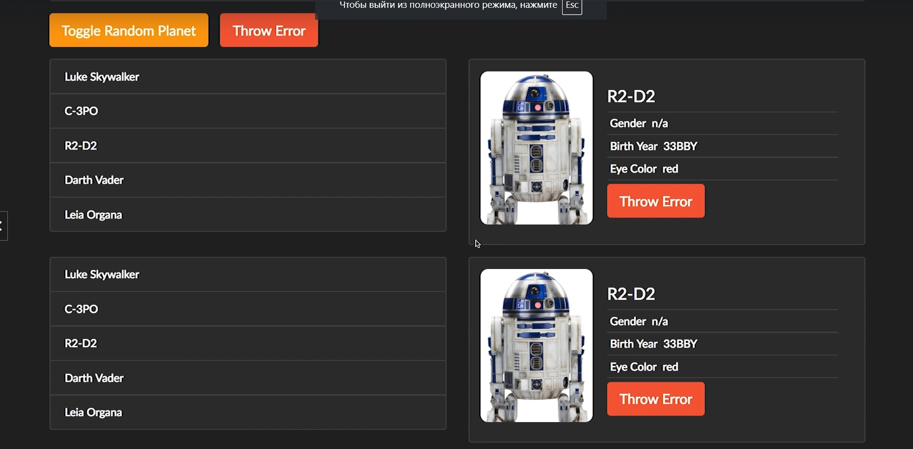
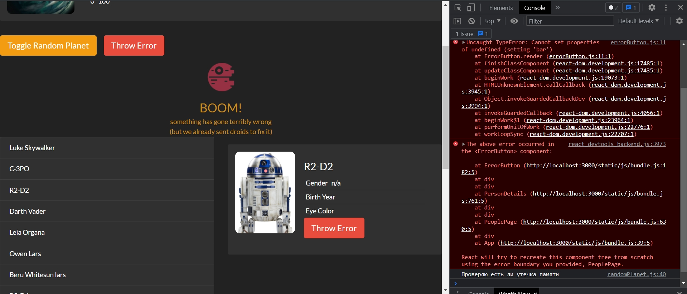
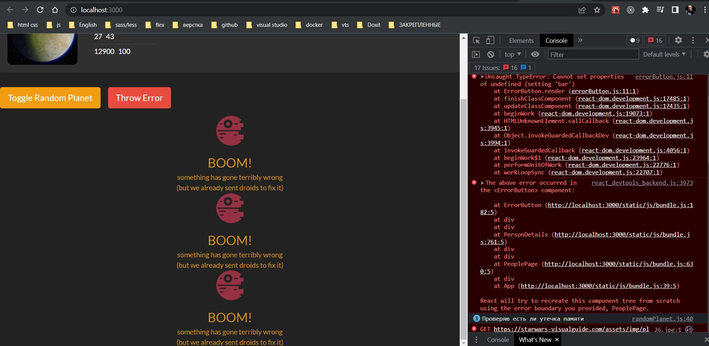
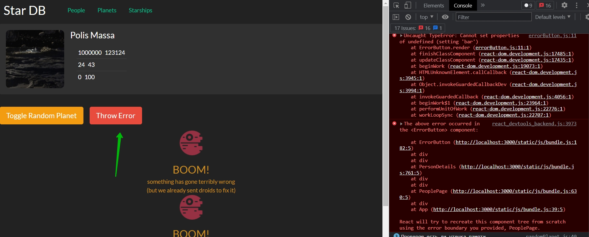
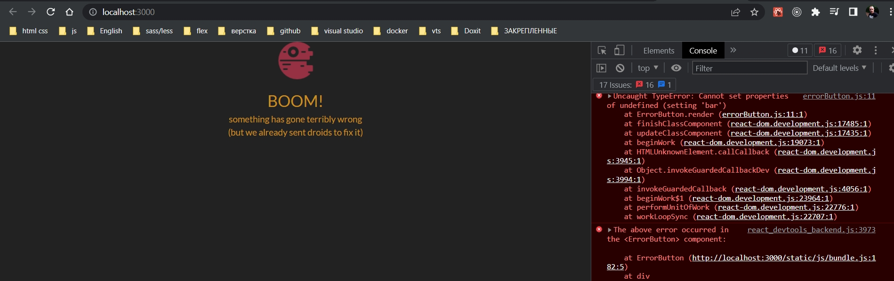

# 009_componentDidCatch_на_практике

Посмотрим как эффективно использовать ErrorBoundary, границы ошибок в нашем приложении. И так в нашем приложении мы отображаем один тип сущностей. Еще у нас будут планеты и звездные корабли когда мы до них дойдем.

Теперь подумаем как сделать так что бы компоненты были изолированы друг от друга?

Посмотрим на схему нашего приложения



Самый интересный момент в ItemList и ItemDetails. сли мы начнем расширять наше приложение, у нас будут такие же блоки для других сущностей.



И для того что бы ошибка в отрисовке ItemDetails не приводила к краху всего приложения, нам нужно изолировать ItemDetails от остальных компонентов. Т.е. обернуть его в другой дополнительный компонент.

И поскольку в будущем мы планируем показывать разные страницы этого приложения, будет логично назвать этот компонент к примеру Page.



К каждой странице мы могли бы добавить componentDidCatch и сделать так что бы каждая страничка была изолирована от остальных. Что бы все приложение не прекращало работать если на одной из страниц вдруг возникнет ошибка.

И теперь я хочу отрефакторить код так что бы ItemList и ItemDetails были внутри компонента peoplePage.

```js
import React, { Component } from "react";
import "./peoplePage.css";

class PeoplePage extends Component {
  render() {
    return <div></div>;
  }
}

export default PeoplePage;

```

И начинаю потихоньку переносить логику из App. Переношу onPersonSelected .Посколку теперь PeoplePage будет отвечать за выбор персонажей нам нужно создать state

```js
import React, {Component} from "react";
import ItemList from "../itemList/itemList";
import ItemDetails from "../itemDetails/itemDetails";
import "./peoplePage.css";

class PeoplePage extends Component {
    state = {
        selectedPerson: 3,
    };
    //Функция выбора персонажа
    onPersonSelected = (id) => {
        this.setState({
            selectedPerson: id,
        });
    };

    render() {
        return (
            <div className="row mb2">
                <div className="col-md-6">
                    <ItemList onItemSelected={this.onPersonSelected}/>
                </div>
                <div className="col-md-6">
                    <ItemDetails itemId={this.state.selectedPerson}/>
                </div>
            </div>
        );
    }
}

export default PeoplePage;

```

```js
//src/component/app?App.js
import React, { Component } from "react";
import Header from "../header/header";
import RandomPlanet from "../randomPlanet/randomPlanet";
import "./App.css";
import ErrorButton from "../errorButton/errorButton";
import ErrorIndicator from "../errorIndicator/errorIndicator";
import PeoplePage from "../peoplePage/peoplePage";

class App extends Component {
  state = {
    showRandomPlanet: true,
    hasError: false,
  };

  //Функция включения и выключения компонента рандомной планеты
  toggleRandomPlanet = () => {
    this.setState((state) => {
      return {
        showRandomPlanet: !state.showRandomPlanet,
      };
    });
  };

  // Обработка ошибок в компонентах
  componentDidCatch(error, errorInfo) {
    console.log("componentDidCatch()");
    this.setState({ hasError: true });
  }

  render() {
    //Если есть ошибка в компонентах
    if (this.state.hasError) {
      return <ErrorIndicator />;
    }

    const planet = this.state.showRandomPlanet ? <RandomPlanet /> : null;
    return (
      <div>
        <Header />
        {planet}
        <div className="row mb2 button-row">
          <button
            className="toggle-planet btn btn-warning btn-lg"
            onClick={this.toggleRandomPlanet}
          >
            Toggle Random Planet
          </button>
          <ErrorButton />
        </div>
        <PeoplePage />
      </div>
    );
  }
}

export default App;

```

И предположим что в приложении есть несколько компонентов PeoplePage

```js
//src/component/app?App.js
import React, { Component } from "react";
import Header from "../header/header";
import RandomPlanet from "../randomPlanet/randomPlanet";
import "./App.css";
import ErrorButton from "../errorButton/errorButton";
import ErrorIndicator from "../errorIndicator/errorIndicator";
import PeoplePage from "../peoplePage/peoplePage";

class App extends Component {
  state = {
    showRandomPlanet: true,
    hasError: false,
  };

  //Функция включения и выключения компонента рандомной планеты
  toggleRandomPlanet = () => {
    this.setState((state) => {
      return {
        showRandomPlanet: !state.showRandomPlanet,
      };
    });
  };

  // Обработка ошибок в компонентах
  componentDidCatch(error, errorInfo) {
    console.log("componentDidCatch()");
    this.setState({ hasError: true });
  }

  render() {
    //Если есть ошибка в компонентах
    if (this.state.hasError) {
      return <ErrorIndicator />;
    }

    const planet = this.state.showRandomPlanet ? <RandomPlanet /> : null;
    return (
      <div>
        <Header />
        {planet}
        <div className="row mb2 button-row">
          <button
            className="toggle-planet btn btn-warning btn-lg"
            onClick={this.toggleRandomPlanet}
          >
            Toggle Random Planet
          </button>
          <ErrorButton />
        </div>
        <PeoplePage />
        <PeoplePage />
        <PeoplePage />
      </div>
    );
  }
}

export default App;

```



И вот у нас несколько компонентов. 

Но пока что в нашем приложении определена только одна функция componentDidCatch. И эта функция определена на самом верхнем уровне.

Добавляю ErrorButton к компоненту ErrorDetails. И если я нажну на нее то крашится все приложение.

Теперь добавлю еще один ErrorBoundary. Придется немного скопировать кода, но позже мы от него избавимся.

```js
import React, {Component} from "react";
import ItemList from "../itemList/itemList";
import ItemDetails from "../itemDetails/itemDetails";
import "./peoplePage.css";
import ErrorIndicator from "../errorIndicator/errorIndicator";

class PeoplePage extends Component {
    state = {
        selectedPerson: 3,
    };
    //Функция выбора персонажа
    onPersonSelected = (id) => {
        this.setState({
            selectedPerson: id,
            hasError: false,
        });
    };

    // Теперь этот компонент становится ErrorBoundary
    componentDidCatch(error, errorInfo) {
        this.setState({hasError: true});
    }

    render() {
        //Если ошибка есть рендерю компонент ErrorIndicator
        if (this.state.hasError) {
            return <ErrorIndicator/>;
        }
        return (
            <div className="row mb2">
                <div className="col-md-6">
                    <ItemList onItemSelected={this.onPersonSelected}/>
                </div>
                <div className="col-md-6">
                    <ItemDetails itemId={this.state.selectedPerson}/>
                </div>
            </div>
        );
    }
}

export default PeoplePage;

```



И вот один из компонентов выдал ошибку, но все остальное работает.



И только когда компонент верхнего уровня получить ошибку крашится все приложение.






ЕЩЕ ОДНА ДЕТАЛЬ!! метод componentDidCatch принимает еще два параметра error и info.

error - это та самая ошибка которая привела к тому что этот метод сработал

info - это детали того в каком компоненте эта ошибка произошла.


Добавим debugger в тело componentDidCatch


И вот эта информация может быть намного полезнее для дебага чем дае сам error.

> componentDidCatch()
> 
> Что бы определить границы ошибок, нужны компоненты, которые будут разделять независимые блоки приложения
> 
> componentDidCatch() - принимает два аргумента - error и info с дополнительной информацией об источнике ошибок