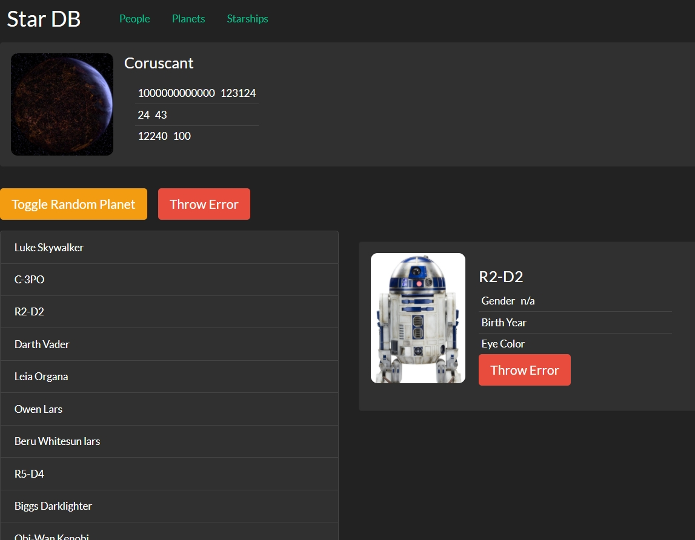
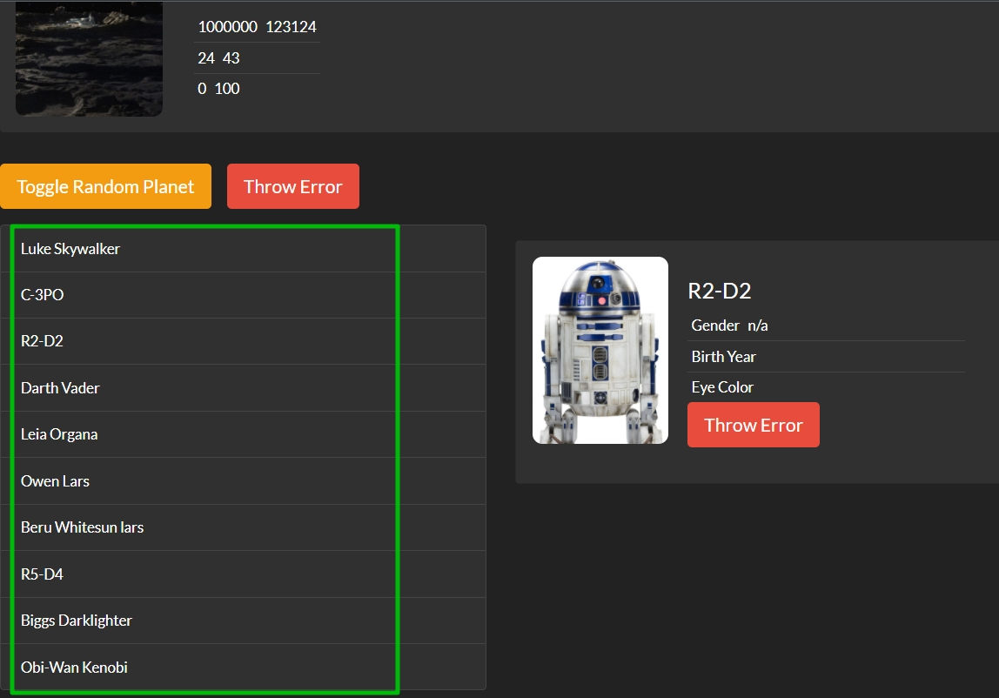
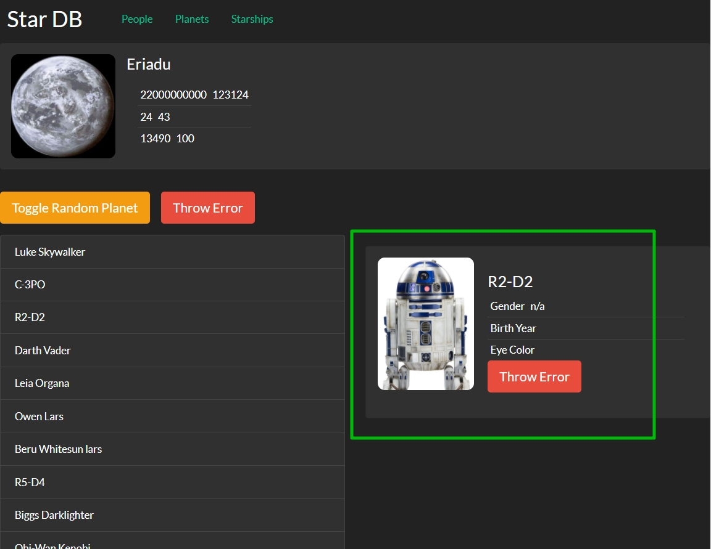
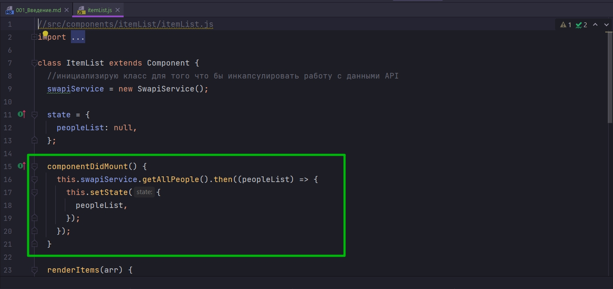

# 001_Введение

В этом разделе мы будем рассматривать немного более углубленные паттерны работы с кодом в React.

После того как мы выучили  методы жизненного цикла React компонента мы освоили 95% всего того что умеет делать API React.

Но следующий вопрос который возникает у разработчиков после того как сам API освоен - это то как же нам эффектвивно использовать этот API React. 

Какие типичные проблемы? Какие типичные решения этих роблем существуют в экосистеме React?

И этот раздел как раз посвящен таким паттернам.

Мы будем спотреть на то как лучше организовать наш код! Как разделить ответственность компонентов! Как переиспользовать некоторые аспекты работы компонентов!!

С практической точки зрения мы продолжаем делать наше приложение starDB, которое уже обрастает функциональностью. 

И наш следуюший шаг сделать так что бы наше приложение работало не только с персонажами, но еще и с планетами и со звездными кораблями.

Я буду свами абсолютно честен. Пока я записывал этот курс я дважды пытался создать недостоющие компоненты используя просто метод копипаста и сделать из этого отдельные уроки. Но каждый раз количество мелких незначительных ошибок которые я допускал при копировании кода, как это часто бывает, оно было настолько большим, что эти уроки попросту уходили в мусорную корзину. 

Мы в этот раз начнем делать правильно сразу. Поскольку иначе количество лишней работы будет уж слишком велико.

И так посмотрим на наши компоненты

и подумаем какие аспекты их работы мы можем улучшить, мы можем оптимизировать и переиспользовать? 

1. Первое это конечно список персонажей. Сейчас это список именно персонажей. А что если нам понадобится список планет?

Следует ли нам полностью скопировать код компонента ItemList

назвать его список планет, и заменить там один вызов функции на другую функцию?

А что если в этом списке для разных сущностей нам нужно будет отображать разные данные. Сможем ли мы настроить этот список так что бы то как именно он отрисовывает свои элементы можно было конфигурировать не изменяя при этом весь компонент.

Компонент ItemDetails

Нам нужен такой же компонент для деталей планеты. И тоже очень не хочется начинать копировать этот компонент и переименовывать те поля которые мы будем отображать.

Ну и последний не мало важный аспект!

Если мы посмотрим на наше компоненты которые мы уже создали, и те компоненты которые мы еще будем создавать, мы увиидим что их поведение следует одному и тому же паттерну.

Мы запрашиваем какие-нибудь данные в componentDidMount. Когда эти данные готовы мы их отрисовываем, и если у нас была ошибка, то нужно по хорошему дописать блок catch

Мы обрабатываем эту ошибку и вместо содержимого компонента мы показываем ErrorIndicator.

И если посмотреть на другие компоненты, то этот паттерн 

будет повторяться снова и снова. Т.е. компоненты будут отличаться тем как именно они отрисовывают те данные которые они получили от сервера, но процесс получения данных, процесс обработки данных, процесс обработки ошибки, процесс отображения loading индикатора, все это будет повторяться от одного компонента к другому. И конечно этот код копировать не хочется.

В двух словах задача этого раздела курса научится эффективно работать с кодом в React и избежать копирования кода и научится правильно и эллегантно переиспользовать части поведения компонентов.

Как часто бывает в программирование, когда вы увидите как работают эти паттерны, вы скажете stop, да это же просто здравый смысл! 

И это правда потому что большинство паттернов разработки, не только в React, а в программировании вообще - это и есть здравый смысл который четко сформулирован в применении к конкретным задачам.

> Паттерны React
> 
> В этом разделе мы рассмотрим основные паттерны работы с React кодом
> 
> Наша цель научится переиспользовать аспекты поведения React компонентов и разделять ответственность компонентов
> 
> Большинство паттернов основано на чистом JavaScript и здравом смысле
