# 002_Использование_функций

Начнем с простого паттерна который связан с использование функций в React компонентах. И мы используем этот паттерн для того что бы отображать не только персонажей, а еще и планеты или звездные корабли, при этом не копируя код компонента ItemList.

Скопирую блок разметки компонента PeoplePage

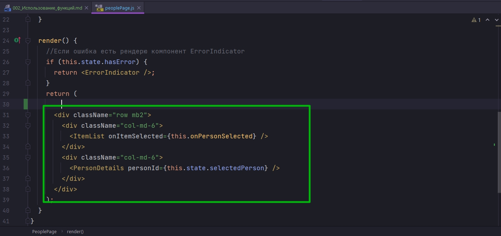

И вставлю в наш компонент App для того что бы отобразить снизу такой же блок, который будет отображать когда мы закончим с нашим рефакторингом, отображать корабли к примеру или планеты.

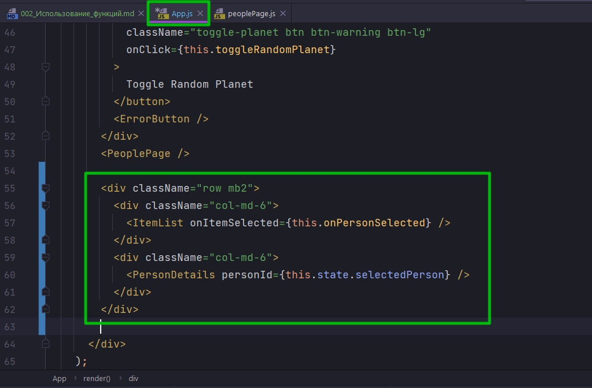

В этом видео меня интересует вот этот блок который мы добавили.

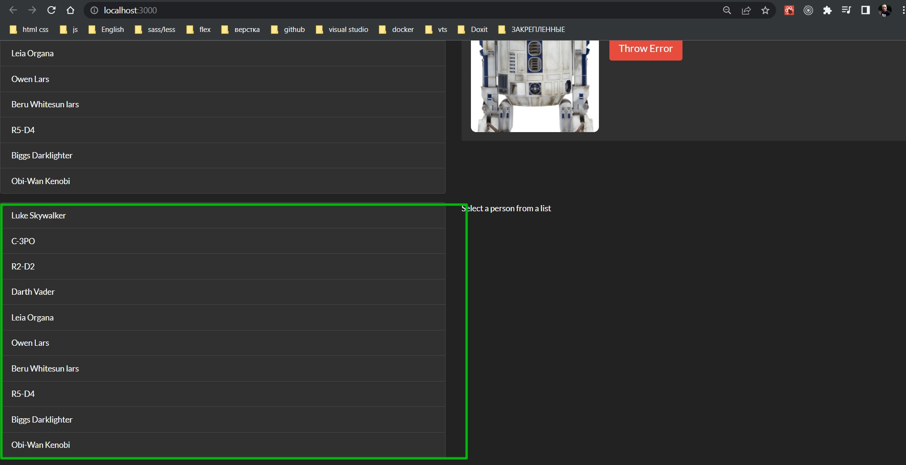

Давайте вместе посмотрим на код компонента ItemList и вместе подумаем чем код этого компонента отличался бы от кода компонента PersonList или PlanetList или StarshipList? Т.е. лист других элементов.


Во-первых не зависимо от того какие элементы мы собираемся отображать вот эта часто кода которая устанавливает состояние и создает новый инстанс swapiService

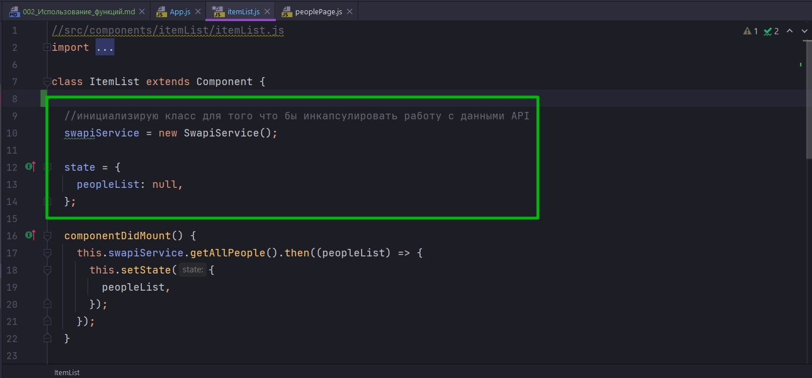

Она останется одинаковой, абсолютно.

Следующий блок кода это componentDidMount

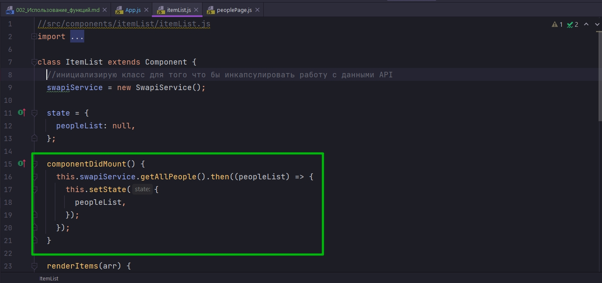

И вот тут в зависимости от того какую мы сущьность мы хотим отобразить мы будем вызывать разные методы с нашего swapiService.

Когда мы хотим отобразить список персонажей мы используем getAllPeople ну а для списка кораблей здесь будет getAllStarships или getAllPlanet.

При этом вторая часть кода, где мы обновляем состояние

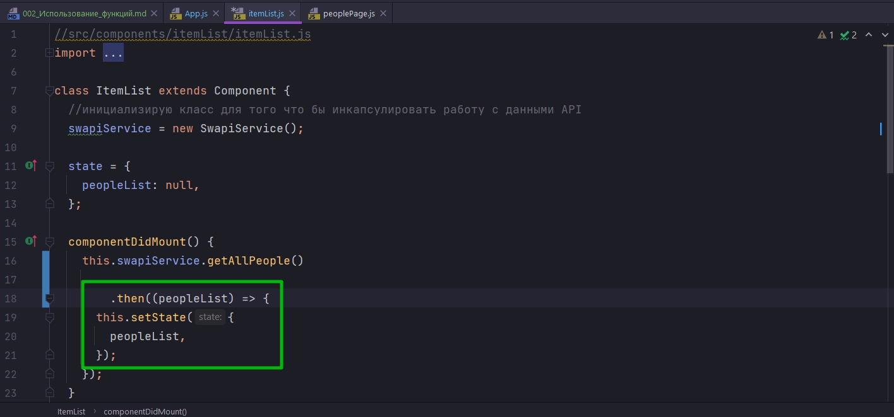

останется точно такой же, возможно может быть только измениться называние параметра состояния с peopleList это будет planetList  к примеру.

renderItems вообще не изменится 

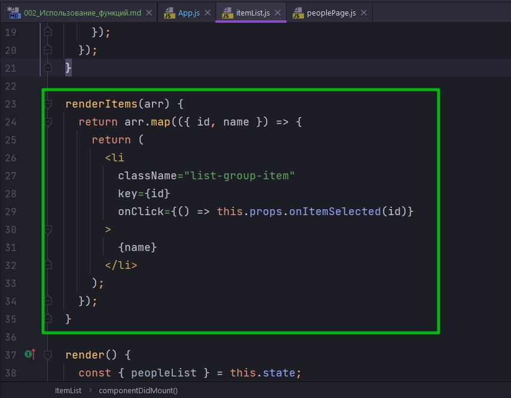

поскольку в каждой сущности мы просто выводим ее имя. Ну и событие onClick будет работать совершенно одинаково для любого компонента независимо от того что именно он отображает.

Другими словами если бы мы начали копировать код, то единственное что отличало бы эти компоненты это та функция которую мы вызываем для того что бы получить данные. А весь остальной код был бы скопирован один в один.

И тут возникает естественный вопрос. А что если вынести нам эту функцию this.swapiService.getAllPeople() наружу из компонента, и сделать так что бы компонент сам на прямую не решал какие именно данные он будет получать?

Компонент ItemList будет заниматься исключительно отрисовкой данных.

Ну и конечно сделать такой рефакторинг совсем не сложно.

В первую очередь удалим swapiService из компонента ItemList.

И вместо того что бы делать this.swapiService.getAllPeople() этот компонент будет получать из props функцию getData

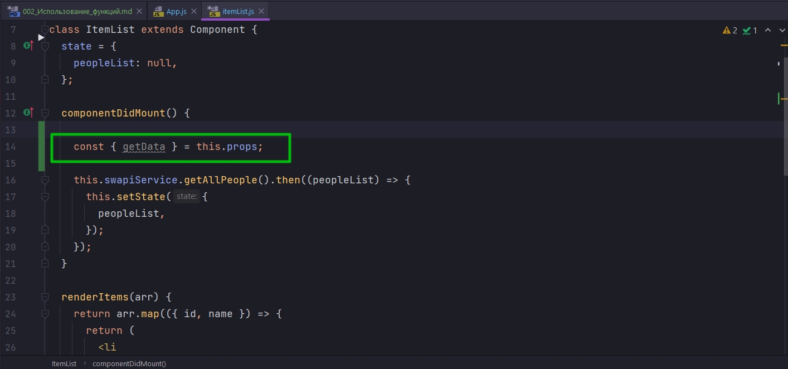

в свойства props мы можем передать все что угодно функцию, объект, массив, другой React-элемент, все что нам захочеться.

Теперь наш компонент вместо того что бы вызывать this.swapiService.getAllPeople(), он вызовет функцию getData. И переименую свойство стейта.

```js
//src/components/itemList/itemList.js
import React, { Component } from "react";
import Spinner from "../spinner/spinner";
import "./itemList.css";

class ItemList extends Component {
    state = {
        itemList: null,
    };

    componentDidMount() {
        const { getData } = this.props;

        getData().then((itemList) => {
            this.setState({
                itemList: itemList,
            });
        });
    }

    renderItems(arr) {
        return arr.map(({ id, name }) => {
            return (
                <li
                    className="list-group-item"
                    key={id}
                    onClick={() => this.props.onItemSelected(id)}
                >
                    {name}
                </li>
            );
        });
    }

    render() {
        const { itemList } = this.state;

        if (!itemList) {
            return <Spinner />;
        }

        const items = this.renderItems(itemList);

        return <ul className="item-list list-group">{items}</ul>;
    }
}

export default ItemList;


```

Теперь нужно изменить то как мы вызываем этот компонент.

Пока рано. Нам нужно сделать такое же изменение в PeoplePage.

Начнем с App.js.

в ItemList передам пропс getData={this.swapiService.getAllPlanets} с вызовом сервиса swapiService и функции получения всех планет

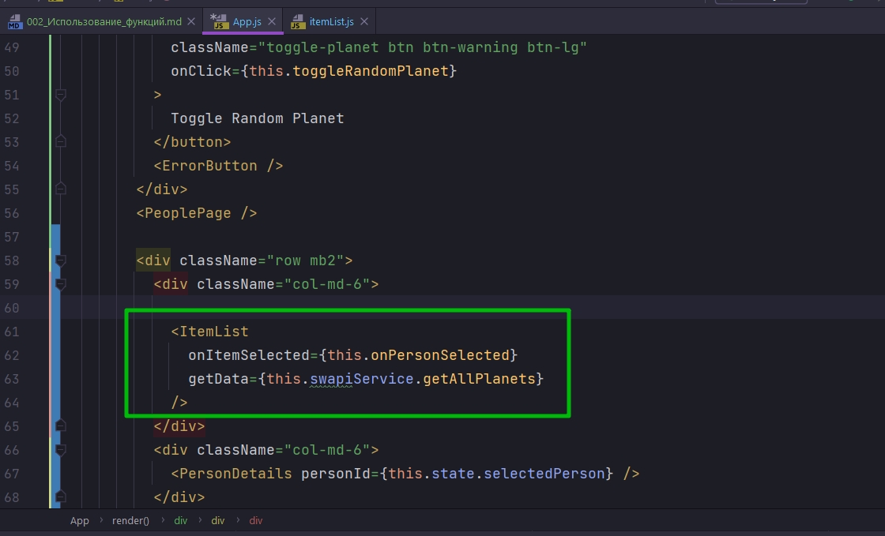

До этого не забываю проинициализировать инстанс класса swapiService

```js
//src/component/app?App.js
import React, {Component} from "react";
import Header from "../header/header";
import RandomPlanet from "../randomPlanet/randomPlanet";
import "./App.css";
import ErrorButton from "../errorButton/errorButton";
import ErrorIndicator from "../errorIndicator/errorIndicator";
import PeoplePage from "../peoplePage/peoplePage";
import ItemList from "../itemList/itemList";
import ItemDetails from "../itemDetails/itemDetails";
import SwapiService from "../../services/SwapiService";

class App extends Component {
    swapiService = new SwapiService();

    state = {
        showRandomPlanet: true,
        hasError: false,
    };

    //Функция включения и выключения компонента рандомной планеты
    toggleRandomPlanet = () => {
        this.setState((state) => {
            return {
                showRandomPlanet: !state.showRandomPlanet,
            };
        });
    };

    // Обработка ошибок в компонентах
    componentDidCatch(error, errorInfo) {
        console.log("componentDidCatch()");
        this.setState({hasError: true});
    }

    render() {
        //Если есть ошибка в компонентах
        if (this.state.hasError) {
            return <ErrorIndicator/>;
        }

        const planet = this.state.showRandomPlanet ? <RandomPlanet/> : null;
        return (
            <div>
                <Header/>
                {planet}
                <div className="row mb2 button-row">
                    <button
                        className="toggle-planet btn btn-warning btn-lg"
                        onClick={this.toggleRandomPlanet}
                    >
                        Toggle Random Planet
                    </button>
                    <ErrorButton/>
                </div>
                <PeoplePage/>

                <div className="row mb2">
                    <div className="col-md-6">
                        <ItemList
                            onItemSelected={this.onPersonSelected}
                            getData={this.swapiService.getAllPlanets}
                        />
                    </div>
                    <div className="col-md-6">
                        <ItemDetails itemId={this.state.selectedPerson}/>
                    </div>
                </div>
            </div>
        );
    }
}

export default App;

```

Теперь наш компонент ItemList получает из вне функцию которую он будет использовать для того что бы получать данные.


И точно такой же маленький рефакторинг мне нужно сделать в компоненте PeoplePage.

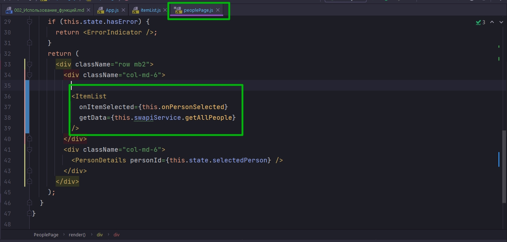

```js
import React, {Component} from "react";
import ItemList from "../itemList/itemList";
import ItemDetails from "../itemDetails/itemDetails";
import "./peoplePage.css";
import ErrorIndicator from "../errorIndicator/errorIndicator";
import SwapiService from "../../services/SwapiService";

class PeoplePage extends Component {
    swapiService = new SwapiService();

    state = {
        selectedPerson: 3,
    };
    //Функция выбора персонажа
    onPersonSelected = (id) => {
        this.setState({
            selectedPerson: id,
            hasError: false,
        });
    };

    // Теперь этот компонент становится ErrorBoundary
    componentDidCatch(error, errorInfo) {
        debugger;
        this.setState({hasError: true});
    }

    render() {
        //Если ошибка есть рендерю компонент ErrorIndicator
        if (this.state.hasError) {
            return <ErrorIndicator/>;
        }
        return (
            <div className="row mb2">
                <div className="col-md-6">
                    <ItemList
                        onItemSelected={this.onPersonSelected}
                        getData={this.swapiService.getAllPeople}
                    />
                </div>
                <div className="col-md-6">
                    <ItemDetails itemId={this.state.selectedPerson}/>
                </div>
            </div>
        );
    }
}

export default PeoplePage;

```

Обратите внимание !!! В этом коде я не вызываю функцию в пропсах, я ее просто передаю getData={this.swapiService.getAllPeople}. 

Мы могли бы вызвать функцию и передать тот промис который она возвращает, но мне болше нравится передавать саму функцию потому что тогда компонент может самостоятельно решать когда именно ее вызвать.


Последний маленький аспект о котром нам нужно позаботиться.

Теперь наша функция swapiService.getAllPeople передается в качестве проперти, в качестве свойства компоненту. По этому нам нужно позаботиться о значении this. Потому что если мы просто так передадим функцию из объекта this внутри этой функции будет потерян.

Ну и самый простой способ гарантировать что this будет правильным внутри функции это изменть ее объявление и сделать так что бы это была функция стрелка.

Захожу в SwapiService. И поскольку мы теперь будем использовать не только getAllPeople, а посути все функции которые получают данные, мы сможем их передавать нашим компонентам, я сделаю так что бы все эти функции стали функциями стрелками.

```js
// src/services/SwapiService.js
export default class SwapiService {
  // базовый url
  API_BASE = `https://swapi.dev/api`;

  getResource = async (url) => {
    // составляю строку из базового url и того url что прилетает из методов
    const response = await fetch(`${this.API_BASE}${url}`);
    //Обработка ошибки на клиенте
    if (!response.ok) {
      throw new Error(`Could not fetch ${url}` + `received ${response.status}`);
    }
    const body = await response.json(); // получаю тело запроса
    return body;
  };

  // Персонажи

  // Получение всех персонажей
  getAllPeople = async () => {
    // передаю только нужную часть url
    const response = await this.getResource(`/people/`);
    return response.results.map(this.transformPerson);
  };
  // получаю конкретного персонажа
  getPerson = async (id) => {
    // передаю только нужную часть url
    const person = await this.getResource(`/people/${id}/`);
    return this.transformPerson(person);
  };

  // Планеты

  // Получаю все планеты
  getAllPlanets = async () => {
    const planets = await this.getResource(`/planets/`);
    return planets.results.map(this.transformPlanet);
  };
  //Получаю планету
  getPlanet = async (id) => {
    const planet = await this.getResource(`/planets/${id}/`);
    return this.transformPlanet(planet);
  };

  //Космические корабли

  // Получаю все корабли
  getAllStarShips = async () => {
    const response = await this.getResource(`/starships/`);
    return response.results.map(this.transformStarShip);
  };

  //Получаю космический корабль
  getStarship = async (id) => {
    const starship = await this.getResource(`/starships/${id}/`);
    return this.transformStarShip(starship);
  };

  // Трансформация данных полученных от API в нужный формат

  // Извлекаю id
  extractId = (item) => {
    //регуларка для поиска id в строке url
    const idRegExp = /\/([0-9]*)\/$/;
    // ищу id
    return item.url.match(idRegExp)[1];
    // Нулевая группа это все выражение, а первая группа это все что в скобках
  };

  // Трансформация данных для планет(ы)
  transformPlanet = (planet) => {
    return {
      id: this.extractId(planet),
      name: planet.name,
      population: planet.population,
      rotationPeriod: planet.rotation_period,
      diameter: planet.diameter,
    };
  };

  // Трансформация данных для космическ(ого)их корабл(я)ей
  transformStarShip = (starship) => {
    return {
      id: this.extractId(starship),
      name: starship.name,
      model: starship.model,
      manufacturer: starship.manufacturer,
      costInCredits: starship.costInCredits,
      length: starship.length,
      crew: starship.crew,
      passengers: starship.passengers,
      cargoCapacity: starship.cargoCapacity,
    };
  };

  // Трансформация данных для персонажа(ей)
  transformPerson = (person) => {
    return {
      id: this.extractId(person),
      name: person.name,
      gender: person.gender,
      birthDay: person.birthDay,
      eyeColor: person.eyeColor,
    };
  };
}

```

И теперь абсолютно безопасно я могу передавать эти функции куда угодно и не бояться что значение this будет потеряно.

Вот первый и второй список

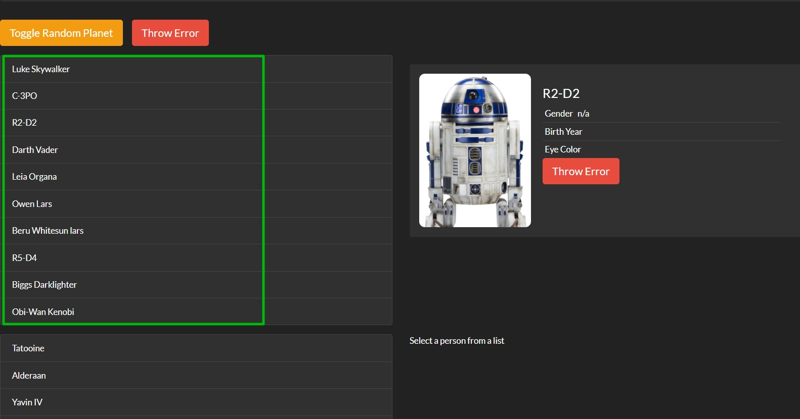

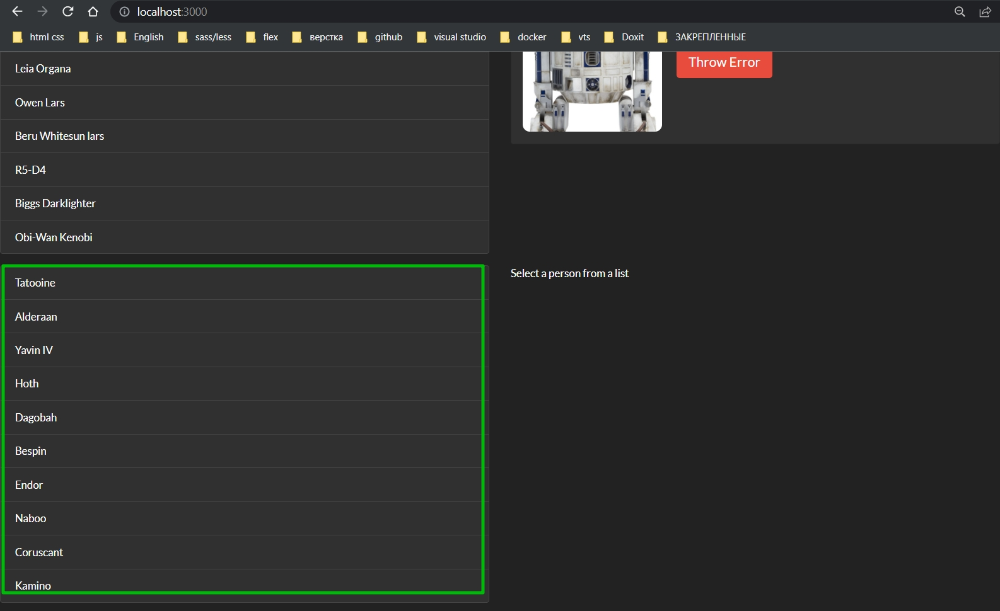

и если мы сейчас возьмем и добавим третий список в наш App скопировать еще блок и вывести список кораблей.

Но я пока этого делать не буду.

Итог: Мы взяли компонент ItemList и проанализировали какая именно часть этого ккомпонента отличает его от похожих компонентов которые будут отрисовывать другие элементы. 

И мы выяснили что единственная отличающаяся часть это получание данных.

Следующий логичный шаг это вынести получение данных наружу из компонента.

Поскольку мы можем передавать в компонент функции мы используем это свойство для того что бы передать в компонент getData. И в качестве getData может выступать любая из функций которая получает коллекцию данных. Т.е. у нас с вами есть контракт - эта функция обязана возвращать promise, это не может быть любая функция которая может работать с callback поскольку наш компонент ожидает именно функцию которая вернет promise. 

Кроме того внутри компонента мы расчитываем что этот promise вернет itemList

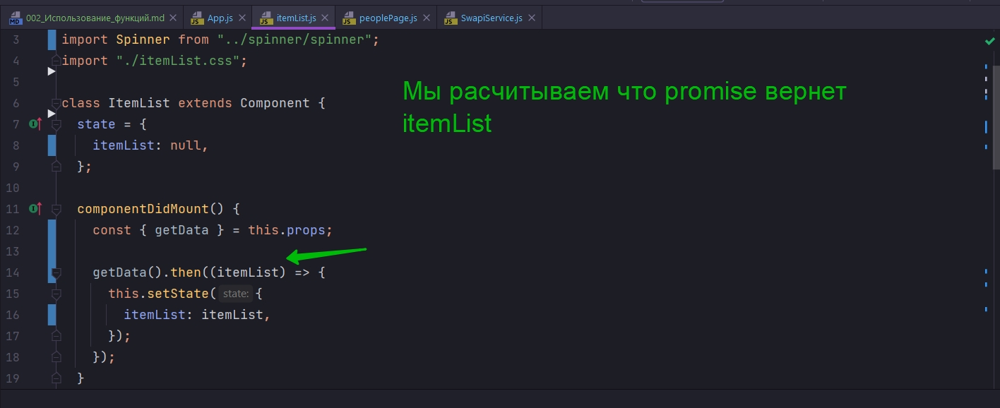

Это будет список элементов. Более того мы расчитываем что у каждого элемента будет id и name

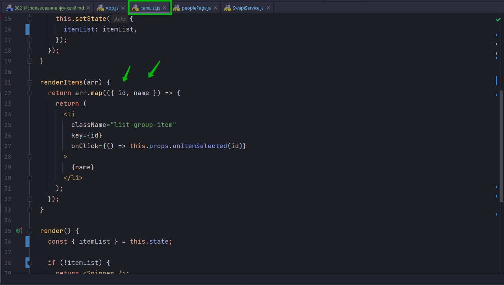

для того что бы мы могли корректно отрисовать компонент.

И передача функции в компонент getData={this.swapiService.getAllPlanets} позволяет не копировать код а элегантно переиспользовать остальные аспекты поведения, кроме собственно получение данных.

В ккомпонент мы можем передавать не только eventListener, а абсолютно любую функцию которую компонент может использовать для любых целей.

Кроме того компонент может использовать внешнюю функцию для того что бы отрисовать часть своего содержимого. И именно на этой идее, использование внешней функии для рендеринга построен паттерн который называется Render-функция.

Функции - это очень мощный инструмент любого JS разработчика. По этому передаая свои функции в компонент не стоит ограничивать их зону ответственности callback-ами на event-ы вроде mouseClick или mouseOver.

>Использование Функций
> Функции которые мы передаем компоненту могут быть не только обработчиками событий
> 
> Функция, к примеру, может инкапсулировать получение данных(тогда компонент становится независимым от источника данных)


