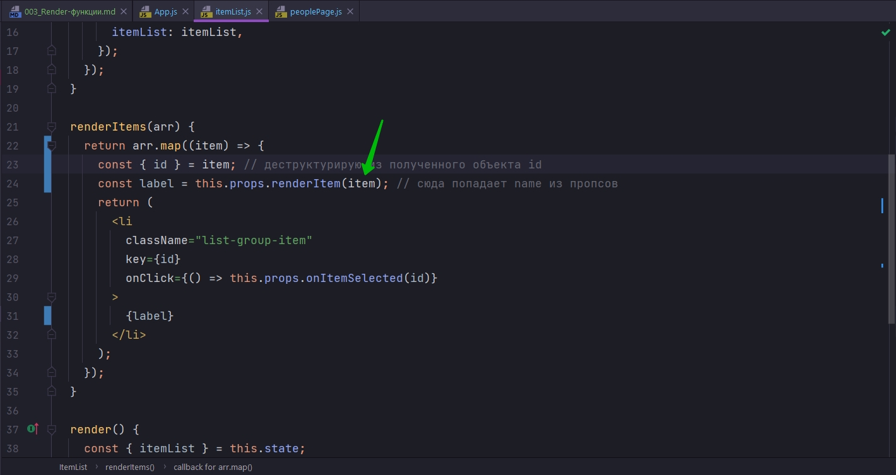
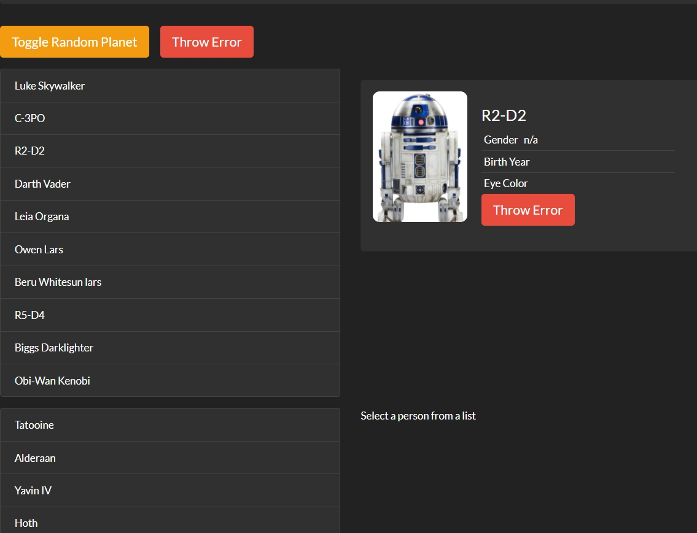
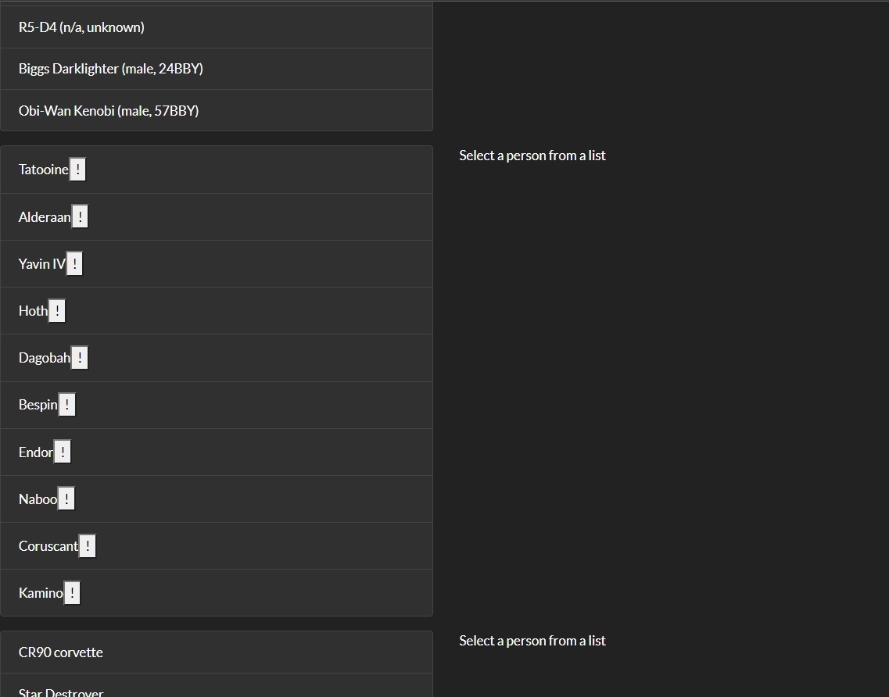

# 003_Render-функции

В прошлых уроках мы узнали как можно передавать функцию в React компонент для того что бы скрыть внутри этой функции детали того как компонент получает данные.

И благодаря тому что мы передали в компонент функцию мы сделали так что один и тот же компонент ItemList можно использовать и для того что бы отображать данные персонажей и для того что бы отображать данные космических кораблей и планет.

Сейчас мы сделаем компонент ItemList еще более гибким.

Давайте представим что у нас есть список персонажей и мы решили что неплохо рядм с именем указать пол и год рождения персонажа.

А вот для планет мы хотим указать диаметр планеты что бы знать какая планета больше, а какая меньше.

Ну а для космического коробля мы покажем модель этого космического коробля.

До сих пор мы все элементы отображали одинаково. Если мы посмотрим на код, то функция renderItems - это та самая функция которая отвечает за то что бы отредеривать элементы списка. Она просто печатает внутри себя name.

И нам повезло что у всех сущностей есть свойство name.


```js
//src/components/itemList/itemList.js
import React, { Component } from "react";
import Spinner from "../spinner/spinner";
import "./itemList.css";

class ItemList extends Component {
  state = {
    itemList: null,
  };

  componentDidMount() {
    const { getData } = this.props;

    getData().then((itemList) => {
      this.setState({
        itemList: itemList,
      });
    });
  }

  renderItems(arr) {
    return arr.map(({ id, name }) => {
      return (
        <li
          className="list-group-item"
          key={id}
          onClick={() => this.props.onItemSelected(id)}
        >
          {name}
        </li>
      );
    });
  }

  render() {
    const { itemList } = this.state;

    if (!itemList) {
      return <Spinner />;
    }

    const items = this.renderItems(itemList);

    return <ul className="item-list list-group">{items}</ul>;
  }
}

export default ItemList;

```

Ну а теперь ьребования изменились!!! И в зависимости от типа сущности мы хотим отображать разную информацию, а не только name.

Эту задачу можно решить как минимум несколькими способами.

Для того что бы сделать этот блок конфигурабельным мы можем использовать ту же стратегию, которую мы уже использовали. Мы можем передать в компонент функцию, которая будет заниматься тем что отрисовывать содержимое ListItem.


Для начало зайдем в App и сделаем так что бы мы передавали в ItemList эту самую функцию. 

Теперь когда мы создаем ItemList у нас уже есть одна функция которую мы передаем в ItemList это getData - эту функцию компонент будет использовать для того что бы получить данные.

И давайте в компонент передадим еще одну функцию. Назовем ее renderItem. И эта функция как раз будет заниматься отрисовкой содержимого списка. Функция будет принимать на вход item и возвращать будет то что нужно отрисовать, например item.name


И теперь функцию renderItem можно передавать в остальные ItemList компоненты

```js
//src/component/app?App.js
import React, {Component} from "react";
import Header from "../header/header";
import RandomPlanet from "../randomPlanet/randomPlanet";
import "./App.css";
import ErrorButton from "../errorButton/errorButton";
import ErrorIndicator from "../errorIndicator/errorIndicator";
import PeoplePage from "../peoplePage/peoplePage";
import ItemList from "../itemList/itemList";
import ItemDetails from "../itemDetails/itemDetails";
import SwapiService from "../../services/SwapiService";

class App extends Component {
    swapiService = new SwapiService();

    state = {
        showRandomPlanet: true,
        hasError: false,
    };

    //Функция включения и выключения компонента рандомной планеты
    toggleRandomPlanet = () => {
        this.setState((state) => {
            return {
                showRandomPlanet: !state.showRandomPlanet,
            };
        });
    };

    // Обработка ошибок в компонентах
    componentDidCatch(error, errorInfo) {
        console.log("componentDidCatch()");
        this.setState({hasError: true});
    }

    render() {
        //Если есть ошибка в компонентах
        if (this.state.hasError) {
            return <ErrorIndicator/>;
        }

        const planet = this.state.showRandomPlanet ? <RandomPlanet/> : null;
        return (
            <div>
                <Header/>
                {planet}
                <div className="row mb2 button-row">
                    <button
                        className="toggle-planet btn btn-warning btn-lg"
                        onClick={this.toggleRandomPlanet}
                    >
                        Toggle Random Planet
                    </button>
                    <ErrorButton/>
                </div>
                <PeoplePage/>
                {/*ItemList All Planets*/}
                <div className="row mb2">
                    <div className="col-md-6">
                        <ItemList
                            onItemSelected={this.onPersonSelected}
                            getData={this.swapiService.getAllPlanets}
                            renderItem={(item) => item.name}
                        />
                    </div>
                    <div className="col-md-6">
                        <ItemDetails itemId={this.state.selectedPerson}/>
                    </div>
                </div>

                {/*ItemList All Starship  */}
                <div className="row mb2">
                    <div className="col-md-6">
                        <ItemList
                            onItemSelected={this.onPersonSelected}
                            getData={this.swapiService.getAllStarShips}
                            renderItem={(item) => item.name}
                        />
                    </div>
                    <div className="col-md-6">
                        <ItemDetails itemId={this.state.selectedPerson}/>
                    </div>
                </div>
            </div>
        );
    }
}

export default App;

```

И еще один ItemList в PeoplePage

```js
import React, {Component} from "react";
import ItemList from "../itemList/itemList";
import ItemDetails from "../itemDetails/itemDetails";
import "./peoplePage.css";
import ErrorIndicator from "../errorIndicator/errorIndicator";
import SwapiService from "../../services/SwapiService";

class PeoplePage extends Component {
    swapiService = new SwapiService();

    state = {
        selectedPerson: 3,
    };
    //Функция выбора персонажа
    onPersonSelected = (id) => {
        this.setState({
            selectedPerson: id,
            hasError: false,
        });
    };

    // Теперь этот компонент становится ErrorBoundary
    componentDidCatch(error, errorInfo) {
        debugger;
        this.setState({hasError: true});
    }

    render() {
        //Если ошибка есть рендерю компонент ErrorIndicator
        if (this.state.hasError) {
            return <ErrorIndicator/>;
        }
        return (
            <div className="row mb2">
                <div className="col-md-6">
                    <ItemList
                        onItemSelected={this.onPersonSelected}
                        getData={this.swapiService.getAllPeople}
                        renderItem={(item) => item.name}
                    />
                </div>
                <div className="col-md-6">
                    <ItemDetails itemId={this.state.selectedPerson}/>
                </div>
            </div>
        );
    }
}

export default PeoplePage;

```

Теперь когда мы передаем функцию в компонент ItemList, мы можем использовать ее внутри нашей функции renderItems для того что бы заменить блок {name} на результат функции. И в зависимости от того что будет возвращать эта функция, наши элементы списка будут отрисовываться по разному для разных сущностей.

Со срипом мозгов. Теперь в ItemList в функции renderItems в теле функции в которой я перебираю массив полученных данных, создаю переменную label в которую передаю вызов функции this.props.renderItem(). Таким образом когда в компоненте App в тег ItemList в пропсах я передаю renderItem={(item) => item.name} я передаю конкретно name. И при вызове функции this.props.renderItem() в label попадает конкретно name. НЕ ПОНИМАЮ ПОЧЕМУ ОН НЕ СОЗДАЕТ ОДНОИМЕННЫХ ПЕРЕМЕННЫХ. ВОЗМОЖНО ПОТОМУ ЧТО В PROPS В ДАЛЬНЕЙШЕМ БУДЕТ ПЕРЕДАВАТЬСЯ НЕ ТОЛЬКО NAME.

Таким образом из массива я могу не деструктурировать name, а деструктурировать только id.



Т.е. если я правильно понимаю, каждый полученный объект item из массива я передаю в функцию this.props.renderItem(item) которая прокидывает этот объект item на уровень выше. А точнее в App. Там в пропсах происходит вызов нужного нам поля из объекта item


После чего данное значение поля объекта, а именно name, попадает в то место там где мы эту функцию вызываем, а именно в то место куда мы с помощью пропсов прокинули данную функцию и вызвали ее. А результат вызова данной функции присвоили в переменную label. СЛОЖНОВА ТО НО УЛОВИМО.

```js
//src/components/itemList/itemList.js
import React, { Component } from "react";
import Spinner from "../spinner/spinner";
import "./itemList.css";

class ItemList extends Component {
  state = {
    itemList: null,
  };

  componentDidMount() {
    const { getData } = this.props;

    getData().then((itemList) => {
      this.setState({
        itemList: itemList,
      });
    });
  }

  renderItems(arr) {
    return arr.map((item) => {
      const { id } = item; // деструктурирую из полученного объекта id
      const label = this.props.renderItem(item); // сюда попадает name из пропсов
      return (
        <li
          className="list-group-item"
          key={id}
          onClick={() => this.props.onItemSelected(id)}
        >
          {label}
        </li>
      );
    });
  }

  render() {
    const { itemList } = this.state;

    if (!itemList) {
      return <Spinner />;
    }

    const items = this.renderItems(itemList);

    return <ul className="item-list list-group">{items}</ul>;
  }
}

export default ItemList;

```

Пока ничего не поломал



Теперь у нас появилась возможность конфигурировать что именно будут элементы того или иного списка.

ОК. Теперь мы скажем что если это персонаж, то мы его отображаем таким способом.


И так пол прилаги отработал. А данные с API получал не правильно. Вот переделанный SwapiService

```js
// src/services/SwapiService.js
export default class SwapiService {
  // базовый url
  API_BASE = `https://swapi.dev/api`;

  getResource = async (url) => {
    // составляю строку из базового url и того url что прилетает из методов
    const response = await fetch(`${this.API_BASE}${url}`);
    //Обработка ошибки на клиенте
    if (!response.ok) {
      throw new Error(`Could not fetch ${url}  received ${response.status}`);
    }
    const body = await response.json(); // получаю тело запроса
    return body;
  };

  // Персонажи

  // Получение всех персонажей
  getAllPeople = async () => {
    // передаю только нужную часть url
    const response = await this.getResource(`/people/`);
    return response.results.map(this.transformPerson);
  };
  // получаю конкретного персонажа
  getPerson = async (id) => {
    // передаю только нужную часть url
    const person = await this.getResource(`/people/${id}/`);
    return this.transformPerson(person);
  };

  // Планеты

  // Получаю все планеты
  getAllPlanets = async () => {
    const planets = await this.getResource(`/planets/`);
    return planets.results.map(this.transformPlanet);
  };
  //Получаю планету
  getPlanet = async (id) => {
    const planet = await this.getResource(`/planets/${id}/`);
    return this.transformPlanet(planet);
  };

  //Космические корабли

  // Получаю все корабли
  getAllStarShips = async () => {
    const response = await this.getResource(`/starships/`);
    console.log(response);
    return response.results.map(this.transformStarShip);
  };

  //Получаю космический корабль
  getStarship = async (id) => {
    const starship = await this.getResource(`/starships/${id}/`);
    return this.transformStarShip(starship);
  };

  // Трансформация данных полученных от API в нужный формат

  // Извлекаю id
  extractId = (item) => {
    //регуларка для поиска id в строке url
    const idRegExp = /\/([0-9]*)\/$/;
    // ищу id
    return item.url.match(idRegExp)[1];
    // Нулевая группа это все выражение, а первая группа это все что в скобках
  };

  // Трансформация данных для планет(ы)
  transformPlanet = (planet) => {
    return {
      id: this.extractId(planet),
      name: planet.name,
      population: planet.population,
      rotationPeriod: planet.rotation_period,
      diameter: planet.diameter,
    };
  };

  // Трансформация данных для космическ(ого)их корабл(я)ей
  transformStarShip = (starship) => {
    return {
      id: this.extractId(starship),
      name: starship.name,
      model: starship.model,
      manufacturer: starship.manufacturer,
      costInCredits: starship.cost_in_credits,
      length: starship.length,
      crew: starship.crew,
      passengers: starship.passengers,
      cargoCapacity: starship.cargo_capacity,
    };
  };

  // Трансформация данных для персонажа(ей)
  transformPerson = (person) => {
    return {
      id: this.extractId(person),
      name: person.name,
      gender: person.gender,
      birthYear: person.birth_year,
      eyeColor: person.eye_color,
    };
  };
}

```


То что я получаю объект item это и так понятно. Для простоты деструктурирую поля из объекта.

```js
import React, {Component} from "react";
import ItemList from "../itemList/itemList";
import ItemDetails from "../itemDetails/itemDetails";
import "./peoplePage.css";
import ErrorIndicator from "../errorIndicator/errorIndicator";
import SwapiService from "../../services/SwapiService";

class PeoplePage extends Component {
    swapiService = new SwapiService();

    state = {
        selectedPerson: 3,
    };
    //Функция выбора персонажа
    onPersonSelected = (id) => {
        this.setState({
            selectedPerson: id,
            hasError: false,
        });
    };

    // Теперь этот компонент становится ErrorBoundary
    componentDidCatch(error, errorInfo) {
        debugger;
        this.setState({hasError: true});
    }

    render() {
        //Если ошибка есть рендерю компонент ErrorIndicator
        if (this.state.hasError) {
            return <ErrorIndicator/>;
        }
        return (
            <div className="row mb2">
                <div className="col-md-6">
                    <ItemList
                        onItemSelected={this.onPersonSelected}
                        getData={this.swapiService.getAllPeople}
                        renderItem={({name, gender, birthYear}) =>
                            `${name} (${gender}, ${birthYear})`
                        }
                    />
                </div>
                <div className="col-md-6">
                    <ItemDetails itemId={this.state.selectedPerson}/>
                </div>
            </div>
        );
    }
}

export default PeoplePage;

```


Тоже самое мы можем сделать и с App.

Но в нешей функции renderItem мы можем не останавливаться на том что возвращать только текст. Пока что мы только возвращаем текст.

Но почему бы нам не вернуть кусок JSX разметки которую мы затем сможем использовать внутри элемента списка.

Просто для интереса я скажу что для наших планет, в каждом элементе списка, кроме имени мы вернем вот такой блок JSX.




Посути благодаря тому что мы передаем в компонент функцию, мы имеем полный контроль над тем как этот компонент будет отрисовывать содержимое элементов списка.


Вот такой вот паттерн когда вы в компонент передаете функцию, которая занимается рендерингом какой-нибудь части этого компонента. Например элемента списка. Этот паттерн называется Render-функция. Ну и конечно название у этой функции модет быть какое угодно. Ей не обязательно задавать имя начинающееся с render, но если вы даете такие имена становится сразу понятьно что это за свойство и что оно делает и для чего оно предназначено.


ПОВТОР: Render-функция это паттерн React. Когда вы передаете в React компонент функцию которая занимается рендерингом части этого компонента или вообще всего компонента.

Вокруг React паттерны построены вокруг здравого смысла и использование механизмов JS.

В JS вы очень часто передаете одну функцию в другую функцию. Вспомните хотя бы функции массива. Для того что бы например вызвать функцию array.filter() вам нужно в filter передать функцию которая будет решать следуетли оставить этот элемент массива или его нужно убрать.

Точно так же и здесь мы передаем функцию renderItem которая решает как именно будет рендерится наш элемент списка.

> Render-функция
> 
> Паттерн React - в компонент передается функция, которая рендерит часть компонента (или весь компонент)
> 
> <Card renderBody={()=><p>hello</p>}/>
> 
> Такая функция обычно возвращает строку или React-елемент