# 004_Свойства_элементы

В прошлых видео мы посмотрели как в React-компоненты можно предавать функции  для того что бы сделать их более гибкими. 

Мы сделали так что бы наш компонент ItemList принимал одну функцию которая рендерит элементы списка и вторую функцию которая дает данные этому компоненту.

И теперь мы можем использоват такой компонент с любыми данными и как угодно конфигурировать содержимое элементов списка.

Но в качестве свойства в компонент можно передавать не только функции, не только значения, массивы или объекты. Можно еще передавать и другие React-элементы. Это логично, потому что React-элемент это не какая-нибудь черная магия  или новый тип данных в JS. React - элемент это обычный объект который содержит в себе информацию об этом компоненте.

И если мы воспользуемся этой техникой мы сможем еще создать как минимум один интересный компонент.

Возвращаюсь в PeoplePage и если мы посмотрим на пропсы компонента ItemList, то увидим что этот код немного разросся.

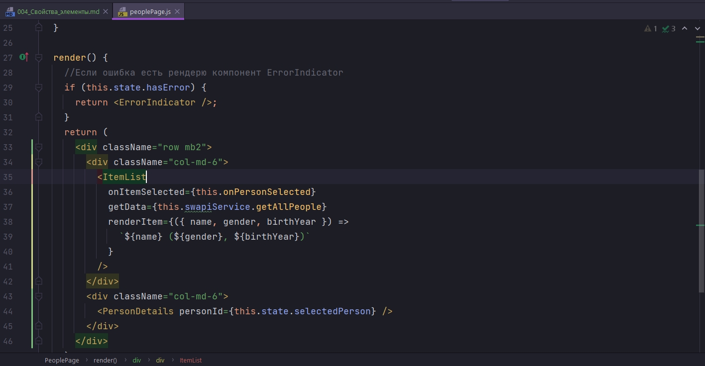

По этому я предлагаю вынести его в отдельную константу.

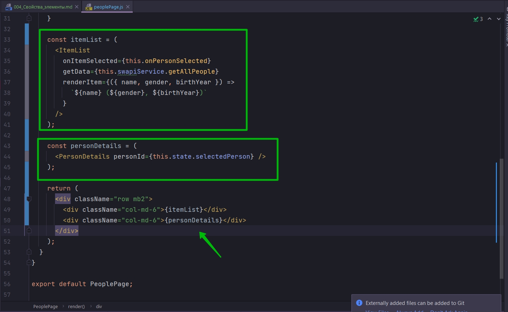

```js
import React, {Component} from "react";
import ItemList from "../itemList/itemList";
import ItemDetails from "../itemDetails/itemDetails";
import "./peoplePage.css";
import ErrorIndicator from "../errorIndicator/errorIndicator";
import SwapiService from "../../services/SwapiService";

class PeoplePage extends Component {
    swapiService = new SwapiService();

    state = {
        selectedPerson: 3,
    };
    //Функция выбора персонажа
    onPersonSelected = (id) => {
        this.setState({
            selectedPerson: id,
            hasError: false,
        });
    };

    // Теперь этот компонент становится ErrorBoundary
    componentDidCatch(error, errorInfo) {
        debugger;
        this.setState({hasError: true});
    }

    render() {
        //Если ошибка есть рендерю компонент ErrorIndicator
        if (this.state.hasError) {
            return <ErrorIndicator/>;
        }

        const itemList = (
            <ItemList
                onItemSelected={this.onPersonSelected}
                getData={this.swapiService.getAllPeople}
                renderItem={({name, gender, birthYear}) =>
                    `${name} (${gender}, ${birthYear})`
                }
            />
        );

        const personDetails = (
            <ItemDetails itemId={this.state.selectedPerson}/>
        );

        return (
            <div className="row mb2">
                <div className="col-md-6">{itemList}</div>
                <div className="col-md-6">{personDetails}</div>
            </div>
        );
    }
}

export default PeoplePage;

```

Смотрите мы можем довольно часто хотеть располагать вот так вот два элемента.

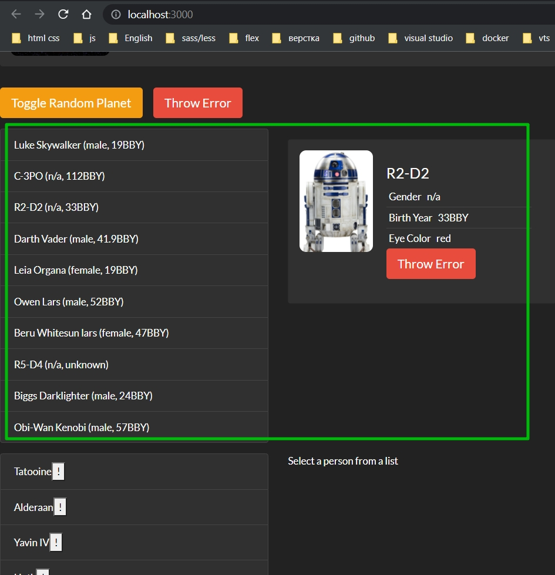

И снова таки каждый раз когда вы копируете код, вы обрекаете себя на то что этот код придется поддерживать и если вы захотите внести какие-нибудь изменения в этот код, который был скопирован несколько раз, вам нужно будет вспомнить в какие именно места вы его копировали.

По этому давайте попробуем сделать так что бы вот этот блок разметки

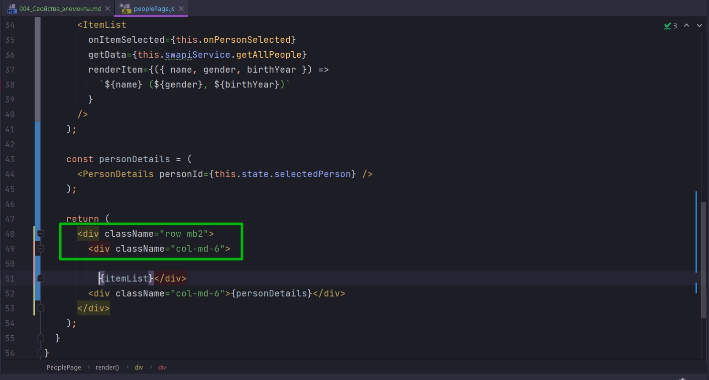

Можно было бы сделать отдельным React компонентом.

Пока что я начну писать компонент ппрямо в этом файле, а затем я его вынесу в отдельный файл.

Назову компонент Row

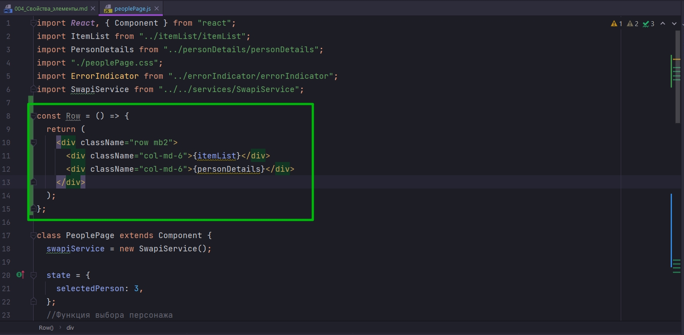

Но конечно мы не хотим что бы этот элемент всегда возвращал только itemList и personDetails. Нам нужно сделать так что бы этот компонент принимал совершенно любые элементы. 

Все что будет делать компонент Row это будет добавлять необходимые стили, создавать необходимую структуру вокруг других элементов.

Совершенно логично будет сделать так что бы компонент Row принимал два значения left и левый элемент и правый элемент и затем использовал значения этих свойст внутри разметки.

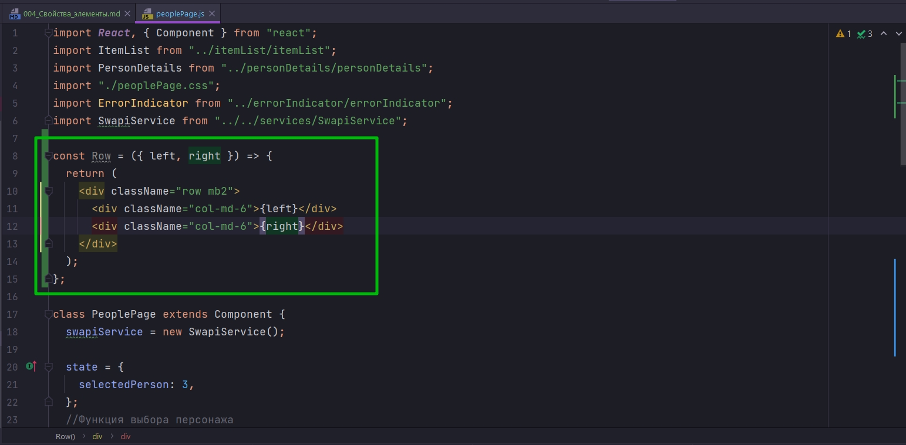

И реперь я могу поправить разметку.

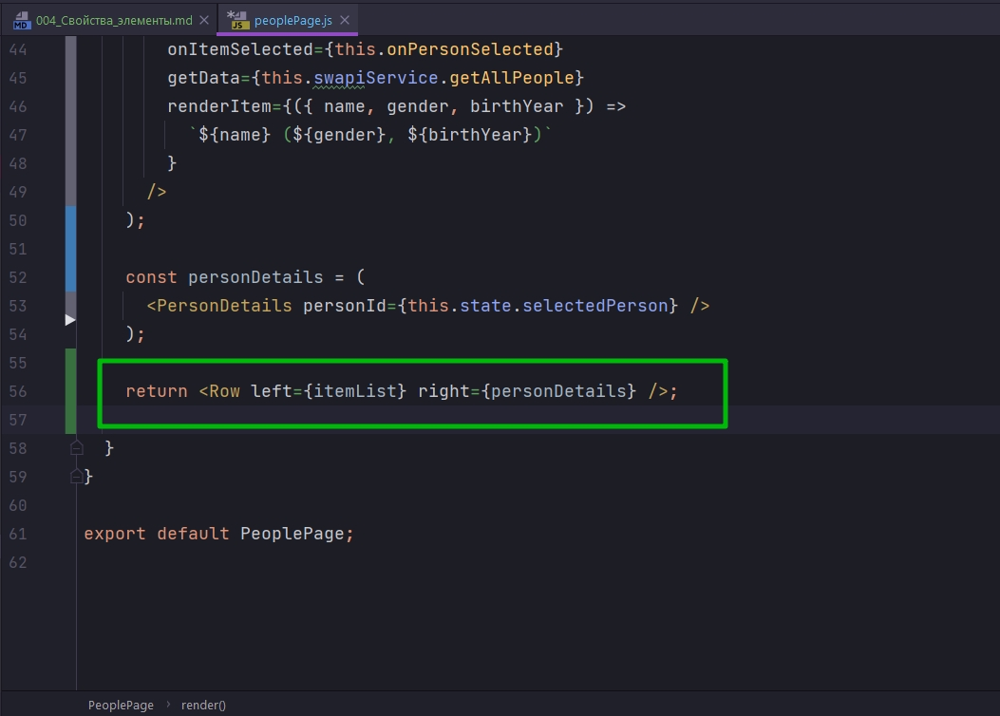

```js
import React, {Component} from "react";
import ItemList from "../itemList/itemList";
import ItemDetails from "../itemDetails/itemDetails";
import "./peoplePage.css";
import ErrorIndicator from "../errorIndicator/errorIndicator";
import SwapiService from "../../services/SwapiService";

const Row = ({left, right}) => {
    return (
        <div className="row mb2">
            <div className="col-md-6">{left}</div>
            <div className="col-md-6">{right}</div>
        </div>
    );
};

class PeoplePage extends Component {
    swapiService = new SwapiService();

    state = {
        selectedPerson: 3,
    };
    //Функция выбора персонажа
    onPersonSelected = (id) => {
        this.setState({
            selectedPerson: id,
            hasError: false,
        });
    };

    // Теперь этот компонент становится ErrorBoundary
    componentDidCatch(error, errorInfo) {
        debugger;
        this.setState({hasError: true});
    }

    render() {
        //Если ошибка есть рендерю компонент ErrorIndicator
        if (this.state.hasError) {
            return <ErrorIndicator/>;
        }

        const itemList = (
            <ItemList
                onItemSelected={this.onPersonSelected}
                getData={this.swapiService.getAllPeople}
                renderItem={({name, gender, birthYear}) =>
                    `${name} (${gender}, ${birthYear})`
                }
            />
        );

        const personDetails = (
            <ItemDetails itemId={this.state.selectedPerson}/>
        );

        return <Row left={itemList} right={personDetails}/>;
    }
}

export default PeoplePage;

```

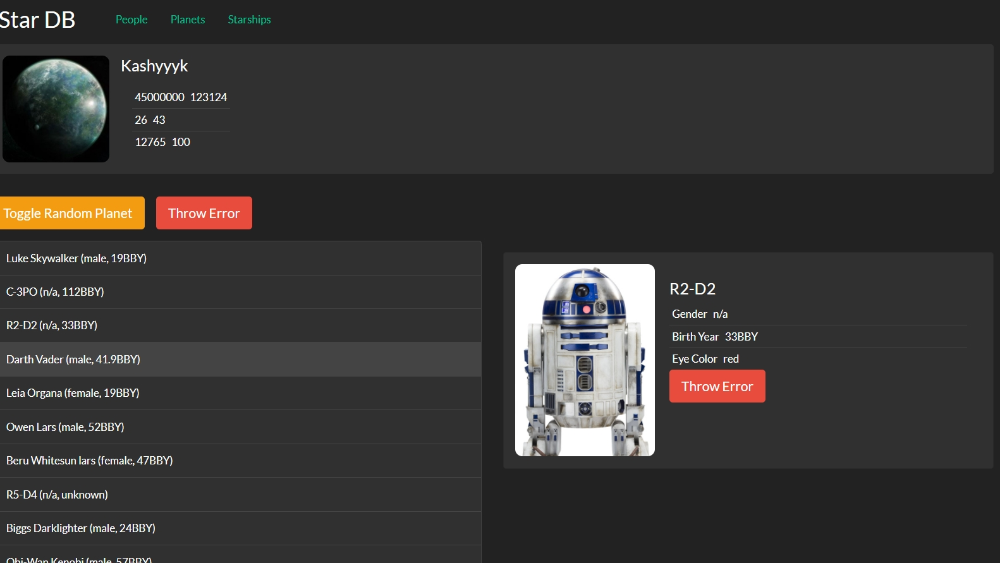

Страничка не сломалась.

Но то что у нас появилось, компонент Row, это компонент контейнер который принимает другие элементы и оборацивает их в нужные элементы.


Теперь если мы захотим переиспользовать такую же разметку нам не нужно копировать html. Я могу еще раз использовать этот компонент контейнер.

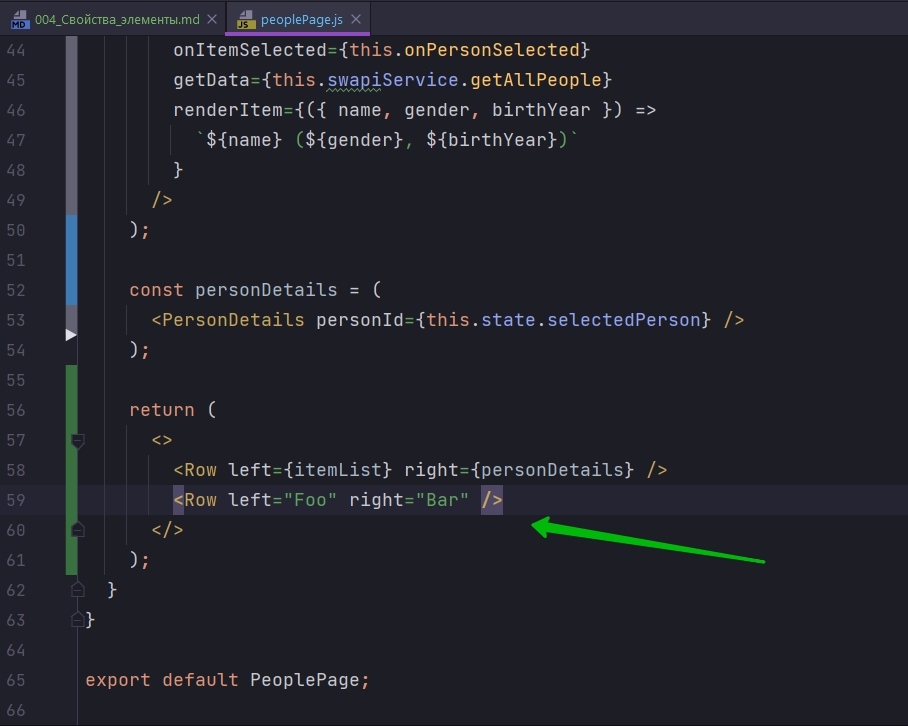

Теперь Foo и Bar будут точно так же расположены слева и справа поскольку они будут как бы вставляться в компонент контейнер.

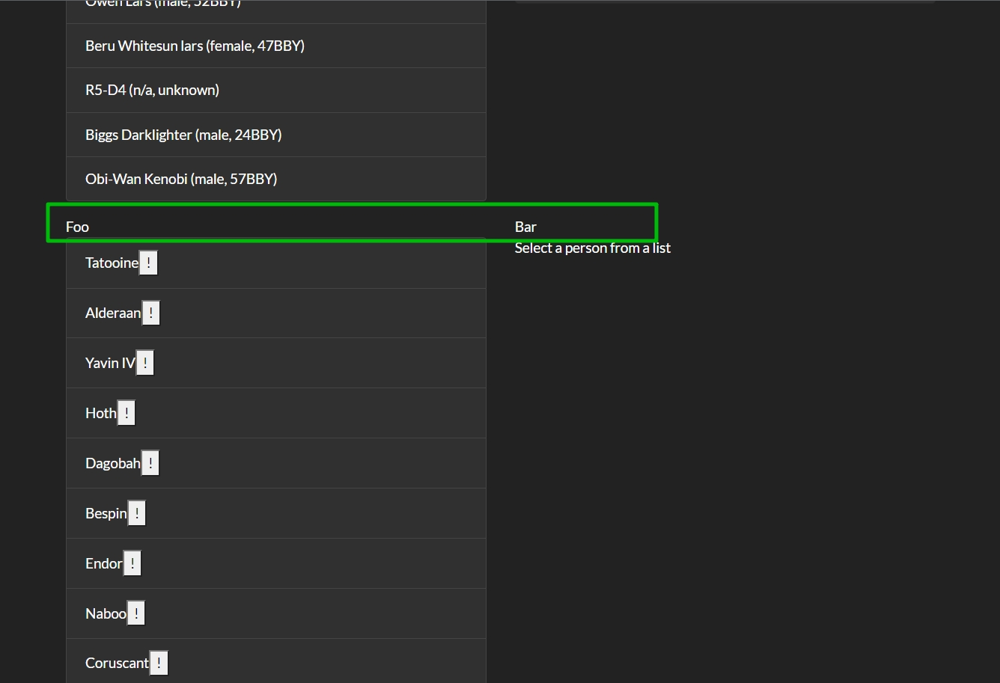

Мы можем создать для нашего приложения другие элементы контейнеры для того что бы переиспользовать блоки html и css и не копировать их между разными компонентами.

Мы можем например сделать из вот этого большого заголовка

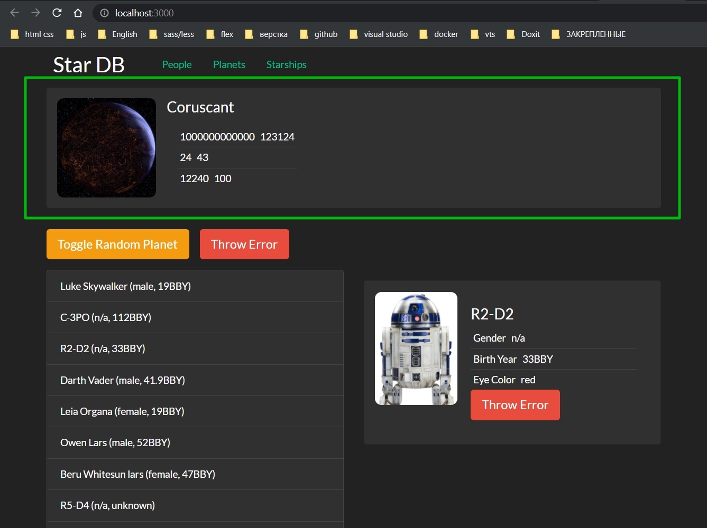

отдельный элемент контейнер в который мы сможем вставлять разные компоненты в зависимости от того что нам нужно.

Может быть в какой-то момент к дополнению к какой-нибудь планете, к вот этому элементу


такой же еще один блок выше в котором мы разместим рекламу фильма Звездные Воины. Тогда элемент контейнер будет иметь смысл, поскольку мы внутри этого контейнера скроем детали того как именно мы его отрисовываем т.е. детали css классов которые мы используем.

По сути это даже не паттерн. Это здравый смысл как и многие другие уроки из этого блока.

Поскольку в качестве свойств мы можем передавать все что угодно, мы можем передать объект который представляет собой React-элемент. И затем каким именно образом наш компонент контейнер будет использовать этот React элемент уже зависит от конкретного компонента. ОН может разместить его в разметку. Он может заменять один компонент другим компонентом в время загрузки. К примеру таким способом мы можем сконфигурировать какой именно элемент использовать для loader для нашего spinner который показывает что данные загружаются, и какой именно компонент испольовать для того что бы отобразить ошибку.


Последний аспект этого урока. Нам не обязательно создавать промежуточные переменные для того что бы передать элементы в другой компонент. мы можем прямо в пропс передать JSX разметку.

Но если ваши компоненты становятся немного больше,как ItemList, имеет смысл вынести их в отдельную константу.

Теперь Row выношу в отдельную парпку.

```js
import React, {Component} from "react";
import ItemList from "../itemList/itemList";
import ItemDetails from "../itemDetails/itemDetails";
import "./peoplePage.css";
import ErrorIndicator from "../errorIndicator/errorIndicator";
import SwapiService from "../../services/SwapiService";
import Row from "../row/row";

class PeoplePage extends Component {
    swapiService = new SwapiService();

    state = {
        selectedPerson: 3,
    };
    //Функция выбора персонажа
    onPersonSelected = (id) => {
        this.setState({
            selectedPerson: id,
            hasError: false,
        });
    };

    // Теперь этот компонент становится ErrorBoundary
    componentDidCatch(error, errorInfo) {
        debugger;
        this.setState({hasError: true});
    }

    render() {
        //Если ошибка есть рендерю компонент ErrorIndicator
        if (this.state.hasError) {
            return <ErrorIndicator/>;
        }

        const itemList = (
            <ItemList
                onItemSelected={this.onPersonSelected}
                getData={this.swapiService.getAllPeople}
                renderItem={({name, gender, birthYear}) =>
                    `${name} (${gender}, ${birthYear})`
                }
            />
        );

        const personDetails = (
            <ItemDetails itemId={this.state.selectedPerson}/>
        );

        return (
            <>
                <Row left={itemList} right={personDetails}/>
                <Row left="Foo" right="Bar"/>
            </>
        );
    }
}

export default PeoplePage;

```

```js
import React from "react";

const Row = ({ left, right }) => {
  return (
    <div className="row mb2">
      <div className="col-md-6">{left}</div>
      <div className="col-md-6">{right}</div>
    </div>
  );
};

export default Row;

```

> Свойства-элементы
> 
> В качестве значения свойства можно передавать React-элемент
> <Card title={<h1>Hi</h1>}/>
> 
> Так можно создавать элементы контейнеры
> 
> ...или элементы которые умеют выбирать что рендерить в зависимости от условия(загрузка, ошибка и т.п.)