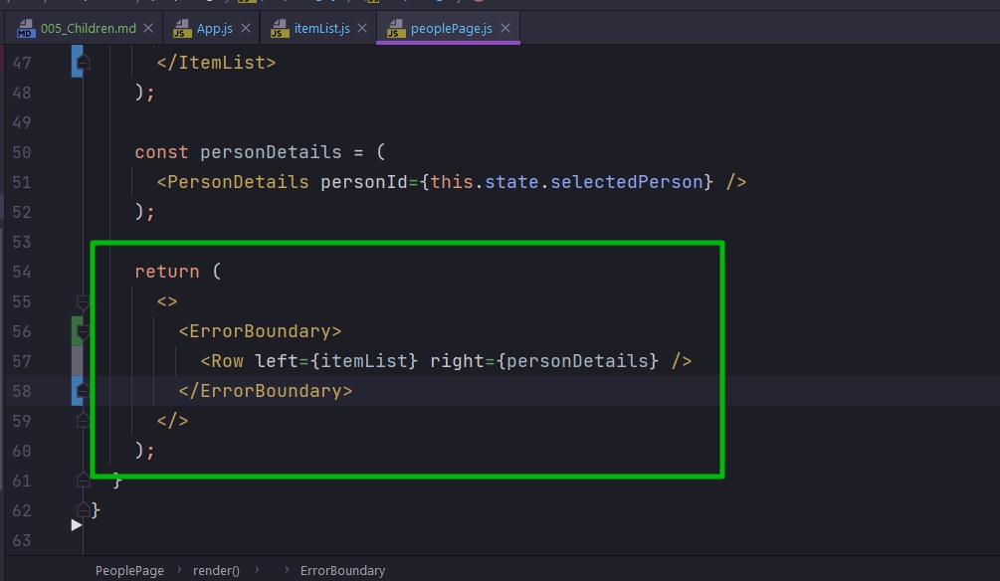

# 005_Children

В React есть два способа передавать свойства  React компонентам. 

Первый способ, это тот который мы использовали, передавать пары ключ значение, похожие на атрибуты в html тегах.


Нл есть еще и второй способ который в некоторых случаях выглядит намного удобнее. И этот способ передать свойство прямо в тело того тега который описывает компонент.

Это будет выглядеть вот так. Мы можем добавить загрывающий тег, так что бы у этого элемента появилось тело


Давайте для того что бы взять конкретный пример мы возьмем нашу функцию renderItem. Эта функция по сути определяет то как будет выглядеть этот компонент. По этому будет логично перенести эту функцию в тело. Таким образом код будет читаться намного лучше.


```js
import React, {Component} from "react";
import ItemList from "../itemList/itemList";
import ItemDetails from "../itemDetails/itemDetails";
import "./peoplePage.css";
import ErrorIndicator from "../errorIndicator/errorIndicator";
import SwapiService from "../../services/SwapiService";
import Row from "../row/row";

class PeoplePage extends Component {
    swapiService = new SwapiService();

    state = {
        selectedPerson: 3,
    };
    //Функция выбора персонажа
    onPersonSelected = (id) => {
        this.setState({
            selectedPerson: id,
            hasError: false,
        });
    };

    // Теперь этот компонент становится ErrorBoundary
    componentDidCatch(error, errorInfo) {
        debugger;
        this.setState({hasError: true});
    }

    render() {
        //Если ошибка есть рендерю компонент ErrorIndicator
        if (this.state.hasError) {
            return <ErrorIndicator/>;
        }

        const itemList = (
            <ItemList
                onItemSelected={this.onPersonSelected}
                getData={this.swapiService.getAllPeople}
            >
                {(item) => `${item.name} ( ${item.birthYear})`}
            </ItemList>
        );

        const personDetails = (
            <ItemDetails itemId={this.state.selectedPerson}/>
        );

        return (
            <>
                <Row left={itemList} right={personDetails}/>
                <Row left="Foo" right="Bar"/>
            </>
        );
    }
}

export default PeoplePage;

```

Убрал все лишнее. И таким способом код читается немного лучше. Функция которая описывает как будет выглядеть тело этого компонента.


Но теперь возникает естественный вопрос. А как же нам получить доступ к этой функции, из самого компонента, если теперь у нее нет имени?

И в React для вот таких вот свойств которые передаются в теле компонента есть специальное имя. К ним можно получить доступ через this.props.children

```js
//src/components/itemList/itemList.js
import React, { Component } from "react";
import Spinner from "../spinner/spinner";
import "./itemList.css";

class ItemList extends Component {
  state = {
    itemList: null,
  };

  componentDidMount() {
    const { getData } = this.props;

    getData().then((itemList) => {
      this.setState({
        itemList: itemList,
      });
    });
  }

  renderItems(arr) {
    return arr.map((item) => {
      const { id } = item; // деструктурирую из полученного объекта id
      const label = this.props.children(item); // сюда попадает name из пропсов
      return (
        <li
          className="list-group-item"
          key={id}
          onClick={() => this.props.onItemSelected(id)}
        >
          {label}
        </li>
      );
    });
  }

  render() {
    const { itemList } = this.state;

    if (!itemList) {
      return <Spinner />;
    }

    const items = this.renderItems(itemList);

    return <ul className="item-list list-group">{items}</ul>;
  }
}

export default ItemList;

```

И так больше часа отсидел разбираясь с ошибкой что this.props.children не является функцией. Нашел! и логично закоментировать ту разметку которая используется в App

```js
//src/component/app?App.js
import React, { Component } from "react";
import Header from "../header/header";
import RandomPlanet from "../randomPlanet/randomPlanet";
import "./App.css";
import ErrorButton from "../errorButton/errorButton";
import ErrorIndicator from "../errorIndicator/errorIndicator";
import PeoplePage from "../peoplePage/peoplePage";
import ItemList from "../itemList/itemList";
import ItemDetails from "../itemDetails/itemDetails";
import SwapiService from "../../services/SwapiService";

class App extends Component {
  swapiService = new SwapiService();

  state = {
    showRandomPlanet: true,
    hasError: false,
  };

  //Функция включения и выключения компонента рандомной планеты
  toggleRandomPlanet = () => {
    this.setState((state) => {
      return {
        showRandomPlanet: !state.showRandomPlanet,
      };
    });
  };

  // Обработка ошибок в компонентах
  componentDidCatch(error, errorInfo) {
    console.log("componentDidCatch()");
    this.setState({ hasError: true });
  }

  render() {
    //Если есть ошибка в компонентах
    if (this.state.hasError) {
      return <ErrorIndicator />;
    }

    const planet = this.state.showRandomPlanet ? <RandomPlanet /> : null;
    return (
      <div>
        <Header />
        {planet}
        <div className="row mb2 button-row">
          <button
            className="toggle-planet btn btn-warning btn-lg"
            onClick={this.toggleRandomPlanet}
          >
            Toggle Random Planet
          </button>
          <ErrorButton />
        </div>
        <PeoplePage />
        {/*/!*ItemList All Planets*!/*/}
        {/*<div className="row mb2">*/}
        {/*  <div className="col-md-6">*/}
        {/*    <ItemList*/}
        {/*      onItemSelected={this.onPersonSelected}*/}
        {/*      getData={this.swapiService.getAllPlanets}*/}
        {/*      renderItem={(item) => (*/}
        {/*        <span>*/}
        {/*          {item.name}*/}
        {/*          <button>!</button>*/}
        {/*        </span>*/}
        {/*      )}*/}
        {/*    />*/}
        {/*  </div>*/}
        {/*  <div className="col-md-6">*/}
        {/*    <ItemDetails personId={this.state.selectedPerson} />*/}
        {/*  </div>*/}
        {/*</div>*/}

        {/*/!*ItemList All Starship  *!/*/}
        {/*<div className="row mb2">*/}
        {/*  <div className="col-md-6">*/}
        {/*    <ItemList*/}
        {/*      onItemSelected={this.onPersonSelected}*/}
        {/*      getData={this.swapiService.getAllStarShips}*/}
        {/*      renderItem={(item) => item.name}*/}
        {/*    />*/}
        {/*  </div>*/}
        {/*  <div className="col-md-6">*/}
        {/*    <ItemDetails personId={this.state.selectedPerson} />*/}
        {/*  </div>*/}
        {/*</div>*/}
      </div>
    );
  }
}

export default App;

```

```js
import React, {Component} from "react";
import ItemList from "../itemList/itemList";
import ItemDetails from "../itemDetails/itemDetails";
import "./peoplePage.css";
import ErrorIndicator from "../errorIndicator/errorIndicator";
import SwapiService from "../../services/SwapiService";
import Row from "../row/row";

class PeoplePage extends Component {
    swapiService = new SwapiService();

    state = {
        selectedPerson: 3,
    };
    //Функция выбора персонажа
    onPersonSelected = (id) => {
        this.setState({
            selectedPerson: id,
            hasError: false,
        });
    };

    // Теперь этот компонент становится ErrorBoundary
    componentDidCatch(error, errorInfo) {
        debugger;
        this.setState({hasError: true});
    }

    render() {
        //Если ошибка есть рендерю компонент ErrorIndicator
        if (this.state.hasError) {
            return <ErrorIndicator/>;
        }

        const itemList = (
            <ItemList
                onItemSelected={this.onPersonSelected}
                getData={this.swapiService.getAllPeople}
            >
                {(item) => `${item.name} (${item.birthYear})`}
            </ItemList>
        );

        const personDetails = (
            <ItemDetails itemId={this.state.selectedPerson}/>
        );

        return (
            <>
                <Row left={itemList} right={personDetails}/>
                <Row left="Foo" right="Bar"/>
            </>
        );
    }
}

export default PeoplePage;

```

```js
//src/components/itemList/itemList.js
import React, { Component } from "react";
import Spinner from "../spinner/spinner";
import "./itemList.css";

class ItemList extends Component {
  state = {
    itemList: null,
  };

  componentDidMount() {
    const { getData } = this.props;

    getData().then((itemList) => {
      this.setState({
        itemList: itemList,
      });
    });
  }

  renderItems(arr) {
    return arr.map((item) => {
      const { id } = item; // деструктурирую из полученного объекта id
      const label = this.props.children(item); // сюда попадает name из пропсов
      return (
        <li
          className="list-group-item"
          key={id}
          onClick={() => this.props.onItemSelected(id)}
        >
          {label}
        </li>
      );
    });
  }

  render() {
    const { itemList } = this.state;

    if (!itemList) {
      return <Spinner />;
    }

    const items = this.renderItems(itemList);

    return <ul className="item-list list-group">{items}</ul>;
  }
}

export default ItemList;

```


И теперь мы с вами знаем еще один хороший способ как можно элементам передавать свойства.

В React API это название this.props.children не очень удачное потому что слово children подрозумевает коллекцию child-ов, коллекцию каких-то элементов. Когда вы видите в коде это название, вы ожидаете там увидить массив. Но на самом деле в this.props.children может быть любой тип данных который вы можете передать в качестве свойства.

Ну и конечно в качестве children можно передать дерево элементов React.


Откроем PeoplePage. 

Этот компонент сейчас занимается сразу несколькими вещами.

Во-первых он координирует работу между списком персонажей и деталями персонажа.

Во-вторых он работает с ошибками. Т.е. он работает как ErrorBoundary  поскольку на нем определен метод componentDidCatch и этот компонент умеет обрабатывать ошибки рендеринга.


А что если мы с вами попробуем создать отдельный компонент, задачей которого будет исключительно заниматься обработкой ошибок?

Это будет отличным решением поскольку мы выделим эту обязанность в отдельный компонент.

И PeoplePage сможет заниматься исключительно координацией работы своих двух компонентов.

Сначало создадим этот компонент прямо в PeoplePage, а затем  я вынесу этот компонент в отдельный файл.

В первую очередь я создам компонент класс поскольку мне нужно будет на нем определить componentDidCatch.


Этот компонент не будет делать ничего кроме как возвращать return this.props.children. Т.е. этот компонент расчитывает получить один или несколько элементов. И этот компонент отрендерит их точно в том виде в котором он их получил т.е. он не будет сейчас делать вообще ничего.



```js
import React, {Component} from "react";
import ItemList from "../itemList/itemList";
import ItemDetails from "../itemDetails/itemDetails";
import "./peoplePage.css";
import ErrorIndicator from "../errorIndicator/errorIndicator";
import SwapiService from "../../services/SwapiService";
import Row from "../row/row";

class ErrorBoundary extends Component {
    render() {
        return this.props.children;
    }
}

export default class PeoplePage extends Component {
    swapiService = new SwapiService();

    state = {
        selectedPerson: 3,
    };
    //Функция выбора персонажа
    onPersonSelected = (id) => {
        this.setState({
            selectedPerson: id,
            hasError: false,
        });
    };

    // Теперь этот компонент становится ErrorBoundary
    componentDidCatch(error, errorInfo) {
        debugger;
        this.setState({hasError: true});
    }

    render() {
        //Если ошибка есть рендерю компонент ErrorIndicator
        if (this.state.hasError) {
            return <ErrorIndicator/>;
        }

        const itemList = (
            <ItemList
                onItemSelected={this.onPersonSelected}
                getData={this.swapiService.getAllPeople}
            >
                {(item) => `${item.name} (${item.birthYear})`}
            </ItemList>
        );

        const personDetails = (
            <ItemDetails itemId={this.state.selectedPerson}/>
        );

        return (
            <>
                <ErrorBoundary>
                    <Row left={itemList} right={personDetails}/>
                </ErrorBoundary>
            </>
        );
    }
}

```

Когда наш код будет исполняться, внутри ErrorBoundary значение this.props.children будет компонент Row, и его же ErrorBoundary и вернет.


Наше приложение все еще не сломалось.

А теперь добавлю в ErrorBoundary немного логики. Перенесу в этот компонент наш метод componentDidCatch и определим соответствующий state для того что бы этот метод работал, что бы в state унас тоже был hasError.


```js
import React, {Component} from "react";
import ItemList from "../itemList/itemList";
import ItemDetails from "../itemDetails/itemDetails";
import "./peoplePage.css";
import ErrorIndicator from "../errorIndicator/errorIndicator";
import SwapiService from "../../services/SwapiService";
import Row from "../row/row";

class ErrorBoundary extends Component {
    state = {
        hasError: false,
    };

    // Теперь этот компонент становится ErrorBoundary
    componentDidCatch(error, errorInfo) {
        debugger;
        this.setState({hasError: true});
    }

    render() {
        if (this.state.hasError) {
            return <ErrorIndicator/>;
        }
        return this.props.children;
    }
}

export default class PeoplePage extends Component {
    swapiService = new SwapiService();

    state = {
        selectedPerson: 3,
    };
    //Функция выбора персонажа
    onPersonSelected = (id) => {
        this.setState({
            selectedPerson: id,
            hasError: false,
        });
    };

    render() {
        //Если ошибка есть рендерю компонент ErrorIndicator
        if (this.state.hasError) {
            return <ErrorIndicator/>;
        }

        const itemList = (
            <ItemList
                onItemSelected={this.onPersonSelected}
                getData={this.swapiService.getAllPeople}
            >
                {(item) => `${item.name} (${item.birthYear})`}
            </ItemList>
        );

        const personDetails = (
            <ItemDetails itemId={this.state.selectedPerson}/>
        );

        return (
            <>
                <ErrorBoundary>
                    <Row left={itemList} right={personDetails}/>
                </ErrorBoundary>
            </>
        );
    }
}

```

И вот теперь у меня появился намного более интересный компонент который теперь содержит логику и он может решать что именно он хочет отрисовать, свое тело т.е. то что мы передали в this.props.children или же ErrorIndicator.

Если мы все сделали правильно, то мы получили возможность отлавливать ошибку на любом компоненте который есть в нашем приложении.


Теперь в компоненте PeoplePage нет болше кода который отлавливает ошибки. Зато этот код перешел в отдельный компонент который можно переиспользовать в любой части приложения.

Теперь посмотрим что будет если ErrorBoundary поставить на немного более низком уровне. Обернем компонент ItemDetails


```js
import React, {Component} from "react";
import ItemList from "../itemList/itemList";
import ItemDetails from "../itemDetails/itemDetails";
import "./peoplePage.css";
import ErrorIndicator from "../errorIndicator/errorIndicator";
import SwapiService from "../../services/SwapiService";
import Row from "../row/row";

class ErrorBoundary extends Component {
    state = {
        hasError: false,
    };

    // Теперь этот компонент становится ErrorBoundary
    componentDidCatch(error, errorInfo) {
        debugger;
        this.setState({hasError: true});
    }

    render() {
        if (this.state.hasError) {
            return <ErrorIndicator/>;
        }
        return this.props.children;
    }
}

export default class PeoplePage extends Component {
    swapiService = new SwapiService();

    state = {
        selectedPerson: 3,
    };
    //Функция выбора персонажа
    onPersonSelected = (id) => {
        this.setState({
            selectedPerson: id,
            hasError: false,
        });
    };

    render() {
        //Если ошибка есть рендерю компонент ErrorIndicator
        if (this.state.hasError) {
            return <ErrorIndicator/>;
        }

        const itemList = (
            <ItemList
                onItemSelected={this.onPersonSelected}
                getData={this.swapiService.getAllPeople}
            >
                {(item) => `${item.name} (${item.birthYear})`}
            </ItemList>
        );

        const personDetails = (
            <ErrorBoundary>
                <ItemDetails itemId={this.state.selectedPerson}/>
            </ErrorBoundary>
        );

        return (
            <>
                <Row left={itemList} right={personDetails}/>
            </>
        );
    }
}

```


Благодаря вот такому маленькому изменению в коде и благодаря свойству this.props,children у нас с вами появилась возможность создавать вот такие более продвинутые компоненты.

Хочу подчеркнуть что нет разницы каким именно способом вы будете передавать свойства в компонент, через тело компонента и this.props.children, или через свойство props.

В данном случае использовать тело компонента и this.props.children удобнее, так как видно какие компоненты оборачивает ErrorBoundary.

```js
import React, { Component } from "react";
import ErrorIndicator from "../errorIndicator/errorIndicator";

class ErrorBoundary extends Component {
  state = {
    hasError: false,
  };
  // Теперь этот компонент становится ErrorBoundary
  componentDidCatch(error, errorInfo) {
    debugger;
    this.setState({ hasError: true });
  }

  render() {
    if (this.state.hasError) {
      return <ErrorIndicator />;
    }
    return this.props.children;
  }
}

export default ErrorBoundary;

```

```js
import React, {Component} from "react";
import ItemList from "../itemList/itemList";
import ItemDetails from "../itemDetails/itemDetails";
import "./peoplePage.css";
import SwapiService from "../../services/SwapiService";
import Row from "../row/row";
import ErrorBoundary from "../errorBoundary/errorBoundary";

export default class PeoplePage extends Component {
    swapiService = new SwapiService();

    state = {
        selectedPerson: 3,
    };
    //Функция выбора персонажа
    onPersonSelected = (id) => {
        this.setState({
            selectedPerson: id,
            hasError: false,
        });
    };

    render() {
        const itemList = (
            <ItemList
                onItemSelected={this.onPersonSelected}
                getData={this.swapiService.getAllPeople}
            >
                {(item) => `${item.name} (${item.birthYear})`}
            </ItemList>
        );

        const personDetails = (
            <ErrorBoundary>
                <ItemDetails itemId={this.state.selectedPerson}/>
            </ErrorBoundary>
        );

        return (
            <>
                <Row left={itemList} right={personDetails}/>
            </>
        );
    }
}

```

```js
//src/components/itemList/itemList.js
import React, { Component } from "react";
import Spinner from "../spinner/spinner";
import "./itemList.css";

class ItemList extends Component {
  state = {
    itemList: null,
  };

  componentDidMount() {
    const { getData } = this.props;

    getData().then((itemList) => {
      this.setState({
        itemList: itemList,
      });
    });
  }

  renderItems(arr) {
    return arr.map((item) => {
      const { id } = item; // деструктурирую из полученного объекта id
      const label = this.props.children(item); // сюда попадает name из пропсов
      return (
        <li
          className="list-group-item"
          key={id}
          onClick={() => this.props.onItemSelected(id)}
        >
          {label}
        </li>
      );
    });
  }

  render() {
    const { itemList } = this.state;

    if (!itemList) {
      return <Spinner />;
    }

    const items = this.renderItems(itemList);

    return <ul className="item-list list-group">{items}</ul>;
  }
}

export default ItemList;

```

> Children
> 
> Компоненту можно передавать одно из свойств, поместив его в тело элемента
> 
> <Card>How are you</Card>
> 
> это свойство доступно через props.children
> 
> Поддерживает любые типы данных: элементы, функции, объекты и другие