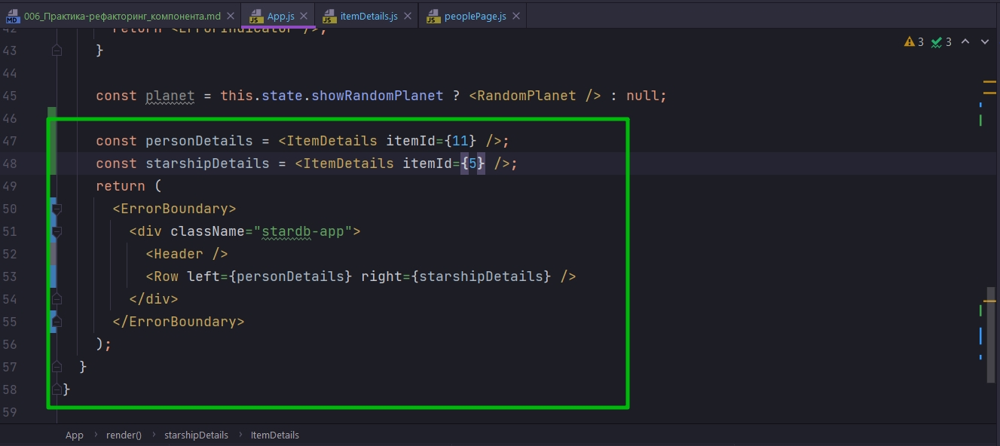
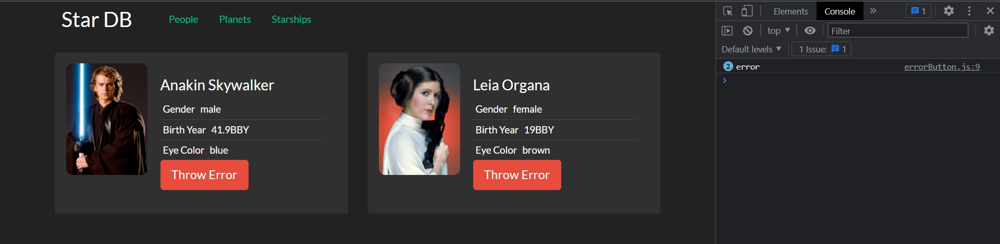
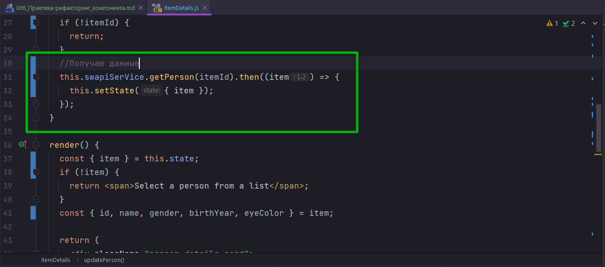
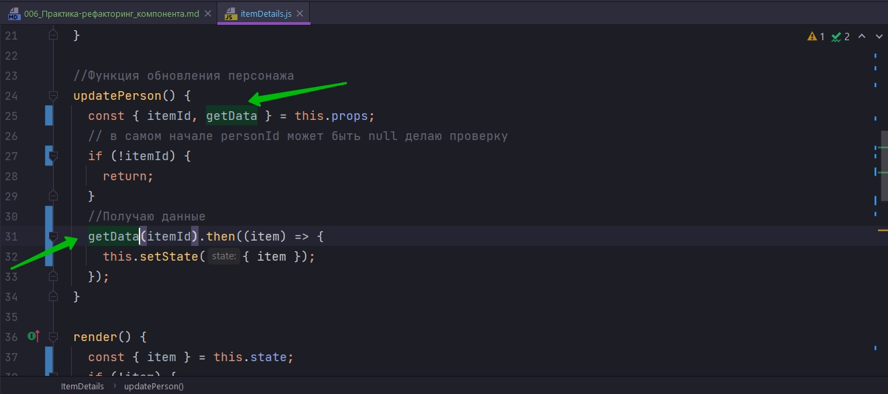
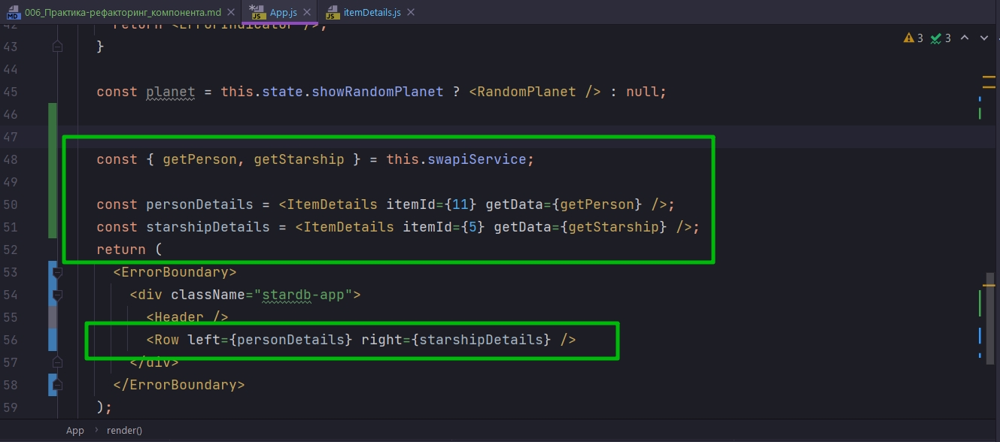
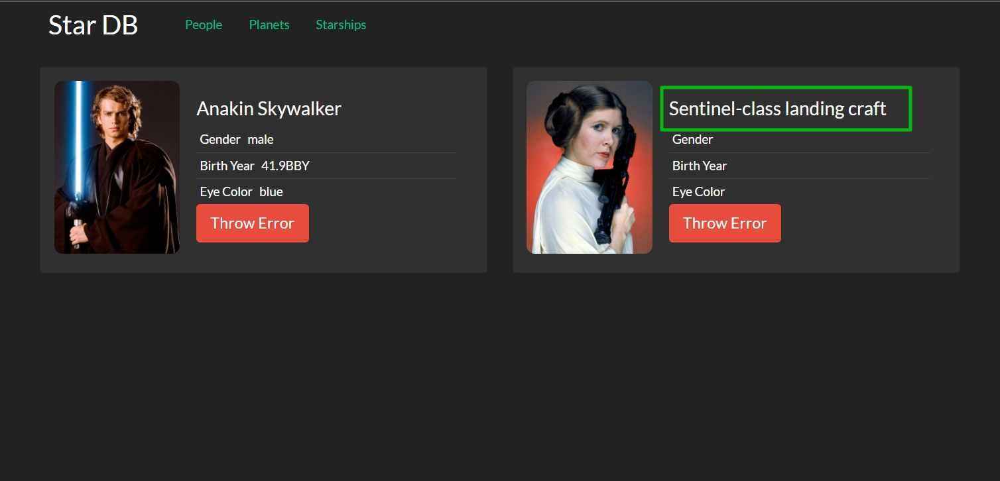
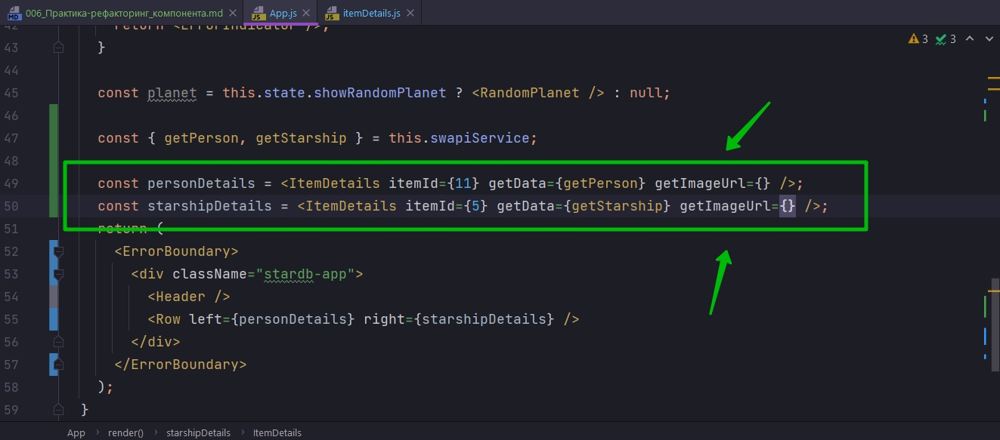
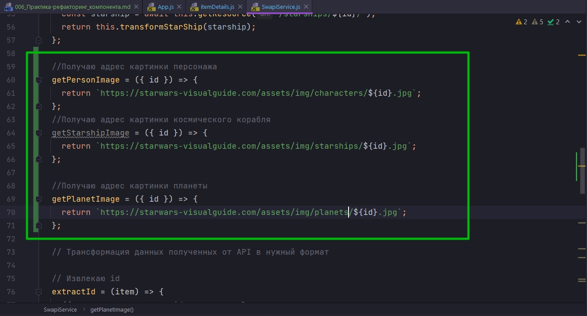
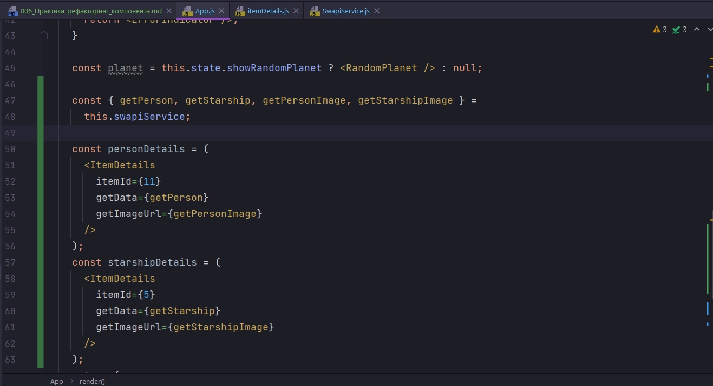
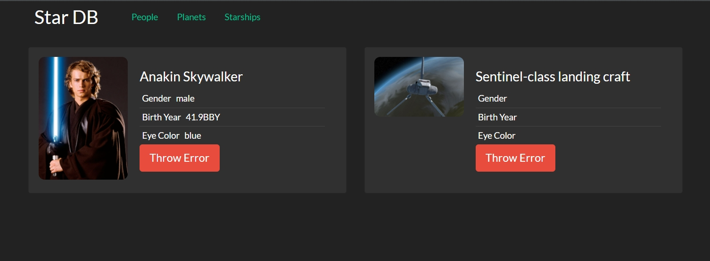

# 006_Практика-рефакторинг_компонента

Начнем делать один очень интересный рефакторинг. Мы сделаем так что бы наш компонент ItemDetails теперь работал не только с персонажами, а мог работать еще и с планетами и с короблями.

Точно так же как и для списка элементов. Помните мы начинали с того что у нас был отдельно PeopleList. Но затем мы вынесли функцию получения данных наружу и во вторых вынесли функцию отрисовки элемента тоже наружу. И таким образом у нас получился более общий компонент который может работать с любыми списками данных.

Точнотак же мы поступим и с компонентом ItemDetails. Но у этого компонента структура немножечко сложнее. По этому и рефакторинг будет интереснее.

И так за кодром он переименовал этот компонент из ItemDetails в ItemDetails. И соответственно все названия переменных которые содержали слово person теперь начинаются со слова item. Это тривиальный рефактринг. 

```js
import React, { Component } from "react";
import ItemList from "../itemList/itemList";
import ItemDetails from "../itemDetails/itemDetails";
import "./peoplePage.css";
import SwapiService from "../../services/SwapiService";
import Row from "../row/row";
import ErrorBoundary from "../errorBoundary/errorBoundary";

export default class PeoplePage extends Component {
    swapiService = new SwapiService();

    state = {
        selectedPerson: 11,
    };
    //Функция выбора персонажа
    onPersonSelected = (id) => {
        this.setState({
            selectedPerson: id,
            hasError: false,
        });
    };

    render() {
        const itemList = (
            <ItemList
                onItemSelected={this.onPersonSelected}
                getData={this.swapiService.getAllPeople}
            >
                {(item) => `${item.name} (${item.birthYear})`}
            </ItemList>
        );

        const personDetails = (
            <ErrorBoundary>
                <ItemDetails itemId={this.state.selectedPerson} />
            </ErrorBoundary>
        );

        return (
            <>
                <Row left={itemList} right={personDetails} />
            </>
        );
    }
}

```

```js
import React, { Component } from "react";
import SwapiService from "../../services/SwapiService";
import "./itemDetails.css";
import ErrorButton from "../errorButton/errorButton";

class ItemDetails extends Component {
  swapiSerVice = new SwapiService();

  state = {
    item: null,
  };

  componentDidMount() {
    this.updatePerson();
  }

  componentDidUpdate(prevProps, prevState, snapshot) {
    if (this.props.itemId !== prevProps.itemId) {
      this.updatePerson();
    }
  }

  //Функция обновления персонажа
  updatePerson() {
    const { itemId } = this.props;
    // в самом начале personId может быть null делаю проверку
    if (!itemId) {
      return;
    }
    //Получаю детали персонажа
    this.swapiSerVice.getPerson(itemId).then((item) => {
      this.setState({ item });
    });
  }

  render() {
    const { item } = this.state;
    if (!item) {
      return <span>Select a person from a list</span>;
    }
    const { id, name, gender, birthYear, eyeColor } = item;

    return (
      <div className="person-details card">
        

        <div className="card-body">
          <h4>{name}</h4>
          <ul className="list-group list-group-flush">
            <li className="list-group-item">
              <span className="term">Gender</span>
              <span>{gender}</span>
            </li>
            <li className="list-group-item">
              <span className="term">Birth Year</span>
              <span>{birthYear}</span>
            </li>
            <li className="list-group-item">
              <span className="term">Eye Color</span>
              <span>{eyeColor}</span>
            </li>
          </ul>
          <ErrorButton />
        </div>
      </div>
    );
  }
}

export default ItemDetails;

```

Теперь вернусь в компонент App и сделаю так что бы у меня не было лишних компонентов на странице. Что бы ничего не отвлекало.

Я хочу сделать так что бы на нашей странице отображалось два компонента ItemDetails. В одном компоненте мы попробуем отрисовать персонажа. А в другом какой-нибудь космический корабль. 

Таким образом мы сможем наблюдать за тем какие еще детали компонента нам нужно обновить для того что бы все работало.



Конкретно отрефакторил. Ладно учимся же!!!!



Единтвенная проблема в том что наш компонент умеет отображать только персонажей.

И так давайте начнем использовать те стратегии которые мы уже знаем для того что бы этот компонент смог отображать какие угодно сущности.

И давайте вспомним как мы поступали с ItemList. 

Первое что мы делали это выносили получение данных из компонента наружу.



Т.е. вместо того что бы компонент сам решал какой метод сервиса вызвать, этот компонент будет получать функцию которую он вызовет тогда когда ему понадобяться данные.

И назову эту функцию getData по аналогии с другим компонентом который мы делали раньше. Теперь вместо this.swapiService.getPerson мы скажем просто getData(itemId). И затем эта функция нам будет должна предоставить нужные данные.



Вернемся в App. И теперь для того что бы обновить персонажа это будет функция getData{this.swapiService.getPerson}. А для того что бы получить корабль getData{this.swapiService.getStarship}



```js
import React, { Component } from "react";
import SwapiService from "../../services/SwapiService";
import "./itemDetails.css";
import ErrorButton from "../errorButton/errorButton";

class ItemDetails extends Component {
  swapiSerVice = new SwapiService();

  state = {
    item: null,
  };

  componentDidMount() {
    this.updatePerson();
  }

  componentDidUpdate(prevProps, prevState, snapshot) {
    if (this.props.itemId !== prevProps.itemId) {
      this.updatePerson();
    }
  }

  //Функция обновления персонажа
  updatePerson() {
    const { itemId, getData } = this.props;
    // в самом начале personId может быть null делаю проверку
    if (!itemId) {
      return;
    }
    //Получаю данные
    getData(itemId).then((item) => {
      this.setState({ item });
    });
  }

  render() {
    const { item } = this.state;
    if (!item) {
      return <span>Select a person from a list</span>;
    }
    const { id, name, gender, birthYear, eyeColor } = item;

    return (
      <div className="person-details card">
        

        <div className="card-body">
          <h4>{name}</h4>
          <ul className="list-group list-group-flush">
            <li className="list-group-item">
              <span className="term">Gender</span>
              <span>{gender}</span>
            </li>
            <li className="list-group-item">
              <span className="term">Birth Year</span>
              <span>{birthYear}</span>
            </li>
            <li className="list-group-item">
              <span className="term">Eye Color</span>
              <span>{eyeColor}</span>
            </li>
          </ul>
          <ErrorButton />
        </div>
      </div>
    );
  }
}

export default ItemDetails;

```

```js
//src/component/app?App.js
import React, { Component } from "react";
import Header from "../header/header";
import RandomPlanet from "../randomPlanet/randomPlanet";
import "./App.css";
import ErrorButton from "../errorButton/errorButton";
import ErrorIndicator from "../errorIndicator/errorIndicator";
import PeoplePage from "../peoplePage/peoplePage";
// import ItemList from "../itemList/itemList";
// import ItemDetails from "../itemDetails/itemDetails";
import SwapiService from "../../services/SwapiService";
import ErrorBoundary from "../errorBoundary/errorBoundary";
import Row from "../row/row";
import ItemDetails from "../itemDetails/itemDetails";

class App extends Component {
  swapiService = new SwapiService();

  state = {
    showRandomPlanet: true,
    hasError: false,
  };

  //Функция включения и выключения компонента рандомной планеты
  toggleRandomPlanet = () => {
    this.setState((state) => {
      return {
        showRandomPlanet: !state.showRandomPlanet,
      };
    });
  };

  // Обработка ошибок в компонентах
  componentDidCatch(error, errorInfo) {
    console.log("componentDidCatch()");
    this.setState({ hasError: true });
  }

  render() {
    //Если есть ошибка в компонентах
    if (this.state.hasError) {
      return <ErrorIndicator />;
    }

    const planet = this.state.showRandomPlanet ? <RandomPlanet /> : null;

    const { getPerson, getStarship } = this.swapiService;

    const personDetails = <ItemDetails itemId={11} getData={getPerson} />;
    const starshipDetails = <ItemDetails itemId={5} getData={getStarship} />;
    return (
      <ErrorBoundary>
        <div className="stardb-app">
          <Header />
          <Row left={personDetails} right={starshipDetails} />
        </div>
      </ErrorBoundary>
    );
  }
}

export default App;

```



Как видите все одинаковое кроме name. name здесь вместо Лея название космоческого корабля Sentinel-class landing craft. А это значит что мы удачно получаем данные с сервера.

И здесь мы поступим точно так же как сданными. Вместо того что бы компонент самостоятельно загружал картинку и решал какой у этой картинки будет адрес. Мы передадим в компонент функцию, которую компонент сможет вызвать тогда, когда ему понадобится адрес картинки.

Теперь в updateItem из пропсов мы будем получать еще одно свойство getImageUrl. И так же к state добавляю поле image: null. 

И при изменени state передаю image: getImageUrl(item)


Таким образом снаружи нам будет легко написать функцию которая получает сам item, сам элемент который загрузил компонент. И по этому элементу возвращает картинку.

Кстати будет логично поместить эту функцию в SwapiService и вызывать ее оттуда.

И теперь я могу избавиться от намертво закодированного пути url в картинке

```js
import React, { Component } from "react";
import SwapiService from "../../services/SwapiService";
import "./itemDetails.css";
import ErrorButton from "../errorButton/errorButton";

class ItemDetails extends Component {
  swapiSerVice = new SwapiService();

  state = {
    item: null,
    image: null,
  };

  componentDidMount() {
    this.updatePerson();
  }

  componentDidUpdate(prevProps, prevState, snapshot) {
    if (this.props.itemId !== prevProps.itemId) {
      this.updatePerson();
    }
  }

  //Функция обновления персонажа
  updatePerson() {
    const { itemId, getData, getImageUrl } = this.props;
    // в самом начале personId может быть null делаю проверку
    if (!itemId) {
      return;
    }
    //Получаю данные
    getData(itemId).then((item) => {
      this.setState({ item, image: getImageUrl(item) });
    });
  }

  render() {
    const { itemб image } = this.state;
    if (!item) {
      return <span>Select a person from a list</span>;
    }
    const { id, name, gender, birthYear, eyeColor } = item;

    return (
      <div className="person-details card">
        

        <div className="card-body">
          <h4>{name}</h4>
          <ul className="list-group list-group-flush">
            <li className="list-group-item">
              <span className="term">Gender</span>
              <span>{gender}</span>
            </li>
            <li className="list-group-item">
              <span className="term">Birth Year</span>
              <span>{birthYear}</span>
            </li>
            <li className="list-group-item">
              <span className="term">Eye Color</span>
              <span>{eyeColor}</span>
            </li>
          </ul>
          <ErrorButton />
        </div>
      </div>
    );
  }
}

export default ItemDetails;

```

Теперь мне нужно обновить App.js и снова передать в ItemDetails вторую функцию которая будет возвращать картинку этому компоненту.



И я думаю что само хорошее место что бы определить тело функции getImageUrl это SwapiService поскольку мы можем считать что адрес изображения это часть API.

Создадим пару новых функций.

Создаю getPersonImage, getStarshipImage, getPlanetImage



Пожалуй не очень красиво копировать повторяющуюся часть url. Вынесу это в отдельное поле класса.

```js
// src/services/SwapiService.js
export default class SwapiService {
  // базовый url
  API_BASE = `https://swapi.dev/api`;
  IMAGE_BASE = `https://starwars-visualguide.com/assets/img`;

  getResource = async (url) => {
    // составляю строку из базового url и того url что прилетает из методов
    const response = await fetch(`${this.API_BASE}${url}`);
    //Обработка ошибки на клиенте
    if (!response.ok) {
      throw new Error(`Could not fetch ${url}  received ${response.status}`);
    }
    const body = await response.json(); // получаю тело запроса
    return body;
  };

  // Персонажи

  // Получение всех персонажей
  getAllPeople = async () => {
    // передаю только нужную часть url
    const response = await this.getResource(`/people/`);
    return response.results.map(this.transformPerson);
  };
  // получаю конкретного персонажа
  getPerson = async (id) => {
    // передаю только нужную часть url
    const person = await this.getResource(`/people/${id}/`);
    return this.transformPerson(person);
  };

  // Планеты

  // Получаю все планеты
  getAllPlanets = async () => {
    const planets = await this.getResource(`/planets/`);
    return planets.results.map(this.transformPlanet);
  };
  //Получаю планету
  getPlanet = async (id) => {
    const planet = await this.getResource(`/planets/${id}/`);
    return this.transformPlanet(planet);
  };

  //Космические корабли

  // Получаю все корабли
  getAllStarShips = async () => {
    const response = await this.getResource(`/starships/`);
    return response.results.map(this.transformStarShip);
  };

  //Получаю космический корабль
  getStarship = async (id) => {
    const starship = await this.getResource(`/starships/${id}/`);
    return this.transformStarShip(starship);
  };

  //Получаю адрес картинки персонажа
  getPersonImage = ({ id }) => {
    return `${this.IMAGE_BASE}/characters/${id}.jpg`;
  };
  //Получаю адрес картинки космического корабля
  getStarshipImage = ({ id }) => {
    return `${this.IMAGE_BASE}/starships/${id}.jpg`;
  };

  //Получаю адрес картинки планеты
  getPlanetImage = ({ id }) => {
    return `${this.IMAGE_BASE}/planets/${id}.jpg`;
  };

  // Трансформация данных полученных от API в нужный формат

  // Извлекаю id
  extractId = (item) => {
    //регуларка для поиска id в строке url
    const idRegExp = /\/([0-9]*)\/$/;
    // ищу id
    return item.url.match(idRegExp)[1];
    // Нулевая группа это все выражение, а первая группа это все что в скобках
  };

  // Трансформация данных для планет(ы)
  transformPlanet = (planet) => {
    return {
      id: this.extractId(planet),
      name: planet.name,
      population: planet.population,
      rotationPeriod: planet.rotation_period,
      diameter: planet.diameter,
    };
  };

  // Трансформация данных для космическ(ого)их корабл(я)ей
  transformStarShip = (starship) => {
    return {
      id: this.extractId(starship),
      name: starship.name,
      model: starship.model,
      manufacturer: starship.manufacturer,
      costInCredits: starship.cost_in_credits,
      length: starship.length,
      crew: starship.crew,
      passengers: starship.passengers,
      cargoCapacity: starship.cargo_capacity,
    };
  };

  // Трансформация данных для персонажа(ей)
  transformPerson = (person) => {
    return {
      id: this.extractId(person),
      name: person.name,
      gender: person.gender,
      birthYear: person.birth_year,
      eyeColor: person.eye_color,
    };
  };
}

```

И теперь все что осталось сделать это передать эти функции в соответствующие компоненты.



```js
//src/component/app?App.js
import React, { Component } from "react";
import Header from "../header/header";
import RandomPlanet from "../randomPlanet/randomPlanet";
import "./App.css";
import ErrorButton from "../errorButton/errorButton";
import ErrorIndicator from "../errorIndicator/errorIndicator";
import PeoplePage from "../peoplePage/peoplePage";
// import ItemList from "../itemList/itemList";
// import ItemDetails from "../itemDetails/itemDetails";
import SwapiService from "../../services/SwapiService";
import ErrorBoundary from "../errorBoundary/errorBoundary";
import Row from "../row/row";
import ItemDetails from "../itemDetails/itemDetails";

class App extends Component {
  swapiService = new SwapiService();

  state = {
    showRandomPlanet: true,
    hasError: false,
  };

  //Функция включения и выключения компонента рандомной планеты
  toggleRandomPlanet = () => {
    this.setState((state) => {
      return {
        showRandomPlanet: !state.showRandomPlanet,
      };
    });
  };

  // Обработка ошибок в компонентах
  componentDidCatch(error, errorInfo) {
    console.log("componentDidCatch()");
    this.setState({ hasError: true });
  }

  render() {
    //Если есть ошибка в компонентах
    if (this.state.hasError) {
      return <ErrorIndicator />;
    }

    const planet = this.state.showRandomPlanet ? <RandomPlanet /> : null;

    const { getPerson, getStarship, getPersonImage, getStarshipImage } =
      this.swapiService;

    const personDetails = (
      <ItemDetails
        itemId={11}
        getData={getPerson}
        getImageUrl={getPersonImage}
      />
    );
    const starshipDetails = (
      <ItemDetails
        itemId={5}
        getData={getStarship}
        getImageUrl={getStarshipImage}
      />
    );
    return (
      <ErrorBoundary>
        <div className="stardb-app">
          <Header />
          <Row left={personDetails} right={starshipDetails} />
        </div>
      </ErrorBoundary>
    );
  }
}

export default App;

```



Теперь наш компонет корректно отображает имя и корректно отображает изображение которое нужно показать для этого элемента.

Осталось решить какк же указывать правильные данные. Как же сделать так что бы для космического коробля показывались собственные характеристики а не Пол, Дата Рождения, и Цвет глаз.

> Мы внесли детали получения данных и адреса картинки в отдельные функции
> 
> В таком вииде компонент может работать с разными объектами
> 
> Осталось решить как сконфигурировать, какие именно данные будет отображать компонент

