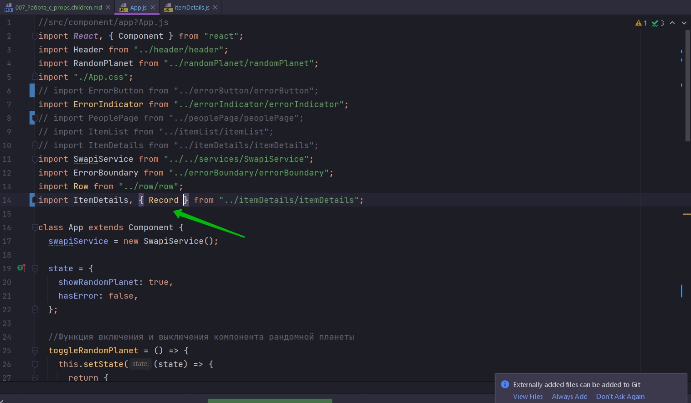

# 007_Работа_с_props.children

Продолжим рефакторинг нашего компонента ItemDetails.

Нам осталось разобраться с тем как менно конфигурировать что будут отображать наши детали item


Ведь сейчас наш компонент работает хорошо только с персонажами. Он отображает Пол, Дату рождения, Цвет глас.

Но эти параметры не имеют ни какого смысла для космических кораблей. И По этому когда мы пытаемся отобразить элемент типа Starship мы не получаем тех данных которые следовало бы здесь отрисовать.


Вот тот самый код который решает что отобразить на пользовательском интерфейсе.

Прямо сейчас мы захардкодили Gender, Birth Year, Eye Color.

И для того что бы сделать поностоящему переиспользуемый компонент, нам нужно вынести эти значения наружу и сделать так что бы наш компонент можно было конфигурировать.

И решить эту задачу можно несколькими способами.

К примеру в компонент ItemDetails мы могли бы передать объект с конфигурацией.

Например этот объект мы бы назвали fields и прередали бы массив, и здесь в каждом элементе массива мы бы описали поле


В каждом элементе массива мы бы описали поле field, и его значение, т.е. как оно отображается в интерфейсе, в label.

И остается только обновить код функции render, так что бы эта функция использовала свойство fields для того что бы выбирать какие именно детали объекта показывать, и отрисовыватьь необходимые значения на пользовательском интерфейсе.


НО ТАКОЙ КОД БУДЕТ НАПИСАН НЕ В ДУХЕ REACT. Ведь React построен вокруг идеии компонентов которые описывают внешний вид нашего приложения.

Могли ли бы мы использовать компоненты для того что бы описать какие детали объекта нам нужно использовать в ItemDetails?

Давайте предположим что мы хотели бы писать вот такой код как я сейчас напишу. А затем мы посмотрим как можно сделать так что бы этот код действительно работал.

Прямо в тело компонента ItemDetails я допишу какой-нибудь компонент, назову его к примеру Record. И в компоненте Record я укажу что я хочу взять поле field которе будет называться gender. И на пользовательском интерфейсе оно будет называться label="Gender"


Воттакая разметка мне нравится намного больше. Мы используем компонент Record для того что бы описать что  именно должно отображаться внутри компонента ItemDetails. И компонент Record находится внутри компонента ItemDetails.

И теперь остался последний вопрос, а как собственно написать наш собственный код для того что бы этот код работал?

Для начало перехожу в ItemDetails и создадим наш компонент Record. А затем экспортируем его так что бы я мог его использовать в компоненте App. Этот компонент будет принимать свойства, те свойства которые нужны для отрисовки. Нам нужно знать название поля которое мы будем использовать, к примеру birthYear. И нам нужен сам объект для того что бы отрисовать компонент.

И так в качаестве свойст деструктурирую поля item - это мас элемент, field - это поле которое мы будем доставать из объекта, label - это то как эта запись будет выглядеть на UI.


Теперь осталось экспортировать Record для того что бы мы погли использовать его в других файлах. И поскольку мы не може иметь два default export. Нам придется экспортировать Record как именной.


```js
import React, { Component } from "react";
import SwapiService from "../../services/SwapiService";
import "./itemDetails.css";
import ErrorButton from "../errorButton/errorButton";

const Record = ({ item, field, label }) => {
  return (
    <li className="list-group-item">
      <span className="term">{label}</span>
      <span>{item[field]}</span>
    </li>
  );
};

export { Record };

class ItemDetails extends Component {
  swapiSerVice = new SwapiService();

  state = {
    item: null,
    image: null,
  };

  componentDidMount() {
    this.updatePerson();
  }

  componentDidUpdate(prevProps, prevState, snapshot) {
    if (this.props.itemId !== prevProps.itemId) {
      this.updatePerson();
    }
  }

  //Функция обновления персонажа
  updatePerson() {
    const { itemId, getData, getImageUrl } = this.props;
    // в самом начале personId может быть null делаю проверку
    if (!itemId) {
      return;
    }
    //Получаю данные
    getData(itemId).then((item) => {
      this.setState({ item, image: getImageUrl(item) });
    });
  }

  render() {
    const { item, image } = this.state;
    if (!item) {
      return <span>Select a person from a list</span>;
    }
    const { id, name, gender, birthYear, eyeColor } = item;

    return (
      <div className="person-details card">
        

        <div className="card-body">
          <h4>{name}</h4>
          <ul className="list-group list-group-flush">
            <li className="list-group-item">
              <span className="term">Gender</span>
              <span>{gender}</span>
            </li>
            <li className="list-group-item">
              <span className="term">Birth Year</span>
              <span>{birthYear}</span>
            </li>
            <li className="list-group-item">
              <span className="term">Eye Color</span>
              <span>{eyeColor}</span>
            </li>
          </ul>
          <ErrorButton />
        </div>
      </div>
    );
  }
}

export default ItemDetails;

```

Теперь в App мы можем импортировать Record



И теперь остается одна не большая проблема. Для того что бы наш Record заработал. Ему нужно знать тот самый объект из которого он будет доставать эти данные.

Но в тот момент гокда мы передает Record в тело ItemDetails у нас нет самого обхекта который мы будет отображать. 

Почему?

Да все очень просто. Сам ItemDetails занимается тем что получает этот объект и затем с ним работает. Т.е. из этого кода


мы не можем получить доступ к нашему item, к тому объекту который мы собираемся отображать.

Означает ли это что наш красивый синтаксис когда мы добавляем записи ввиди компонента Record, он провальный и он не может существовать? Ну конечно же нет!!

Вернемся к нашему коду в Record и временно уберем item для того что бы наш код не ломался. И немного обновим код ItemDetails. И вместо элементов списка li, отрисовываем всех child а именно {this.props.children}.

```js
import React, { Component } from "react";
import SwapiService from "../../services/SwapiService";
import "./itemDetails.css";
import ErrorButton from "../errorButton/errorButton";

const Record = ({ item, field, label }) => {
  return (
    <li className="list-group-item">
      <span className="term">{label}</span>
      <span>{field}</span>
    </li>
  );
};

export { Record };

class ItemDetails extends Component {
  swapiSerVice = new SwapiService();

  state = {
    item: null,
    image: null,
  };

  componentDidMount() {
    this.updatePerson();
  }

  componentDidUpdate(prevProps, prevState, snapshot) {
    if (this.props.itemId !== prevProps.itemId) {
      this.updatePerson();
    }
  }

  //Функция обновления персонажа
  updatePerson() {
    const { itemId, getData, getImageUrl } = this.props;
    // в самом начале personId может быть null делаю проверку
    if (!itemId) {
      return;
    }
    //Получаю данные
    getData(itemId).then((item) => {
      this.setState({ item, image: getImageUrl(item) });
    });
  }

  render() {
    const { item, image } = this.state;
    if (!item) {
      return <span>Select a person from a list</span>;
    }
    const { id, name, gender, birthYear, eyeColor } = item;

    return (
      <div className="person-details card">
        

        <div className="card-body">
          <h4>{name}</h4>
          <ul className="list-group list-group-flush">{this.props.children}</ul>
          <ErrorButton />
        </div>
      </div>
    );
  }
}

export default ItemDetails;

```


Но только мы ошиблись и добавили Gender и Eye Color к космическому персонажу. Ну а ладно.


```js
//src/component/app?App.js
import React, { Component } from "react";
import Header from "../header/header";
import RandomPlanet from "../randomPlanet/randomPlanet";
import "./App.css";
import ErrorIndicator from "../errorIndicator/errorIndicator";
import SwapiService from "../../services/SwapiService";
import ErrorBoundary from "../errorBoundary/errorBoundary";
import Row from "../row/row";
import ItemDetails, { Record } from "../itemDetails/itemDetails";

class App extends Component {
  swapiService = new SwapiService();

  state = {
    showRandomPlanet: true,
    hasError: false,
  };

  //Функция включения и выключения компонента рандомной планеты
  toggleRandomPlanet = () => {
    this.setState((state) => {
      return {
        showRandomPlanet: !state.showRandomPlanet,
      };
    });
  };

  // Обработка ошибок в компонентах
  componentDidCatch(error, errorInfo) {
    console.log("componentDidCatch()");
    this.setState({ hasError: true });
  }

  render() {
    //Если есть ошибка в компонентах
    if (this.state.hasError) {
      return <ErrorIndicator />;
    }

    const planet = this.state.showRandomPlanet ? <RandomPlanet /> : null;

    const { getPerson, getStarship, getPersonImage, getStarshipImage } =
      this.swapiService;

    const personDetails = (
      <ItemDetails itemId={11} getData={getPerson} getImageUrl={getPersonImage}>
        {" "}
        <Record field="gender" label="Gender" />
        <Record field="eyeColor" label="Eye Color" />
      </ItemDetails>
    );
    const starshipDetails = (
      <ItemDetails
        itemId={5}
        getData={getStarship}
        getImageUrl={getStarshipImage}
      />
    );
    return (
      <ErrorBoundary>
        <div className="stardb-app">
          <Header />
          <Row left={personDetails} right={starshipDetails} />
        </div>
      </ErrorBoundary>
    );
  }
}

export default App;

```


Напомню, нам в объект Record нужно получить каким-то способом тот объект с данными персонажа в этом случае.

У нас с вами есть замечательное свойство this.props.children


которое представляет из себя все то что мы передадим в теле компонента


А что если бы мы с вами, перед тем как отрисовывать children, вместо того что бы отрисовывать их просто в таком виде как мы их получили this.props.children, мы бы смогли их сначало немножечко модифицировать.


В React есть специальный API для работы с children. И этот API находится в React.Children. И в этом API есть функция которая называется map. Она похожа на функцию map у массива, только для того что бы эта функция работала ей нужно передать:

1. первым параметром this.props.children.

2. И вторым параметром нужно передать фукцию, которая будет вызваана для каждого child. Ну и конечно в эту функцию React будет передавать каждый child элемент который мы передали в этот ккомпонент.


Для чего нам нужен React.Children.map(), и почему мы не можем использовать стандартный map который определен на массиве?

Все дело в том что this.props.children не обязательно React-элемент. Это может быть строка, функция, число, да все что угодно, это может быть один React компонент или это может быть массив react компонентов.

И функция React.Children.map() делает так что бы вам не нужно было задумываться какого типа child вам сейчас попал. React.Children.map() по аналогии с array.map() пройдется по каждому непосредственному child-у, и при этом обработает для вас все специальные случаи вроде null и undefined. 


```js
import React, { Component } from "react";
import SwapiService from "../../services/SwapiService";
import "./itemDetails.css";
import ErrorButton from "../errorButton/errorButton";

const Record = ({ item, field, label }) => {
  return (
    <li className="list-group-item">
      <span className="term">{label}</span>
      <span>{field}</span>
    </li>
  );
};

export { Record };

class ItemDetails extends Component {
  swapiSerVice = new SwapiService();

  state = {
    item: null,
    image: null,
  };

  componentDidMount() {
    this.updatePerson();
  }

  componentDidUpdate(prevProps, prevState, snapshot) {
    if (this.props.itemId !== prevProps.itemId) {
      this.updatePerson();
    }
  }

  //Функция обновления персонажа
  updatePerson() {
    const { itemId, getData, getImageUrl } = this.props;
    // в самом начале personId может быть null делаю проверку
    if (!itemId) {
      return;
    }
    //Получаю данные
    getData(itemId).then((item) => {
      this.setState({ item, image: getImageUrl(item) });
    });
  }

  render() {
    const { item, image } = this.state;
    if (!item) {
      return <span>Select a person from a list</span>;
    }
    const { id, name, gender, birthYear, eyeColor } = item;

    return (
      <div className="person-details card">
        

        <div className="card-body">
          <h4>{name}</h4>
          <ul className="list-group list-group-flush">
            {React.Children.map(this.props.children, (child) => {
              return child;
            })}
          </ul>
          <ErrorButton />
        </div>
      </div>
    );
  }
}

export default ItemDetails;

```

Мы можем заменить наши child на что-нибудь другое. Мы можем сказать что независимо от того что нам пришло в child, мы просто выведем index этого child в массиве


Т.е. таким способом мы полностью проигнирировали какие child были у этого компонента и вместо каждого child мы вернули listItem у которого будет index этого самого child.

Т.е. наш React компонент совсем не обязательно должен использовать свойства this.prop.children именно в том виде в котором его передали. Мы можем заменять child элементы на все что угодно, на любые другие элементы.

Но нам не нужно заменять child элементы. Единственно что нам нужно в каждый child передать item, тот самый объект, который мы получили с сервера. И этот item присутствует в нешем компоненте.


А как именно в React  можно модефицировать элемент, а вернее создать новый элемент, который точно такой же как редыдущий, но только с одним маленьким измененным свойством мы свами узнаем позднее.

> Работа с props.children
> 
> Компонент может решать как именно использовать props.children
> 
> Функция React.children.map() упрощает обработку props.children
> 
> Child элементы можно заменять, оборачивая их в другие компоненты или скрывать(если вернуть null)

