# 008_Клонирование элементов

Давайте немного вспомним. В прошлом уроке мы с вами научились использовать функцию React.Children.map()

```js
import React, { Component } from "react";
import SwapiService from "../../services/SwapiService";
import "./itemDetails.css";
import ErrorButton from "../errorButton/errorButton";

const Record = ({ item, field, label }) => {
  return (
    <li className="list-group-item">
      <span className="term">{label}</span>
      <span>{field}</span>
    </li>
  );
};

export { Record };

class ItemDetails extends Component {
  swapiSerVice = new SwapiService();

  state = {
    item: null,
    image: null,
  };

  componentDidMount() {
    this.updatePerson();
  }

  componentDidUpdate(prevProps, prevState, snapshot) {
    if (this.props.itemId !== prevProps.itemId) {
      this.updatePerson();
    }
  }

  //Функция обновления персонажа
  updatePerson() {
    const { itemId, getData, getImageUrl } = this.props;
    // в самом начале personId может быть null делаю проверку
    if (!itemId) {
      return;
    }
    //Получаю данные
    getData(itemId).then((item) => {
      this.setState({ item, image: getImageUrl(item) });
    });
  }

  render() {
    const { item, image } = this.state;
    if (!item) {
      return <span>Select a person from a list</span>;
    }
    const { id, name, gender, birthYear, eyeColor } = item;

    return (
      <div className="person-details card">
        

        <div className="card-body">
          <h4>{name}</h4>
          <ul className="list-group list-group-flush">
            {React.Children.map(
              this.props.children,
              (child, indexChildArray) => {
                return <li>{indexChildArray}</li>;
              }
            )}
          </ul>
          <ErrorButton />
        </div>
      </div>
    );
  }
}

export default ItemDetails;

```

React.Children.map() - позволяет проитерироваться по this.props.children, и затем сделать что-нибудь с каждым child-ом. Например вместо child мы можем вернуть абсолютно другой элемент.

И здесь появляется еще одно очень важное свойство React-элементов, всех React-элементов, и react.props.children в частности. REACT ЭЛЕМЕНТЫ НЕЛЬЗЯ ИЗМЕНЯТЬ ПОСЛЕ ТОГО КАК ОНИ БЫЛИ СОЗДАНЫ. Мы должны работать с элементами так как будто они не изменяемы.

Т.е. мы не можем написать child.item = item и расчитывать что этот код будет хорошо работать. ТАК ДЕЛАТЬ НЕЛЬЗЯ!!!!!

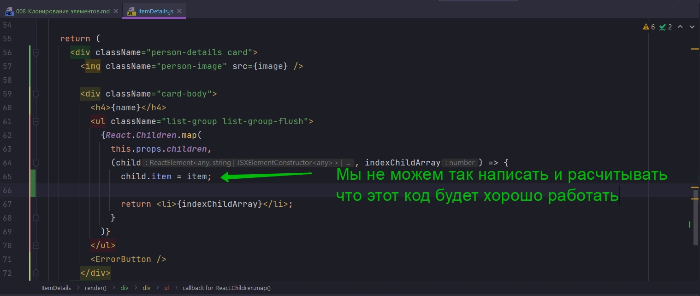

Вместо этого нам нужно создать новый элемент, который точно такой же как старый, только с новыйм свойством которое называется item.

И для этого в React есть еще один полезный метод. И этот метод React.cloneElement(). Он принимает несколько аргументов.

Первый агрумент это тот самый элемент который нам нужно скопировать, и в нашем случае это child

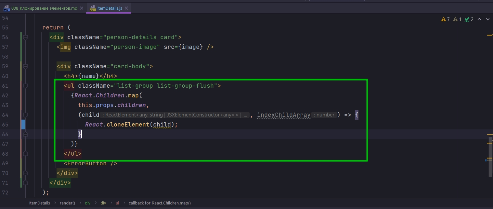

Если мы запустим этот код и ничего не буем менять, мы просто создадим копии child-ов в том виде в котором они есть и отобразим их на нашем UI.

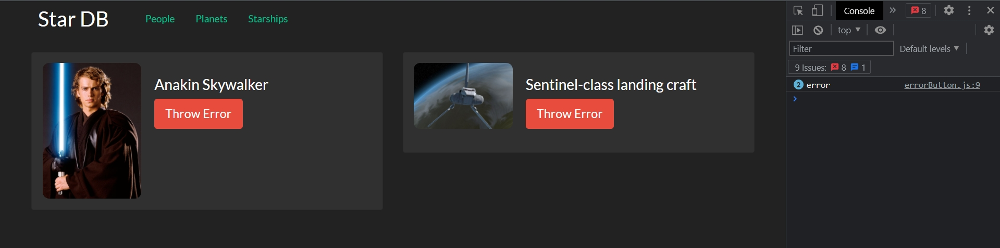

Но если мы передадим второй аргумент, то таким способом мы можем сказать React добавь еще свойств к этому элементу в дополнении к тем которые там уже определены.

Т.е. на child у нас уже определены field и label.

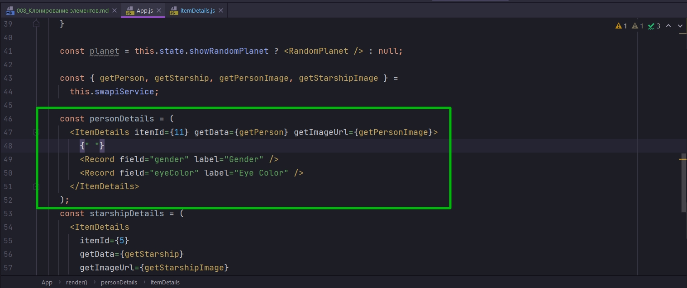

И теперь во второй аргумент React.cloneElement() мы можем передать объект в котором определим дополнительные свойсва. И в нашем случае это объект item.

И ТАК ПОЛ ДНЯ ОТСИДЕЛ КАК ДИБИЛУШКА. ОКАЗЫВАЕТСЯ У МЕНЯ В React.Children.map(item=>{}) В item ПЕРВЫМ ДЕЛОМ ПОПАДАЕТ STRING А ПОТОМ ТОЛЬКО ОБЪЕКТ.

ПО ЭТОМУ СДЕЛАЛ ПРОВЕРКУ.

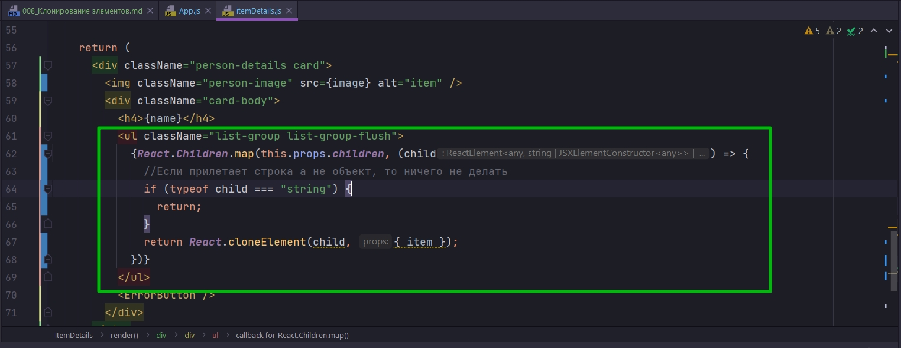

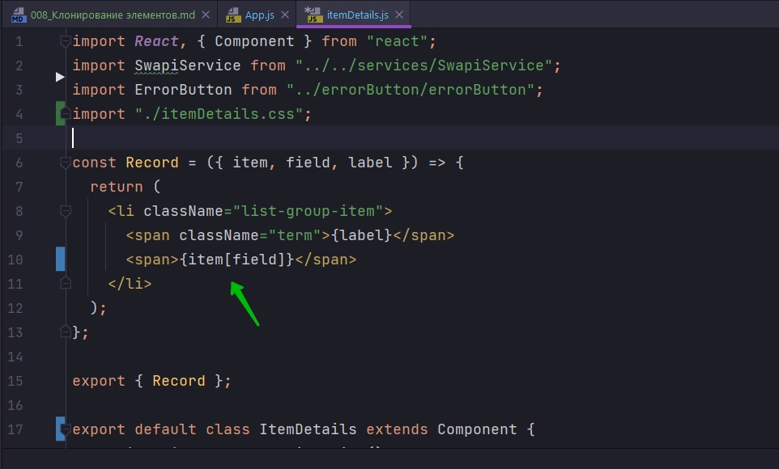

И ЕЩЕ ТАК КАК Я ИСПОЛЬЗУЮ ErrorBoundary то все что связано с  обработкой ошибок в App я удалил.

```js
//src/component/app?App.js
import React, { Component } from "react";
import Header from "../header/header";
import RandomPlanet from "../randomPlanet/randomPlanet";
import "./App.css";
import SwapiService from "../../services/SwapiService";
import ErrorBoundary from "../errorBoundary/errorBoundary";
import Row from "../row/row";
import ItemDetails, { Record } from "../itemDetails/itemDetails";

class App extends Component {
  swapiService = new SwapiService();

  state = {
    showRandomPlanet: true,
  };

  //Функция включения и выключения компонента рандомной планеты
  toggleRandomPlanet = () => {
    this.setState((state) => {
      return {
        showRandomPlanet: !state.showRandomPlanet,
      };
    });
  };

  render() {
    const planet = this.state.showRandomPlanet ? <RandomPlanet /> : null;

    const { getPerson, getStarship, getPersonImage, getStarshipImage } =
      this.swapiService;

    const personDetails = (
      <ItemDetails itemId={11} getData={getPerson} getImageUrl={getPersonImage}>
        {" "}
        <Record field="gender" label="Gender" />
        <Record field="eyeColor" label="Eye Color" />
      </ItemDetails>
    );
    const starshipDetails = (
      <ItemDetails
        itemId={5}
        getData={getStarship}
        getImageUrl={getStarshipImage}
      />
    );
    return (
      <ErrorBoundary>
        <div className="stardb-app">
          <Header />
          <Row left={personDetails} right={starshipDetails} />
        </div>
      </ErrorBoundary>
    );
  }
}

export default App;

```

Таким способом на основании child элементов которые мы получаем в нашем компоненте мы создаем новое с дополнительным свойством item. И теперь мы можем использовать item внутри нашего Record

```js
import React, { Component } from "react";
import SwapiService from "../../services/SwapiService";
import ErrorButton from "../errorButton/errorButton";
import "./itemDetails.css";
import { type } from "@testing-library/user-event/dist/type";

const Record = ({ item, field, label }) => {
  return (
    <li className="list-group-item">
      <span className="term">{label}</span>
      <span>{item[field]}</span>
    </li>
  );
};

export { Record };

export default class ItemDetails extends Component {
  swapiSerVice = new SwapiService();

  state = {
    item: null,
    image: null,
  };

  componentDidMount() {
    this.updatePerson();
  }

  componentDidUpdate(prevProps, prevState, snapshot) {
    if (this.props.itemId !== prevProps.itemId) {
      this.updatePerson();
    }
  }

  //Функция обновления персонажа
  updatePerson() {
    const { itemId, getData, getImageUrl } = this.props;
    // в самом начале personId может быть null делаю проверку
    if (!itemId) {
      return;
    }
    //Получаю данные
    getData(itemId).then((item) => {
      this.setState({ item, image: getImageUrl(item) });
    });
  }

  render() {
    const { item, image } = this.state;
    if (!item) {
      return <span>Select a person from a list</span>;
    }
    const { id, name, gender, birthYear, eyeColor } = item;

    return (
      <div className="person-details card">
        
        <div className="card-body">
          <h4>{name}</h4>
          <ul className="list-group list-group-flush">
            {React.Children.map(this.props.children, (child) => {
              //Если прилетает строка а не объект, то ничего не делать
              if (typeof child === "string") {
                return;
              }
              return React.cloneElement(child, { item });
            })}
          </ul>
          <ErrorButton />
        </div>
      </div>
    );
  }
}

```

Еще раз рассмотрим как работает этот код!!!

Для того что бы реализовать вот такой вот синтаксис

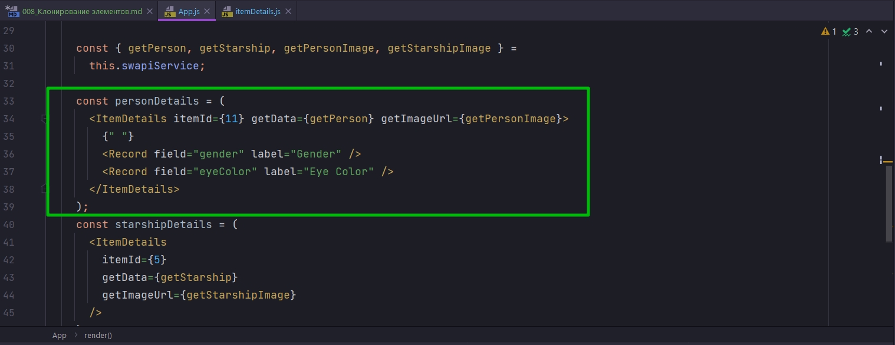

Мы создали дополнительный компонент Record. Для того что бы работать компоненту Record ему необходимо три поля field, label и item. Но к сожаления в этм коде что на скрине мы не можем передать item поскольку тот объект который мы получаем с сервера создается внутри ItemDetails.

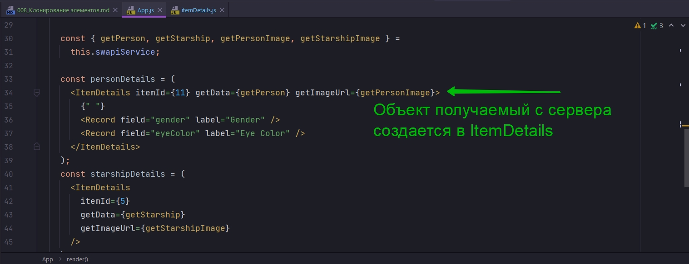

По этому наш внешний код ничего не знает о том как создается этот объект, пришедший с сервера. 

И для того что бы все же передать этот объект в наши child элементы мы использовали одно замечательное свойство. То что наш компонент не обязательно должен использовать свои child  в том виде в котором они переданы.

Мы прошлись по каждому child используя React.Children.map(), и для каждого child, которые я указываю в первом параметре функции this.props.child, мы создали его копию с React.cloneElement(), и заменили child на его копию, первым параметром в React.cloneElement() указываю  то что я копирую а именно child, а вторым параметром я добавляю каждой копии child свойство item.

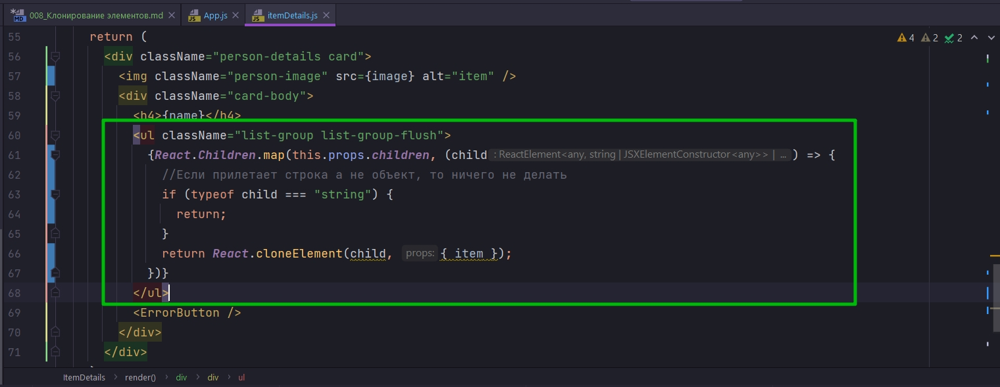

И вот именно таким способом в тот момент когда наш элемент Record будет отрисовываться, когда он будет рендериться, у него уже будет установлено свойство item.

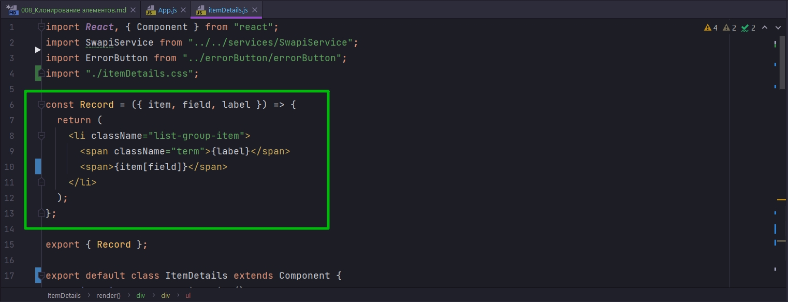

Такой паттерн, для работы с child-элементами, часто встречается в React когда вам нужно работать с группой взаимосвязанных элементов.

К примеру если вы разрабатываете компонент где есть группа кнопок которые взаимоисключающие так что только одна кнопка может активна, в какой-нибудь конкретный момент времени, то вот таким способом мы можем добавить дополнительные eventListener-ы на эти самые кнопки и делать так что бы эти кнопки переключались.

Таким же способом к примеру мы бы могли реализовать фильтр. Если к примеру вот здесь

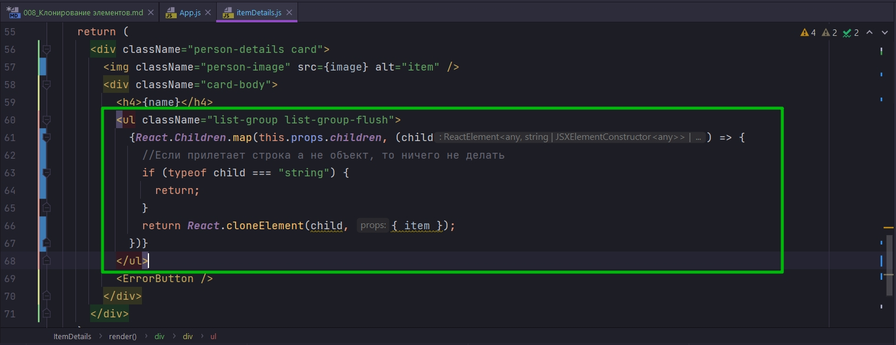

в функци React.Children.map() мы вернем undefined, то это значение просто не отрисуется внутри JSX.

И по какому-нибудь критерию мы могли бы с вами выбрать какие именно child элементы нам нужно отрендерить.


Теперь делаю так что бы Starship тоже отображал правильную информацию.

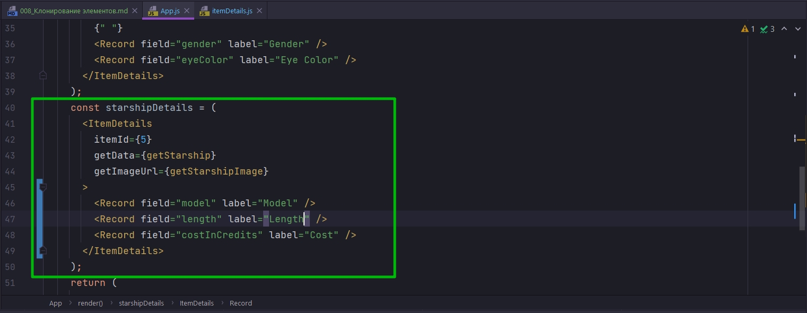

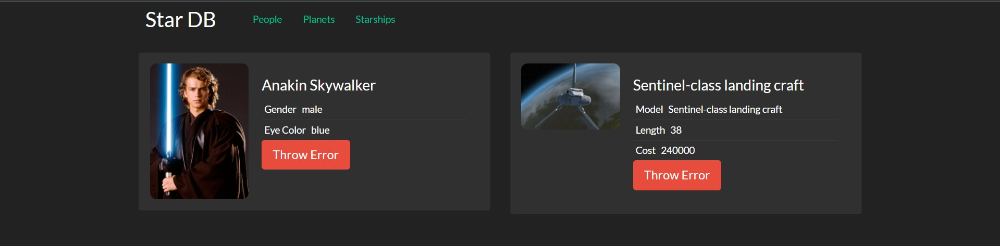

И теперь после того как мы с вами провели вот такой вот интересный рефакторинг мы готовы к том что бы не копируя код создать три разных страницы. Одна которая будет отображать персонажей, вторая для космических кораблей, ну и третья для планет.

> Клонирование элементов
> 
> React элементы нельзя изменять(они считаются immutable)
> 
> ...но можно создавать модифицированные копии при помощи React.cloneElement()
> 
> К примеру, элементам можно добавлять новые свойства
