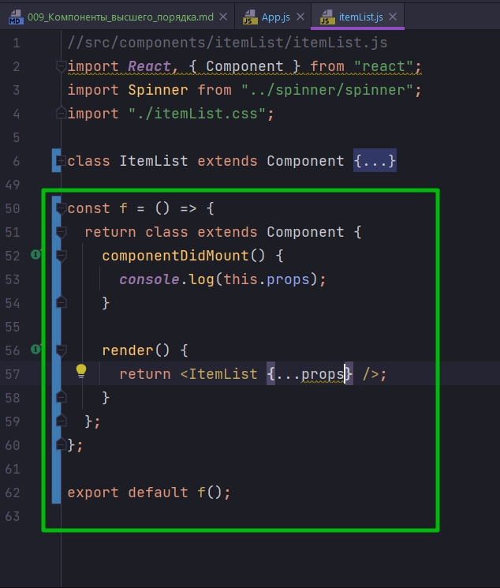
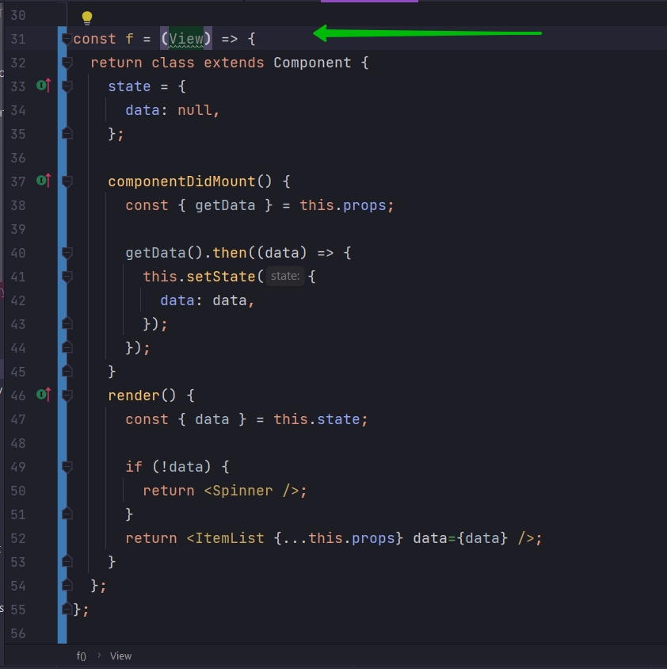

# 009_Компоненты_высшего_порядка

Когда большинство уроков этого курса быди уже опубликованы один из студентов гляда на вот такой код задал вполне закономерный вопрос


А можно ли написать его лучше.

Давайте вспомнои что это за код и что это за компонент.

Это компонент ItemList который сделан для того что бы отображать на странице списки элементов.


И так мутарно, снова ошибки и тому подобное. Т.е. он начал показывать этот элемент на странице. Пришлось немногопеределать компонент


```js
//src/component/app?App.js
import React, { Component } from "react";
import Header from "../header/header";
import RandomPlanet from "../randomPlanet/randomPlanet";
import "./App.css";
import SwapiService from "../../services/SwapiService";
import ErrorBoundary from "../errorBoundary/errorBoundary";
import Row from "../row/row";
import ItemDetails, { Record } from "../itemDetails/itemDetails";
import ItemList from "../itemList/itemList";

class App extends Component {
  swapiService = new SwapiService();

  state = {
    showRandomPlanet: true,
  };

  //Функция включения и выключения компонента рандомной планеты
  toggleRandomPlanet = () => {
    this.setState((state) => {
      return {
        showRandomPlanet: !state.showRandomPlanet,
      };
    });
  };

  render() {
    const planet = this.state.showRandomPlanet ? <RandomPlanet /> : null;

    const {
      getPerson,
      getStarship,
      getPersonImage,
      getStarshipImage,
      getAllPeople,
      getAllStarShips,
    } = this.swapiService;

    const personDetails = (
      <ItemDetails itemId={11} getData={getPerson} getImageUrl={getPersonImage}>
        {" "}
        <Record field="gender" label="Gender" />
        <Record field="eyeColor" label="Eye Color" />
      </ItemDetails>
    );
    const starshipDetails = (
      <ItemDetails
        itemId={5}
        getData={getStarship}
        getImageUrl={getStarshipImage}
      >
        <Record field="model" label="Model" />
        <Record field="length" label="Length" />
        <Record field="costInCredits" label="Cost" />
      </ItemDetails>
    );
    const peopleList = (
      <ItemList getData={getAllPeople} onItemSelected={() => {}}>
        {({ name }) => <span>{name}</span>}
      </ItemList>
    );

    const startShipList = (
      <ItemList getData={getAllStarShips} onItemSelected={() => {}}>
        {({ name }) => <span>{name}</span>}
      </ItemList>
    );
    return (
      <ErrorBoundary>
        <div className="stardb-app">
          <Header />
          <Row left={peopleList} right={personDetails} />
          <Row left={startShipList} right={starshipDetails} />
        </div>
      </ErrorBoundary>
    );
  }
}

export default App;

```


ItemList наш тепичный сетевой компонент.

```js
//src/components/itemList/itemList.js
import React, { Component } from "react";
import Spinner from "../spinner/spinner";
import "./itemList.css";

class ItemList extends Component {
  state = {
    itemList: null,
  };

  componentDidMount() {
    const { getData } = this.props;

    getData().then((itemList) => {
      this.setState({
        itemList: itemList,
      });
    });
  }

  renderItems(arr) {
    return arr.map((item) => {
      const { id } = item; // деструктурирую из полученного объекта id
      const label = this.props.children(item); // сюда попадает name из пропсов
      return (
        <li
          className="list-group-item"
          key={id}
          onClick={() => this.props.onItemSelected(id)}
        >
          {label}
        </li>
      );
    });
  }

  render() {
    const { itemList } = this.state;

    if (!itemList) {
      return <Spinner />;
    }

    const items = this.renderItems(itemList);

    return <ul className="item-list list-group">{items}</ul>;
  }
}

export default ItemList;

```

Как у любого сетевого компонента его работа состоит из нескольких фаз.

Сначало в componentDidMount мы получаем данные, мы отправляем запрос на данные, затем когда данные приходят мы обновляем state 


А в render мы проверяем если есть данные, то мы их тображаем, если же нет то мы отображаем Spinner.


И так вопрос. Если вам нужно создать новый сетевой компонент, не ужели вам придется скопировать весь этот код. Код который отправляет запрос, который проверяет результат запроса, обновляет state, отображает Spinner, отображает ошибку и т.д. Когда единственное что в действительности изменяется это два аспекта: это тот запрос который вы делаете, и то как вы отображаете результат на экране.

Для того что бы сдлать этот код лучше мы с вами посмотрим на паттерн HOC([Higher-Order Components](https://reactjs.org/docs/higher-order-components.html)) 

Еще раз повторим какая у нас цель. Наша цель сделать так что бы вот эти аспекты компонента 


Те аспекты которые отвечают за сетевой код. За получение данных. За отображение Spinner или ошибки, мы могли их вынести в какую-нибудь отдельную конструкцию и затем переиспользовать с другими компонентами, так что бы этот код не пришлось копировать.

Остаюсь в ItemList и начну писать код ниже нашего класса.

1. И так первое что нужно знать для того что бы реализовать Higher-Order Components это то что в JS функция может возвращать другую функцию.


Теперь переходим на новый уровень. В JS вместо того что бы возвращать функцию мы можем вернуть class. Потому что class работает на том же механизме что и функции, по сути класс это и есть функция.


Функция возвращает класс и вызывает его перед экспортом. По сути ничего не изменилось и наше приложение работает.


А теперь сделаем еще одну небольшую трансформацию. В JS точно так же как мы можем делать функции у которых нет имени, мы можем создавать без имянные классы.


И вот таким вот способом мы вернем новый класс у которого нет имени, но у которого есть какое-то пустое тело. И этот класс конечно же может наследовать Component.


Теперь мы вообще не используем ItemList. Вместо него мы возвращаем вот такой анонимный компонент у которого есть один параграф.


Теперь сделаем еще один эксперемент. Поскольку наш внутренний анонимный класс это компонент, мы можем в него передать componentDidMount(){}, ну или другую любую функцию жизненного цикла компонента.


```js
//src/components/itemList/itemList.js
import React, { Component } from "react";
import Spinner from "../spinner/spinner";
import "./itemList.css";

class ItemList extends Component {
  state = {
    itemList: null,
  };

  componentDidMount() {
    const { getData } = this.props;

    getData().then((itemList) => {
      this.setState({
        itemList: itemList,
      });
    });
  }

  renderItems(arr) {
    return arr.map((item) => {
      const { id } = item; // деструктурирую из полученного объекта id
      const label = this.props.children(item); // Прокидываю объект в App, в теле компонента ItemList обрабатываю функцией и достаю интересующие меня значения
      return (
        <li
          className="list-group-item"
          key={id}
          onClick={() => this.props.onItemSelected(id)}
        >
          {label}
        </li>
      );
    });
  }

  render() {
    const { itemList } = this.state;

    if (!itemList) {
      return <Spinner />;
    }

    const items = this.renderItems(itemList);

    return <ul className="item-list list-group">{items}</ul>;
  }
}

const f = () => {
  return class extends Component {
    componentDidMount() {
      console.log(this.props);
    }

    render() {
      return <h1>Hi</h1>;
    }
  };
};

export default f();

```


и совершенно не удивительно что те свойства которые получает компонент это те самые свойства, которые наше приложение передает в ItemList


В ItemList мы передаем функцию getData которую мы затем можем использовать для того что бы получить наши данные. И мы передаем eventListener onItemSelected. А в теле мы передаем render функцию которая решает как именно будут отрисовываться элементы этого списка {({ name }) => <span>{name}</span>}. В этом случае мы получаем элемент, деструктурируем из него имя и отрисовываем его на экране.


Но теперь когда мы подменили наш настоящий ItemList наш  маленький анонимный класс - этот класс получает все теже свойства, что должен был бы получить Item list. 

И теперь, что совершенно логично, в нашей render функции мы можем вернуть ItemList, и передать в него все те же свойства которые мы получили {...props}



Таким образом мы получили пустую обертку, которая не делает вообще ничего.

Я уберу componentDidMount


Мы получаем свойства, и в том виде в котором мы их получили передаем в ItemList


Мы создали пустой компонент обертку который вызывает наш основной компонент и передает ему все те же свойства, которые он получил сам.


Замечательно!!! А теперь ключевой шаг. В этот компонент обертку мы вынесем все части логики которые были в оригинальном компоненте, всю логику работы с сетью и всю логику выбора того что именно отображать: Spinner, Загрузку, Ошибку.


```js
//src/components/itemList/itemList.js
import React, { Component } from "react";
import Spinner from "../spinner/spinner";
import "./itemList.css";

class ItemList extends Component {
  renderItems(arr) {
    return arr.map((item) => {
      const { id } = item; // деструктурирую из полученного объекта id
      const label = this.props.children(item); // Прокидываю объект в App, в теле компонента ItemList обрабатываю функцией и достаю интересующие меня значения
      return (
        <li
          className="list-group-item"
          key={id}
          onClick={() => this.props.onItemSelected(id)}
        >
          {label}
        </li>
      );
    });
  }

  render() {
    const items = this.renderItems(itemList);

    return <ul className="item-list list-group">{items}</ul>;
  }
}

const f = () => {
  return class extends Component {
    state = {
      itemList: null,
    };

    componentDidMount() {
      const { getData } = this.props;

      getData().then((itemList) => {
        this.setState({
          itemList: itemList,
        });
      });
    }
    render() {
      const { itemList } = this.state;

      if (!itemList) {
        return <Spinner />;
      }
      return <ItemList {...this.props} />;
    }
  };
};

export default f();

```

Теперь у нас есть одна проблема. Раньше ItemList получал всю логигу из state, но теперь у него нет state. Теперь данные ему ноужно получить из props.


И теперь в нашем компоненте обертке в тег ItemList передаю объект data={data}


```js
//src/components/itemList/itemList.js
import React, { Component } from "react";
import Spinner from "../spinner/spinner";
import "./itemList.css";

class ItemList extends Component {
  renderItems(arr) {
    return arr.map((item) => {
      const { id } = item; // деструктурирую из полученного объекта id
      const label = this.props.children(item); // Прокидываю объект в App, в теле компонента ItemList обрабатываю функцией и достаю интересующие меня значения
      return (
        <li
          className="list-group-item"
          key={id}
          onClick={() => this.props.onItemSelected(id)}
        >
          {label}
        </li>
      );
    });
  }

  render() {
    const { data } = this.props;
    const items = this.renderItems(data);

    return <ul className="item-list list-group">{items}</ul>;
  }
}

const f = () => {
  return class extends Component {
    state = {
      data: null,
    };

    componentDidMount() {
      const { getData } = this.props;

      getData().then((data) => {
        this.setState({
          data: data,
        });
      });
    }
    render() {
      const { data } = this.state;

      if (!data) {
        return <Spinner />;
      }
      return <ItemList {...this.props} data={data} />;
    }
  };
};

export default f();

```

Мы только что добились очень многого. Мы вынесли весть state, всю логику работы с сетью, и всю логику того какой компонент сейчас нужно отобразжать в отдельный компонент который теперь не зависит от ItemList.

Единственная зависимость которая у нас осталась это то что в функции render мы вызываем ItemList. 

Это очень просто исправить, поскольку мы используем функцию. Назову аргумент View.



И этот в этот самый аргумент мы сможем передать любой компонент который мы захотим использовать.


Переименую нашу функцию высшего порядка в withData. Т.е. мы оборачиваем компонент и даем ему данные.

```js
//src/components/itemList/itemList.js
import React, { Component } from "react";
import Spinner from "../spinner/spinner";
import "./itemList.css";

class ItemList extends Component {
  renderItems(arr) {
    return arr.map((item) => {
      const { id } = item; // деструктурирую из полученного объекта id
      const label = this.props.children(item); // Прокидываю объект в App, в теле компонента ItemList обрабатываю функцией и достаю интересующие меня значения
      return (
        <li
          className="list-group-item"
          key={id}
          onClick={() => this.props.onItemSelected(id)}
        >
          {label}
        </li>
      );
    });
  }

  render() {
    const { data } = this.props;
    const items = this.renderItems(data);

    return <ul className="item-list list-group">{items}</ul>;
  }
}

const withData = (View) => {
  return class extends Component {
    state = {
      data: null,
    };

    componentDidMount() {
      const { getData } = this.props;

      getData().then((data) => {
        this.setState({
          data: data,
        });
      });
    }
    render() {
      const { data } = this.state;

      if (!data) {
        return <Spinner />;
      }
      return <View {...this.props} data={data} />;
    }
  };
};

export default withData(ItemList);

```

И таким вот способом мы разделили ItemList не две части.

Она часть отвечает исключительно за отрисовку ItemList.

А вторая часть которая отвечает за логику работы с сетью находится в анонимном компоненте


А зачем же нам нужна была функция?? Все очень просто. Мы создали эту функцию для того что бы мы могли кастомизировать, для того что бы мы могли выбирать какой именно компонент будет заниматься отображением данных.

Теперь мы можем сделать еще один шаг. Поскольку ItemList не содержит состояния, мы можем сделать из него компонент функцию.


И следующим шагом давайте немного улучшим функцию withData прямо в эту функцию мы будем передавать другую функцию getData, так что бы она передавалась не в свойствах а ввиде явного аргумента.


ну и конечно теперь когда мы конструируем компоненты таким способом


Нам нужно будет явно передать getData


```js
//src/components/itemList/itemList.js
import React, { Component } from "react";
import Spinner from "../spinner/spinner";
import "./itemList.css";
import SwapiService from "../../services/SwapiService";

const ItemList = (props) => {
  const { data, onItemSelected, children: renderLabel } = props;
  const items = data.map((item) => {
    const { id } = item; // деструктурирую из полученного объекта id
    const label = renderLabel(item); // Прокидываю объект в App, в теле компонента ItemList обрабатываю функцией и достаю интересующие меня значения
    return (
      <li
        className="list-group-item"
        key={id}
        onClick={() => onItemSelected(id)}
      >
        {label}
      </li>
    );
  });

  return <ul className="item-list list-group">{items}</ul>;
};

const withData = (View, getData) => {
  return class extends Component {
    state = {
      data: null,
    };

    componentDidMount() {
      getData().then((data) => {
        this.setState({
          data: data,
        });
      });
    }
    render() {
      const { data } = this.state;

      if (!data) {
        return <Spinner />;
      }
      return <View {...this.props} data={data} />;
    }
  };
};

const { getAllPeople } = new SwapiService();

export default withData(ItemList, getAllPeople);

```


наш код работате точно так же как и раньше, но теперь он разбит на две части.

И теперь поскольку та часть которая отвечает за логику совершенно ни как не привязана к тому компоненту который будет отображать наши полученные данные. Мы можем вынесту функцию withData в отдельный файл и переиспользовать ее везде где нам нужно будет создать такой же сетевой компонент.

В корне проекта создаю папку hoc-helpers. Создаю файл withData

```js
//src/hoc-helpers/withDataHOC.js
import React, { Component } from "react";
import Spinner from "../components/spinner/spinner";
import ErrorIndicator from "../components/errorIndicator/errorIndicator";

const withData = (View, getData) => {
  return class extends Component {
    state = {
      data: null,
    };

    componentDidMount() {
      getData().then((data) => {
        this.setState({
          data: data,
        });
      });
    }
    render() {
      const { data } = this.state;

      if (!data) {
        return <Spinner />;
      }
      return <View {...this.props} data={data} />;
    }
  };
};

export default withData;

```

```js
//src/hoc-helpers/index.js

import withData from "./withDataHOC";

export { withData };

```

```js
//src/components/itemList/itemList.js
import React from "react";
import "./itemList.css";
import { withData } from "../../hoc-helpers/index";
import SwapiService from "../../services/SwapiService";

const ItemList = (props) => {
  const { data, onItemSelected, children: renderLabel } = props;
  const items = data.map((item) => {
    const { id } = item; // деструктурирую из полученного объекта id
    const label = renderLabel(item); // Прокидываю объект в App, в теле компонента ItemList обрабатываю функцией и достаю интересующие меня значения
    return (
      <li
        className="list-group-item"
        key={id}
        onClick={() => onItemSelected(id)}
      >
        {label}
      </li>
    );
  });

  return <ul className="item-list list-group">{items}</ul>;
};

//Экспортирую функцию получения людей из сервиса 
const { getAllPeople } = new SwapiService();

// Передаю компонент и функцию получения данных в функция высшего порядка
export default withData(ItemList, getAllPeople);

```

Если смотреть на функцию высшего порядка


Теперь в View я могу передать совершенно любой компонент. Ну и конечно вместо getData мы можем подставить совершенно любую функцию которая получает данные. Это вся сути паттерна HOC.

Кстати компонент с ошибкой нужно добавить. и он это сделает за кадром.

Точно такой же подход можно использовать не только с данными, но и с любыми другими аспектами приложения которые будет полезно вынести наружу, которое будет полезно отделить от основного компонента и затем переиспользовать не переписывая при этом код.

> Компоненты высшего порядка
> 
> const hoc=(Wrapped)=>{
> return class extends Component{
> render(){
> return <Wrapped {...this.props}/>}}}
> 
> const MyWrappedComponent = hoc(InnerComponent);
> 
> Функция которая создает компоненты и оборачивает существующие