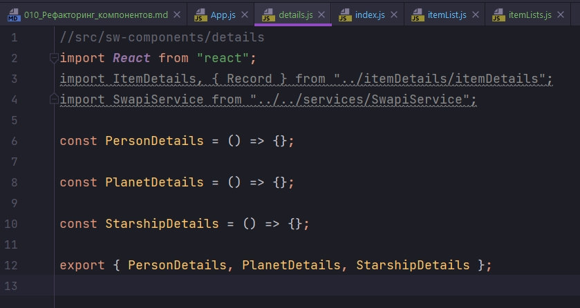
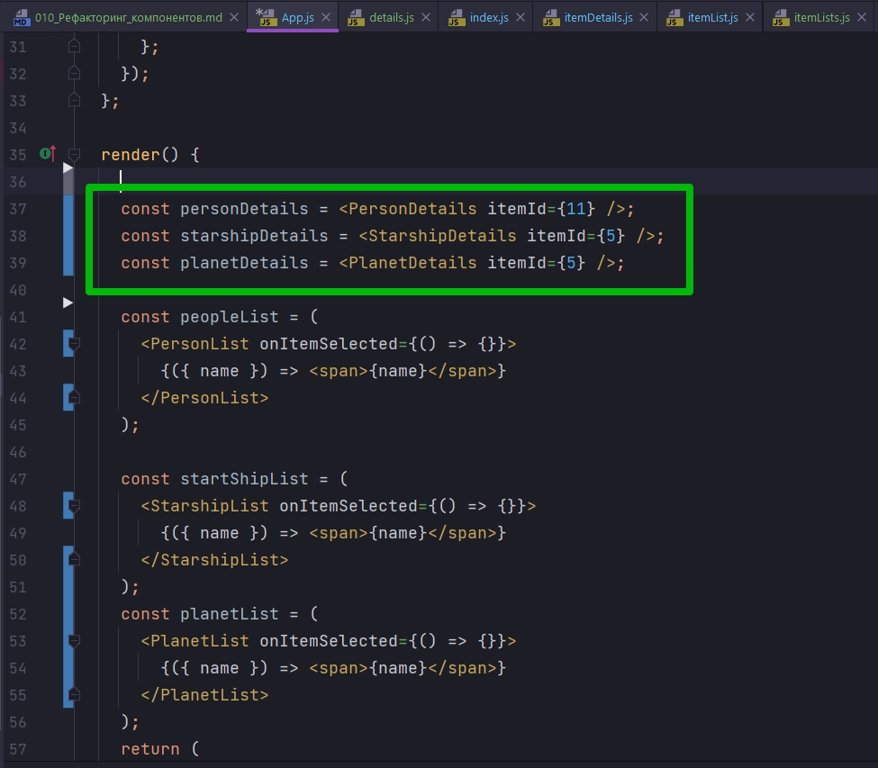

# 010_Рефакторинг_компонентов

Вы наверняка видили в хорошем JS коде если есть какое-нибудь сложное выражение автор часто сохраняет его в отдельную константу ради того что бы код читался легче. К примеру если у меня есть выражение width * height * length - это выражение можно созранить в константе const volume = width * height * length.

Он говорит про ItemList который находится в разметке компонента App. Но у меня данная разметка уже вынесена в отдельные константы.


```js
//src/component/app?App.js
import React, { Component } from "react";
import Header from "../header/header";
import RandomPlanet from "../randomPlanet/randomPlanet";
import "./App.css";
import SwapiService from "../../services/SwapiService";
import ErrorBoundary from "../errorBoundary/errorBoundary";
import Row from "../row/row";
import ItemDetails, { Record } from "../itemDetails/itemDetails";
import ItemList from "../itemList/itemList";

class App extends Component {
  swapiService = new SwapiService();

  state = {
    showRandomPlanet: true,
  };

  //Функция включения и выключения компонента рандомной планеты
  toggleRandomPlanet = () => {
    this.setState((state) => {
      return {
        showRandomPlanet: !state.showRandomPlanet,
      };
    });
  };

  render() {
    const planet = this.state.showRandomPlanet ? <RandomPlanet /> : null;

    const {
      getPerson,
      getStarship,
      getPersonImage,
      getStarshipImage,
      getAllPeople,
      getAllStarShips,
    } = this.swapiService;

    const personDetails = (
      <ItemDetails itemId={11} getData={getPerson} getImageUrl={getPersonImage}>
        {" "}
        <Record field="gender" label="Gender" />
        <Record field="eyeColor" label="Eye Color" />
      </ItemDetails>
    );
    const starshipDetails = (
      <ItemDetails
        itemId={5}
        getData={getStarship}
        getImageUrl={getStarshipImage}
      >
        <Record field="model" label="Model" />
        <Record field="length" label="Length" />
        <Record field="costInCredits" label="Cost" />
      </ItemDetails>
    );
    const peopleList = (
      <ItemList getData={getAllPeople} onItemSelected={() => {}}>
        {({ name }) => <span>{name}</span>}
      </ItemList>
    );

    const startShipList = (
      <ItemList getData={getAllStarShips} onItemSelected={() => {}}>
        {({ name }) => <span>{name}</span>}
      </ItemList>
    );
    return (
      <ErrorBoundary>
        <div className="stardb-app">
          <Header />
          <Row left={peopleList} right={personDetails} />
          <Row left={startShipList} right={starshipDetails} />
        </div>
      </ErrorBoundary>
    );
  }
}

export default App;

```

С компонентом ItemList  не все так плохо. Хуже с ItemDetails. 


Это большие блоки кода которые отображают переменные personDetails starshipDetails. Из-за особенностей компонента ItemDetails, для того что бы его правильно сконфигурировать нам нужно передать столько разных конфигурационных параметров.

И если где-нибудь в другом месте приложения нам захочется вывести starshipDetails, мне совершенно не хотелось бы брать и копировать весь этот блок для того что бы вставить его в новое место.


Т.е. не мешало бы весь этот код в переменных вынести в компоненты более высокого уровня которые внутри себя скрывают все детали конфигурации.

Для начало я создам папку sw-components. И здесь я буду хранить те самые компоненты которые создам. itemLists - в этом файле мы создадим компоненты для списков персонажей, космических кораблей, и списка планет. details - в котором мы создадим компоненты для деталей персонажа, коробля, планеты.

И так начну с того что набросаю структуру для этих файлов.

```js
//src/sw-components/itemList

const PersonList = () => {};

const PlanetList = () => {};

const StarshipList = () => {};

export { PersonList, PlanetList, StarshipList };

```

Точно так же мы поступим с файлом details.

```js
//src/sw-components/details

const PersonDetails = () => {};

const PlanetDetails = () => {};

const StarshipDetails = () => {};

export { PersonDetails, PlanetDetails, StarshipDetails };

```

И начнем реализовывать наш компоненты с ItemList. Импортирую все необходимые зависимости

```js

//src/sw-components/itemList
import React from "react";
import ItemList from "../itemList/itemList";
import { withData } from "../hoc-helpers";
import SwapiService from "../../services/SwapiService";

const PersonList = () => {};

const PlanetList = () => {};

const StarshipList = () => {};

export { PersonList, PlanetList, StarshipList };

```

Теперь создам экземпляр класса swapiService для того что бы использовать функции которые получают данные для наших функций

```js
//src/sw-components/itemList
import React from "react";
import ItemList from "../itemList/itemList";
import { withData } from "../hoc-helpers";
import SwapiService from "../../services/SwapiService";

// инициализирую класс
const swapiService = new SwapiService();

// Деструктурирую нужные мне функции
const { getAllPeople, getAllPlanets, getStarship } = swapiService;

const PersonList = () => {};

const PlanetList = () => {};

const StarshipList = () => {};

export { PersonList, PlanetList, StarshipList };

```

Кроме того нам нужно немного обновить компонент ItemList.

В прошлом видео, когда мы показывали как работают компоненты высшего порядка, мы использовали функцию withData прямо в файле ItemList. Таким образом мы намертво связали ItemList c getAllPeople. Пока что у нас все списки элементов возвращают исключительно людей. Но это совсем не то чего мы хотим.


И просто export default ItemList.

```js
//src/components/itemList/itemList.js
import React from "react";
import "./itemList.css";

const ItemList = (props) => {
    const { data, onItemSelected, children: renderLabel } = props;
    const items = data.map((item) => {
        const { id } = item; // деструктурирую из полученного объекта id
        const label = renderLabel(item); // Прокидываю объект в App, в теле компонента ItemList обрабатываю функцией и достаю интересующие меня значения
        return (
            <li
                className="list-group-item"
                key={id}
                onClick={() => onItemSelected(id)}
            >
                {label}
            </li>
        );
    });

    return <ul className="item-list list-group">{items}</ul>;
};

export default ItemList;

```

Возвращаемся к ItemLists. И теперь создать вот эти компоненты будет совсем не сложно.


Помните у нас есть функция withData - это компонент-функция высшего порядка который создает компоненты. А мы как раз и хотим это сделать.

И теперь мы скажем что PersonList это withData, в которую первым параметром передаю компонент который я хочу создать ItemList, а вторым параметром передаю функцию которую я буду использовать для создания этого компонента getAllPeople.


```js
//src/sw-components/itemList
import React from "react";
import ItemList from "../itemList/itemList";
import { withData } from "../hoc-helpers";
import SwapiService from "../../services/SwapiService";

// инициализирую класс
const swapiService = new SwapiService();

// Деструктурирую нужные мне функции
const { getAllPeople, getAllPlanets, getStarship } = swapiService;

const PersonList = withData(ItemList, getAllPeople);

const PlanetList = withData(ItemList, getAllPlanets);

const StarshipList = withData(ItemList, getStarship);

export { PersonList, PlanetList, StarshipList };

```

Теперь PersonList, PlanetList, StarshipList это переменные получающие обработанное значение от компонента высшего порядка, который сделал запрос на сервер и получил нужные нам данные. код компонента высшего порядка

```js
//src/hoc-helpers/withDataHOC.js
import React, { Component } from "react";
import Spinner from "../spinner/spinner";
import ErrorIndicator from "../errorIndicator/errorIndicator";

const withData = (View, getData) => {
  return class extends Component {
    state = {
      data: null,
    };

    componentDidMount() {
      getData().then((data) => {
        this.setState({
          data: data,
        });
      });
    }
    render() {
      const { data } = this.state;

      if (!data) {
        return <Spinner />;
      }
      return <View {...this.props} data={data} />;
    }
  };
};

export default withData;

```

Вот такой простой рефакторинг который создаст для нас три компонента, которые уже заранее сконфигурированы работать с определенным набором данных.

И теперь легкий рефакторинг в App.

ItemList заменяю на соответствующий компонент и в параметрах убираю getData так как getData теперь передается в самом PersonList.


Теперь повторю тот же трюк только для компонентов с деталями.


И снова я начну с того что импортирую все необходимые зависимости.



Нам понадобится ItemDetails потому что на основании этого компонента ItemDetails мы будем строить наши компоненты PersonDetails, PlanetDetails, StarshipDetails.

Нам понадобится Record - это как бы подкомпонент ItemDetails для того что бы сконфигурировать какие именно детали будет отображать ItemDetails.

Конечно для того что бы работать нам потребуется деструктурировать, достать из SwapiService необходимые функции для работы с данными.

```js
//src/sw-components/details
import React from "react";
import ItemDetails, { Record } from "../itemDetails/itemDetails";
import SwapiService from "../../services/SwapiService";

const swapiService = new SwapiService();

const {
  getPerson,
  getPlanet,
  getStarship,
  getPlanetImage,
  getPersonImage,
  getStarshipImage,
} = swapiService;

const PersonDetails = () => {};

const PlanetDetails = () => {};

const StarshipDetails = () => {};

export { PersonDetails, PlanetDetails, StarshipDetails };

```

Теперь когда у нас есть все нужные функции мы можем переходить к определению компонентов. И здесь у нас ситуация несколько иная чем со списками. Ведь когда мы работали со списками у нас был элегантный компонент высшего порядка withData - это функция которая создавала для нас компоненты. Но для details у нас нет такой функции и пока что ItemDetails у нас отвечает и за рендеринг, и за получения данных и за отображения ошибок.

```js
import React, { Component } from "react";
import SwapiService from "../../services/SwapiService";
import ErrorButton from "../errorButton/errorButton";
import "./itemDetails.css";

const Record = ({ item, field, label }) => {
    return (
        <li className="list-group-item">
            <span className="term">{label}</span>
            <span>{item[field]}</span>
        </li>
    );
};

export { Record };

export default class ItemDetails extends Component {
    swapiSerVice = new SwapiService();

    state = {
        item: null,
        image: null,
    };

    componentDidMount() {
        this.updatePerson();
    }

    componentDidUpdate(prevProps, prevState, snapshot) {
        if (this.props.itemId !== prevProps.itemId) {
            this.updatePerson();
        }
    }

    //Функция обновления персонажа
    updatePerson() {
        const { itemId, getData, getImageUrl } = this.props;
        // в самом начале personId может быть null делаю проверку
        if (!itemId) {
            return;
        }
        //Получаю данные
        getData(itemId).then((item) => {
            this.setState({ item, image: getImageUrl(item) });
        });
    }

    render() {
        const { item, image } = this.state;
        if (!item) {
            return <span>Select a person from a list</span>;
        }
        const { name } = item;

        return (
            <div className="person-details card">
                
                <div className="card-body">
                    <h4>{name}</h4>
                    <ul className="list-group list-group-flush">
                        {React.Children.map(this.props.children, (child) => {
                            //Если прилетает строка а не объект, то ничего не делать
                            if (typeof child === "string") {
                                return;
                            }
                            return React.cloneElement(child, { item });
                        })}
                    </ul>
                    <ErrorButton />
                </div>
            </div>
        );
    }
}


```

Кстати это будет замечательным упражнением если вы попробуете самостоятельно обновить ItemDetails и вынести детали поведения в отдельный Компонент Высшего порядка.

В этом случае мы просто создадим новый компонент который будет внутри себя использовать компонент details.

```js
//src/sw-components/details
import React from "react";
import ItemDetails, { Record } from "../itemDetails/itemDetails";
import SwapiService from "../../services/SwapiService";

const swapiService = new SwapiService();

const {
  getPerson,
  getPlanet,
  getStarship,
  getPlanetImage,
  getPersonImage,
  getStarshipImage,
} = swapiService;

const PersonDetails = ({itemId}) => {
  return (
    <ItemDetails
      itemId={itemId}
      getData={getPerson}
      getImageUrl={getPersonImage}
    >
      {" "}
      <Record field="gender" label="Gender" />
      <Record field="eyeColor" label="Eye Color" />
    </ItemDetails>
  );
};

const PlanetDetails = ({ itemId }) => {
  return (
    <ItemDetails
      itemId={itemId}
      getData={getPlanet}
      getImageUrl={getPlanetImage}
    >
      <Record field="planet" label="Planet" />
      <Record field="rotationPeriod" label="Rotation Period" />
      <Record field="diameter" label="Diameter" />
    </ItemDetails>
  );
};

const StarshipDetails = ({ itemId }) => {
  return (
    <ItemDetails
      itemId={itemId}
      getData={getStarship}
      getImageUrl={getStarshipImage}
    >
      <Record field="model" label="Model" />
      <Record field="length" label="Length" />
      <Record field="costInCredits" label="Cost" />
    </ItemDetails>
  );
};

export { PersonDetails, PlanetDetails, StarshipDetails };

```



```js
//src/component/app?App.js
import React, { Component } from "react";
import Header from "../header/header";
import "./App.css";
import SwapiService from "../../services/SwapiService";
import ErrorBoundary from "../errorBoundary/errorBoundary";
import Row from "../row/row";
import {
  PersonList,
  StarshipList,
  PlanetList,
} from "../sw-components/itemLists";
import {
  PersonDetails,
  StarshipDetails,
  PlanetDetails,
} from "../sw-components/details";

class App extends Component {
  swapiService = new SwapiService();

  state = {
    showRandomPlanet: true,
  };

  //Функция включения и выключения компонента рандомной планеты
  toggleRandomPlanet = () => {
    this.setState((state) => {
      return {
        showRandomPlanet: !state.showRandomPlanet,
      };
    });
  };

  render() {
    const personDetails = <PersonDetails itemId={11} />;
    const starshipDetails = <StarshipDetails itemId={5} />;
    const planetDetails = <PlanetDetails itemId={5} />;

    const peopleList = (
      <PersonList onItemSelected={() => {}}>
        {({ name }) => <span>{name}</span>}
      </PersonList>
    );

    const startShipList = (
      <StarshipList onItemSelected={() => {}}>
        {({ name }) => <span>{name}</span>}
      </StarshipList>
    );
    const planetList = (
      <PlanetList onItemSelected={() => {}}>
        {({ name }) => <span>{name}</span>}
      </PlanetList>
    );
    return (
      <ErrorBoundary>
        <div className="stardb-app">
          <Header />
          <Row left={peopleList} right={personDetails} />
          <Row left={startShipList} right={starshipDetails} />
          <Row left={planetList} right={planetDetails} />
        </div>
      </ErrorBoundary>
    );
  }
}

export default App;

```


И в ваших собственных проектах рекомендую использовать точно такой же подход. Как только вы видите что у вас повторяется компонент с похожей или одинаковой конфигурацией, возможно имеет смысл на основании этого компонента сделать другой компонент который будет намного лаконичнее, содержать существенно меньше кода и скрывать детали этой конфигурации внутри.


> Рефакторинг компонентов
> 
> Обратная сторона "гибкости" компонентов это громоздкая конфигурация
> 
> КОд будет более читабельным, если вынести детали конфигурации в отдельные компоненты
> 
> Для этого можно использовать HOC(компоненты высшего порядка) или просто написать компонент обертку вручную.


И ТАК ЕСТЬ ДВА ПРИМЕРА ЭТОГО ПРОЕКТА ПЕРВЫЙ БЕЗ КОМПОНЕНТА ВЫСШЕГО ПОРЯДКА WithDetailsData, ВТОРОЙ ПРИМЕР С НИМ 

