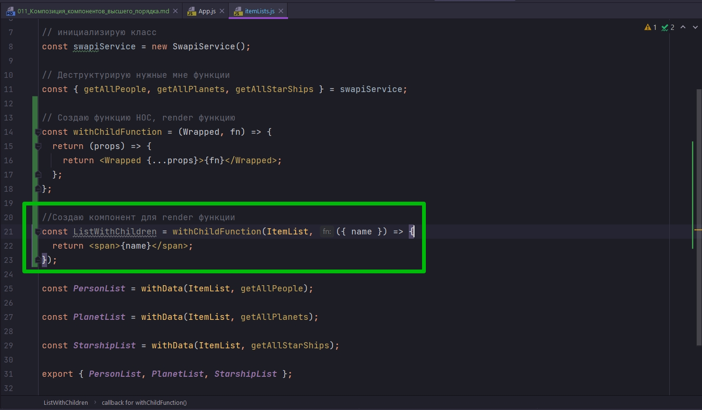

# 011_Композиция_компонентов_высшего_порядка

В эом уроке мы с вами рассмотрим технику которая называется композиция компонентов высшего порядка.

В прошлом рефакторинге мы создали маленькие аккуратные компоненты PersonDetails, PlanetDetails, StarshipDetails Которые скрывали детали конфигурации. Смотри прошлый урок в папке example компонент App.


Однако у меня они сейчас выглядят так, потому что я вынес всю логику из компонента ItemDetail в компонент высшего порядка. И по этому часть логики пришлось вернуть в App.


Единственная проблема в нашем PersonList, StarshipList и PlanetList мы все еще должны передавать в качестве children render функцию 


Эта функция отрисовывает элементы списка. Было бы хорошо сделать так что бы эта функция тоже стала частью PersonList.

Но проблема заключается в том, что если мы перейдем в то место где мы определяем PersonList


```js
//src/sw-components/itemList
import React from "react";
import ItemList from "../itemList/itemList";
import { withData } from "../hoc-helpers";
import SwapiService from "../../services/SwapiService";

// инициализирую класс
const swapiService = new SwapiService();

// Деструктурирую нужные мне функции
const { getAllPeople, getAllPlanets, getAllStarShips } = swapiService;

const PersonList = withData(ItemList, getAllPeople);

const PlanetList = withData(ItemList, getAllPlanets);

const StarshipList = withData(ItemList, getAllStarShips);

export { PersonList, PlanetList, StarshipList };

```

Совершенно не очевидно куда эту функцию передать. Ведь ItemList мы передаем не как элемент, а как компонент, как класс в функцию withData.

Как же нам с вами поступить?


И ответ. Снова использовать компоненты высшего порядка. Ведь компоненты высшего порядка как бы оборачивают наш компонент и могут взять на себя один из аспектов его работы. И таким аспектом, вполне может быть, установка render функции.


Как это будет работать?

В ItemLists создаю функцию, и в духе компонентов высшего порядка назову ее withChildFunction.


Какае ей нудны аргументы? 

Первый аргумент это компонент который она будет оборачивать. Потому что компоненты высшего порядка работают над другими компонентами. Назовем этот аргумент Wrapped.

Второй аргумент - это будет функция, fn, которую мы будем передавать в качестве propsChildren в этот компонент.


И код для этой функции будет очень простым. Мы возвращаем новый компонент, компонент функцию. Этот компонент будет принимать props. И возвращать этот компонент будет компонент Wrapped т.е. тот компонент который нам передали в нашу функцию. В качестве свойств мы передадим все те же свойства которые получил наш компонент {...props}, но в дополнении, в качестве children, мы передадим ту самую функцию, т.е. второй аргумент fn.


```js
//src/sw-components/itemList
import React from "react";
import ItemList from "../itemList/itemList";
import { withData } from "../hoc-helpers";
import SwapiService from "../../services/SwapiService";

// инициализирую класс
const swapiService = new SwapiService();

// Деструктурирую нужные мне функции
const { getAllPeople, getAllPlanets, getAllStarShips } = swapiService;

// Создаю функцию HOC, render функцию
const withChildFunction = (Wrapped, fn) => {
  return (props) => {
    return <Wrapped {...props}>{fn}</Wrapped>;
  };
};

const PersonList = withData(ItemList, getAllPeople);

const PlanetList = withData(ItemList, getAllPlanets);

const StarshipList = withData(ItemList, getAllStarShips);

export { PersonList, PlanetList, StarshipList };

```

Теперь у нас с вами появился новый инструмент. Это компонент высшего порядка withChildFunction. Эта функция может брать совершенно любой React компонент и устанавливать ему в качестве children заданную функцию


Как же будет работать данная функция?


Для начало создадим новый компонент ListWithChildren и присвоим вызов нашей функции withChildFunction. В эту функцию в качестве первого аргумента нам нужно передать компонент который мы будем оборачивать. И этот компонент будет ItemList. А в качестве второго аргумента мы передадим функцию которая станет render функцией в ItemList.

Создаю функцию которая принимает name и возвращаем обычный span с name.



```js
//src/sw-components/itemList
import React from "react";
import ItemList from "../itemList/itemList";
import { withData } from "../hoc-helpers";
import SwapiService from "../../services/SwapiService";

// инициализирую класс
const swapiService = new SwapiService();

// Деструктурирую нужные мне функции
const { getAllPeople, getAllPlanets, getAllStarShips } = swapiService;

// Создаю функцию HOC, render функцию
const withChildFunction = (Wrapped, fn) => {
  return (props) => {
    return <Wrapped {...props}>{fn}</Wrapped>;
  };
};

//Создаю компонент для render функции
const ListWithChildren = withChildFunction(ItemList, ({ name }) => {
  return <span>{name}</span>;
});

const PersonList = withData(ItemList, getAllPeople);

const PlanetList = withData(ItemList, getAllPlanets);

const StarshipList = withData(ItemList, getAllStarShips);

export { PersonList, PlanetList, StarshipList };

```

Теперь ListWithChildren это новый React компонент, у которого всегда будет установлена render функция на ItemList. Т.е. ЭТО ItemList c RENDER ФУНКЦИЕЙ. ВОСПРИНИМАЙТЕ ЕГО ИМЕННО ТАК.

Теперь этот компонент мы можем передавать в PersonList вместо первого аргумента функции высшего порядка withData


И редактирую App


```js
//src/component/app?App.js
import React, { Component } from "react";
import Header from "../header/header";
import "./App.css";
import SwapiService from "../../services/SwapiService";
import ErrorBoundary from "../errorBoundary/errorBoundary";
import Row from "../row/row";
import {
  PersonList,
  StarshipList,
  PlanetList,
} from "../sw-components/itemLists";
import {
  PersonDetails,
  StarshipDetails,
  PlanetDetails,
} from "../sw-components/details";
import { Record } from "../itemDetails/record/record";

class App extends Component {
  swapiService = new SwapiService();

  state = {
    showRandomPlanet: true,
  };

  //Функция включения и выключения компонента рандомной планеты
  toggleRandomPlanet = () => {
    this.setState((state) => {
      return {
        showRandomPlanet: !state.showRandomPlanet,
      };
    });
  };

  render() {
    const {
      getPerson,
      getPersonImage,
      getStarship,
      getStarshipImage,
      getPlanet,
      getPlanetImage,
    } = this.swapiService;
    const personDetails = (
      <PersonDetails
        itemId={11}
        getData={getPerson}
        getImageUrl={getPersonImage}
      >
        {" "}
        <Record field="gender" label="Gender" />
        <Record field="eyeColor" label="Eye Color" />
      </PersonDetails>
    );
    const starshipDetails = (
      <StarshipDetails
        itemId={5}
        getData={getStarship}
        getImageUrl={getStarshipImage}
      >
        <Record field="model" label="Model" />
        <Record field="length" label="Length" />
        <Record field="costInCredits" label="Cost" />
      </StarshipDetails>
    );
    const planetDetails = (
      <PlanetDetails
        itemId={5}
        getData={getPlanet}
        getImageUrl={getPlanetImage}
      >
        <Record field="planet" label="Planet" />
        <Record field="rotationPeriod" label="Rotation Period" />
        <Record field="diameter" label="Diameter" />
      </PlanetDetails>
    );

    const peopleList = <PersonList />;
    const startShipList = <StarshipList />;
    const planetList = <PlanetList />;

    return (
      <ErrorBoundary>
        <div className="stardb-app">
          <Header />
          <Row left={peopleList} right={personDetails} />
          <Row left={startShipList} right={starshipDetails} />
          <Row left={planetList} right={planetDetails} />
        </div>
      </ErrorBoundary>
    );
  }
}

export default App;

```


Теперь PersonList, StarshipList, PlanetList теперь не требуют render функцию поскольку она уже встроена в этот компонент.


Теперь давайте заметим одну интересную особенность. Мы создали константу ListWithChildren  


Исключительно для того что бы немного более наглядно продемонстрировать как работает этот код. 

Вместо того что бы использовать эту константу, мы можем вместо нее подставить вызов функции withChildFunction.

теперь рендер функцию я могу вынести в отдельную костанту. А функцию withChildFunction передать в другую функцию высшего порядка withData.


```js
//src/sw-components/itemList
import React from "react";
import ItemList from "../itemList/itemList";
import { withData } from "../hoc-helpers";
import SwapiService from "../../services/SwapiService";

// инициализирую класс
const swapiService = new SwapiService();

// Деструктурирую нужные мне функции
const { getAllPeople, getAllPlanets, getAllStarShips } = swapiService;

// Создаю функцию HOC, render функцию
const withChildFunction = (Wrapped, fn) => {
  return (props) => {
    return <Wrapped {...props}>{fn}</Wrapped>;
  };
};

//Выношу render функцию
const renderName = ({ name }) => <span>{name}</span>;

//Создаю компонент для render функции
const PersonList = withData(
  withChildFunction(ItemList, renderName),
  getAllPeople
);

const PlanetList = withData(
  withChildFunction(ItemList, renderName),
  getAllPlanets
);

const StarshipList = withData(
  withChildFunction(ItemList, renderName),
  getAllStarShips
);

export { PersonList, PlanetList, StarshipList };

```

еще раз пройдемся по коду.

Для начало в каждом компоненте за основу мы берем компонент ItemList


Затем  ItemList проходит через функцию withChildFunction - это создает новый компонент, у которого уже установлена функция которая будет рендерить нам child элементы, функция renderName.

Затем этот компонент который мы создали, результат функции withChildFunction, мы даже не присваивали ему имя т.е. имя константе. Мы передаем этот компонент дальше функции withData - и эта функция в свою очередь оборачивает этот компонент в намного более сложный компонент, который занимается получанием данных и обработкой ошибок.

Этот подход в математике и в программировании называется композицией функций. Это когда мы будем результат одной из функций и поверх нее мы применяем еще одну функцию.

Для того что бы еще более наглядно это продемонстрировать давайте посмотрим как это выглядело бы в обычном JS.

```js
const comp = (x) => f(g(x));
```
Вот это и есть композиция функцийю. Благодаря такому коду мы комбинируем эффекты каждой из этих функций.

Но в контексте компонента высшего порядка такая композиция позволяет вам применить эффекты нескольких компонентов повер того компонента который вы хотите обернуть.

И на самом деле это один из самых мощных инструментов React разработчика.


И на последок сделаем наш код еще немножечко интереснее. Сейчас мы совершенно одинаково отрисовывваем каждый тип списка. Т.е. все отрисовывают просто имя.

```js
//src/sw-components/itemList
import React from "react";
import ItemList from "../itemList/itemList";
import { withData } from "../hoc-helpers";
import SwapiService from "../../services/SwapiService";

// инициализирую класс
const swapiService = new SwapiService();

// Деструктурирую нужные мне функции
const { getAllPeople, getAllPlanets, getAllStarShips } = swapiService;

// Создаю функцию HOC, render функцию
const withChildFunction = (Wrapped, fn) => {
  return (props) => {
    return <Wrapped {...props}>{fn}</Wrapped>;
  };
};

//Выношу render функцию
const renderName = ({ name }) => <span>{name}</span>;

//Создаю компонент для render функции
const PersonList = withData(
  withChildFunction(ItemList, renderName),
  getAllPeople
);

const PlanetList = withData(
  withChildFunction(ItemList, renderName),
  getAllPlanets
);

const StarshipList = withData(
  withChildFunction(ItemList, renderName),
  getAllStarShips
);

export { PersonList, PlanetList, StarshipList };

```

Давайте скажем что для Starship мы отрендериваем не только имя, но еще и модель.

```js
//src/sw-components/itemList
import React from "react";
import ItemList from "../itemList/itemList";
import { withData } from "../hoc-helpers";
import SwapiService from "../../services/SwapiService";

// инициализирую класс
const swapiService = new SwapiService();

// Деструктурирую нужные мне функции
const { getAllPeople, getAllPlanets, getAllStarShips } = swapiService;

// Создаю функцию HOC, render функцию
const withChildFunction = (Wrapped, fn) => {
  return (props) => {
    return <Wrapped {...props}>{fn}</Wrapped>;
  };
};

//Выношу render функцию
const renderName = ({ name }) => <span>{name}</span>;

// Модель коробля
const renderModelAndName = ({ model, name }) => (
  <span>
    {name} ({model})
  </span>
);
//Создаю компонент для render функции
const PersonList = withData(
  withChildFunction(ItemList, renderName),
  getAllPeople
);

const PlanetList = withData(
  withChildFunction(ItemList, renderName),
  getAllPlanets
);

const StarshipList = withData(
  withChildFunction(ItemList, renderModelAndName),
  getAllStarShips
);

export { PersonList, PlanetList, StarshipList };

```


И теперь наш код в App максимально близок к идеалу.

У нас появилась коллекция специализированных компонентов которые заточены специально для работы Star Wars API, и которые скрывают внутри ебя детали конфигурации.

Использовать такие компоненты в разы легче чем оригинальные компоненты которые мы создавали.

> Композиция HOC
> 
> Композиция - применение одной функции к результату другой f(g(x))
> 
> Компоненты высшего порядка это обычные функции, которые возвразают компоненты. Композиция работает и для них
> 
> Так мы можем применять несколько "Эффектов" HOC
> HOC - Higher Order Component


