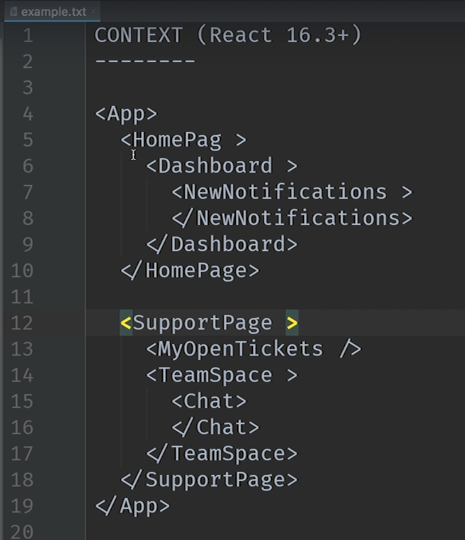
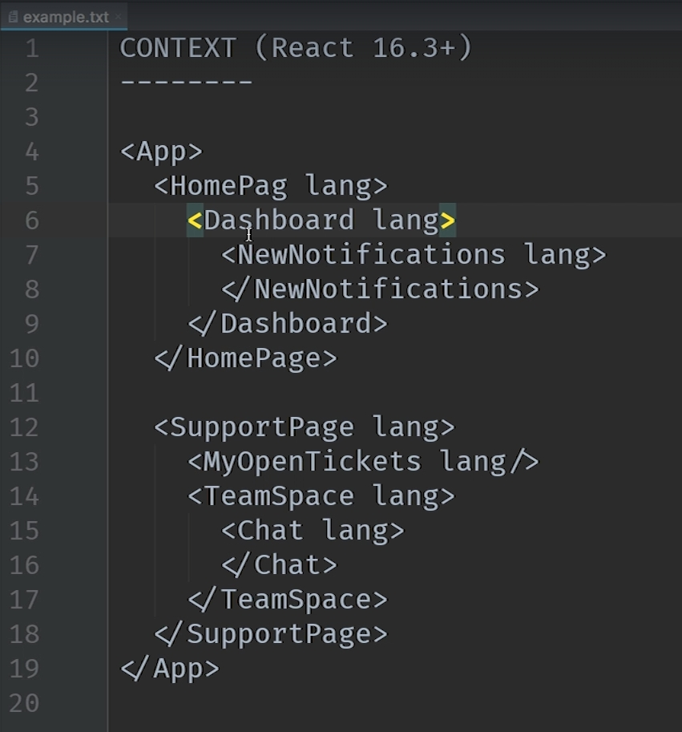
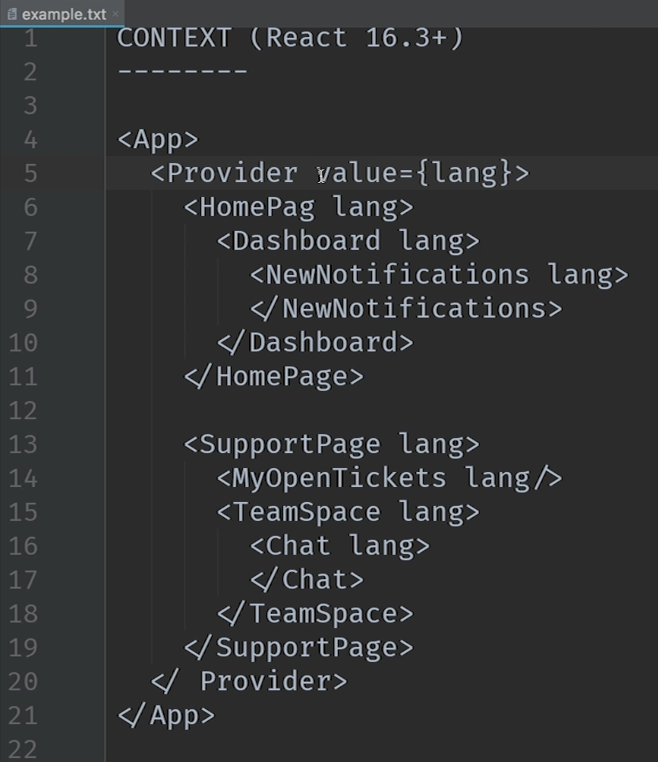
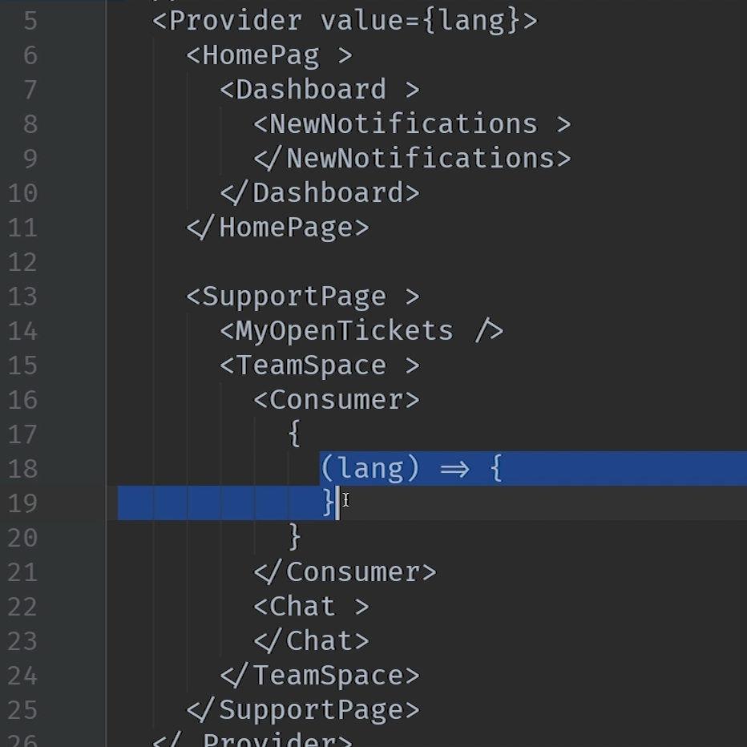
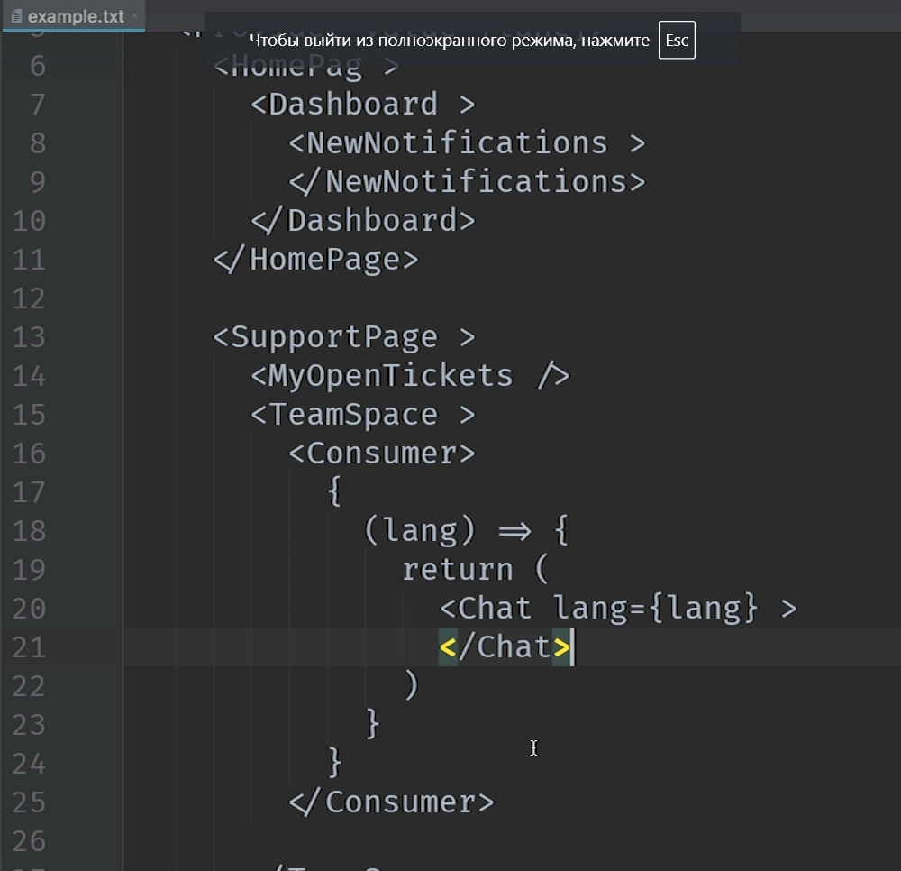

# 012_Контекст

В этом видео мы рассмотрим еще один API React который называется Context.

Context - это довольно интересная часть React потому что контекстом пользуются 99% разработчиков не зная того. Ведь многие популярные библиотеки вроде Redux и React-router используют внутри себя Context.

И еще одна важная деталь по поводу этого API, Context-API в React до версии 16.3 этот API считался эксперементальным.

Давайте редставим довольно абстрактное приложение 

На примере этой схемы посмотрим какие проблемы решает Context и как он это делает. А затем на практике применим знания.

И так у нас есть приложение и скажем что оно должно поддерживать несколько языков. Теперь компонентам которые отображают текст т.е. всем компонентам нужно знать какой сейчас выбран язык.

С теми знаниями которые у нас есть самым лучшим решением будет проинициализировать язык на самом верхнем уровне в App а затем спустить его по цепочке props до тех компонентов которым он дейтвительно нужен. Т.е. все наше приложение будет пронизано свойством lang

При этом компоненты на промежуточных уровнях должны будут знать о существовании свойства lang, хотябы для того что бы передать его своим child компонентам.

Другой пример тема визуального оформления.

Контекст позволяет создать специальное хранилище данных. И данные которые мы запишем в это хранилище будут доступны всем компонентам иерархии без необходимости явно передавать эти данные через props.

Создавая Context мы создаем два специальных компонента. Первый компонент называется Provider а второй Consumer.

Компонент Provider отвечает за то что бы установить значение которое затем можно будет использовать в иерархии.

Мы создаем Provider и говорим что value у него будет некий lang

И теперь это значение value доступно всем компонентам вниз по иерархии от provider.

Consumer - используем для того что бы считать это значение. И к примеру в TeamSpace нам нужно получить проперти lang. Для этого на одном уровне с компонентом создаю компонент Consumer. И в тело компонента Consumer нужно передать render функцию в которую компонент Consumer передает то значение которое он получит от ближайшего к себе подходящего компонента Provider. 

И затем функцию котрую мы передаем в Consumer можно использовать как самую обычную render функцию. Т.е. в функции мы можем вернуть те компоненты которые зависят от lang.

Таким образом при помощи API Context можно передавать значения с самого верха иерархии приложения к любому компоненту ниже по иерархии.

Тот аспект который мы улучшим при помощи Context, это то как мы работаем с SwapiService.

Это один из пяти принципов SOLID - Буква D это Dependency Inversion Principle (Принцип инверсии зависимостей)