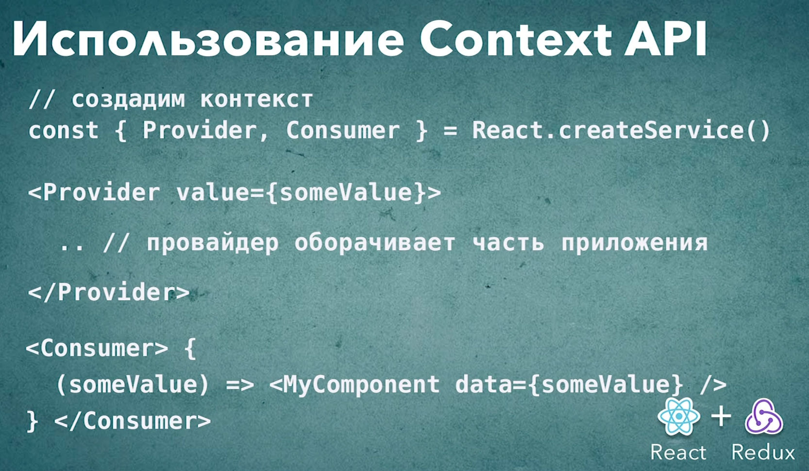

# 013_Использование_Context_API

И так это не по курсу но отрефакторил проект.

```js
//src/component/app?App.js
import React, { Component } from "react";
import Header from "../header/header";
import "./App.css";
import SwapiService from "../../services/SwapiService";
import ErrorBoundary from "../errorBoundary/errorBoundary";
import Row from "../row/row";
import {
  PersonList,
  StarshipList,
  PlanetList,
} from "../sw-components/itemLists";
import {
  PersonDetails,
  StarshipDetails,
  PlanetDetails,
} from "../sw-components/details";

class App extends Component {
  swapiService = new SwapiService();

  state = {
    showRandomPlanet: true,
  };

  //Функция включения и выключения компонента рандомной планеты
  toggleRandomPlanet = () => {
    this.setState((state) => {
      return {
        showRandomPlanet: !state.showRandomPlanet,
      };
    });
  };

  render() {
    return (
      <ErrorBoundary>
        <div className="stardb-app">
          <Header />
          <Row left={<PersonList />} right={PersonDetails} />
          <Row left={<StarshipList />} right={StarshipDetails} />
          <Row left={<PlanetList />} right={PlanetDetails} />
        </div>
      </ErrorBoundary>
    );
  }
}

export default App;

```

```js
//src/sw-components/details
import React from "react";
import ItemDetails from "../itemDetails/itemDetails";
import SwapiService from "../../services/SwapiService";
import { withDetailsData } from "../hoc-helpers/withDetailsData";
import { Record } from "../itemDetails/record/record";

// инициализирую класс
const swapiService = new SwapiService();

// Деструктурирую нужные мне функции
const {
  getPerson,
  getPlanet,
  getStarship,
  getPersonImage,
  getStarshipImage,
  getPlanetImage,
} = swapiService;

const PersonDetails = (
  <ItemDetails itemId={11} getData={getPerson} getImageUrl={getPersonImage}>
    {" "}
    <Record field="gender" label="Gender" />
    <Record field="eyeColor" label="Eye Color" />
  </ItemDetails>
);

const PlanetDetails = (
  <ItemDetails itemId={5} getData={getPlanet} getImageUrl={getPlanetImage}>
    <Record field="planet" label="Planet" />
    <Record field="rotationPeriod" label="Rotation Period" />
    <Record field="diameter" label="Diameter" />
  </ItemDetails>
);

const StarshipDetails = (
  <ItemDetails itemId={5} getData={getStarship} getImageUrl={getStarshipImage}>
    <Record field="model" label="Model" />
    <Record field="length" label="Length" />
    <Record field="costInCredits" label="Cost" />
  </ItemDetails>
);


export { PersonDetails, PlanetDetails, StarshipDetails };

```

```js
import React, { Component } from "react";

export const withDetailsData = (View, getData) => {
  return class extends Component {
    state = {
      item: null,
      image: null,
    };

    componentDidMount() {
      this.updateDetails();
    }

    componentDidUpdate(prevProps, prevState, snapshot) {
      if (this.props.itemId !== prevProps.itemId) {
        this.updateDetails();
      }
    }

    //Функция обновления
    updateDetails() {
      const { itemId, getImageUrl } = this.props;
      // в самом начале personId может быть null делаю проверку
      if (!itemId) {
        return;
      }
      //Получаю данные
      getData(itemId).then((item) => {
        this.setState({ item, image: getImageUrl(item) });
      });
    }
    render() {
      const { item, image } = this.state;
      if (!item) {
        return <span>Select a person from a list</span>;
      }

      return <View {...this.props} item={item} image={image} />;
    }
  };
};

```

И так обновлю src/component/sw-components/detail.js. Что бы эти компоненты использовали сервис который мы передадим из контекста.

создаю диркторию swapiServiceContext.


Для создани контекста использую специальную функцию React.React.createContext(). React.createContext() - эта функция может принимать опциональный аргумент, это значение по умолчанию. Т.е. если наш Consumer не сможет найти ни какого Provider, то он будет использовать значение которое мы передадим в функцию React.createContext().

Но в нашем приложении у нас всегда будет присутствовать какое-то значение. По этому я не буду передавать сюда аргумент.

Функция React.createContext() возвращает пару Provider и Consumer.

```js
//src/components/swapiServiceContext/swapiServiceContext.js
import React from "react";

const { Provider, Consumer } = React.createContext();
```

И прямо здесь мы переименуем Provider и consumer так что бы их имена лючше отображали то значение которое они будут хранить.

```js
//src/components/swapiServiceContext/swapiServiceContext.js
import React from "react";

const { Provider: SwapiServiceProvider, Consumer: SwapiServiceConsumer } =
    React.createContext();

export { SwapiServiceProvider, SwapiServiceConsumer };

```

Это собственно весь код который нам нужно написать для того что бы создать Context.

Теперь я иду в App и импортирую SwapiServiceProvider. Далее оборачиваю все приложение и в качестве value передаю this.swapiService.

```js
//src/component/app?App.js
import React, { Component } from "react";
import Header from "../header/header";
import "./App.css";
import SwapiService from "../../services/SwapiService";
import ErrorBoundary from "../errorBoundary/errorBoundary";
import Row from "../row/row";
import {
  PersonList,
  StarshipList,
  PlanetList,
} from "../sw-components/itemLists";
import {
  PersonDetails,
  StarshipDetails,
  PlanetDetails,
} from "../sw-components/details";
import { SwapiServiceProvider } from "../swapiServiceContext/swapiServiceContext";

class App extends Component {
  swapiService = new SwapiService();

  state = {
    showRandomPlanet: true,
  };

  //Функция включения и выключения компонента рандомной планеты
  toggleRandomPlanet = () => {
    this.setState((state) => {
      return {
        showRandomPlanet: !state.showRandomPlanet,
      };
    });
  };

  render() {
    return (
      <ErrorBoundary>
        <SwapiServiceProvider value={this.swapiService}>
          <div className="stardb-app">
            <Header />
            <Row left={<PersonList />} right={PersonDetails} />
            <Row left={<StarshipList />} right={StarshipDetails} />
            <Row left={<PlanetList />} right={PlanetDetails} />
          </div>
        </SwapiServiceProvider>
      </ErrorBoundary>
    );
  }
}

export default App;

```

И теперь у всех компонентов обернутых в SwapiServiceProvider есть доступ к тому значению которое мы передаем.

И для того что бы получить это значение нужно еспользовать SwapiServiceConsumer.

Теперь перехожу в details.js и здесь используя SwapiServiceConsumer мы достаем значение из SwapiServiceProvider.

Импортирую SwapiServiceConsumer. И перехожу в то место где нам нужен swapiService. Оборачиваю компоненты в SwapiServiceConsumer. Но главной особенностью SwapiServiceConsumer является то что в своем теле он принимает функцию. И эта функция принимает swapiService. И после чего в теле функции я могу использовать swapiService для того что бы передать нужное значение.

Теперь компонент выглядит вот так

```js
//src/sw-components/details
import React from "react";
import ItemDetails from "../itemDetails/itemDetails";
import { Record } from "../itemDetails/record/record";
import { SwapiServiceConsumer } from "../swapiServiceContext/swapiServiceContext";

const PersonDetails = (
  <SwapiServiceConsumer>
    {({ getPerson, getPersonImage }) => {
      return (
        <ItemDetails
          itemId={11}
          getData={getPerson}
          getImageUrl={getPersonImage}
        >
          {" "}
          <Record field="gender" label="Gender" />
          <Record field="eyeColor" label="Eye Color" />
        </ItemDetails>
      );
    }}
  </SwapiServiceConsumer>
);

const PlanetDetails = (
  <SwapiServiceConsumer>
    {({ getPlanet, getPlanetImage }) => {
      return (
        <ItemDetails
          itemId={5}
          getData={getPlanet}
          getImageUrl={getPlanetImage}
        >
          <Record field="planet" label="Planet" />
          <Record field="rotationPeriod" label="Rotation Period" />
          <Record field="diameter" label="Diameter" />
        </ItemDetails>
      );
    }}
  </SwapiServiceConsumer>
);

const StarshipDetails = (
  <SwapiServiceConsumer>
    {({ getStarship, getStarshipImage }) => {
      return (
        <ItemDetails
          itemId={5}
          getData={getStarship}
          getImageUrl={getStarshipImage}
        >
          <Record field="model" label="Model" />
          <Record field="length" label="Length" />
          <Record field="costInCredits" label="Cost" />
        </ItemDetails>
      );
    }}
  </SwapiServiceConsumer>
);

export { PersonDetails, PlanetDetails, StarshipDetails };

```

Как бы это все!!! Говорит показывает пример с фейковым сервисом. И говорит о том как легко заменить один сервис получения данных на другой.

API контекста позволяет решать проблему глобальных данных т.е. передавать какие нибудь значения свуерху приложения до любых компонентов ниже по иерархии не передавая при  этом свойство в явном виде. 

Для того что бы реализовать контекст мы использовали функцию React.createContext(). Эта функция возвращает пару компонентов Provider и Consumer которые всегда должны работать вместе.

В Provider на самм верхнем уровне в value мы записываем то самое значение которое нам нужно передать. A затем в Consumer мы можем взять и получить это значение в функцию которую принимает Consumer.




