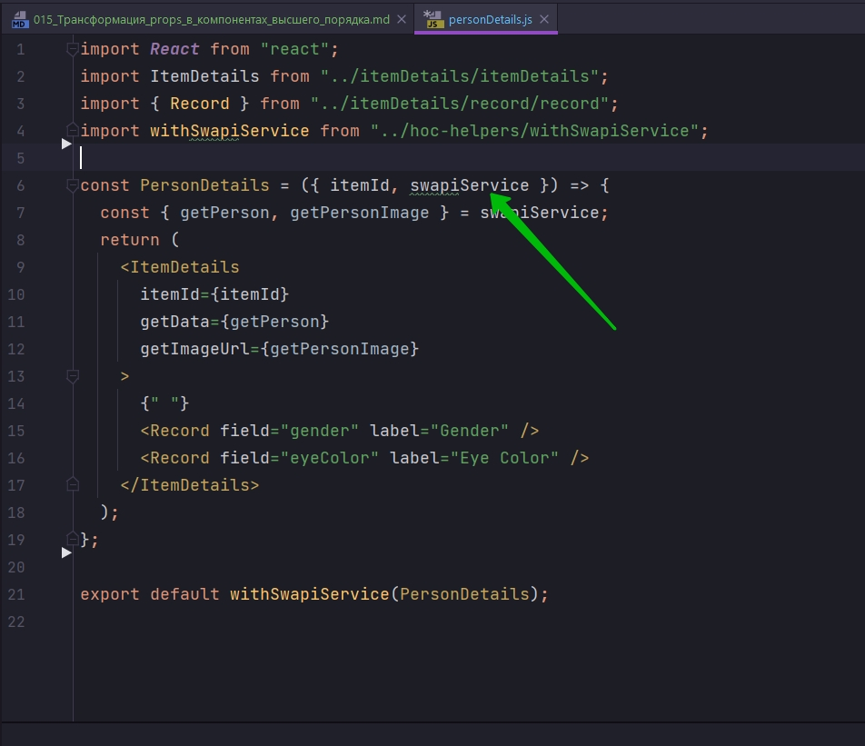
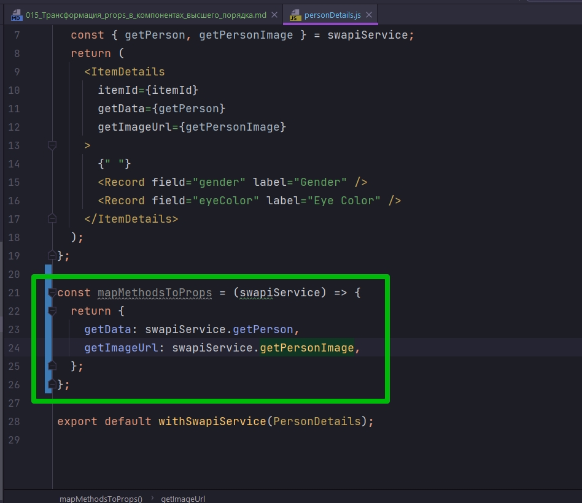
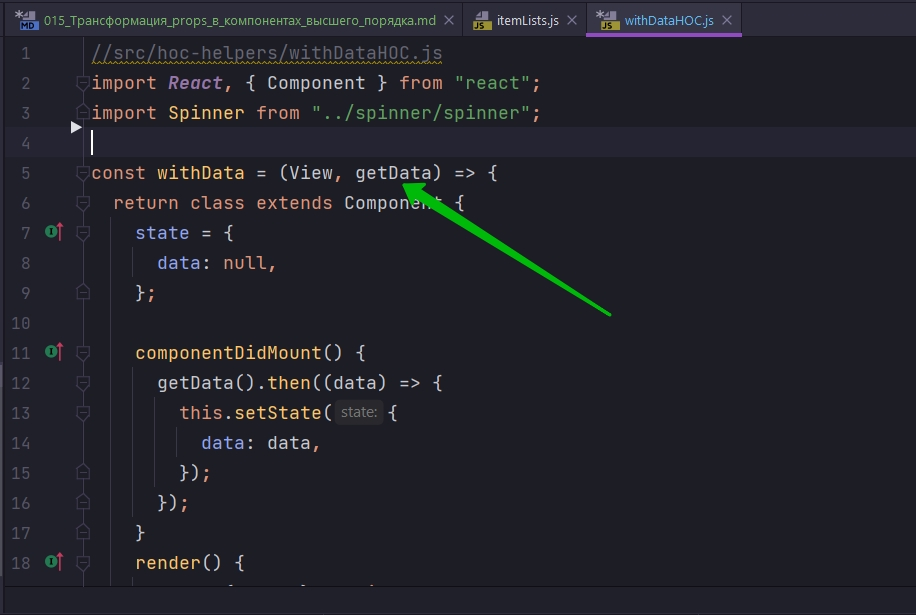
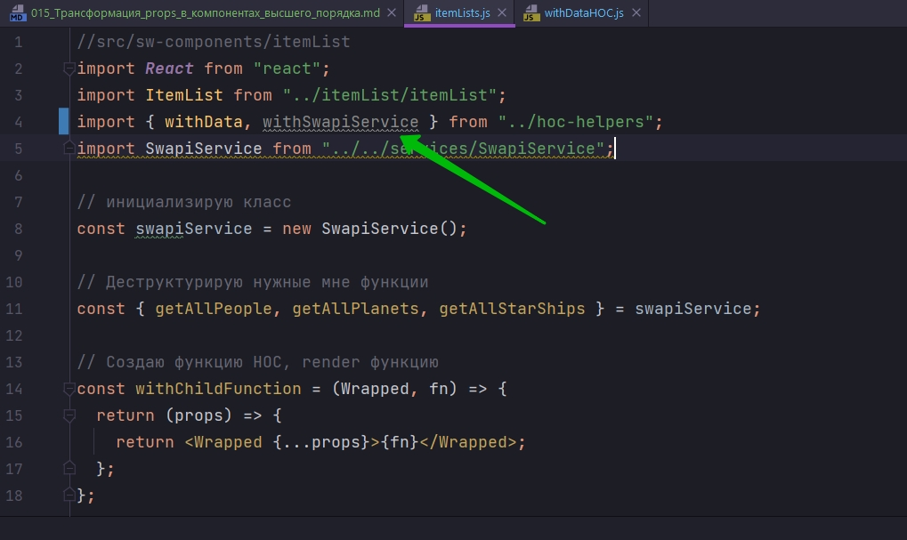
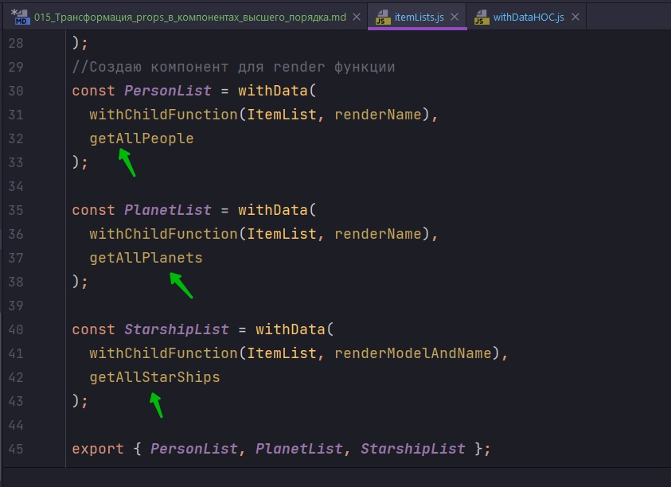
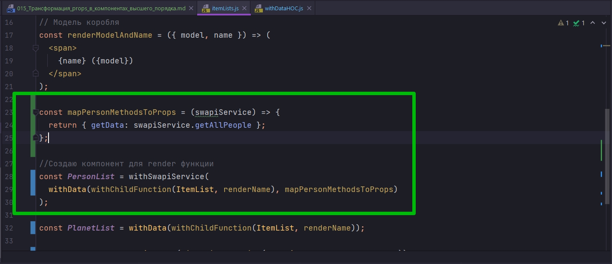

# 015_Трансформация_props_в_компонентах_высшего_порядка

 Мы уже знаем как можно использовать компоненты высшего порядка для того что бы достать значение из контекста и установить его какому-нибудь конкретному компоненту.
 
Использование HOC  позволяет коду нашего компонента оставаться компактным и аккуратным. 

Но теперь у нас остается один важный вопрос. А можем ли мы сделать этот код еще лучше и еще эелегантнее? 

Тот аспект который я предлагаю улучшить - это вместо того что бы передавать весь swapiService



Передавать исклчительно те методы которые нужны этому компоненту. И эти методы в данном случае getPerson, getPersonImage. И будет еще удобнее если метод getPerson мы бы могли передать под именем getData, именно таким каким его ожидает увидеть ItemDetails. А getPersonImage мы бы могли передать под именем getImageUrl. Т.е. то что мы хотим сделать - это определить маппинг между методами swapiService и свойствами которые будет принимать объект props.


Давайте сначало напишем код для того что бы лучше проилюстрировать идею. И как это будет выглядеть со стороны компонента.

И так я бы хотел сделать так что бы я мог передать в компонент правило как именно передавать swapiService в компонент PersonDetails.

И правило конечно же легче описать в функции. Называю функцию mapMethodsToProps. Мы возьмем определенные методы из swapiService и присвоим их пределенным свойствам в компоненте. Такая функция конечно должна принимать swapiService и возвращать она будет обычный объект который будет использоваться как mapping для свойств.



И теперь имея такую функцию mapMethodsToProps, которая берет swapiService и назначает его методы свойствам компонента.

И теперь я могу взять функцию mapMethodsToProps и передать ее в withSwapiService. И когда я обновлю код функции withSwapiService наш компонент PersonDetails будет получать вместо swapiService, вместо всего объекта, itemId, getData,getImageUrl

```js
import React from "react";
import ItemDetails from "../itemDetails/itemDetails";
import { Record } from "../itemDetails/record/record";
import withSwapiService from "../hoc-helpers/withSwapiService";

const PersonDetails = ({ itemId, getData, getImageUrl }) => {
  return (
    <ItemDetails itemId={itemId} getData={getData} getImageUrl={getImageUrl}>
      {" "}
      <Record field="gender" label="Gender" />
      <Record field="eyeColor" label="Eye Color" />
    </ItemDetails>
  );
};

const mapMethodsToProps = (swapiService) => {
  return {
    getData: swapiService.getPerson,
    getImageUrl: swapiService.getPersonImage,
  };
};

export default withSwapiService(PersonDetails, mapMethodsToProps);

```

И заметьте что ключ и значение в пропсах соврадают. Для сокращения кода в свойства функции PersonDetails я передаю просто props. А в свойства компонента я просто деструктурирую объект {...props}

```js
import React from "react";
import ItemDetails from "../itemDetails/itemDetails";
import { Record } from "../itemDetails/record/record";
import withSwapiService from "../hoc-helpers/withSwapiService";

const PersonDetails = (props) => {
  return (
    <ItemDetails {...props}>
      {" "}
      <Record field="gender" label="Gender" />
      <Record field="eyeColor" label="Eye Color" />
    </ItemDetails>
  );
};

const mapMethodsToProps = (swapiService) => {
  return {
    getData: swapiService.getPerson,
    getImageUrl: swapiService.getPersonImage,
  };
};

export default withSwapiService(PersonDetails, mapMethodsToProps);

```

Ну а теперь обнолю код в своем компоненте высшего порядка withSwapiService. Наша функция будет получать дополнительный параметр который назову точно также mapMethodsToProps

И в теле SwapiServiceConsumer, когда мы получаем в функции получаем swapiService, создаю константу serviceProps которой присваиваю вызов функции mapMethodsToProps, которая возвращает объект. И не забываем передать в mapMethodsToProps(swapiService)

```js
import React from "react";
import { SwapiServiceConsumer } from "../swapiServiceContext/swapiServiceContext";

const withSwapiService = (Wrapped, mapMethodsToProps) => {
  return (props) => {
    return (
      <SwapiServiceConsumer>
        {(swapiService) => {
          // результатом прилетают getData, getImageUrl
          const serviceProps = mapMethodsToProps(swapiService);
          return <Wrapped {...props} {...serviceProps} />;
        }}
      </SwapiServiceConsumer>
    );
  };
};

export default withSwapiService;

```

Но у меня ошибка!!! Полагаю что нужно и другие компоненты переделать которые используют withSwapiService.

```js
import React from "react";
import ItemDetails from "../itemDetails/itemDetails";
import { Record } from "../itemDetails/record/record";
import withSwapiService from "../hoc-helpers/withSwapiService";

const PlanetDetails = (props) => {
  return (
    <ItemDetails {...props}>
      <Record field="planet" label="Planet" />
      <Record field="rotationPeriod" label="Rotation Period" />
      <Record field="diameter" label="Diameter" />
    </ItemDetails>
  );
};

const mapMethodsToProps = (swapiService) => {
  console.log(swapiService);
  return {
    getData: swapiService.getPlanet,
    getImageUrl: swapiService.getPlanetImage,
  };
};

export default withSwapiService(PlanetDetails, mapMethodsToProps);

```

```js
import React from "react";
import ItemDetails from "../itemDetails/itemDetails";
import { Record } from "../itemDetails/record/record";
import withSwapiService from "../hoc-helpers/withSwapiService";

const StarshipDetails = (props) => {
  return (
    <ItemDetails {...props}>
      <Record field="model" label="Model" />
      <Record field="length" label="Length" />
      <Record field="costInCredits" label="Cost" />
    </ItemDetails>
  );
};

const mapMethodsToProps = (swapiService) => {
  console.log(swapiService);
  return {
    getData: swapiService.getStarship,
    getImageUrl: swapiService.getStarshipImage,
  };
};

export default withSwapiService(StarshipDetails, mapMethodsToProps);

```

И вуаля


И теперь наша задача обновить компоненты списки поскольку они пока что используют реальный API и не используют данные из контекста вообще.

Перехожу в itemLists. И здесь наши компоненты создаются исключительно из компонентов высшего порядка.

```js
//src/sw-components/itemList
import React from "react";
import ItemList from "../itemList/itemList";
import { withData } from "../hoc-helpers";
import SwapiService from "../../services/SwapiService";

// инициализирую класс
const swapiService = new SwapiService();

// Деструктурирую нужные мне функции
const { getAllPeople, getAllPlanets, getAllStarShips } = swapiService;

// Создаю функцию HOC, render функцию
const withChildFunction = (Wrapped, fn) => {
  return (props) => {
    return <Wrapped {...props}>{fn}</Wrapped>;
  };
};

//Выношу render функцию
const renderName = ({ name }) => <span>{name}</span>;

// Модель коробля
const renderModelAndName = ({ model, name }) => (
  <span>
    {name} ({model})
  </span>
);
//Создаю компонент для render функции
const PersonList = withData(
  withChildFunction(ItemList, renderName),
  getAllPeople
);

const PlanetList = withData(
  withChildFunction(ItemList, renderName),
  getAllPlanets
);

const StarshipList = withData(
  withChildFunction(ItemList, renderModelAndName),
  getAllStarShips
);

export { PersonList, PlanetList, StarshipList };

```

PersonList к примеру создается на основании компонента withData. И теперь вспимном что делает withData

```js
//src/hoc-helpers/withDataHOC.js
import React, { Component } from "react";
import Spinner from "../spinner/spinner";
// import ErrorIndicator from "../errorIndicator/errorIndicator";

const withData = (View, getData) => {
  return class extends Component {
    state = {
      data: null,
    };

    componentDidMount() {
      getData().then((data) => {
        this.setState({
          data: data,
        });
      });
    }
    render() {
      const { data } = this.state;

      if (!data) {
        return <Spinner />;
      }
      return <View {...this.props} data={data} />;
    }
  };
};

export default withData;

```
Это компонент который занимается тем что получает данные в componentDidMount, и отображает состояние в равильном виде. Т.е. если данные все еще загружаются отображается Spinner, а если данные загружены отображаются собственно данные.

И так этот компонент получает getData как внешний аргумент



Но теперь мы с вами при помощи функции withSwapiService научились передавать нужный метод сервиса в компонент, да еще и под нужным именем.

По этому нам теперь в этом компоненте не нужно передавать getData в явном виде. Вместо этого мы теерь можем взять getData из this.props.getData()

```js
//src/hoc-helpers/withDataHOC.js
import React, { Component } from "react";
import Spinner from "../spinner/spinner";

const withData = (View) => {
  return class extends Component {
    state = {
      data: null,
    };

    componentDidMount() {
      this.props.getData().then((data) => {
        this.setState({
          data: data,
        });
      });
    }
    render() {
      const { data } = this.state;

      if (!data) {
        return <Spinner />;
      }
      return <View {...this.props} data={data} />;
    }
  };
};

export default withData;

```

Ну а теперь в itemLists обновлю наши списки. И так нам понадобится withSwapiService



Теперь в компоненте высшего порядка withData нам теперь не нужно передавать функцию в явном виде, поскольку мы ее получим из контекста. Удаляю:



Теперь нам для каждой функции нужно две вещи. Нам нужно вызывать withSwapiService, передать туда withData. В качестве второго агрумента withSwapiService нужно передать mapPersonMethodsToProps.



```js
//src/sw-components/itemList
import React from "react";
import ItemList from "../itemList/itemList";
import { withData } from "../hoc-helpers";
import withSwapiService from "../hoc-helpers/withSwapiService";

// Создаю функцию HOC, render функцию
const withChildFunction = (Wrapped, fn) => {
    return (props) => {
        return <Wrapped {...props}>{fn}</Wrapped>;
    };
};

//Выношу render функцию
const renderName = ({ name }) => <span>{name}</span>;

// Модель коробля
const renderModelAndName = ({ model, name }) => (
    <span>
        {name} ({model})
    </span>
);

// Маппинг персонажей
const mapPersonMethodsToProps = (swapiService) => {
    return { getData: swapiService.getAllPeople };
};
// Маппинг планет
const mapPlanetMethodsToProps = (swapiService) => {
    return { getData: swapiService.getAllPlanets };
};
// Маппинг космических кораблей
const mapStarshipMethodsToProps = (swapiService) => {
    return { getData: swapiService.getAllStarShips };
};

//Создаю компонент для render функции
const PersonList = withSwapiService(
    withData(withChildFunction(ItemList, renderName)),
    mapPersonMethodsToProps
);

const PlanetList = withSwapiService(
    withData(withChildFunction(ItemList, renderName)),
    mapPlanetMethodsToProps
);

const StarshipList = withSwapiService(
    withData(withChildFunction(ItemList, renderModelAndName)),
    mapStarshipMethodsToProps
);

export { PersonList, PlanetList, StarshipList };

```


В этот раз withSwapiService делает две полезных вещи. Во первых этот ккомпонент умеет доставать SwapiServiceConsumer из контекста и передавать его в обернутый Wrapped компонент.

А во вторых мы свами использовали еще один очень интересный прием. В наш компонент высшего порядка мы передаем функцию которая называется mapMethodsToProps. И теперь вместо того что бы передавать весь swapiService в компоненты, мы выбираем какие именно части сервиса мы хотим передать. И что еще более важно под какими именами.

Теперь не зависимо откуда взялся компонент. Даже если мы не контролируем код этого  компонента. Даже если компонент пришел из какой-нибудь сторонней библиотеки. Мы сможем адаптировать withSwapiService для того что бы этот компонент получил свойтсва именно под тем именем под которым от хочет это свойство получить


Перед тем как перейти к следующему видео. 

ВАЖНАЯ ЗАМЕТКА!!!

Те методы рефакторинга которые мы начинаем с вами использовать, те подходы, приемы которые мы начинаем с вами использовать они становятся все сложнее. Мы уже близки даже не к среднему уровню знания React, а к продвинотому.

> Трансформация свойств
> 
> HOC может переобразовывать свойства перед тем, как передавать их компоненту
> 
> Например, изменять их имена и выбирать, какие именно свойства нужно передать
> 
> при помощидополнительной функции (mapMethodsToProps) можно определять это поведение для каждого компонента.