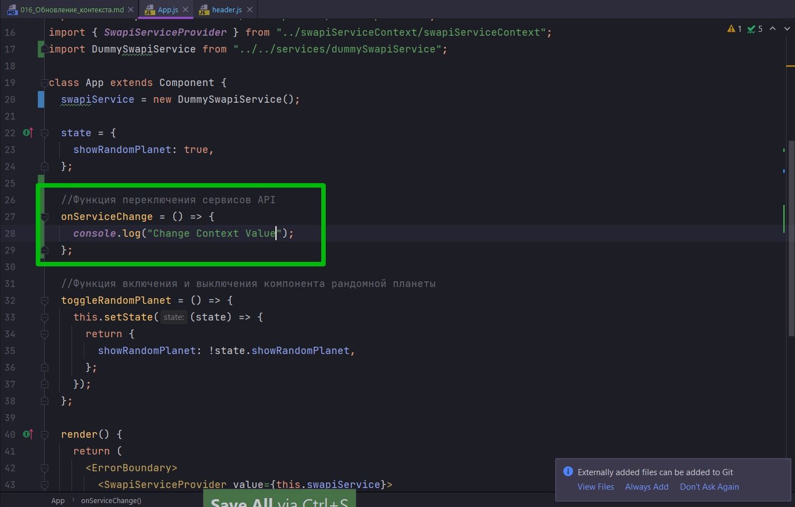
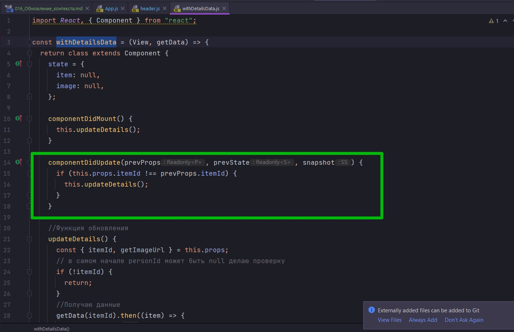
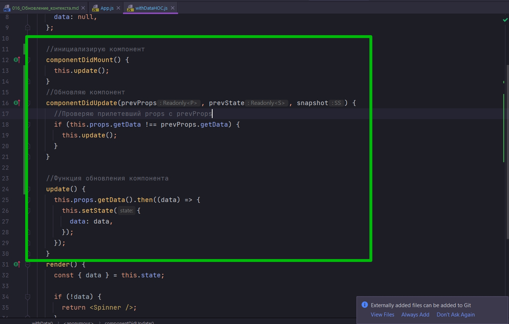

# 016_Обновление_контекста

В прошлых уроках мы посмотрели как всего одной строкой кода мы можем изменять тот сервис который используется в нашем приложении. НЕ ИШИ ЭТО Я НЕ КОНСПЕКИРОВАЛ.... НО СМЫСЛ ПРОСТ.


То мы можем переключится с реальных данных, на тестовые данные, которые лучше всего использовать во время тестирования.

Но замена одной строки кода это все еще сборка и перезапуск приложения.

А можем ли мы сделать наш код еще более гибким и сделать так что бы мы могли переключать обычный сервис и тестовый сервис просто кликнув на кнопку, не перезагружая при этом все приложение?

Реализуем такую функциональность.

Добавляю в папку service тестовые данные. Создаю dummySwapiService.js и добавляю код.

```js
export default class DummySwapiService {

  _people = [
    {
      id: 1,
      name: 'Bilbo Baggins [TEST DATA]',
      gender: 'male',
      birthYear: 'long ago',
      eyeColor: 'dark brown'
    },

    {
      id: 2,
      name: 'Frodo Baggins [TEST DATA]',
      gender: 'male',
      birthYear: 'long ago',
      eyeColor: 'dark brown'
    }
  ];

  _planets = [
    {
      id: 1,
      name: 'Earth [TEST DATA]',
      population: '7.530.000.000',
      rotationPeriod: '23 hours 56 seconds',
      diameter: '12.742 km'
    },
    {
      id: 2,
      name: 'Venus [TEST DATA]',
      population: 'not known',
      rotationPeriod: '243 days',
      diameter: '12.104 km'
    }
  ];

  _starships = [
    {
      id: 1,
      name: 'USS Enterprise [TEST DATA]',
      model: 'NCC-1701-C',
      manufacturer: 'Northrop Grumman Shipbuilding',
      costInCredits: 'not known',
      length: 'approx 300 meters',
      crew: 1000,
      passengers: 50,
      cargoCapacity: 100
    }
  ];

  getAllPeople = async () => {
    return this._people;
  };

  getPerson = async () => {
    return this._people[0];
  };

  getAllPlanets = async () => {
    return this._planets;
  };

  getPlanet = async () => {
    return this._planets[0]
  };

  getAllStarships = async () => {
    return this._starships;
  };

  getStarship = async () => {
    return this._starships[0];
  };

  getPersonImage = () => {
    return `https://placeimg.com/400/500/people`
  };

  getStarshipImage = () => {
    return `https://placeimg.com/600/400/tech`;
  };

  getPlanetImage = () => {
    return `https://placeimg.com/400/400/nature`
  };
}
```

И так обнаружил ошибку. я именовал вплоть с сервиса получение данных getAllStarShips а надо было getAllStarships. Поисправлял.

```js
// src/services/SwapiService.js
export default class SwapiService {
  // базовый url
  API_BASE = `https://swapi.dev/api`;
  IMAGE_BASE = `https://starwars-visualguide.com/assets/img`;

  getResource = async (url) => {
    // составляю строку из базового url и того url что прилетает из методов
    const response = await fetch(`${this.API_BASE}${url}`);
    //Обработка ошибки на клиенте
    if (!response.ok) {
      throw new Error(`Could not fetch ${url}  received ${response.status}`);
    }
    const body = await response.json(); // получаю тело запроса
    return body;
  };

  // Персонажи

  // Получение всех персонажей
  getAllPeople = async () => {
    // передаю только нужную часть url
    const response = await this.getResource(`/people/`);
    return response.results.map(this.transformPerson);
  };
  // получаю конкретного персонажа
  getPerson = async (id) => {
    // передаю только нужную часть url
    const person = await this.getResource(`/people/${id}/`);
    return this.transformPerson(person);
  };

  // Планеты

  // Получаю все планеты
  getAllPlanets = async () => {
    const planets = await this.getResource(`/planets/`);
    return planets.results.map(this.transformPlanet);
  };
  //Получаю планету
  getPlanet = async (id) => {
    const planet = await this.getResource(`/planets/${id}/`);
    return this.transformPlanet(planet);
  };

  //Космические корабли

  // Получаю все корабли
  getAllStarships = async () => {
    const response = await this.getResource(`/starships/`);
    return response.results.map(this.transformStarShip);
  };

  //Получаю космический корабль
  getStarship = async (id) => {
    const starship = await this.getResource(`/starships/${id}/`);
    return this.transformStarShip(starship);
  };

  //Получаю адрес картинки персонажа
  getPersonImage = ({ id }) => {
    return `${this.IMAGE_BASE}/characters/${id}.jpg`;
  };
  //Получаю адрес картинки космического корабля
  getStarshipImage = ({ id }) => {
    return `${this.IMAGE_BASE}/starships/${id}.jpg`;
  };

  //Получаю адрес картинки планеты
  getPlanetImage = ({ id }) => {
    return `${this.IMAGE_BASE}/planets/${id}.jpg`;
  };

  // Трансформация данных полученных от API в нужный формат

  // Извлекаю id
  extractId = (item) => {
    //регуларка для поиска id в строке url
    const idRegExp = /\/([0-9]*)\/$/;
    // ищу id
    return item.url.match(idRegExp)[1];
    // Нулевая группа это все выражение, а первая группа это все что в скобках
  };

  // Трансформация данных для планет(ы)
  transformPlanet = (planet) => {
    return {
      id: this.extractId(planet),
      name: planet.name,
      population: planet.population,
      rotationPeriod: planet.rotation_period,
      diameter: planet.diameter,
    };
  };

  // Трансформация данных для космическ(ого)их корабл(я)ей
  transformStarShip = (starship) => {
    return {
      id: this.extractId(starship),
      name: starship.name,
      model: starship.model,
      manufacturer: starship.manufacturer,
      costInCredits: starship.cost_in_credits,
      length: starship.length,
      crew: starship.crew,
      passengers: starship.passengers,
      cargoCapacity: starship.cargo_capacity,
    };
  };

  // Трансформация данных для персонажа(ей)
  transformPerson = (person) => {
    return {
      id: this.extractId(person),
      name: person.name,
      gender: person.gender,
      birthYear: person.birth_year,
      eyeColor: person.eye_color,
    };
  };
}

```

В маппинге данных - это когда передаю нужные функции нужным компонента. А не весь сервис передаю каждому компоненту. И так сдесь тоже исправил

```js
//src/sw-components/itemList
import React from "react";
import ItemList from "../itemList/itemList";
import { withData } from "../hoc-helpers";
import withSwapiService from "../hoc-helpers/withSwapiService";

// Создаю функцию HOC, render функцию
const withChildFunction = (Wrapped, fn) => {
  return (props) => {
    return <Wrapped {...props}>{fn}</Wrapped>;
  };
};

//Выношу render функцию
const renderName = ({ name }) => <span>{name}</span>;

// Модель коробля
const renderModelAndName = ({ model, name }) => (
  <span>
    {name} ({model})
  </span>
);

// Маппинг персонажей
const mapPersonMethodsToProps = (swapiService) => {
  return { getData: swapiService.getAllPeople };
};
// Маппинг планет
const mapPlanetMethodsToProps = (swapiService) => {
  return { getData: swapiService.getAllPlanets };
};
// Маппинг космических кораблей
const mapStarshipMethodsToProps = (swapiService) => {
  return { getData: swapiService.getAllStarships };
};

//Создаю компонент для render функции
const PersonList = withSwapiService(
  withData(withChildFunction(ItemList, renderName)),
  mapPersonMethodsToProps
);

const PlanetList = withSwapiService(
  withData(withChildFunction(ItemList, renderName)),
  mapPlanetMethodsToProps
);

const StarshipList = withSwapiService(
  withData(withChildFunction(ItemList, renderModelAndName)),
  mapStarshipMethodsToProps
);

export { PersonList, PlanetList, StarshipList };

```

И вот теперь я могу по настоящему переключаться с тестовых данных на реальные данные.


Для начало создадим кнопку рядом с меню. Перехожу в header.js

```js
//src/component/header/header.js
import React, { Component } from "react";
import "./header.css";

class Header extends Component {
  render() {
    return (
      <div className="header d-flex">
        <h3>
          <a href="#">Star DB</a>
        </h3>
        <ul className="d-flex">
          <li>
            <a href="#">People</a>
          </li>
          <li>
            <a href="#">Planets</a>
          </li>
          <li>
            <a href="#">Starships</a>
          </li>
        </ul>
        <button className="btn btn-primary bt-sm">Change Service</button>
      </div>
    );
  }
}

export default Header;

```

```css
.header {
    margin-top: .5rem;
    padding-left: 10px;
}

.header ul li {
    list-style: none;
    margin: 0;
    padding: .5rem 1rem;
    border-radius: 3px;
}

.header ul li:hover {
    background-color: #444;
}

.header a:hover {
    text-decoration: none;
}

.header h3 a {
    color: white;
}

.header h3 a:hover {
    color: #00bc8c;
}

.header button{
    height:  2.2rem;
    margin-top: 3px;
}
```

И теперь мы поступим точно так же. Мы сделаем дополнительный eventListener. Мы скажем что Header принимает новое свойство props onServiceChange. И мы будем вызывать его тогда когда у нас произошел onClick на этой кнопке.


```js
//src/component/header/header.js
import React, { Component } from "react";
import "./header.css";

const Header = ({ onServiceChange }) => {
  return (
    <div className="header d-flex">
      <h3>
        <a href="#">Star DB</a>
      </h3>
      <ul className="d-flex">
        <li>
          <a href="#">People</a>
        </li>
        <li>
          <a href="#">Planets</a>
        </li>
        <li>
          <a href="#">Starships</a>
        </li>
      </ul>
      <button className="btn btn-primary bt-sm" onClick={onServiceChange}>
        Change Service
      </button>
    </div>
  );
};

export default Header;
```

И теперь в App в нашем главном файле мы можемм начать слушать этот event. 

Создаем функцию




Теперь вопрос как реализовать смену значений в swapiService ?

Наш swapiService пока что просто поле класса. Оно не является частью state.

Соответственно если мы попробуем обновить swapiService, то React ни как не узнает о том что приложение нужно снова перерисовать.

И для того что бы правильно изменять это значение swapiService нужно перенести в state. Помещаю и изменяю некоторые места в коде где использую swapiService. У меня это одно место SwapiServiceProvider.

Далее в функции onServiceChange меняю состояние. Для того что бы поменять состояние мне нужно знать прежнее состояние, а значит в функции setState я использую функцию,которая принимает наш текущий state, а не объект. Что бы не принимать весь state я деструктурирую из него ключ swapiService.


Здесь логика проста, если swapiService наследуется от класса SwapiService то мне нужно переключится на DummySwapiService, т.е. выполнится блок if. А если же swapiService наследуется от DummyService, то выполниться блок else.

```js
//src/component/app?App.js
import React, { Component } from "react";
import Header from "../header/header";
import "./App.css";
import SwapiService from "../../services/SwapiService";
import ErrorBoundary from "../errorBoundary/errorBoundary";
import Row from "../row/row";
import {
    PersonList,
    StarshipList,
    PlanetList,
} from "../sw-components/itemLists";
import PersonDetails from "../sw-components/personDetails";
import PlanetDetails from "../sw-components/planetDetails";
import StarshipDetails from "../sw-components/starshipDetails";
import { SwapiServiceProvider } from "../swapiServiceContext/swapiServiceContext";
import DummySwapiService from "../../services/dummySwapiService";

class App extends Component {
    state = {
        showRandomPlanet: true,
        swapiService: new DummySwapiService(),
    };

    //Функция переключения сервисов API
    onServiceChange = () => {
        this.setState(({ swapiService }) => {
            //Наш новый сервис зависит от того какой тип у текущего сервиса
            const Service =
                swapiService instanceof SwapiService ? DummySwapiService : SwapiService;
            // Проверяю переключение
            console.log("switched to", Service.name);
            //Возвращаю обновленную часть состояния
            return {
                swapiService: new Service(),
            };
        });
    };

    //Функция включения и выключения компонента рандомной планеты
    toggleRandomPlanet = () => {
        this.setState((state) => {
            return {
                showRandomPlanet: !state.showRandomPlanet,
            };
        });
    };

    render() {
        return (
            <ErrorBoundary>
                <SwapiServiceProvider value={this.state.swapiService}>
                    <div className="stardb-app">
                        <Header onServiceChange={this.onServiceChange} />
                        <Row left={<PersonList />} right={<PersonDetails itemId={11} />} />
                        <Row
                            left={<StarshipList />}
                            right={<StarshipDetails itemId={5} />}
                        />
                        <Row left={<PlanetList />} right={<PlanetDetails itemId={5} />} />
                    </div>
                </SwapiServiceProvider>
            </ErrorBoundary>
        );
    }
}

export default App;

```


Как видим переключение сервиса происходит. А перерисовка приложения нет!!!!

В чем же здесь причина?

А причина тут очень простая. Для того что бы компоненты обновлялись они должны знать о том что обновляться нужно.

Он идет в ItemDetails, но а я иду в withDetailsData так как вю логику я выынес туда.

И вот у него есть функция componentDidUpdate()



Эта функция жизненного цикла React которая вызывается тогда, когда мы получили новое свойство props. Мы в этой функции проверяем изменился ли itemId. Т.е. надо ли нам показать нового персонажа. И если этот itemId дейсвительно изменился, мы вызываем код который обновляет компонент. Этот код в updateDetails уже будет использовать сервис для того что бы получить данные и обновить наше состояние.


Но updateDetails запускается исключительно тогда, когда изменился itemId, т.е. когда мы хотим отобразить нового персонажа.


А в этом случае мы не хотим отобразить нового персонажа. Мы хотим отобразить точно того же персонажа, но использую новый сервис.

По этому мы можем обновить componentDidUpdate и добавить еще условие. Нам нужно обновлятся не только тогда когда itemId обновился. Но и тогда когда функция getData стала другой. Т.е. точно так же сравнить является ли предыдущая версия getData одинаковой, если нет то тогда запускаем обновление компонента.

```js
import React, { Component } from "react";

const withDetailsData = (View, getData) => {
  return class extends Component {
    state = {
      item: null,
      image: null,
    };

    componentDidMount() {
      this.updateDetails();
    }

    componentDidUpdate(prevProps, prevState, snapshot) {
      if (
        this.props.itemId !== prevProps.itemId ||
        this.props.getData !== prevProps.getData ||
        this.props.getImageUrl !== prevProps.getImageUrl
      ) {
        this.updateDetails();
      }
    }

    //Функция обновления
    updateDetails() {
      const { itemId, getImageUrl } = this.props;
      // в самом начале personId может быть null делаю проверку
      if (!itemId) {
        return;
      }
      //Получаю данные
      getData(itemId).then((item) => {
        this.setState({ item, image: getImageUrl(item) });
      });
    }
    render() {
      const { item, image } = this.state;

      return <View {...this.props} item={item} image={image} />;
    }
  };
};

export default withDetailsData;

```


Осталось обновить компонент который отвечает за списки элементов.

Захожу в withDataHOC.js И в этом компоненте у меня есть только метод жизненного цикла componentWillUnmount.

Но мне нужно сделать так что бы компонент реагировал на смену функции getData.

Для начало создаю новую функцию update и выношу в нее весь код из componentDidUnmount. Далее я могу вызвать эту функцию как в componentDidUpdate так и в componentDidUpdate



```js
//src/hoc-helpers/withDataHOC.js
import React, { Component } from "react";
import Spinner from "../spinner/spinner";

const withData = (View) => {
  return class extends Component {
    state = {
      data: null,
    };

    //инициализирую компонент
    componentDidMount() {
      this.update();
    }
    //Обновляю компонент
    componentDidUpdate(prevProps, prevState, snapshot) {
      //Проверяю прилетевший props с prevProps
      if (this.props.getData !== prevProps.getData) {
        this.update();
      }
    }

    //Функция обновления компонента
    update() {
      this.props.getData().then((data) => {
        this.setState({
          data: data,
        });
      });
    }
    render() {
      const { data } = this.state;

      if (!data) {
        return <Spinner />;
      }
      return <View {...this.props} data={data} />;
    }
  };
};

export default withData;

```


Два основных факта которые вы должны запомнить.

1. Контекст  не обязательно должен быть статичным Если значение которое мы используем в контексте обновилось,которое мы передаем в SwapiServiceProvider в value, то компоненты наже по иерархии тоже обновяться.
2. Наши компоненты должны реагировать на изменение в контексте. В наших компонентах есть поведение. У них есть функции которые получают новые данные. И для того что бы поддержать это поведение нам нужно было обновить функцию componentDidUpdate. И сказать что если функция, которая используется для получения данных getData обновилась т.е. если он не равна предыдущему значению prevProps.getData, то это значить что данные обновились и нам нужно получить свежую версию данных.


Когда мы только начинали говорить про контекст я приводил примеры где контекст может пригодиться: 
1. Поддержка языков
2. Тем визуального оформления и т.д.

Пользователь может менять язык, пользователь может изменять тему оформления и для этого мы не хотим пересобирать приложение.

Ну а теперь мы с вами знаем как реализовать такой функционал.

> Обновление контекста
> 
> Значения в контексте можно обновлять, как любое другое свойство компонента
> 
> Компоненты должны поддерживать изменение нужных свойств
> 
> componentDidUpdate() - функция в которой можно проверить, какие свойства изменились.


