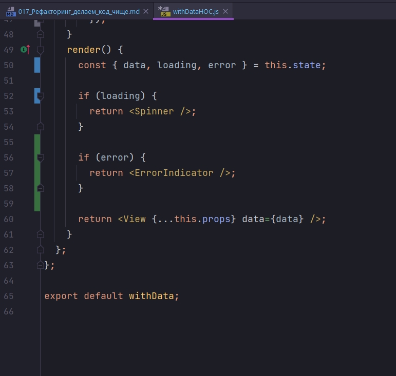

# 017_Рефакторинг_делаем_код_чище

С кодом все работает точно так же как с созданием мебели.

Пока вы обрабатываете дерево, стружки и опилки неизбежно попадают на рабочие поверхности. Но пока мусора немного, его можно считать частью рабочего процесса. Но нельза допускать что бы вся мастерская была им завалена.

В нашем коде можно считать такие мелочи вроде не используемых импортов, warning - предупреждений которые появляются в консоли, забытых обработчиков ошибок. И блоков кода которые находяться не на своем месте.

В этом видео мы не будем рассматривать ни каких новых концепций. В место этого мы подготовим наш проект к следующему блоку и сделаем так что бы наш код стал аккуратным и чистым.

Для начало посмотрим на App. Убираю фукцию toggleRandomPlanet


Нам нужна была эта функция когда мы показывали что randomPlanet может создавать memory Links т.е. утечку памяти.

Далее добавляю назад блок рандомной планенты и по умолчанию ставлю SwapiService.


```js
//src/component/app?App.js
import React, { Component } from "react";
import Header from "../header/header";
import "./App.css";
import SwapiService from "../../services/SwapiService";
import ErrorBoundary from "../errorBoundary/errorBoundary";
import Row from "../row/row";
import {
  PersonList,
  StarshipList,
  PlanetList,
} from "../sw-components/itemLists";
import PersonDetails from "../sw-components/personDetails";
import PlanetDetails from "../sw-components/planetDetails";
import StarshipDetails from "../sw-components/starshipDetails";
import { SwapiServiceProvider } from "../swapiServiceContext/swapiServiceContext";
import DummySwapiService from "../../services/dummySwapiService";
import RandomPlanet from "../randomPlanet/randomPlanet";

class App extends Component {
  state = {
    showRandomPlanet: true,
    swapiService: new SwapiService(),
  };

  //Функция переключения сервисов API
  onServiceChange = () => {
    this.setState(({ swapiService }) => {
      //Наш новый сервис зависит от того какой тип у текущего сервиса
      const Service =
        swapiService instanceof SwapiService ? DummySwapiService : SwapiService;
      // Проверяю переключение
      console.log("switched to", Service.name);
      //Возвращаю обновленную часть состояния
      return {
        swapiService: new Service(),
      };
    });
  };

  render() {
    const { showRandomPlanet, swapiService } = this.state;

    //Отображение рандомной планеты
    const planet = showRandomPlanet ? <RandomPlanet /> : null;

    return (
      <ErrorBoundary>
        <SwapiServiceProvider value={swapiService}>
          <div className="stardb-app">
            <Header onServiceChange={this.onServiceChange} />
            {planet}
            <Row left={<PersonList />} right={<PersonDetails itemId={11} />} />
            <Row
              left={<StarshipList />}
              right={<StarshipDetails itemId={5} />}
            />
            <Row left={<PlanetList />} right={<PlanetDetails itemId={5} />} />
          </div>
        </SwapiServiceProvider>
      </ErrorBoundary>
    );
  }
}

export default App;

```


И так как видим у меня блок Row есть. Он же его восстанавливает.

И так у меня есть компонент peoplePage. Прикол в том что он сейчас не используется вообще нигде. Я его просто удалю...


Далее создаю новую папку pages и в ней создаю peoplePage, planetsPage и starshipPage. Пока что эти комопоненты будут как две капли воды похожи друг на друга. Но в этот раз я иду на небольшое копирование кода сознательно, поскольку в следующем блоке этого курса мы посмотрим как дать этим страницам немножечко разное поведение. И по этому нам будет намного удобнее сравнивать этот код

```js
import React, { Component } from "react";
import Row from "../../row/row";
import { PersonList } from "../../sw-components/itemLists";
import PersonDetails from "../../sw-components/personDetails";

class PeoplePage extends Component {
  state = { selectedItem: null };

  onItemSelected = (selectedItem) => {
    this.setState({
      selectedItem,
    });
  };
  render() {
    const { selectedItem } = this.state;
    return (
      <Row
        left={<PersonList onItemSelected={this.onItemSelected} />}
        right={<PersonDetails itemId={selectedItem} />}
      />
    );
  }
}

export default PeoplePage;

```


И так компонента peoplePage готов. Я перенес разметку Row из компонента App в компонент peoplePage. И я добавил очень простой onItemSelected - eventListener который срабатывает когда пользователь нажимает на один из элементов списка PersonList. И все что мы делаем в функции onItemSelected - это устанавливаем текущий выбранный элемент, id этого элемента в selectedItem. Затем этот selectedItem используется для того что бы отобразить  PersonDetails.

```js
//src/component/app?App.js
import React, { Component } from "react";
import Header from "../header/header";
import "./App.css";
import SwapiService from "../../services/SwapiService";
import ErrorBoundary from "../errorBoundary/errorBoundary";
import Row from "../row/row";
import {
  PersonList,
  StarshipList,
  PlanetList,
} from "../sw-components/itemLists";
import PersonDetails from "../sw-components/personDetails";
import PlanetDetails from "../sw-components/planetDetails";
import StarshipDetails from "../sw-components/starshipDetails";
import { SwapiServiceProvider } from "../swapiServiceContext/swapiServiceContext";
import DummySwapiService from "../../services/dummySwapiService";
import RandomPlanet from "../randomPlanet/randomPlanet";
import PeoplePage from "../pages/peoplePage/peoplePage";

class App extends Component {
  state = {
    showRandomPlanet: true,
    swapiService: new SwapiService(),
  };

  //Функция переключения сервисов API
  onServiceChange = () => {
    this.setState(({ swapiService }) => {
      //Наш новый сервис зависит от того какой тип у текущего сервиса
      const Service =
        swapiService instanceof SwapiService ? DummySwapiService : SwapiService;
      // Проверяю переключение
      console.log("switched to", Service.name);
      //Возвращаю обновленную часть состояния
      return {
        swapiService: new Service(),
      };
    });
  };

  render() {
    const { showRandomPlanet, swapiService } = this.state;

    //Отображение рандомной планеты
    const planet = showRandomPlanet ? <RandomPlanet /> : null;

    return (
      <ErrorBoundary>
        <SwapiServiceProvider value={swapiService}>
          <div className="stardb-app">
            <Header onServiceChange={this.onServiceChange} />
            {planet}
            <PeoplePage />
            <Row
              left={<StarshipList />}
              right={<StarshipDetails itemId={5} />}
            />
            <Row left={<PlanetList />} right={<PlanetDetails itemId={5} />} />
          </div>
        </SwapiServiceProvider>
      </ErrorBoundary>
    );
  }
}

export default App;

```


Теперь точно так же создадим страницы для PlanetsPage и StarshipPage.

```js
import React, { Component } from "react";
import Row from "../../row/row";
import { PlanetList } from "../../sw-components/itemLists";
import PlanetDetails from "../../sw-components/planetDetails";

class PlanetsPage extends Component {
  state = { selectedItem: null };

  onItemSelected = (selectedItem) => {
    this.setState({
      selectedItem,
    });
  };
  render() {
    const { selectedItem } = this.state;
    return (
      <Row
        left={<PlanetList onItemSelected={this.onItemSelected} />}
        right={<PlanetDetails itemId={selectedItem} />}
      />
    );
  }
}

export default PlanetsPage;

```

```js
import React, { Component } from "react";
import { StarshipList } from "../../sw-components/itemLists";
import StarshipDetails from "../../sw-components/starshipDetails";
import Row from "../../row/row";

class StarshipPage extends Component {
  state = { selectedItem: null };

  onItemSelected = (selectedItem) => {
    this.setState({ selectedItem });
  };
  render() {
    const { selectedItem } = this.state;
    return (
      <Row
        left={<StarshipList onItemSelected={this.onItemSelected} />}
        right={<StarshipDetails itemId={selectedItem} />}
      />
    );
  }
}

export default StarshipPage;

```

```js
//src/component/app?App.js
import React, { Component } from "react";
import Header from "../header/header";
import "./App.css";
import SwapiService from "../../services/SwapiService";
import ErrorBoundary from "../errorBoundary/errorBoundary";
import Row from "../row/row";
import {
  PersonList,
  StarshipList,
  PlanetList,
} from "../sw-components/itemLists";
import PersonDetails from "../sw-components/personDetails";
import PlanetDetails from "../sw-components/planetDetails";
import StarshipDetails from "../sw-components/starshipDetails";
import { SwapiServiceProvider } from "../swapiServiceContext/swapiServiceContext";
import DummySwapiService from "../../services/dummySwapiService";
import RandomPlanet from "../randomPlanet/randomPlanet";
import PeoplePage from "../pages/peoplePage/peoplePage";
import PlanetsPage from "../pages/planetsPage/planetsPage";
import StarshipPage from "../pages/starshipPage/starshipPage";

class App extends Component {
  state = {
    showRandomPlanet: true,
    swapiService: new SwapiService(),
  };

  //Функция переключения сервисов API
  onServiceChange = () => {
    this.setState(({ swapiService }) => {
      //Наш новый сервис зависит от того какой тип у текущего сервиса
      const Service =
        swapiService instanceof SwapiService ? DummySwapiService : SwapiService;
      // Проверяю переключение
      console.log("switched to", Service.name);
      //Возвращаю обновленную часть состояния
      return {
        swapiService: new Service(),
      };
    });
  };

  render() {
    const { showRandomPlanet, swapiService } = this.state;

    //Отображение рандомной планеты
    const planet = showRandomPlanet ? <RandomPlanet /> : null;

    return (
      <ErrorBoundary>
        <SwapiServiceProvider value={swapiService}>
          <div className="stardb-app">
            <Header onServiceChange={this.onServiceChange} />
            {planet}
            <PeoplePage />
            <StarshipPage />
            <PlanetsPage />
          </div>
        </SwapiServiceProvider>
      </ErrorBoundary>
    );
  }
}

export default App;

```


Кроме того мы решили что RandomPlanet будет всегда отображаться, мы не будем его включать и выключать. Поскольку мы не хотим демонстрировать какая у нас утечка в памяти. По этому избавляюсь от состояния и просто отображаю компонент.

```js
//src/component/app?App.js
import React, { Component } from "react";
import Header from "../header/header";
import "./App.css";
import SwapiService from "../../services/SwapiService";
import ErrorBoundary from "../errorBoundary/errorBoundary";
import { SwapiServiceProvider } from "../swapiServiceContext/swapiServiceContext";
import DummySwapiService from "../../services/dummySwapiService";
import RandomPlanet from "../randomPlanet/randomPlanet";
import PeoplePage from "../pages/peoplePage/peoplePage";
import PlanetsPage from "../pages/planetsPage/planetsPage";
import StarshipPage from "../pages/starshipPage/starshipPage";

class App extends Component {
  state = {
    swapiService: new SwapiService(),
  };

  //Функция переключения сервисов API
  onServiceChange = () => {
    this.setState(({ swapiService }) => {
      //Наш новый сервис зависит от того какой тип у текущего сервиса
      const Service =
        swapiService instanceof SwapiService ? DummySwapiService : SwapiService;
      // Проверяю переключение
      console.log("switched to", Service.name);
      //Возвращаю обновленную часть состояния
      return {
        swapiService: new Service(),
      };
    });
  };

  render() {
    const { swapiService } = this.state;

    return (
      <ErrorBoundary>
        <SwapiServiceProvider value={swapiService}>
          <div className="stardb-app">
            <Header onServiceChange={this.onServiceChange} />
            <RandomPlanet />
            <PeoplePage />
            <StarshipPage />
            <PlanetsPage />
          </div>
        </SwapiServiceProvider>
      </ErrorBoundary>
    );
  }
}

export default App;

```


И добавлю обработку ошибок в withData. Добавляю в state параметр loading:false и параметр error:false.

Теперь обновим код этого компонента так что бы эти значения устанавливались а затем использовались в функции render.





```js
//src/hoc-helpers/withDataHOC.js
import React, { Component } from "react";
import Spinner from "../spinner/spinner";
import ErrorIndicator from "../errorIndicator/errorIndicator";

const withData = (View) => {
  return class extends Component {
    state = {
      data: null,
      loading: true, //Всегда ставь по умолчанию что зарузка произошла
      error: false,
    };

    //инициализирую компонент
    componentDidMount() {
      this.update();
    }
    //Обновляю компонент
    componentDidUpdate(prevProps, prevState, snapshot) {
      //Проверяю прилетевший props с prevProps
      if (this.props.getData !== prevProps.getData) {
        this.update();
      }
    }

    //Функция обновления компонента
    update() {
      //Обработка загрузки
      this.setState({
        loading: true,
        error: false,
      });
      //Получение данных
      this.props
        .getData()
        .then((data) => {
          this.setState({
            data: data,
            loading: false,
          });
        })
        .catch(() => {
          this.setState({
            loading: false,
            error: true,
          });
        });
    }
    render() {
      const { data, loading, error } = this.state;

      if (loading) {
        return <Spinner />;
      }

      if (error) {
        return <ErrorIndicator />;
      }

      return <View {...this.props} data={data} />;
    }
  };
};

export default withData;

```

> Рефакторинг
> 
> Опытные программисты рассматривают систему как историю, которую они должны рассказать, а не как программу, которую нужно написать. Они используют средства выбранного ими языка программирования для конструирования гораздо более богатого и выразительного языка, подходящего для этого повествования
> 
> Robert Martin


