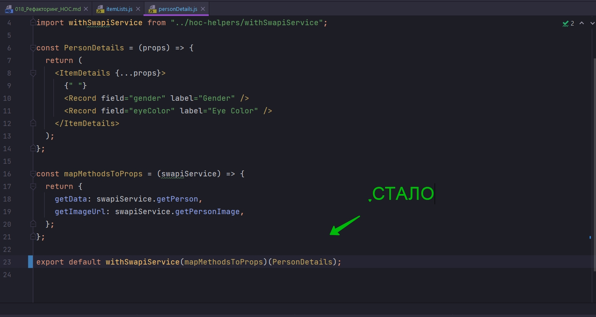

# 018_Рефакторинг_HOC

Посмотрим на файл ItemLists. Это тот самый файл в котором мы тестировали как работают компоненты высшего порядка.

```js
//src/sw-components/itemList
import React from "react";
import ItemList from "../itemList/itemList";
import withData from "../hoc-helpers/withDataHOC";
import withSwapiService from "../hoc-helpers/withSwapiService";

// Создаю функцию HOC, render функцию
const withChildFunction = (Wrapped, fn) => {
  return (props) => {
    return <Wrapped {...props}>{fn}</Wrapped>;
  };
};

//Выношу render функцию
const renderName = ({ name }) => <span>{name}</span>;

// Модель коробля
const renderModelAndName = ({ model, name }) => (
  <span>
    {name} ({model})
  </span>
);

// Маппинг персонажей
const mapPersonMethodsToProps = (swapiService) => {
  return { getData: swapiService.getAllPeople };
};
// Маппинг планет
const mapPlanetMethodsToProps = (swapiService) => {
  return { getData: swapiService.getAllPlanets };
};
// Маппинг космических кораблей
const mapStarshipMethodsToProps = (swapiService) => {
  return { getData: swapiService.getAllStarships };
};

//Создаю компонент для render функции
const PersonList = withSwapiService(
  withData(withChildFunction(ItemList, renderName)),
  mapPersonMethodsToProps
);

const PlanetList = withSwapiService(
  withData(withChildFunction(ItemList, renderName)),
  mapPlanetMethodsToProps
);

const StarshipList = withSwapiService(
  withData(withChildFunction(ItemList, renderModelAndName)),
  mapStarshipMethodsToProps
);

export { PersonList, PlanetList, StarshipList };

```

Этот код демонстрирует силу и гибкость композиций функций. Каждая маленькая функция


это как бы кусочек мозайки, который добавляет один аспект к поведению компонента. А в результате мы получаем сложные компоненты, постороенные без копирования кода. Но если вы следили за прошлыми уроками, то заметили что код со временем, визуально становился все сложнее и сложнее. В этом выраении, что на скрине выше, уже трудно сказать, к какой именно функции относится аргумент mapStarshipMethodsToProps.

Что бы существенно упростить этот код, нам нужно будет еще существенно погрузится в функциональное программирование.

ВАЖНОЕ ЗАМЕЧАНИЕ!!! Эта техника, как и множество других, нужна только для того что бы код выглядел лучше и его легче было поддерживать. Никакой новой функциональности к нашему проекту эта техника не добавит.


И так у нас есть три функции каждая из которых работает с результатов вызова предыдущей функции. ВИЗУАЛЬНЫЙ ПРИМЕР


Читая такой код нужно прилагать не мало усилий для того что бы не потерятся в количестве открывающихся и закрывающихся скобок. И очень внимательно смотреть между какими скобками нужно добавить аргументы что бы передать их в правильные функции.


Вот такой вот не красвый код у нс с вами получился. Если мы будем пытаться читать его слева на право, как бы пытаясь понять что он делает, то нам будет очень сложно перепрыгивать между функциями и их аргументами.

Мы можем сделать так что бы аргументы не нужно было выносить в конец перед закрывающимися скобками, а сделать так что ы аргументы стояли рядом с теми функцими к которым они относятся.

Мы можем сделать вот так. взять и аргументы функции поставить рядом с функциями... БЫЛО


СТАЛО


Этот код уже как минимум можно читать.

Но давайте представим что аргументов может быть больше чем один, и некоторые аргументы могут быть опциональными(не обязательными). 

Это значить что нам нужно будет помнить что например в функции  withSwapiService, <Component/> должен идти на третьем месте в списке аргументов. Это значит что нам придется заполнять опциональные аргументы либо null или undefined.


посмотрим на вот такой вот код

```js
const add = (a,b) => a + b;
add(1,3)
```

Но мы бы могди написать точно такую же логику используя замыкание

```js
const add = (a) => (b) => a + b;
add(1)(3)
```

Теперь у нас есть две функции. Функция "a" возвращает анонимную функцию которая принимает значение "b".

Смотрим на вызов. Наш первый вызов создает функцию, мы передаем в нее чать аргументов, она возвращает анонимную функцию которая принимает остальные аргументы и выполняет нужное нам действие. 

Если мы перепишем наши компоненты высшего порядка вот таким вот способом

```js
const add = (a) => (b) => a + b;
add(1)(3)
```

то мы могли бы разделить аргументы на две группы.

1. В первой группе будут все аргументы которые используются для конфигурации компоненты высшего порядка
2. А во второй группе только сам компонент который мы оборачиваем.

Тогда наш код выглядел бы вот так


Теперь если один из компонентво высшего порядка принимает несколько опциональных аргументов, для того что бы сконфигурировать как именно он будет оборачивать наш компонент, все эти аргументы мы можем передать в нашу первую функцию.  И нам не нужно будет заботиться о том что бы помнить, на каком  все же месте должен стоять сам компонент.

Возвращаюсь в проект и провожу рефакторинг. А затем мы перепишем код из ItemLists, вот так что бы этот код


читался немного удобнее.

Перехожу в withSwapiService

БЫЛО

```js
import React from "react";
import { SwapiServiceConsumer } from "../swapiServiceContext/swapiServiceContext";

const withSwapiService = (Wrapped, mapMethodsToProps) => {
  return (props) => {
    return (
      <SwapiServiceConsumer>
        {(swapiService) => {
          // результатом прилетают getData, getImageUrl
          const serviceProps = mapMethodsToProps(swapiService);
          return <Wrapped {...props} {...serviceProps} />;
        }}
      </SwapiServiceConsumer>
    );
  };
};

export default withSwapiService;

```

Теперь withSwapiService это функция которая возвращает функцию. И первая из двух функций принимает mapMethodsToProps. А вторая только Wrapped т.е. сам компонент.

```js
import React from "react";
import { SwapiServiceConsumer } from "../swapiServiceContext/swapiServiceContext";

const withSwapiService = (mapMethodsToProps) => (Wrapped) => {
  return (props) => {
    return (
      <SwapiServiceConsumer>
        {(swapiService) => {
          // результатом прилетают getData, getImageUrl
          const serviceProps = mapMethodsToProps(swapiService);
          return <Wrapped {...props} {...serviceProps} />;
        }}
      </SwapiServiceConsumer>
    );
  };
};

export default withSwapiService;

```

Второй компонент который мы перепишем таким же образом это withChildFunction


И теперь мы можем переписать наш код.


Теперь вы можете сравнить насколько сильно отличаются эти два стиля композиции функций. withSwapiService который сконфигурирован с mapPersonMethodsToProps. Оборачивает withData который оборачивает withChildFunction который оборачивает ItemList.

Код теперь читается последовательно слева направо. И таким способом что бы понять что именно делает код намного проще.

Теперь что бы проект не сломался нужно е забыть обновить другие файлы которые используют withSwapiService. Поскольку мы изменили то как работает withSwapiService. Эти компоненты находяться в sw-components PersonDetails




```js
import React from "react";
import ItemDetails from "../itemDetails/itemDetails";
import { Record } from "../itemDetails/record/record";
import withSwapiService from "../hoc-helpers/withSwapiService";

const PersonDetails = (props) => {
  return (
    <ItemDetails {...props}>
      {" "}
      <Record field="gender" label="Gender" />
      <Record field="eyeColor" label="Eye Color" />
    </ItemDetails>
  );
};

const mapMethodsToProps = (swapiService) => {
  return {
    getData: swapiService.getPerson,
    getImageUrl: swapiService.getPersonImage,
  };
};

export default withSwapiService(mapMethodsToProps)(PersonDetails);

```

```js
import React from "react";
import ItemDetails from "../itemDetails/itemDetails";
import { Record } from "../itemDetails/record/record";
import withSwapiService from "../hoc-helpers/withSwapiService";

const PlanetDetails = (props) => {
  return (
    <ItemDetails {...props}>
      <Record field="planet" label="Planet" />
      <Record field="rotationPeriod" label="Rotation Period" />
      <Record field="diameter" label="Diameter" />
    </ItemDetails>
  );
};

const mapMethodsToProps = (swapiService) => {
  return {
    getData: swapiService.getPlanet,
    getImageUrl: swapiService.getPlanetImage,
  };
};

export default withSwapiService(mapMethodsToProps)(PlanetDetails);

```

```js
import React from "react";
import ItemDetails from "../itemDetails/itemDetails";
import { Record } from "../itemDetails/record/record";
import withSwapiService from "../hoc-helpers/withSwapiService";

const StarshipDetails = (props) => {
  return (
    <ItemDetails {...props}>
      <Record field="model" label="Model" />
      <Record field="length" label="Length" />
      <Record field="costInCredits" label="Cost" />
    </ItemDetails>
  );
};

const mapMethodsToProps = (swapiService) => {
  return {
    getData: swapiService.getStarship,
    getImageUrl: swapiService.getStarshipImage,
  };
};

export default withSwapiService(mapMethodsToProps)(StarshipDetails);

```


И так наши компоненты работают так как они и работали раньше. А один из наших самых сложных блоков кода стал выглядеть намного легче.

```js
//src/sw-components/itemList
import React from "react";
import ItemList from "../itemList/itemList";
import withData from "../hoc-helpers/withDataHOC";
import withSwapiService from "../hoc-helpers/withSwapiService";

// Создаю функцию HOC, render функцию
const withChildFunction = (fn) => (Wrapped) => {
  return (props) => {
    return <Wrapped {...props}>{fn}</Wrapped>;
  };
};

//Выношу render функцию
const renderName = ({ name }) => <span>{name}</span>;

// Модель коробля
const renderModelAndName = ({ model, name }) => (
  <span>
    {name} ({model})
  </span>
);

// Маппинг персонажей
const mapPersonMethodsToProps = (swapiService) => {
  return { getData: swapiService.getAllPeople };
};
// Маппинг планет
const mapPlanetMethodsToProps = (swapiService) => {
  return { getData: swapiService.getAllPlanets };
};
// Маппинг космических кораблей
const mapStarshipMethodsToProps = (swapiService) => {
  return { getData: swapiService.getAllStarships };
};

//Создаю компонент для render функции
const PersonList = withSwapiService(mapPersonMethodsToProps)(
  withData(withChildFunction(renderName)(ItemList))
);

const PlanetList = withSwapiService(mapPlanetMethodsToProps)(
  withData(withChildFunction(renderName)(ItemList))
);

const StarshipList = withSwapiService(mapStarshipMethodsToProps)(
  withData(withChildFunction(renderModelAndName)(ItemList))
);

export { PersonList, PlanetList, StarshipList };

```

> Рефакторинг HOC
> 
> Техника которую мы использовали называется "частичное применение функции"(partially applied function)
> 
> const add = (a) => (b) => a + b пример такой функции
> 
> Такие функции принимают часть аргументов и возвращают новые функции - с меньшим количеством аргументов