# 019_Функция_compose


Это еще одно опциональное видео которое покажет как еще можно проще работать с компонентами высшего порядка. И так наш код стал лучше.

```js
//src/sw-components/itemList
import React from "react";
import ItemList from "../itemList/itemList";
import withData from "../hoc-helpers/withDataHOC";
import withSwapiService from "../hoc-helpers/withSwapiService";

// Создаю функцию HOC, render функцию
const withChildFunction = (fn) => (Wrapped) => {
  return (props) => {
    return <Wrapped {...props}>{fn}</Wrapped>;
  };
};

//Выношу render функцию
const renderName = ({ name }) => <span>{name}</span>;

// Модель коробля
const renderModelAndName = ({ model, name }) => (
  <span>
    {name} ({model})
  </span>
);

// Маппинг персонажей
const mapPersonMethodsToProps = (swapiService) => {
  return { getData: swapiService.getAllPeople };
};
// Маппинг планет
const mapPlanetMethodsToProps = (swapiService) => {
  return { getData: swapiService.getAllPlanets };
};
// Маппинг космических кораблей
const mapStarshipMethodsToProps = (swapiService) => {
  return { getData: swapiService.getAllStarships };
};

//Создаю компонент для render функции
const PersonList = withSwapiService(mapPersonMethodsToProps)(
  withData(withChildFunction(renderName)(ItemList))
);

const PlanetList = withSwapiService(mapPlanetMethodsToProps)(
  withData(withChildFunction(renderName)(ItemList))
);

const StarshipList = withSwapiService(mapStarshipMethodsToProps)(
  withData(withChildFunction(renderModelAndName)(ItemList))
);

export { PersonList, PlanetList, StarshipList };

```

У нас с вами получилась довольно красивая схема. Каждый компонент высшего порядка. Каждая функция, после того как мы ее частично сконфигурировали, принимает ровно один аргумент. Это тот компонент который нужно обернуть

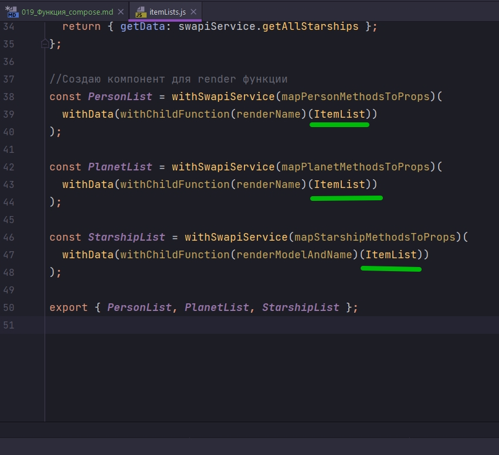

А затем обернутый компонент передается функции выше по цепочке и так далее. Алгоритм того как работает наша композиция очень-очень простой. Получил аорумент передал его функции, вызвал функцию результат этой функции передал функции выше, вызвал функцию и передал результат этой функции выше и т.д. до тех пор пока мы не закончим цепочку.

И такой просто алгоритм наверняка не сложно было бы реализовать ввиде отдельной функции. 

Давайте предствим как бы мы написали функцию compose которая делает за нас эту композицию.


Если бы у нас была функция, которая скажем называлась бы compose. Мы бы могли передать в нее несколько функций, композицию которых мы бы хотели получить

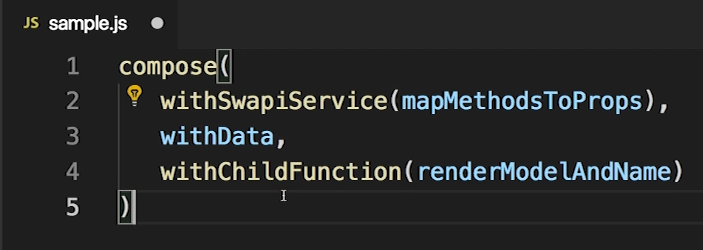

А затем, скажем эта функция compose, возвращала бы композицию этих функций. Т.е. другую функцию, которая тоже принимает только один аргумент, компонент который мы хотим обернуть ItemList.

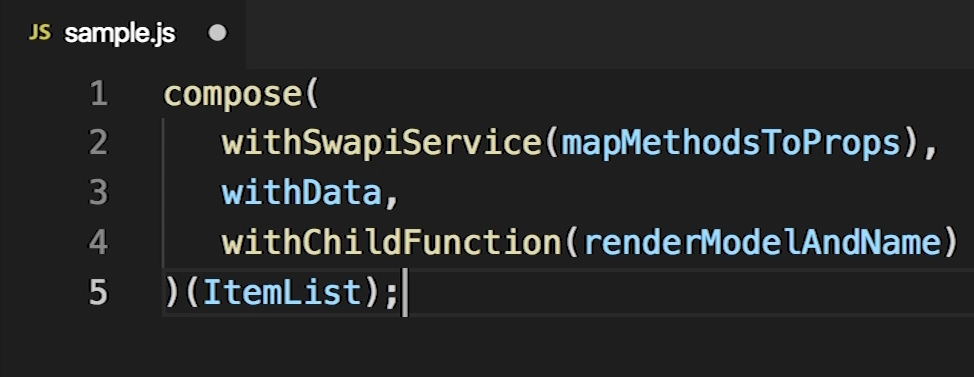

И затем этот компонент,ItemList, пройдет через те функции которые мы передали в функцию compose, withChildFunction, withData, withSwapiService.

И как видите этот код читать совсем легко. Мы делаем компонент который состоит как бы из нескольких слоев. И эти слои даже визуально в коде выглядят как слои.


В самом низу у нас компонент, ItemList. Сверху его оборачивает withChildFunction, withData, withSwapiService.

Осталось самую малость, написать собственно функцию compose. Структура такой функции в общем-то понятна.  compose будет принимать набор функций funcs, будет возвращать новую функцию которая принимает component, и дальше у нас будет тело которое нам предстоит написать.

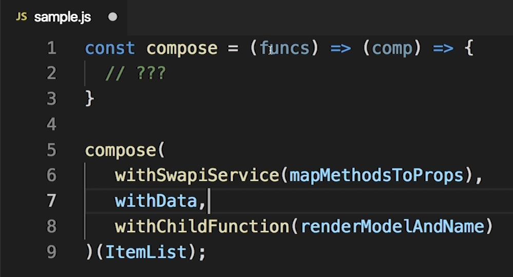

В функции compose funcs -это массив. Мы хотим передать массив функций.

Но для того что бы код было писать проще, и не нужно было оборачивать наши функции в массив в явном виде, мы можем использовать rest arguments. И тогда все значения, которые примерт функция compose, будут автоматически обернуты в массив. Соответственно параметр funcs всегда будет массивом.

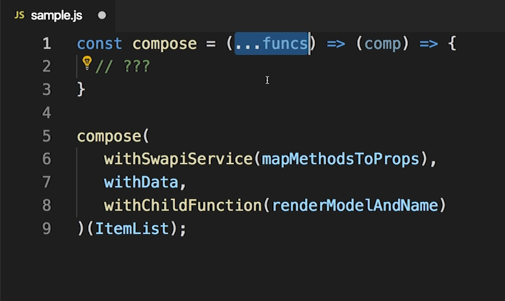

Если у нас есть массив из вот таких вот трех функций

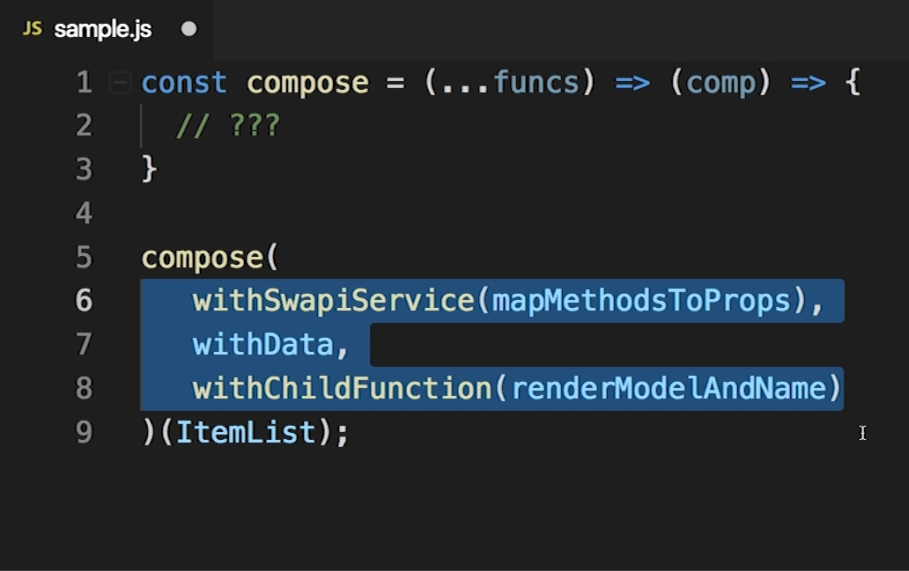

Напомню каждый элемент - это функция. Строки 8 и 6 это тоже функции которые возвращают еще одни функции, у нас три функции в этом массиве. 

Все что нам нужно сделать это пройтись по этим функциям справо а лево, сначало withChildFunction и передать ему ItemList, затем withData, затем withSwapiService, передавая каждой следующей функции результат работы предыдущей функции.

Написать такой код совсем не сложно. Самый очевидный способ написать его это использовать просто итерацию по массиву funcs, мы можем пройтись по этому массиву справо на лево, вызвать каждую функцию передавая каждой функции результат предыдущей фукции. И затем вернуть самый последний результат назад из функции compose.


И Я ОСТАВЛЮ ВАМ ЭТОТ КОД КАК УПРАЖНЕНИЕ.

НО ЕСТЬ НАМНОГО БОЛЕЕ ЭЛЕГАНТНЫЙ СПОСОБ НАПИСАТЬ ТОТ ЖЕ КОД ПОСКОЛЬКУ В JS ЕСТЬ ОЧЕНЬ УДОБНАЯ ФУНКЦИЯ reduceRight.

reduceRight - как раз проходится по массиву с право на лево, вызывая какую-нибудь функцию для того что бы вычислить значение, а затем передает это значение для того что бы вычислить следующий элемент. ЭТО ИМЕННО ТО ЧТО НАМ НУЖНО СДЕЛАТЬ!!!


Давайте сначало посмотрим как работает reduceRight. Скажем у нас есть массив const arr =['a','b','c']; Далее мы получаем результат в переменную res в значении которой вызываю массив arr у которого вызываю метод reduceRight().

reduceRight() - принимает два аргумента.

1. Это функция которую мы будем вызывать на каждом элементе, сначало на последнем элементе массива, и постепенно перемещаясь к 0 индексу массива. И эта функция принимает два значения - это предыдущий результат prevResult, и текущее значение value. Т.е. value это будет наше текущее значение "c","b","a", а prevResult предыдущий результат это будет результат выполенения этой же функции на прошлом элемента массива. И если эе из этой функции мы вернем к примеру prevResult + value, то reduceRight вернет нам значение 'c','b','a', т.е. все элементы массива поставленные в обратном порядке.

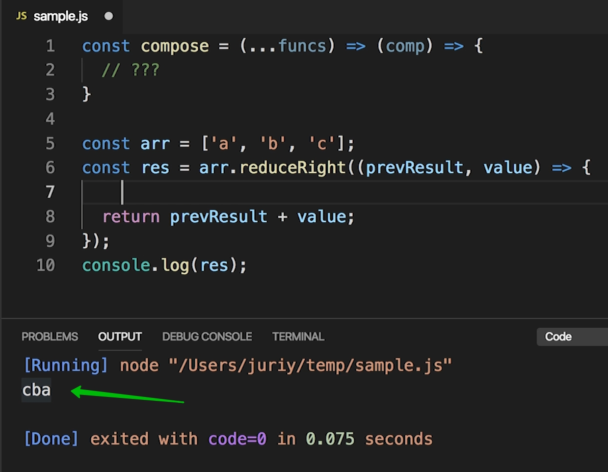

Добавлю console.log() что бы увидеть значения когда reduceRight проходится по массиву справо на лево.

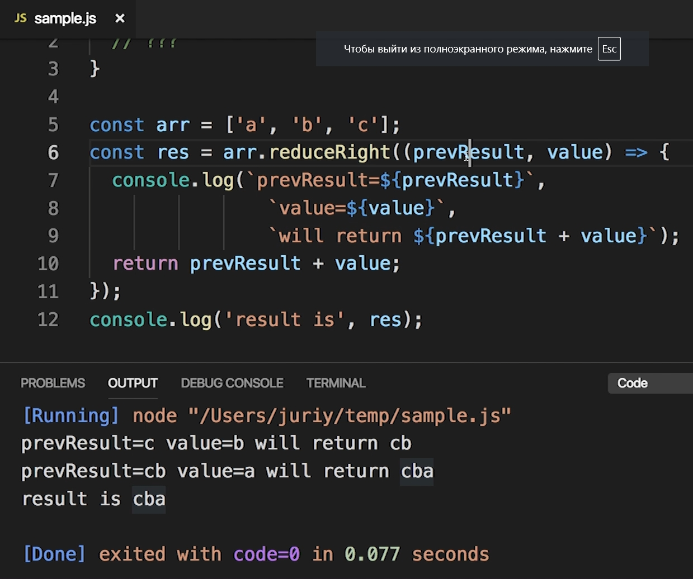

Первый раз когда вызывается функция reduceRight prevResult еще нет. И по этому функция reduceRight в качестве предыдущего результата возьмет просто последный элемент массива. По этому prevResult в первый раз это 'c'. Ну а value соответственно будет следующий элемент массива 'b'. Мы возвращаем prevResult + value т.е. 'c' + 'b'. По этому первый результат reduceRight это 'cb'.

Но на этом проход по массиву еще не закончен, но у нас еще остался элемент 'a'. По этому reduceRight сработает еще раз и возмет элемент 'a' в качестве текущего значения value.  и мы снова возвращаем prevResult + value т.е. 'cb' + 'a'.

2. Если вторым параметром передать какое-то значение, то оно будет использоваться в качестве initial value. Т.е. когда первый раз будет вызываться функция, то prevResult будет значением которое мы указали во втором параметре функции reduceRight.

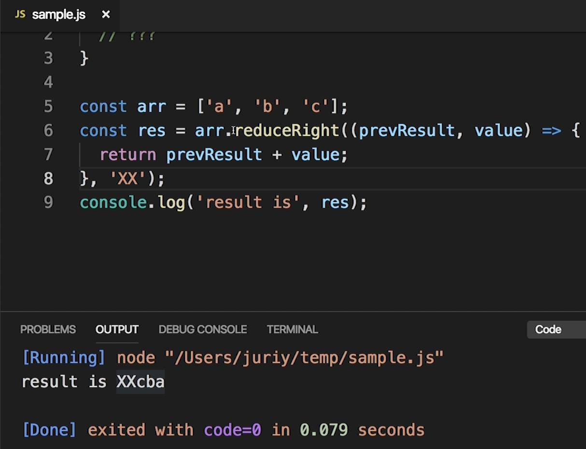

Таким образом мы с вами научились ходить по массиву справо на лево. Для каждого элемента выполнять какую-нибудь функцию, и затем результат работы этой функции передавать в следующую функцию которая будет обрабатывать следующий элемент.

И это именно то что нам нужно для того что бы реализовать функцию compose.

Давайте напишем код для функции compose.

И так funcs это будет наш массив на котором мы применим reduceRight() в которую передаю функцию. В качестве первоначального значения, которое указываю вторым параметром в функцию reduceRight, это наш компонент который мы будем оборачивать т.е. component.

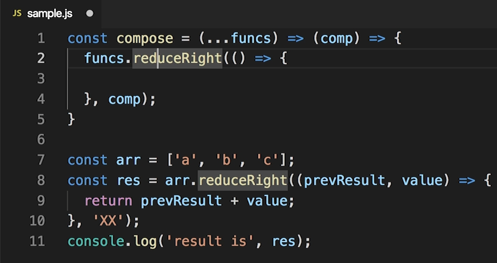

Теперь что нам нужно сделать в callback который принимает reduceRight?
Эта функция принимает prevResult, а prevResult это тот компонент который мы будем оборачивать. И вторым параметром указываю функцию f с которой мы будем работать. Поскольку funcs это массив функций, мы в callback принимаем одну из них в качестве второго аргумента f.

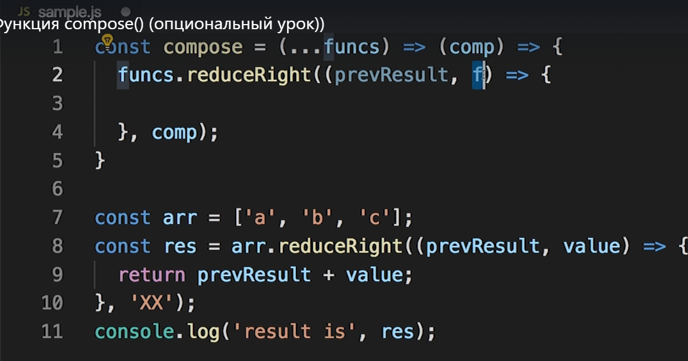

Ну а теперь все что нам нужно сделать это вызвать функци f , передать ей component. Функция f создаст новый компонент который будет оборачивать наш текущий component b и передаст значение следующей функции f справо на лево.

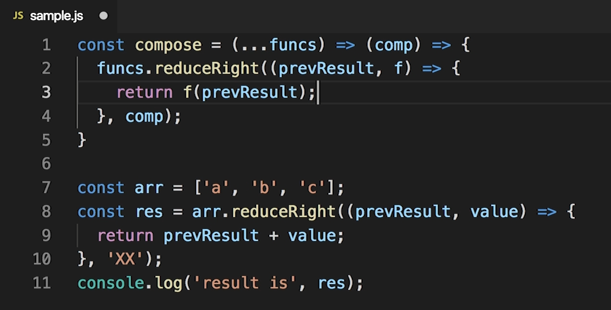

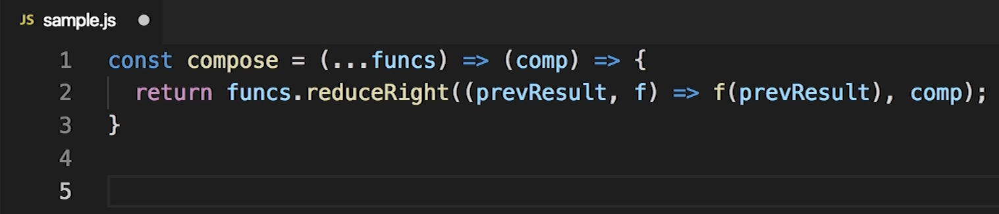

И вот таким вот способом мы получили простую реализацию функции compose.

Специально для этой маленькой функции compose я создам отдельный файл в hoc-helpers файл compose.js.

```js
//src/components/hoc-helpers/compose.js
const compose =
  (...funcs) =>
  (component) => {
    return funcs.reduceRight((prevResult, f) => {
      return f(prevResult);
    }, component);
  };

export default compose;

```

Кстати в ItemLists мы забыли еще перенести в hoc-helpers компонент withChildFunction

```js
//src/components/hoc-helpers/withChildFunction.js
// Создаю функцию HOC, render функцию
import React from "react";

const withChildFunction = (fn) => (Wrapped) => {
  return (props) => {
    return <Wrapped {...props}>{fn}</Wrapped>;
  };
};

export default withChildFunction;

```

Теперь импортирую эти функции withChildFunction и compose.

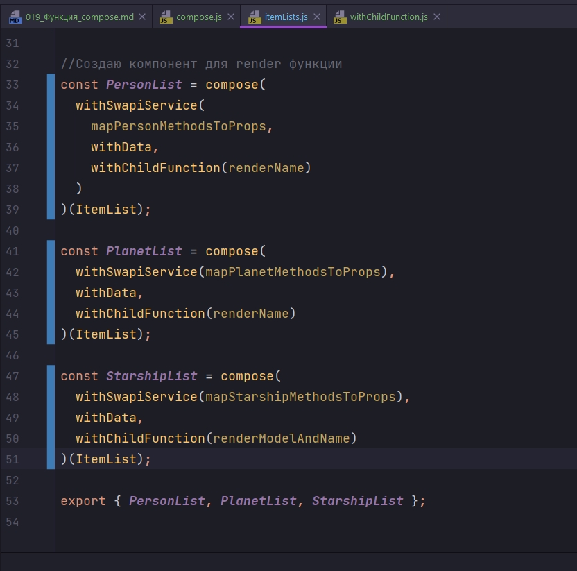

```js
//src/sw-components/itemList
import React from "react";
import ItemList from "../itemList/itemList";
import withData from "../hoc-helpers/withDataHOC";
import withSwapiService from "../hoc-helpers/withSwapiService";
import withChildFunction from "../hoc-helpers/withChildFunction";
import compose from "../hoc-helpers/compose";

//Выношу render функцию
const renderName = ({ name }) => <span>{name}</span>;

// Модель коробля
const renderModelAndName = ({ model, name }) => (
  <span>
    {name} ({model})
  </span>
);

// Маппинг персонажей
const mapPersonMethodsToProps = (swapiService) => {
  return { getData: swapiService.getAllPeople };
};
// Маппинг планет
const mapPlanetMethodsToProps = (swapiService) => {
  return { getData: swapiService.getAllPlanets };
};
// Маппинг космических кораблей
const mapStarshipMethodsToProps = (swapiService) => {
  return { getData: swapiService.getAllStarships };
};

//Создаю компонент для render функции
const PersonList = compose(
  withSwapiService(mapPersonMethodsToProps),
  withData,
  withChildFunction(renderName)
)(ItemList);

const PlanetList = compose(
  withSwapiService(mapPlanetMethodsToProps),
  withData,
  withChildFunction(renderName)
)(ItemList);

const StarshipList = compose(
  withSwapiService(mapStarshipMethodsToProps),
  withData,
  withChildFunction(renderModelAndName)
)(ItemList);

export { PersonList, PlanetList, StarshipList };

```

И этот код выглядит еще лучше чем был. Нужно заметить что такая функция, функция compose есть во многих библиотеках, к примеру в Lodash или Ramda - это очень мощная библиотека для функционального программирования на JS. Ну или библиотеки Recompose - создана специально для работы с компонентами высшего порядка.

И функция compose это один из базовых строительных блоков в функциональном программировании. Как не возможно представить себе язык программирования в котором есть массивы и нет стандартной функции для сортировки, так и функциональное программирование не возможно представить без функции compose.

В прошлых уроках вы видили что композицию функций можно использовать и без дополнительных вспомогательных функций вроде compose.

> Функция compose 
> 
> Реализует композицию ввиде функции

```js
const compose =(...funcs)=>(component) =>{
    return funcs.reduceRight((wrapped, f)=>{
        return f(wrapped)
    }, component)
}

const MyComp = compose(
    withService,
    withData,
    withChild(renderName)
)(SimpleComponent)
```

