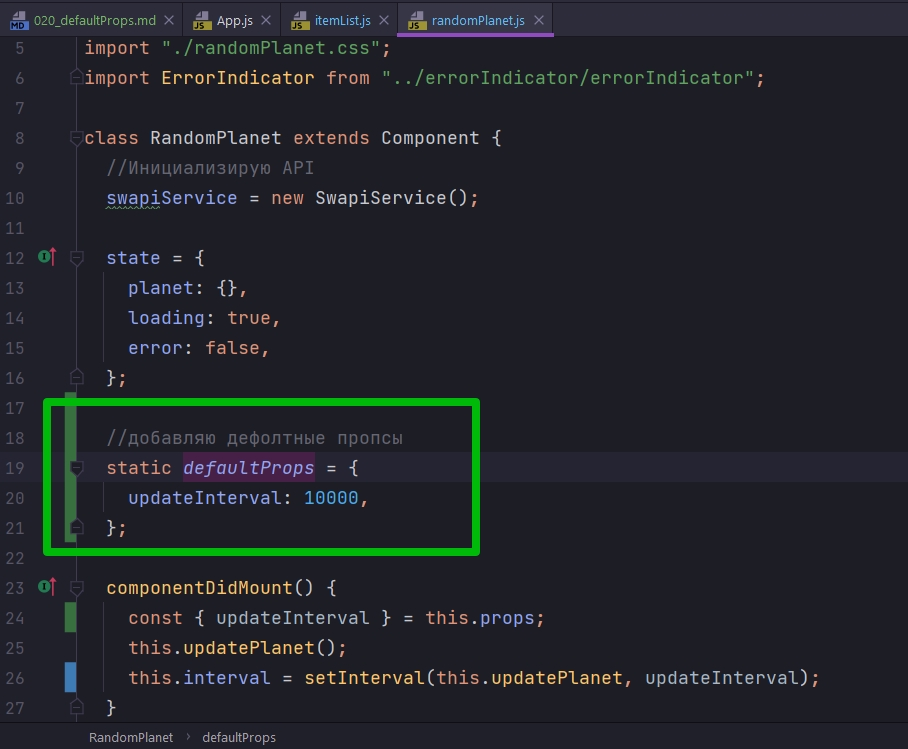

# 020_defaultProps

У React компонентов есть одно особенное свойство которое называется defaultProps. Оно работает точно так же как значение по умолчанию в функциях, только вместо перемера функции defaultProps устанавливет значение по умолчанию для свойств компонентов.

Другими словами если вы не передаете значение какому-нибудь из свойств, то будет использвано значение из defaultProps.


К примеру, в нашем коде есть компоненты, которые расчитывают на то что им передадут какие-нибудь обработчики событий. К примеру компонент ItemList расчитывает что он получит функцию onItemSelected

```js
//src/components/itemList/itemList.js
import React from "react";
import "./itemList.css";

const ItemList = (props) => {
  console.log(props);
  const { data, onItemSelected, children: renderLabel } = props;
  const items = data.map((item) => {
    const { id } = item; // деструктурирую из полученного объекта id
    const label = renderLabel(item); // Прокидываю объект в App, в теле компонента ItemList обрабатываю функцией и достаю интересующие меня значения
    return (
      <li
        className="list-group-item"
        key={id}
        onClick={() => onItemSelected(id)}
      >
        {label}
      </li>
    );
  });

  return <ul className="item-list list-group">{items}</ul>;
};

export default ItemList;

```

onItemSelected - это функция, которую ItemList, будет вызывать тогда когда пользователь кликает на элементе.

А что если мы захотим использовать ItemList просто ради того что бы отображать какой-то список и при этом ни как не реагировать на клики по этому списку.

Конечно прямо в деструктуризации мы можем onItemSelected присвоить значение по умолчанию и сказать что если ничего не передать, то это будет пустая функция. Но этот подход не очень удобный. 

Дело в том что к компоненте классе может быть несколько функций которые работают с props. И каждый раз когда вы будуте работать с onItemSelected вам нужно не забыть поставить вот такое значение по умолчанию () =>{}.

Намного проще будет установить значение по умолчанию один раз. И defaultProps нам как раз позволяет это сделать.

```js
//src/components/itemList/itemList.js
import React from "react";
import "./itemList.css";

const ItemList = (props) => {
  console.log(props);
  const { data, onItemSelected, children: renderLabel } = props;
  const items = data.map((item) => {
    const { id } = item; // деструктурирую из полученного объекта id
    const label = renderLabel(item); // Прокидываю объект в App, в теле компонента ItemList обрабатываю функцией и достаю интересующие меня значения
    return (
      <li
        className="list-group-item"
        key={id}
        onClick={() => onItemSelected(id)}
      >
        {label}
      </li>
    );
  });

  // Установка пропсов по умолчанию
  ItemList.defaultProps = {
    onItemSelected: () => {},
  };

  return <ul className="item-list list-group">{items}</ul>;
};

export default ItemList;

```

В компоненте randomPlanet мы используем заранее определенное число для того что бы естановить период обновления наших планет.


Было бы хорошо вынести это значение в качестве свойства, так что бы мы могли его изменять в зависимости от того какой интервал нам больше всего нравится.

В componentDidMount, в теле функции жизненного цикла компонента, деструктурирую из props updateInterval


Но только теперь есть одна проблема. Для того что бы этот код заработал, все остальные компоненты в приложении которые используют этот компонент, должны передавать свойство updateInterval, потому что если они его не передадут. То по умолчанию оно получит значение undefined. И если мы вызовем setInterval c undefined в качестве второго аргумента, то вместо этого будет использоваться 10 милисек. Т.е. наши планеты начнут обновляться очень быстро.

И мы конечно не хотим ходить по всему проекту и заменять наш код. По этому мы можем задать defaultProps


```js
import React, { Component } from "react";
import SwapiService from "../../services/SwapiService";
import Spinner from "../spinner/spinner";
import PlanetView from "./planetView/planetView";
import "./randomPlanet.css";
import ErrorIndicator from "../errorIndicator/errorIndicator";

class RandomPlanet extends Component {
  //Инициализирую API
  swapiService = new SwapiService();

  state = {
    planet: {},
    loading: true,
    error: false,
  };

  componentDidMount() {
    const { updateInterval } = this.props;
    this.updatePlanet();
    this.interval = setInterval(this.updatePlanet, updateInterval);
  }

  componentWillUnmount() {
    clearInterval(this.interval);
  }

  // Функция загрузки планет
  onPlanetLoaded = (planet) => {
    this.setState({ planet, loading: false });
  };

  //Функция обработки ошибок
  onError = (error) => {
    this.setState({ error: true, loading: false });
  };

  // Функция обновления планеты
  updatePlanet = () => {
    console.log("Проверяю есть ли утечка памяти");
    const id = Math.floor(Math.random() * 25) + 2; //Округляю и устанавливаю диапазон случайных планет
    this.swapiService
      .getPlanet(id)
      .then(this.onPlanetLoaded)
      .catch(this.onError);
  };

  render() {
    const { planet, loading, error } = this.state;

    const errorMessage = error ? <ErrorIndicator /> : null;
    const spinner = loading ? <Spinner /> : null;
    const hasData = !(loading || error); // Получаю данные если нет загрузки или ошибки
    const content = hasData ? <PlanetView planet={planet} /> : null;

    return (
      <div className="random-planet jumbotron rounded">
        {errorMessage}
        {spinner}
        {content}
      </div>
    );
  }
}

//добавляю дефолтные пропсы
RandomPlanet.defaultProps = {
  updateInterval: 10000,
};

export default RandomPlanet;

```

А Теперь если мы в App обновим RandomPlanet и скажем что 


```js
//src/component/app?App.js
import React, { Component } from "react";
import Header from "../header/header";
import "./App.css";
import SwapiService from "../../services/SwapiService";
import ErrorBoundary from "../errorBoundary/errorBoundary";
import { SwapiServiceProvider } from "../swapiServiceContext/swapiServiceContext";
import DummySwapiService from "../../services/dummySwapiService";
import RandomPlanet from "../randomPlanet/randomPlanet";
import PeoplePage from "../pages/peoplePage/peoplePage";
import PlanetsPage from "../pages/planetsPage/planetsPage";
import StarshipPage from "../pages/starshipPage/starshipPage";

class App extends Component {
  state = {
    swapiService: new SwapiService(),
  };

  //Функция переключения сервисов API
  onServiceChange = () => {
    this.setState(({ swapiService }) => {
      //Наш новый сервис зависит от того какой тип у текущего сервиса
      const Service =
        swapiService instanceof SwapiService ? DummySwapiService : SwapiService;
      // Проверяю переключение
      console.log("switched to", Service.name);
      //Возвращаю обновленную часть состояния
      return {
        swapiService: new Service(),
      };
    });
  };

  render() {
    const { swapiService } = this.state;

    return (
      <ErrorBoundary>
        <SwapiServiceProvider value={swapiService}>
          <div className="stardb-app">
            <Header onServiceChange={this.onServiceChange} />
            <RandomPlanet updateInterval={2000} />
            <PeoplePage />
            <StarshipPage />
            <PlanetsPage />
          </div>
        </SwapiServiceProvider>
      </ErrorBoundary>
    );
  }
}

export default App;

```

И да ниши планеты обновляются быстрее. Убираю props из RandomPlanet. Буду использовать defaultProps.


ЕЩЕ ОДИН ВАЖНЫЙ НЮАНС. Для компонентов классов для того что бы использовать вот такой синтексис


Мы можем использовать ключевое слово static



```js
import React, { Component } from "react";
import SwapiService from "../../services/SwapiService";
import Spinner from "../spinner/spinner";
import PlanetView from "./planetView/planetView";
import "./randomPlanet.css";
import ErrorIndicator from "../errorIndicator/errorIndicator";

class RandomPlanet extends Component {
  //Инициализирую API
  swapiService = new SwapiService();

  state = {
    planet: {},
    loading: true,
    error: false,
  };

  //добавляю дефолтные пропсы
  static defaultProps = {
    updateInterval: 10000,
  };

  componentDidMount() {
    const { updateInterval } = this.props;
    this.updatePlanet();
    this.interval = setInterval(this.updatePlanet, updateInterval);
  }

  componentWillUnmount() {
    clearInterval(this.interval);
  }

  // Функция загрузки планет
  onPlanetLoaded = (planet) => {
    this.setState({ planet, loading: false });
  };

  //Функция обработки ошибок
  onError = (error) => {
    this.setState({ error: true, loading: false });
  };

  // Функция обновления планеты
  updatePlanet = () => {
    console.log("Проверяю есть ли утечка памяти");
    const id = Math.floor(Math.random() * 25) + 2; //Округляю и устанавливаю диапазон случайных планет
    this.swapiService
      .getPlanet(id)
      .then(this.onPlanetLoaded)
      .catch(this.onError);
  };

  render() {
    const { planet, loading, error } = this.state;

    const errorMessage = error ? <ErrorIndicator /> : null;
    const spinner = loading ? <Spinner /> : null;
    const hasData = !(loading || error); // Получаю данные если нет загрузки или ошибки
    const content = hasData ? <PlanetView planet={planet} /> : null;

    return (
      <div className="random-planet jumbotron rounded">
        {errorMessage}
        {spinner}
        {content}
      </div>
    );
  }
}

export default RandomPlanet;

```

Этот синтаксис мне нравится больше поскольку теперь defaultProps как бы является частью этого класса.


defaultProps СРАБОТАЕТ ТОЛЬКО КОГДА КОГДА СВОЙСТВА НЕТ ВООБЩЕ ИЛИ В КАЧЕСТВЕ СВОЙСТВА ВЫ ПЕРЕДАЛИ undefined!!!! ЕСЛИ В КАЧЕСТВЕ props ВЫ ПЕРЕДАДИТЕ ЯВНО null, то это считается валидным свойством и defaultProps использоваться не будет.

> defaultProps
> 
> Позволяет установить значение по умолчанию

```js
const Comp = ({name}) =>(<p>{name}</p>);
Comp.defaultProps ={name:'Bob'}

//отрендерит Hi Bob
<Comp/>
```