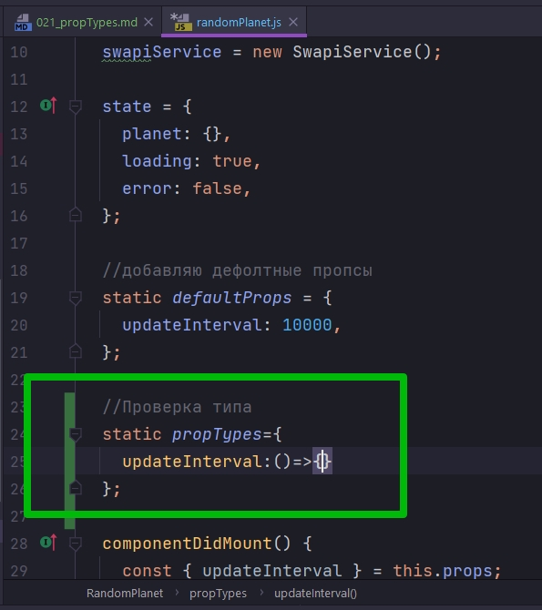
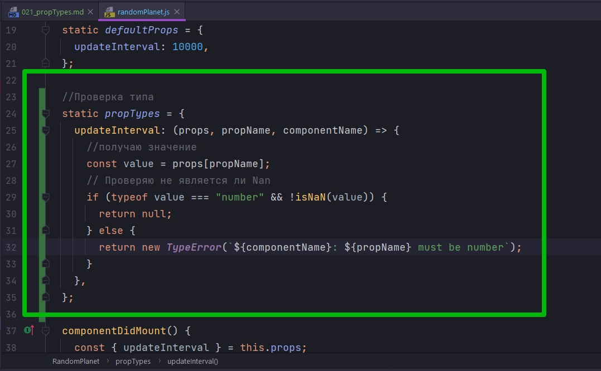
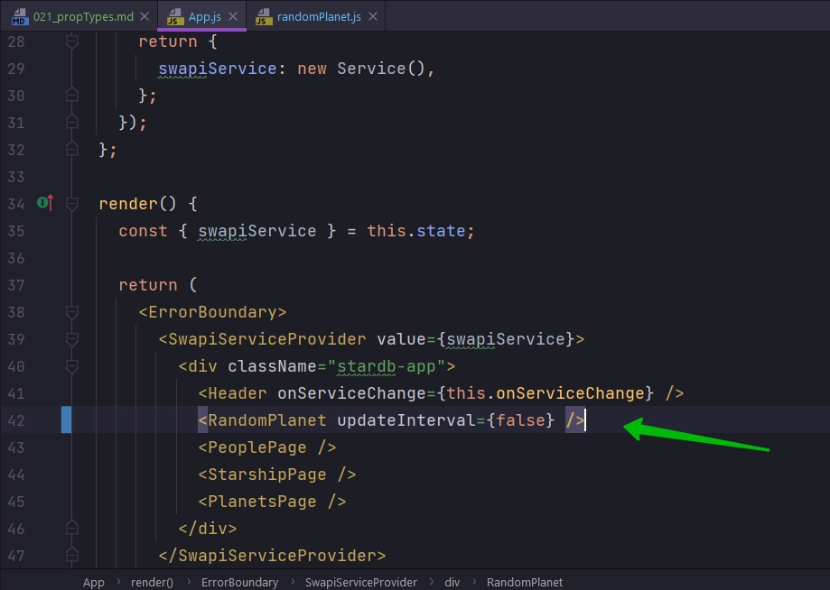
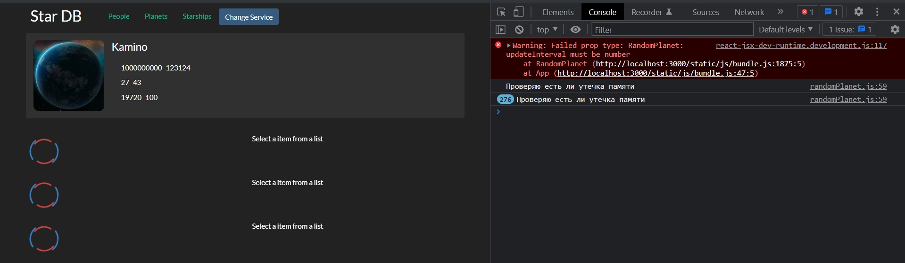
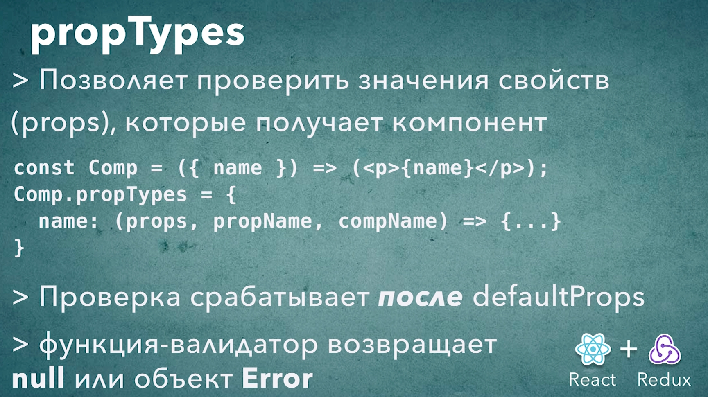

# 021_propTypes

JS - это язык с динамической типизацией. Это означает что мы не указываем типы данных для наших переменных. переменные могут менять тип хранимых данных во время своего эизненного цикла.

А отлов ошибок связанный с неправильным типом данных откладывается до момента запуска приложения.

Языки вроде typeScript добавляют опциональную типизацию в JS. Но многим разработчикам кажется это решение через чур громоздким.

В React есть механизм который позволяет указать типы для свойств компонентов.

Если у нас есть компонент, который ожидает получить свойство число, а мы передадим туда строку, то мы не получим ни какого внятного сообщения об ошибке.

К примеру в RandomPlanet в updateInterval мы ожидаем получить в качестве значения число. Но если сюда передать string, false, undefined, null или любое другое значение. Это значение в том виде в котором мы его получим, оно перейдет в updateInterval в функцию setInterval.

Функция setInterval в свою очередь работает довольно интересно. Если в качестве второго аргумента передать не число а какой-нибудь мусор, то что не приводится к числу, то setInterval установит интервал в 10 милисек. Т.е. у вас не будет ни какой ошибки, но вместо этого планеты бубут обновляться очент быстро и ваше приложение не будет работать так как вы ожидаете.

Согласитесь искать причину такого бага будет намного ложнее чем предотвратить его с самого начала.

В React есть способ проверять значения свойств перед тем как эти значения получит компонент и начнет с ними работать. 


У каждого компонента есть специальное свойство которое называется propTypes. Точно так же как и defaultProps, propsTypes - это объект, название которых с которыми мы будем работать. Если мы хотим проверить значение updateInterval, то в качестве значения устанавливаю ему функцию, которая будет проверять значение updateInterval у компонента.



Эта функция которая принимает три аргумента.

1. props - это весь объект свойств с которым мы работаем
2. propName - имя того свойства для которого сейчас мы проводим валидацию
3. componentName - название компонента для которого мы сейчас проводим валидацию




Если все наши проверки прошли успешно то мы возвращаем null. Но если не прошли проверку мы возвращаем ошибку. Именно возвращаем а не выбрасываем!!!

```js
import React, { Component } from "react";
import SwapiService from "../../services/SwapiService";
import Spinner from "../spinner/spinner";
import PlanetView from "./planetView/planetView";
import "./randomPlanet.css";
import ErrorIndicator from "../errorIndicator/errorIndicator";

class RandomPlanet extends Component {
  //Инициализирую API
  swapiService = new SwapiService();

  state = {
    planet: {},
    loading: true,
    error: false,
  };

  //добавляю дефолтные пропсы
  static defaultProps = {
    updateInterval: 10000,
  };

  //Проверка типа
  static propTypes = {
    updateInterval: (props, propName, componentName) => {
      //получаю значение
      const value = props[propName];
      // Проверяю не является ли Nan
      if (typeof value === "number" && !isNaN(value)) {
        return null;
      } else {
        return new TypeError(`${componentName}: ${propName} must be number`);
      }
    },
  };

  componentDidMount() {
    const { updateInterval } = this.props;
    this.updatePlanet();
    this.interval = setInterval(this.updatePlanet, updateInterval);
  }

  componentWillUnmount() {
    clearInterval(this.interval);
  }

  // Функция загрузки планет
  onPlanetLoaded = (planet) => {
    this.setState({ planet, loading: false });
  };

  //Функция обработки ошибок
  onError = (error) => {
    this.setState({ error: true, loading: false });
  };

  // Функция обновления планеты
  updatePlanet = () => {
    console.log("Проверяю есть ли утечка памяти");
    const id = Math.floor(Math.random() * 25) + 2; //Округляю и устанавливаю диапазон случайных планет
    this.swapiService
      .getPlanet(id)
      .then(this.onPlanetLoaded)
      .catch(this.onError);
  };

  render() {
    const { planet, loading, error } = this.state;

    const errorMessage = error ? <ErrorIndicator /> : null;
    const spinner = loading ? <Spinner /> : null;
    const hasData = !(loading || error); // Получаю данные если нет загрузки или ошибки
    const content = hasData ? <PlanetView planet={planet} /> : null;

    return (
      <div className="random-planet jumbotron rounded">
        {errorMessage}
        {spinner}
        {content}
      </div>
    );
  }
}

export default RandomPlanet;

```





Это сообщение об ошибке намного дружественнее чем просто плохое поведение приложения. Теперь мы точно знаем что именно пошло не так.

Только что вы видель как именно работает propTypes. propTypes - выдает сообщение об ошибке в консоль и говорит что что-то в вашем приложении пошло не так. Это сообщение об ошибке выводится как warning в консоль и на него довольно сложно не обратить внимания или не заметить во время разработки.

КСТАТИ ПРОВЕРКА propTypes СРАБАТЫВАЕТ ПОСЛЕ defaultProps, ПО ЭТОМУ К МОМЕНТУ ВАЛИДАЦИИ ЗНАЧНИЕ ПО УМОЛЧАНИЮ УЖЕ БУДУТ ПРИСВОЕНЫ.

Конечно в экосистеме React есть библиотеки которые позволяют не писать такие тривиальные проверки, к примеру проверки на число. 

Одна из таких библиотек которая позволит сделать этот код намного лаконичнее называется prop-types.




