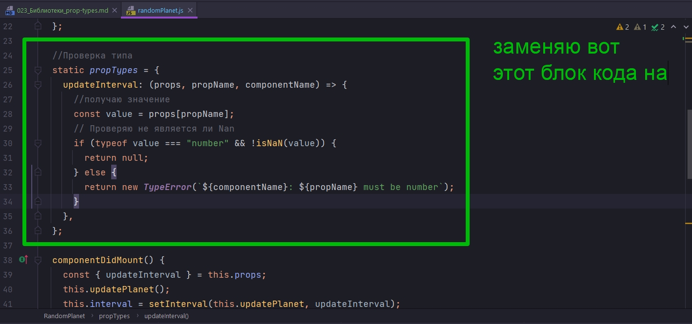
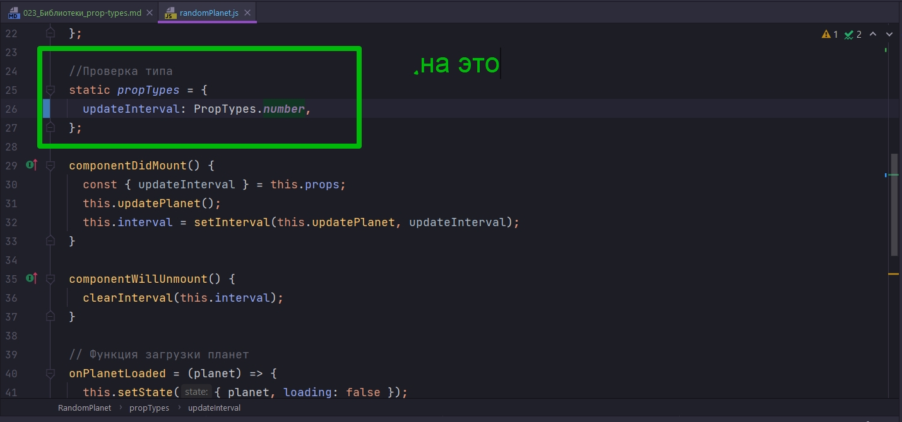
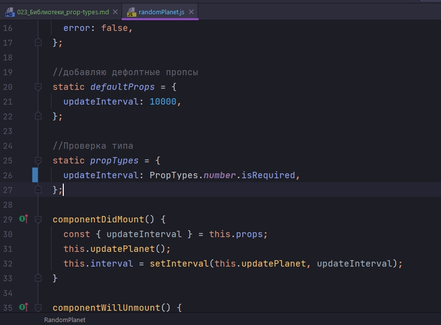
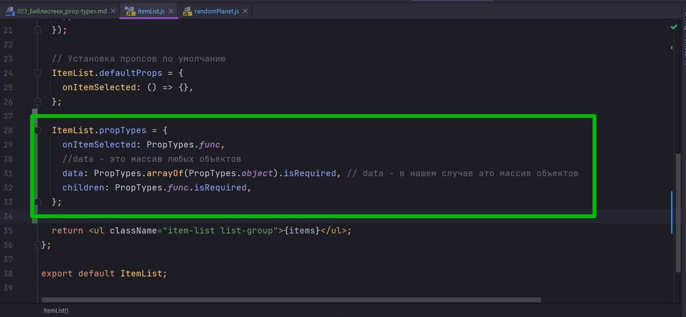
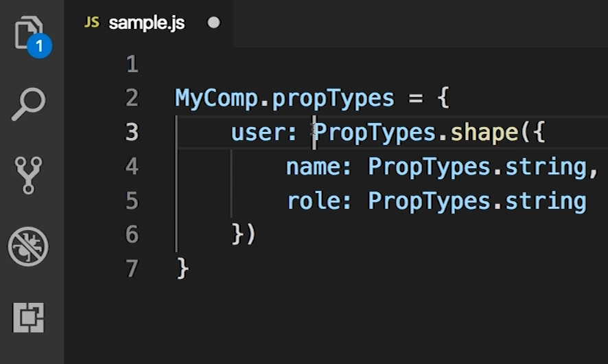
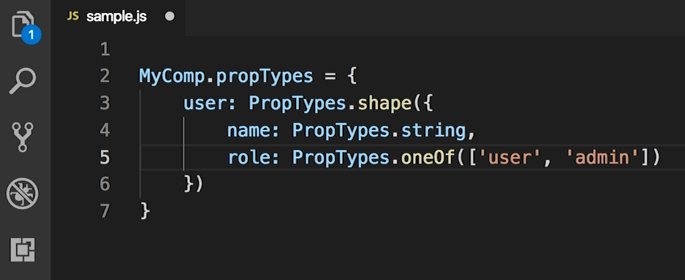
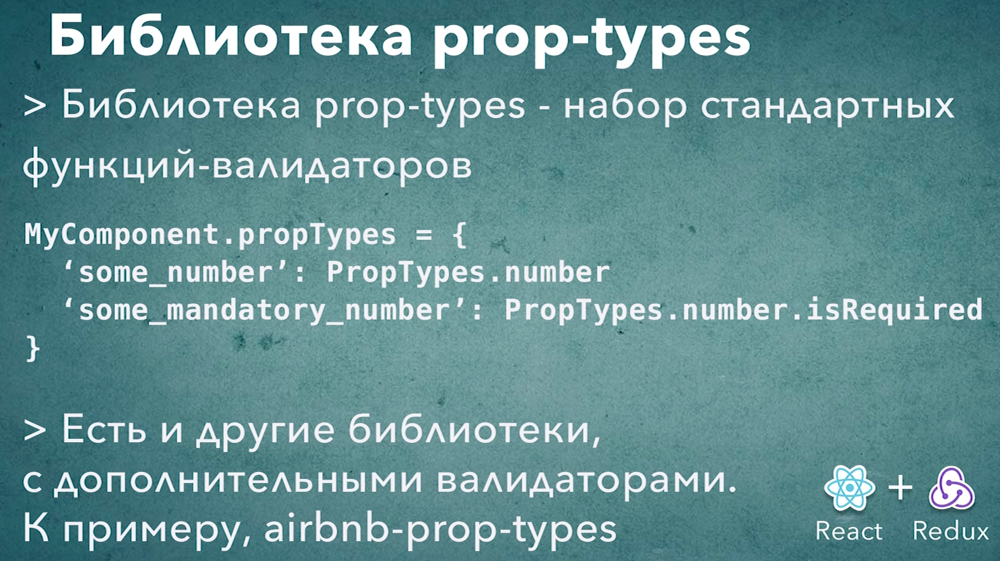

# 023_Библиотеки_prop-types

prop-types - это коллекция функций для проверки наших props. Раньше эти функции были частью самого React, но затем в React 15.5 prop-types вынесли в отдельную библиотеку. 

Что же давайте ввесто нашей собственной функции updateInterval которую мы написали что бы проверить что updateInterval это действительно число и не isNan() - функция в JS котороая проверяет является ли передаваемое ей значение числом.

Мы будем испльзовать функцию isPropsTypes. 

Начну с того что импортирую библиотеку propTypes





Возможна она будет работать немного по другому. И кроме предупреждения об ошибках этот объект PropTypes выполняет еще и функцию документирования вашего компонента. Props - это свойство компонента, это интерфейс между самим компонентом и внешни миром.

Кстати если вы используете PropTypes, то вот такое выражение PropTypes.number описывает опциональное свойство - это свойство которое можно не передаать.

Если updateInterval это обязательное свойство, то к выражению PropTypes.number можно добавить свойство isRequired. Данный параметр делает поле updateInterval обязательным.



Ну и конечно здесь мы видим одну интересную особенность. propTypes описывает свойство updateInterval как isRequired, но темнеменее у нас есть defaultProps которое говорит что если мы это свойство не передадим то будет использоваться значение  updateInterval: 10000.

Поскольку defaultProps срабатывает до проверки propTypes то выражение isRequired будет лишним.

```js
import React, { Component } from "react";
import PropTypes from "prop-types";
import SwapiService from "../../services/SwapiService";
import Spinner from "../spinner/spinner";
import PlanetView from "./planetView/planetView";
import "./randomPlanet.css";
import ErrorIndicator from "../errorIndicator/errorIndicator";

class RandomPlanet extends Component {
  //Инициализирую API
  swapiService = new SwapiService();

  state = {
    planet: {},
    loading: true,
    error: false,
  };

  //добавляю дефолтные пропсы
  static defaultProps = {
    updateInterval: 10000,
  };

  //Проверка типа
  static propTypes = {
    updateInterval: PropTypes.number,
  };

  componentDidMount() {
    const { updateInterval } = this.props;
    this.updatePlanet();
    this.interval = setInterval(this.updatePlanet, updateInterval);
  }

  componentWillUnmount() {
    clearInterval(this.interval);
  }

  // Функция загрузки планет
  onPlanetLoaded = (planet) => {
    this.setState({ planet, loading: false });
  };

  //Функция обработки ошибок
  onError = (error) => {
    this.setState({ error: true, loading: false });
  };

  // Функция обновления планеты
  updatePlanet = () => {
    console.log("Проверяю есть ли утечка памяти");
    const id = Math.floor(Math.random() * 25) + 2; //Округляю и устанавливаю диапазон случайных планет
    this.swapiService
      .getPlanet(id)
      .then(this.onPlanetLoaded)
      .catch(this.onError);
  };

  render() {
    const { planet, loading, error } = this.state;

    const errorMessage = error ? <ErrorIndicator /> : null;
    const spinner = loading ? <Spinner /> : null;
    const hasData = !(loading || error); // Получаю данные если нет загрузки или ошибки
    const content = hasData ? <PlanetView planet={planet} /> : null;

    return (
      <div className="random-planet jumbotron rounded">
        {errorMessage}
        {spinner}
        {content}
      </div>
    );
  }
}

export default RandomPlanet;


```

Кроме обычных примитивных типов мы можем описывать функции или массивы.



```js
//src/components/itemList/itemList.js
import React from "react";
import PropTypes from "prop-types";
import "./itemList.css";

const ItemList = (props) => {
  console.log(props);
  const { data, onItemSelected, children: renderLabel } = props;
  const items = data.map((item) => {
    const { id } = item; // деструктурирую из полученного объекта id
    const label = renderLabel(item); // Прокидываю объект в App, в теле компонента ItemList обрабатываю функцией и достаю интересующие меня значения
    return (
      <li
        className="list-group-item"
        key={id}
        onClick={() => onItemSelected(id)}
      >
        {label}
      </li>
    );
  });

  // Установка пропсов по умолчанию
  ItemList.defaultProps = {
    onItemSelected: () => {},
  };

  ItemList.propTypes = {
    onItemSelected: PropTypes.func,
    //data - это массив любых объектов
    data: PropTypes.arrayOf(PropTypes.object).isRequired, // data - в нашем случае это массив объектов
    children: PropTypes.func.isRequired,
  };

  return <ul className="item-list list-group">{items}</ul>;
};

export default ItemList;

```

Очень компактное описание свойств компонента которое одновременно выполняет две функции.

С одно стороны во время разработки propTypes будет предупреждать что вы передаете какие-то не правильные значения в компонент. 

Ну а с другой стороны когда вы будете читать код этого компнента вы сразу можете понять какие именно свойства рассчитывает получить этот компонент.


Еще опишем свойства для компоненте Row. И поскольку это компонент функция нам нужно propTypes описать вот таким вот способом.

```js
import React from "react";
import PropTypes from "prop-types";

const Row = ({ left, right }) => {
  return (
    <div className="row mb2">
      <div className="col-md-6">{left}</div>
      <div className="col-md-6">{right}</div>
    </div>
  );
};

//типизация
Row.propTypes = {
  left: PropTypes.node,
  right: PropTypes.node,
};

export default Row;

```

PropTypes.node - проверяет соответствующий property left - это то что можно отрендерить в JSX.

В PropTypes описан еще один тип PropTypes.element, но он намного более узкий и принимает только React-элемент.

В этом приложении у нас нет компонентов которые требуют в качестве свойств объект с какой-нибудь определенной структурой. Но при помощи PropTypes можно описать и такой case.

К примеру если у нас есть компонент который должен получать в качестве свойства объект user, у которого есть name и role, то это можно описать таким вот способом.



Мы используем функцию PropTypes.shape которая говорит что мы ожидаем объект с какой-то определенной формой. И эту форму мы затем описываем стандартными свойствами PropTypes.

Если нам нужно указать что role может быть одно из двух значений, к примеру это может быть или user или admin, то это тоже можно сделать. Для этого вызываю oneOf() и передаю сюда массив возможных значений.



Как видите PropTypes - это доволно мощный механизм.

Официальная документация в React.

[Typechecking With PropTypes](https://reactjs.org/docs/typechecking-with-proptypes.html)

или же библиотека 
<https://github.com/airbnb/prop-types>




