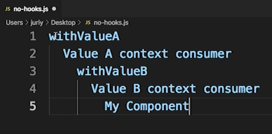

# 001_React_Hooks-введение

Hooks - это особенные функции в React которые позволяют обычным функциональным компонентам использовать state, реагировать на события жизненного цикла. Получать доступ из значений из контекста. И все это не используя компоненты классы. Если хуки использовать правильно, они существенно упрощают структуру приложения.

Хуки появились в версии 16.8 которая вышла в феврале 2019 года.

Раньше если мы хотели добавить state, то мы должны были использовать компоненты классы. Поскольку это был единственный способ связать компонент с объектом state. 


Тоже самое касается методов жизненного цикла. Если нужно было послать запрос на сервер, пока компонент появлялся на странице, мы использовали componentDidMount. А если мы использовали componentDidMount, то мы обязательно должны были использовать компонент класс.  

У функциональных компонентов не было понятия метод жизненного цикла. Без hooks функциональный компонент это просто функция render.


C появлением Hooks разработчики могут создавать компоненты у которых почти есть все те же возможности что и у компонентов классов. Такие функциональные компоненты смогут иметь state и смогут иметь что-то похожее на методы жизненного цикла.

И так первый класический пример

```js
import React, { Component } from "react";

class Switcher extends Component {
  state = {
    color: "white",
  };

  setDark = () => {
    this.setState({ color: "black" });
  };
  setLight = () => {
    this.setState({ color: "white" });
  };

  render() {
    const { color } = this.state;
    return (
      <>
        <div style={{ padding: "10px", backgroundColor: color }}>
            <button onClick={this.setDark}>Dark</button>
            <button onClick={this.setLight}>Light</button>
        </div>
        
      </>
    );
  }
}

export default Switcher;

```

Это компонент класс с состоянием. Для того что бы хранить состояние мы сделала компонент класс и в компоненте мы можем обновлять это состояние при помощи функции setState.

Использую HOOKS этот компонент можно сделать вот так.

```js
import React, { useState } from "react";

const Switcher = () => {
  const [color, setColor] = useState("white");

  const setDark = () => setColor("black");
  const setLight = () => setColor("white");

  return (
    <>
      <div style={{ padding: "10px", backgroundColor: color }}>
        <button onClick={() => setDark}>Dark</button>
        <button onClick={() => setLight}>Light</button>
      </div>
    </>
  );
};

export default Switcher;

```

useState - когда мы вызываем его первый раз React возвращает аналог state для компонента Switcher. Функция useState возвращает массив из двух элементов. Первый элемент массива это сам state. А второе значение это функция setColor - аналог setState который устанавливает не весь state, а только вот это значение color.

useState как бы возвращает два результата. Но в JS функция не может возвращать два результата. По этому функция useState возвращает массив, мы его сразу же деструктурируем и сохраняем сразу же первое значение в константе color, а второе значение в константе setColor.

Используя похожий синтаксис можно добавить некоторые методы жизненного цикла или передать значение из Context не используя при этом классы.


Но а теперь один из главных вопросов. Зачем нужны Hooks?

1. Причина это ООП в JS и поведение ключевого слова this. Эта тема считается сложной для понимания особенно для начинающих разработчиков, цепочки прототипов, вызовы функций в разных контекстах, не ожиданное значение this. Это довольно распостраненный тип ошибок. И разработчики React решили добавить механизм hooks. Плюс это или не плюс при разработке решать вам.
2. Вторая причина немного интереснее. Это аспект React разработки который становится существенно удобнее если мы используем hooks - это работа с компонентами высшего порядка.

HOC - это нично иное как паттерн переиспользования кода в React. Например если нам нужно получить значение из Context-а, вместо того что бы копировать код Consumer, передавать ему render функцию мы можем создать компонент высшего порядка, и затем использовать этот компонент высшего порядка для того что бы не дублировать код.

Но с компонентами высшего порядка есть одна проблема. Проблема заключается в том что каждый компонент высшего порядка создает как минимум один дополнительный компонент обертку в делеве компонентов React.

Давайте представим что мы создали компонент myComponent. И этому компоненту нужно получить два значения из двух разных контекстов React.



Тогда в нашем дереве компонентов мы получим пять компонентов. Снизу буде My Component.

Затем используя паттерн компонент высшего порядка мы будем использовать компонент withValueB. И для того что бы этот компонент мог получить значение из контекста, внутри нужно будет использовать Consumer из этого context. Соответственно мы получим еще один компонент.

И так если у нас есть два значения из двух контекстов, всего у нас получится пять компонентов.

Еще раз повторимся. Ради того что бы получить два значения, у нас в дереве появляется пять компонентов.

Это не так критично для небольших приложений. Но для крупных проектов это может стать настоящей проблемой при отладке. Когда дерево компонентов разрастается на десятки уровней вглубь.


С появлением Hooks в реакт мы можем отказаться от большинства компонентов высшего порядка и использовать вместо них хуки. 

К примеру что бы реализовать такую же структуру при помощи хуков


Достаточно написать код который будет похож на вот такой.

```js
const MyComponent = () =>{
    const a = useContext(ContextA);
    const b = useContext(ContextB);
    return ...
}
```

Мы просто вызываем функцию useContext(ContextA) и получаем значение контекста a. И затем снова вызываем useContext(ContextB) получаем другое значение из другого контекста. Ну а затем в коде этого компонента мы можем использовать эти значения. Мы не создаем вообщи ни каких дополнительных компонентов прослоек.

И ТОЧНО ТАКЖЕ КАК КОМПОНЕНТЫ ВЫСШЕГО ПОРЯДКА, ХУКИ ЭТО ТОЖЕ ПАТТЕРН ПЕРЕИСПОЛЬЗОВАНИЯ КОДА В React.

Разработчики могут создавать свои собественные хуки и переносить переиспользуемые блоки логики в них. Да и сторонние библиотеки которые мы будем рассматривать в этом курсе, тоже чаще всего предоставляют свои собственные хуки как альтернативу компонентам высшего порядка.

> React Hooks
> 
> Хуки дают возможность компонентам-функциям работать с состоянием, жизненным циклом и контекстом.

```js
//Пример хука
const HooksSwitcher = () =>{
    const[num, setNum]=useState(42);
    return <button onClick={setNum(100)}></button>
}
```


