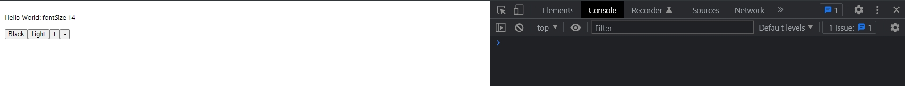

# 002_useState 

<https://www.udemy.com/course/pro-react-redux/learn/lecture/17163704#notes>

И так когда я веду этот конспект я использую React 18.0.0. И здесь произошли изменения. Изучаю походу. Как минимум не используется React.render. Теперь для этого используется createRoot. Вся основная инфа [Как перейти на React 18](https://reactjs.org/blog/2022/03/08/react-18-upgrade-guide.html#updates-to-client-rendering-apis)

Теперь ReactDOM я импортирую не из react-dom а из react-dom/client.

Далее вызываю у ReactDOM метод createRoot() куда помещаю результат выбранного DOM узла с помощью document.getElementById. Далее присваиваю это все в переменную root. Таким образом я присваиваю все методы ReactDOM. И далее используя пременнуб root я могу вызвать метод render и передать в него компонент который я хочу отобразить.

```js
import React from "react";
import ReactDOM from "react-dom/client";
import "./index.css";

const App = () => <p>Hi</p>;
const root = ReactDOM.createRoot(document.getElementById("root"));

root.render(<App />);

```

На этом пока все. Перехожу к useState.

useState() - позволяет использовать state в функциональных компонентах. И ведет себя почти так же как state в компонентах классах.

```js
import React from "react";
import ReactDOM from "react-dom/client";
import "./index.css";

const App = () => (
  <>
    <HookSwitcher />
  </>
);

const HookSwitcher = () => {
  return (
    <div style={{ padding: "10px", backgroundColor: "white" }}>
      <button onClick={() => {}}>Black</button>
      <button onClick={() => {}}>Light</button>
    </div>
  );
};

const root = ReactDOM.createRoot(document.getElementById("root"));

root.render(<App />);

```

И теперь мы можем начать использовать useState. Импортирую хук из пакета React.

useState('white') - аргументом передаю значение которое будет по умолчанию у нашего state. Передаю строку.

useState('white') возвращает массив который всегда состоит ровно из двух значений. Первое значение это собственно текущее значение state. По мере того как state будет изменяться в первом значении будет самое свежее значение state. Первое значение это переменная, называю ее как мне угодно color.

Второе деструктурируемое значение из массива который возвращает useState, является функция, аналог setState, называю тоже как хочу setColor.

```js
import React, { useState } from "react";
import ReactDOM from "react-dom/client";
import "./index.css";

const App = () => (
  <>
    <HookSwitcher />
  </>
);

const HookSwitcher = () => {
  const [color, setColor] = useState("white");
  return (
    <div style={{ padding: "10px", backgroundColor: color }}>
      <button onClick={() => setColor("black")}>Black</button>
      <button onClick={() => setColor("white")}>Light</button>
    </div>
  );
};

const root = ReactDOM.createRoot(document.getElementById("root"));

root.render(<App />);

```


setColor он практически точно такой же как в компоненте классе когда мы работаем со state и используем setState.

Есть несколько важных отличий!!!!

1. Это то что useState можно вызывать несколько раз и работать с несколькими независимыми частями state.

Давате представим что наш компонент кроме переключения цвета фона, должен переключать размер шрифта.


Если бы мы работали с компонентом классом то state мы создали бы как один объект, в который записали бы оба значения.

Но когда мы работаем с хуком useState намного удобнее разделять независимые части state. 

```js
import React, { useState } from "react";
import ReactDOM from "react-dom/client";
import "./index.css";

const App = () => (
    <>
        <HookSwitcher />
    </>
);

const HookSwitcher = () => {
    const [color, setColor] = useState("white");

    const [fontSize, setFontSize] = useState(14);
    return (
        <div
            style={{
                padding: "10px",
                backgroundColor: color,
            }}
        >
            <p style={{ fontSize: `${fontSize}px` }}>
                Hello World: {`fontSize ${fontSize}`}
            </p>
            <button onClick={() => setColor("black")}>Black</button>
            <button onClick={() => setColor("white")}>Light</button>
            <button onClick={() => setFontSize((prevState) => prevState + 2)}>
                +
            </button>
            <button onClick={() => setFontSize((prevState) => prevState - 2)}>
                -
            </button>
        </div>
    );
};

const root = ReactDOM.createRoot(document.getElementById("root"));

root.render(<App />);


```

Если мы посмотрим на пример кода выше. Мы подошли к моменту когда начинающие React разработчики часто ошибаются. Это установка состояния зависящее от предыдущего состояния.

Точно так же как и в обычном setState() - если ваш state зависит от старого state то я передаю функцию, в параметры которой пападает старое значение state, и в теле функции я изменяю старое состояние на новое. 

Если же state не зависит от предыдущего state, то я могу просто передать значение, а не объект как в setState с указанием какое поле меняем, т.е. setState по умолчанию работает с одни значением из state.




2. Важное отличие хука useState() от setState в классах мы рассмотрим на примере этого простого кода.


```js
class Person extends React.Component {
  state = {
    firstName: "Bob",
    lastName: "Smith",
  };

  updateFirstName = () => {
    this.setState({ firstName: "Mike" });
  };
  render() {
    return (  
      <p>
        {this.state.firstName} {this.state.lastName}
      </p>
    );
  }
}
```

Если помните когда мы используем setState мы можем туда передать туда объект который обновляет только нужные поля в state.

Т.е. если мы запустим код updateFirstName то firstName в state поменяется на Mike, а lastName: "Smith" так и остантся как было.


Но в случае с хуками сеттер функции будет работать не так!!!!

В функциональном компоненте, который использует хук useState, если мы попробуем передать объект сполями и значениями, мы получим не совсем правильный результат.

Дело в том что сетер, функция из useState, полностью заменит объект на тот объект который  мы передалим в сеттере.  

```js
const Person = () =>{
    const [person, setPerson] = useState({
        firstName: "Bob",
        lastName: "Smith",
    });
    
    setPerson({ firstName: "Bob"});
}
```

Т.е. у нового объекта, в нашем новом состоянии вообще не будет свойства lastName: "Smith" поскольку в setPerson({ firstName: "Bob"}) мы не передали lastName: "Smith".

Если мы используем useState() и в качестве состояния мы используем объект, то функция сеттер не будет автоматически заменять только нужные части объекта. Она будет устанавливать полностью тот объект который вы в нее передали.


Возникает вопрос. Как правильно оформить код так что бы lastName: "Smith" сохранялся.

Есть несколько способов это сделать. 

Первый способ это разделить state на две независымые части, на firstName и lastName.

```js
const Person =()=>{
    const [firstName, setFirstName] = useState('Bob');
    const [lastName, setLastName] = useState('Smith');
    
    setFirstName('Mike');
}
```

Этот способ хорошо работает если части state действительно  независимые и они устанавливаются по отдельности.

Если же в вашем state значении из объекта изменяются слишком часто, например как координаты положения мышки X и Y. Тогда чаще всего обе координаты будут обновляться одновлеменно. И такая техника, как в примере выше, будет работать намного хуже, поскольку нам чаще всего нужно будет вызывать сразу обе функции.


Можно вернутся к объекту и самостоятельно сохранять значения тех полей которые не изменяются.

```js
const Person = () =>{
    const [person, setPerson] = useState({
        firstName: "Bob",
        lastName: "Smith",
    });
    
    setPerson((person)=>{
        return { firstName: "Mike",
            lastName: person.lastName
        }
    });
}
```

Не забывайте что в этом случае нам сново придется использовать функциональную форму setPerson т.е. передавать в setPerson функцию, по скольку наше новое значение зависит от старого значения state.

Ну а так же мы можем использовать деструктуризацию.

```js
const Person = () =>{
    const [person, setPerson] = useState({
        firstName: "Bob",
        lastName: "Smith",
    });
    
    setPerson((person)=>{
        return { ...person, firstName: "Mike"
            
        }
    });
}
```


