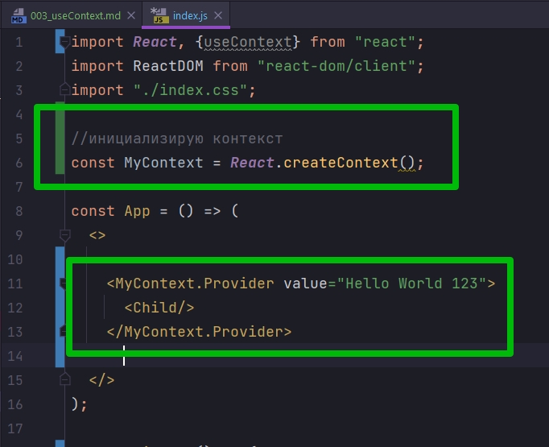
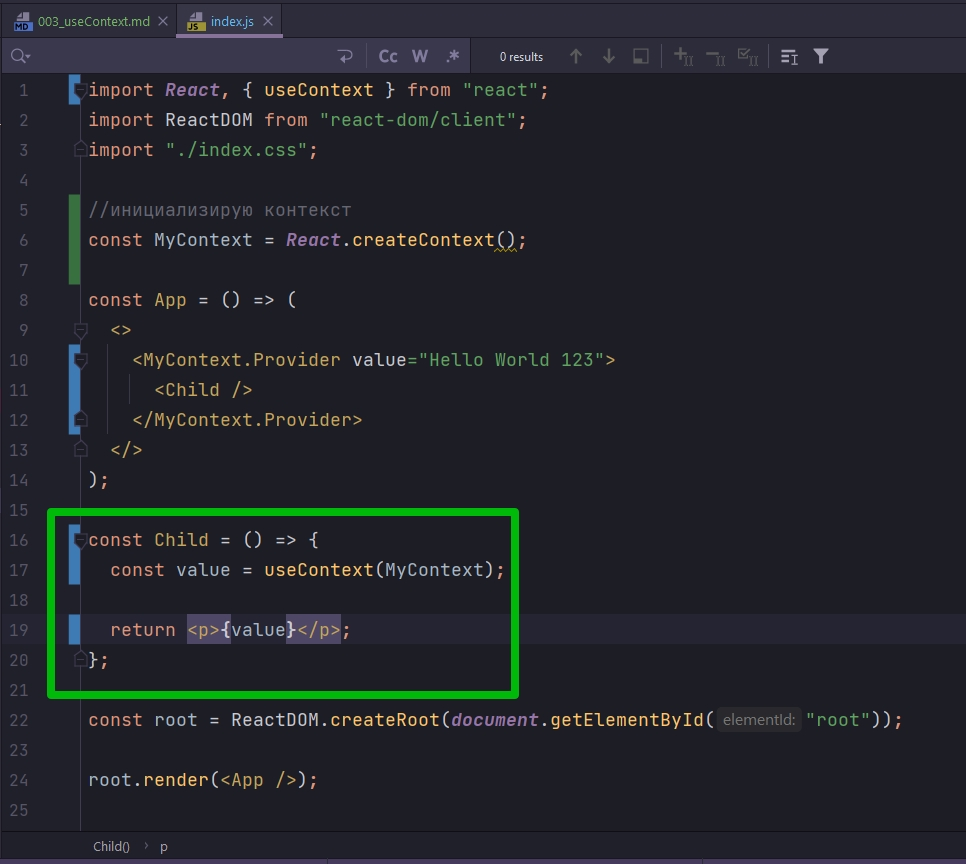
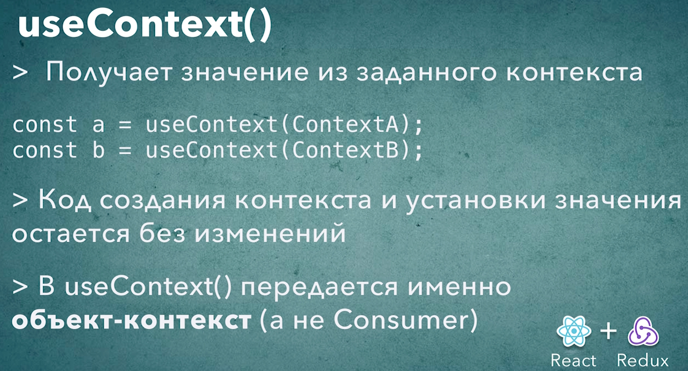

# 003_useContext

useContext() - это пожалуй самый простой хук из хуков React. Как не сложно угадать по названию этот хук используется тогда когда компоненту нужно получить значение из контекста.


Сперва вспомним как работает код без хука. Как мы используем Context. 

Для того что бы использовать контекст нам нужно сделать несколько вещей. 

Во-первых нам нужно создать котекст с помощью React.createContext

Затем где-нибудь в нашем приложении нам нужно создать компонент React.Provider - этот компонент как бы предоставляет значение из контекста value всем компонентам ниже по иерархии.

Для того что бы прочитать это значение мы использовали MyContext.Consumer. В этот компонент мы передавали render функцию которая в свою очередь получает значение value из контекста. И внутри render функции мы можем использовать это значение.

```js
import React from "react";
import ReactDOM from "react-dom/client";
import "./index.css";

//инициализирую контекст
const MyContext = React.createContext();

const App = () => (
  <>
    <MyContext.Provider value="Hello World 123">
      <Child/>
    </MyContext.Provider>
  </>
);

const Child = () => {
  return (
    <MyContext.Consumer>
      {(value) => {
        return <p{value}></p>;
      }}
    </MyContext.Consumer>
  );
};

const root = ReactDOM.createRoot(document.getElementById("root"));

root.render(<App />);

```

Этот код можно упростить если использовать компоненты высшего порядка.


Но с использованием Hooks этот код можно упростить еще больше. И так что бы получить доступ к значению из контекста мы будем использовать useContext.

Код создания контекста и код который устанавливает значение контекста остается точно таким же.



Изменится только код компонента который получает значение из контекста.

При инициализации контекста в useContext() передаю какой именно контекст мы хотим использовать. Для того что бы useContext знал какое именно значение нам нужно получить.



ОБРАТИТЕ ВНИМАНИЕ что в useContext мы передаем именно объект контекст MyContext, не Provider, не Consumer, а тот самый объект который возвращает React.createContext().

```js
import React, { useContext } from "react";
import ReactDOM from "react-dom/client";
import "./index.css";

//инициализирую контекст
const MyContext = React.createContext();

const App = () => (
  <>
    <MyContext.Provider value="Hello World 123">
      <Child />
    </MyContext.Provider>
  </>
);

const Child = () => {
  const value = useContext(MyContext);

  return <p>{value}</p>;
};

const root = ReactDOM.createRoot(document.getElementById("root"));

root.render(<App />);

```

Такой код куда проще интуитивнее. Если для хука useState код остался таким же как раньше, то здесь мы упростили всю структуру. Избавились от одного компонента обертки т.е. от Consumer, от вложенной функции, и сделали код намного читабельнее.



