# 004_useEffect

useEffect() - это пожалуй самый сложный из базовых хуков в React. Код этого хука больше всего напоминает работу методов жизненного цикла componentDidMount, componentDidUpdate и componentWillUnmount.

Но все же этот хук не просто повторяет функционал этих методов, а реализует свою собственную механику работы с так называемыми побочными эффектами.


Давайте попробуем разобраться с тем как работает этот хук.

Вот очень маленькое приложение. И оно нам нужно для того что бы у компонента вызывались методы жизненного цикла.

```js
import React, { useState } from "react";
import ClassCounter from "../ClassCounter/ClassCounter";
import HookCounter from "../HookCounter/HookCounter";

const App = () => {
  const [value, setValue] = useState(0);
  const [visible, setVisible] = useState(true);

  if (visible) {
    return (
      <div>
        <button onClick={() => setValue((value) => value + 1)}>+</button>
        <button onClick={() => setVisible(false)}>hide</button>
        <ClassCounter value={value} />
        <HookCounter value={value} />
      </div>
    );
  } else {
    return <button onClick={() => setVisible(true)}>show</button>;
  }
};

export default App;

```

```js
import React, { Component } from "react";

class ClassCounter extends Component {
    componentDidMount() {
        console.log(`class: mount`);
    }

    componentDidUpdate(prevProps, prevState, snapshot) {
        console.log(`class: update`);
    }

    componentWillUnmount() {
        console.log(`class: unmount`);
    }

    render() {
        return <p>{this.props.value}</p>;
    }
}

export default ClassCounter;


```

```js
import React from "react";

const HookCounter = ({ value }) => {
  return <div>{value}</div>;
};

export default HookCounter;

```

Это приложение которое выводит на экран два счетчика и позволяет скрывать эти счетчики, либо показывать их снова на экране. Таким образом мы сможем проверить все методы жизненного цикла.

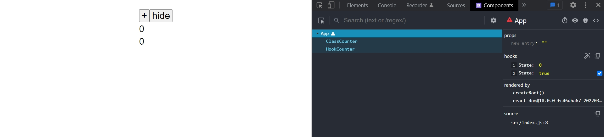

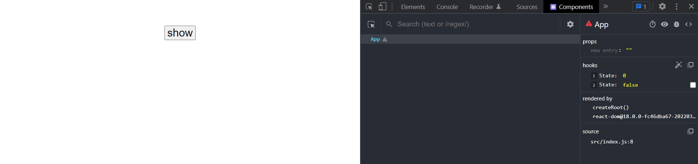

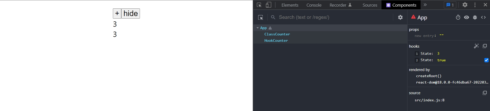

То что происходило бы в компонентах классах. Увеличение счетчика это componentDidUpdate. Когда мы скрываем счетчики происходит событие componentUnmount. Ну и конечно же когда мы показываем счетчики на экране это соответствует событию componentDidMount.

Таким образом у нас здесь есть приложение которое демонстрирует полный жизненный цикл компонента componentDidMount, componentDidUpdate, componentUnmount.


Пробегается по коду балаболит то что я и так знаю...

ClassCounter - это обычный класс компоненент который просто печатает свой жизненный цикл ну и выводит значение на экран.

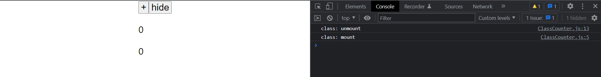

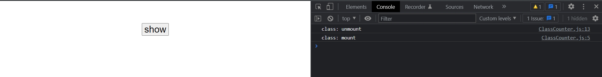

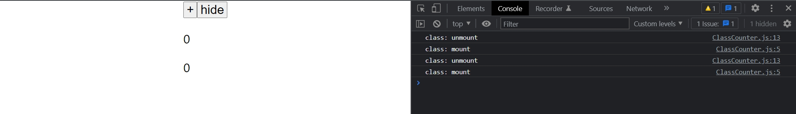

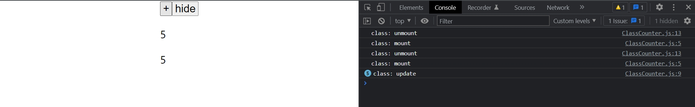

Единственное назначение ClassCounter в этом уроке показать как работает аналогичный коомпонент класс.

Ну и самый главный компонент с которым мы будем работать это HookCounter. Пока что он просто показывает value а экран. И на примере этого компонента мы будем смотреть как работают методы жизненного цикла.

Временно удалю ClassCounter из нашего приложения что бы смотреть на HookCounter.


И так что делает useEffect? useEffect регистрирует функцию у которой могут быть побочные эффекты. Например эта функция которая может создавать setTimeout или отправлять запрос на сервер. Впринципе тоже самое что мы с вами делали в componentDidMount когда мы загружали данные с сервера в тот момент когда компонент появляется на экране. И эта функция будет срабатывать каждый раз когда компонент обновляется.

```js
import React, { useEffect } from "react";

const HookCounter = ({ value }) => {
  useEffect(() => {
    console.log(`useEffect()`);
  });

  return <div>{value}</div>;
};

export default HookCounter;

```
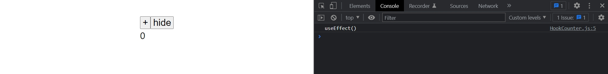

Это значит что функция которую мы зарегистрировали в useEffect вызвалась когда компонент появился на экране т.е. аналогично тому как работает componentDidMount.

Ну а теперь когда мы начнем изменять значение счетчика вы увидите что в консоли каждый раз вызывается useEffect.

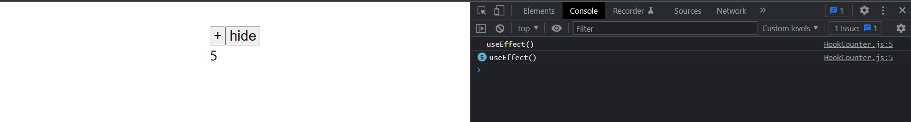

Как мы видим эта функция вызывается каждый раз когда компонент обновляется. Т.е. в такой форме useEffect это как бы комбиация между componentDidMount и componentDidUpdate. Эта функция будет вызывать тогда когда компонент впервые появился на странице componentDidMount, и тогда когда компонент по любой причине обновился componentDidUpdate.

Если мы прямо сейчас раскоментируем ClassCounter. Сравим работу классового компонента и нашего хука useEffect. Вы увидите как соотносятся методы жизненного цикла.

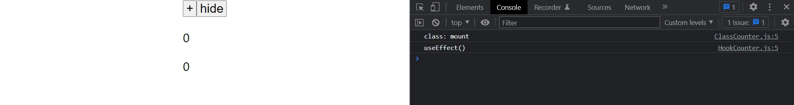

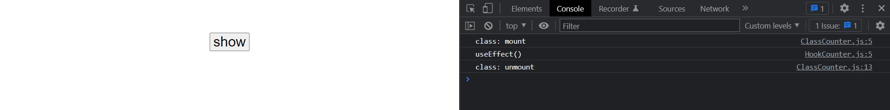

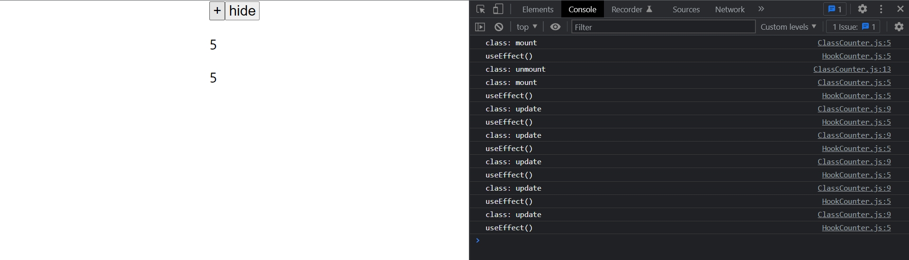

Вы навернякапомните что когда мы использовали componentDidUpdate мы проверяли какие именно свойства изменились.

Посмотрим как мы писали код в starDB.

```js
import React, { Component } from "react";

const withDetailsData = (View, getData) => {
  return class extends Component {
    state = {
      item: null,
      image: null,
    };

    componentDidMount() {
      this.updateDetails();
    }

    componentDidUpdate(prevProps, prevState, snapshot) {
      if (
        this.props.itemId !== prevProps.itemId ||
        this.props.getData !== prevProps.getData ||
        this.props.getImageUrl !== prevProps.getImageUrl
      ) {
        this.updateDetails();
      }
    }

    //Функция обновления
    updateDetails() {
      const { itemId, getImageUrl } = this.props;
      // в самом начале personId может быть null делаю проверку
      if (!itemId) {
        return;
      }
      //Получаю данные
      getData(itemId).then((item) => {
        this.setState({ item, image: getImageUrl(item) });
      });
    }
    render() {
      const { item, image } = this.state;

      return <View {...this.props} item={item} image={image} />;
    }
  };
};

export default withDetailsData;

```

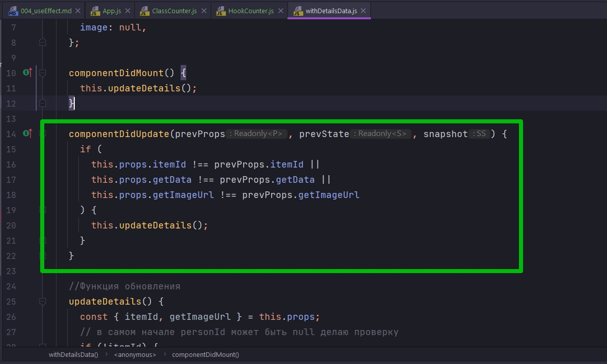

Мы проверяем что одно из заданных свойств itemId, getData, getImageUrl, изменились и только тогда когда действительно одно из этих свойств изменилось мы вызываем функцию this.updateDetails().

Если вы еще по внимательнее посмотрите на этот код, то заметите что componentDidMount и componentDidUpdate вызывают одну и туже функцию this.updateDetails()

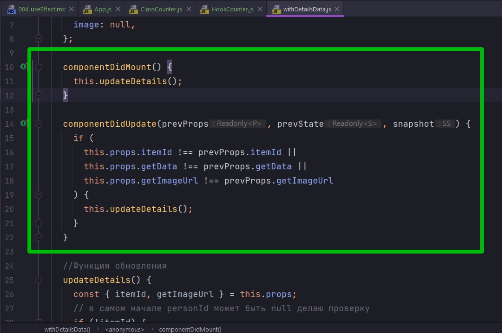

И это поведение которое мы реализовали в withDetailsData полностью соответствует тому поведению которое мы используем в HookCounter в useEffect, поскольку useEffect тоже запускает свою функцию и на создание компонента и на обновление компонента.

Но теперь остается один вопрос. Как реализовать в useEffect вот такое поведение кога мы вызываем наш эффект только тогда, когда изменились определенные свойства. Как здесь

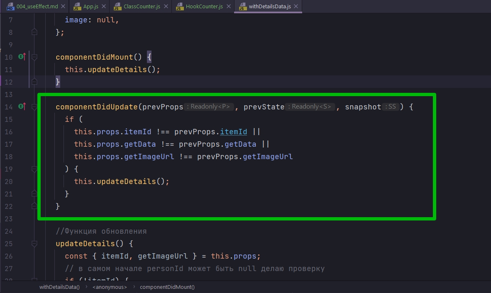

И хук useEffect поддерживает такую проверку. Для того что бы реализовать эту логику нужно передать в useEffect в качестве второго аргумента массив с теми данными которые мы будем проверять для того что бы решить следует вызывать этот хук или нет.

Например если мы хотим вызываь этот хук только тогда когда вызывается value мы передаем в список звисимостей value.

```js
import React, { useEffect } from "react";

const HookCounter = ({ value }) => {
  useEffect(() => {
    console.log(`useEffect()`);
  }, [value]);

  return <div>{value}</div>;
};

export default HookCounter;

```

Теперь если значение value изменилось с прошлого раза, наша функция которую мы зарегистрировали в useEffect сработает. Но если значение value осталось точно таким же, то хук не будет вызывать эту функцию. КОД КОТОРЫЙ СРАВНИВАЕТ СТАРОЕ ЗНАЧЕНИЕ И НОВОЕ ЗНАЧЕНИЕ ОН РЕАЛИЗОВАН В САМОМ ХУКЕ. Нам не нужно писать эту логику самостоятельно так как мы писали в этом коде.


Поскольку это массив

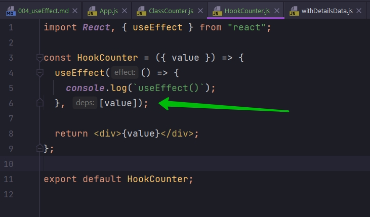

Здесь могут быть несколько значений. Если хотя бы одно значение изменилось, то мы будем вызывать наш useEffect.


Есть один интересный момент. Если в useEffect в качестве второго аргумента передать пустой массив, пустой список зависимостей, то эта функция вызовется только один раз, точно так же как работает componentDidMount.

```js
import React, { useEffect } from "react";

const HookCounter = ({ value }) => {
  useEffect(() => {
    console.log(`useEffect()`);
  }, []);

  return <div>{value}</div>;
};

export default HookCounter;

```

Теперь посмотрите на консоль.

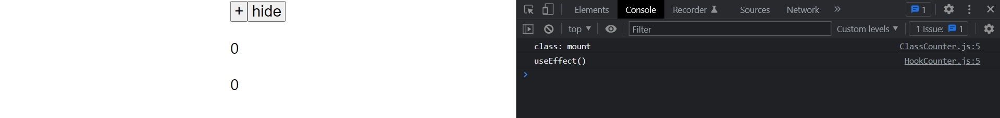

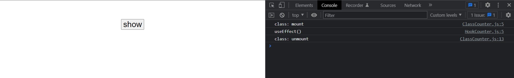

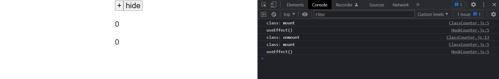

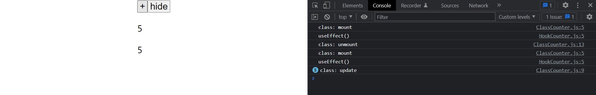

Как видим в двух случаях при монтировани компонента useEffect вызывается. Во всех остальных случаях при обновлении компонента он не вызывается. Мы в явном виде сказали что useEffect не зависит от каких либо данных. С пустым списком зависимостей он работает как componentDidMount т.е. вызывается только один раз при монтировании компонента. ОБРАТИТЕ ВНИМАНИЕ НА ЭТО ВАЖНОЕ СВОЙСТВО ПОСКОЛЬКУ ОНО МОЖЕТ БЫТЬ ИСТОЧНИКОМ ОШИБОК. ЕСЛИ МЫ НЕ ПЕРЕДАДИМ ВТОРОЙ АРГУМЕНТ, ИЛИ ПЕРЕДАДИМ null, ТО useEffect БУДЕТ ВЫЗЫВАТЬСЯ НА КАЖДОЕ ОБНОВЛЕНИЕ КОМПОНЕНТА. ЕСЛИ МЫ ПЕРЕДАДИМ ПУСТОЙ МАССИВ ТО useEffect БУДЕТ ВЫЗЫВАТСЯ ТОЛЬКО ТОГДА КОГДА КОМПОНЕНТ СОЗДАН т.е. аналог componentDidMount.


Остался один вопрос как этот useEffect очищать?

Очень часто те функции которые мы будем передавать в useEffect. Они будут создавать какие-нибудь побочные ресурсы, например: создавать таймеры, или запускать запросы к серверу которые мы должны будем каким-нибудь образом очистить. Например если у нас есть таймер мы должны будем его остановить.

В useEffect это сделать очень просто. Достаточно вернуть еще одну функцию которая будет вызвана тогда когда этот эфект нужно будет очистить.

```js
import React, { useEffect } from "react";

const HookCounter = ({ value }) => {
    useEffect(() => {
        console.log(`useEffect()`);
        return () => console.log(`clear`);
    }, [value]);

    return <div>{value}</div>;
};

export default HookCounter;


```

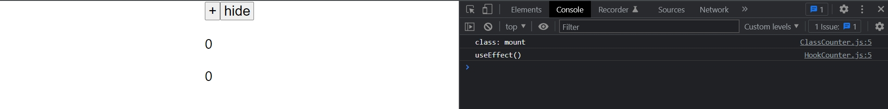

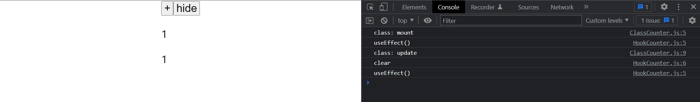

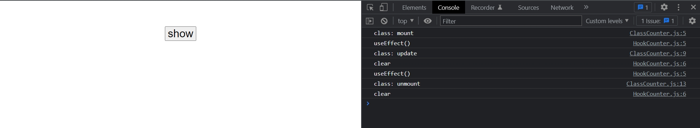

Предыдущий эффект который запускался раньше и мы заново вызвали новый useEffect. React сначало вызвал функцио очистки clear для предыдущего эффекта, а затем запустил следующий useEffect. Если мы скроем компонент со страницы то мы увидим что последний эффект очистился. Т.Е. ЭТА ФУНКЦИЯ ПРИБЛТЗИТЕЛЬНО РАБОТАЕТ КАК componentUnmount за исключением того что она вызывается не только когда компонент пропадает со страницы, а тогда когда нужно запустить следующий эффект.Тогда очищается предыдущий эффект. Такая модель поведения очистка предыдущего эффекта, перед тем как запускать следующий эффект, эта модель намного более удобная в разработке, чем та модель которая у нас была в классовых компонентах.


Есть довольно ощутимое отличие того как работает useEffect и тем как работают методы жизненного цикла в React компонентах классах.

useEffect заставляет вас думать немножечко по другому. О том как реагировать на обновление компонента. В такой модели, сам жизненный цикл React компонента, он как бы имеет вторичное значение. В этом коде даже нет ключевых слов вроде componentDidMount или componentDidUpdate или componentUnmount.


Все что у нас есть это функция которая реагирует на данные, в списке зависимостей. Т.е. мы запускам компонент не потому что изменился список зависимостей, а потому что изменились данные от которых зависит поведение этого useEffect.

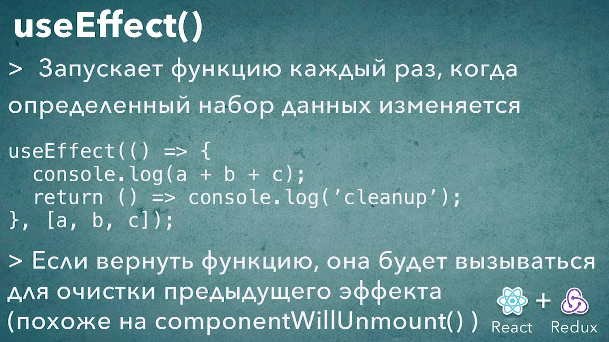


 