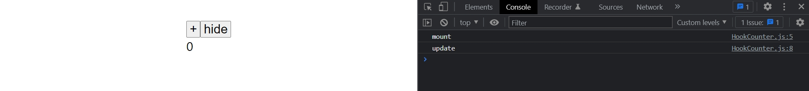
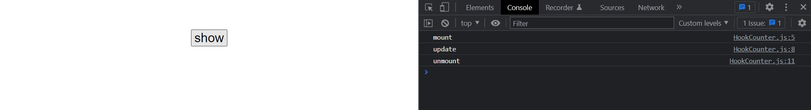
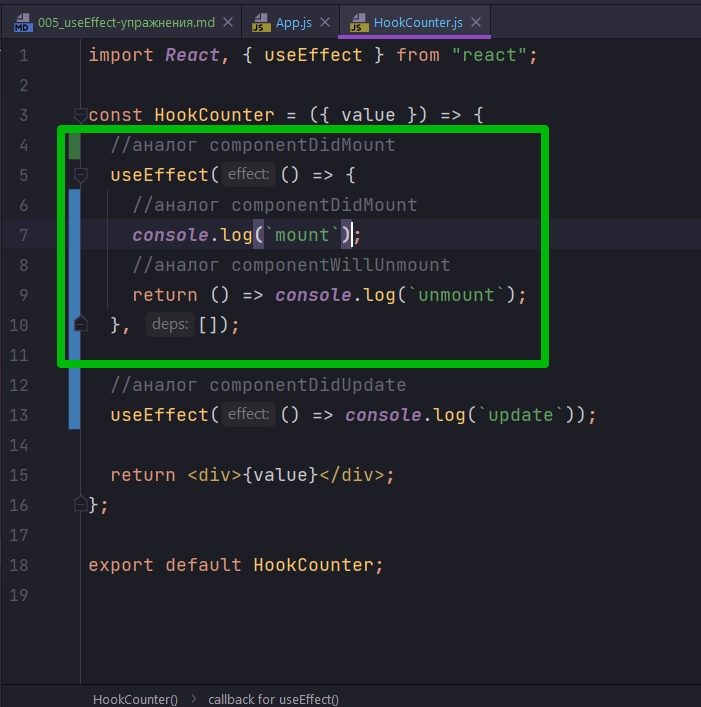
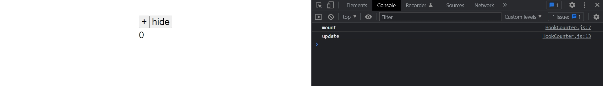
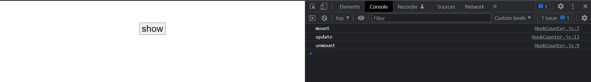
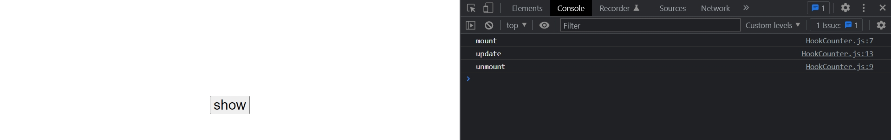
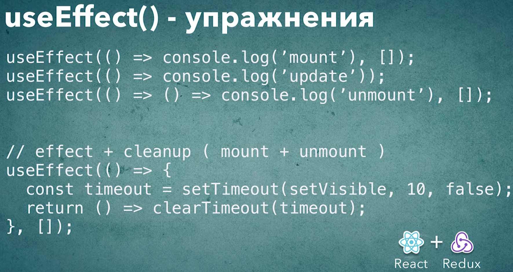

# 005_useEffect-упражнения

Хук useEffect - не просто новый синтаксис для методов жизненного цикла компонента. useEffect работате по другому. Он постороен вокруг идеи эффектов которые создаются и очищаются когда изменяются данные от которых этот эфект зависит.

Не смотря на то что хук useEffect использует другую механику, иногда необходимо проводить паралели между жизненными циклами компонента и useEffect как минимум в образовательных целях и что бы было прощ рефакторить существующий код.

Что бы закрепить метериал как работает useEffect, мы посмотрим как реализовать каждый из основных методов жизненного цикла при помощи хука useEffect.


Начнем с componentDidMount. Как сделать так что бы в HookCounter появилась функция которая вызывается только один раз при создании компонента.

Достаточно в useEffect передать функцию, первым аргументом, а для того что бы функция вызывалась только один раз вторым аргументом необходимо передать пустой массив списка зависимостей.

```js
import React, { useEffect } from "react";

const HookCounter = ({ value }) => {
  useEffect(() => console.log(`mount`), []);

  return <div>{value}</div>;
};

export default HookCounter;

```

useEffect будет сравнивать данные, которые мы передали в качестве второго аргуметра, если хоть одно значение измениться, то хук useEffect будет вызван повторно во время обновления. Но если массив пустой, то у нас вообще ни как не может возникнуть ситуации когда какое-нибудь значение из этого массива измениться. Пустой массив всегда такой же как любой другой пустой массив.


Попробуем реализовать componentDidUpdate. Если я уберу список зависимостей, если мы не передаем массив в качестве второго аргумента в useEffect, то этот код будет вызываться каждый раз кога компонент обновляется. 

```js
import React, { useEffect } from "react";

const HookCounter = ({ value }) => {
    //аналог componentDidMount
    useEffect(() => console.log(`mount`), []);

    //аналог componentDidUpdate
    useEffect(() => console.log(`update`));

    return <div>{value}</div>;
};

export default HookCounter;

```

Единственный момент!!! Мы не сможем здесь полностью реализовать работу componentDidUpdate поскольку componentDidUpdate не вызывается первый раз когда компонент только-только создан. Он вызывается только при последующих обновлениях. А useEffect будет вызываться и впервый раз и при последующих обновлениях. По этому это комбинация componentDidMount и componentDidUpdate.




Как реализовать componentUnmount? 

Код будет похож как при использовании componentDidMount поскольку мы должны вызвать код только один раз когда компонент уничтожается. И функция очистки это функция которую мы возвращаем из нашей функции.

```js
import React, { useEffect } from "react";

const HookCounter = ({ value }) => {
  //аналог componentDidMount
  useEffect(() => console.log(`mount`), []);

  //аналог componentDidUpdate
  useEffect(() => console.log(`update`));

  //аналог componentWillUnmount
  useEffect(() => () => console.log(`unmount`), []);

  return <div>{value}</div>;
};

export default HookCounter;

```



Такая вот запись   useEffect(() => () => console.log(`unmount`), []); практически никогда не встречается в коде, поскольку очистка ресурсов имеет смысл только тогда когда есть что очищать. Т.е. функция очистки чаще всего связана с функцией которая создает какой-нибудь ресурс. По этому чаще всего у вас будет комбинация эфектов.



Вот этот вот

```js
console.log(`mount`);
```

код сработает когда компонент создается


А вот этот вот код сработает когда компонент уничтожается

```js
() => console.log(`unmount`);
```


```js
import React, { useEffect } from "react";

const HookCounter = ({ value }) => {
  //аналог componentDidMount
  useEffect(() => {
    //аналог componentDidMount
    console.log(`mount`);
    //аналог componentWillUnmount
    return () => console.log(`unmount`);
  }, []);

  //аналог componentDidUpdate
  useEffect(() => console.log(`update`));

  return <div>{value}</div>;
};

export default HookCounter;

```





Код сработает только один раз поскольку список зависимостей пустой массив.


Сделаем немного более сложное упражнение. 

Скажем нам нужно написать компонент который сперва выводит сообщение на экран, а затем скажем убирает это сообщение чере 1,5 сек.

Этот пример может показаться надуманным. Но по такому принципу могут работать временные всплывающие окна с нотификациями. По этому для этого кода вполне есть реальное применение.

Создаю компонент Notification

```js
import React from "react";

const Notification = () => {
  return (
    <div>
      <p>Hello</p>
    </div>
  );
};

export default Notification;

```

```js
import React, { useState } from "react";
import ClassCounter from "../ClassCounter/ClassCounter";
import HookCounter from "../HookCounter/HookCounter";
import Notification from "../Notification/Notification";

const App = () => {
  const [value, setValue] = useState(0);
  const [visible, setVisible] = useState(true);

  if (visible) {
    return (
      <div>
        <button onClick={() => setValue((value) => value + 1)}>+</button>
        <button onClick={() => setVisible(false)}>hide</button>
        <HookCounter value={value} />
        <Notification />
      </div>
    );
  } else {
    return <button onClick={() => setVisible(true)}>show</button>;
  }
};

export default App;

```

Для того что бы убрать эту надпись нам как минимум нужно знать отображается эта надпись или нет. По этому нам понадобится хук useState

```js
import React, { useState } from "react";

const Notification = () => {
  const [visible, setVisible] = useState(true);
  return <div>{visible && <p>Hello</p>}</div>;
};

export default Notification;

```

Отлично осталось сделать так что бы чере 1,5 секунды вызывался setVisible и устанавливал значение в false. Этот useEffect не зависит от данных, он должен запускаться только один раз при старте компонента, по этому я передаю пустой массив в качестве второго аргумента. А в теле функции useEffect пишу функцию setTimeout()

```js
import React, { useEffect, useState } from "react";

const Notification = () => {
  const [visible, setVisible] = useState(true);

  useEffect(() => {
    setTimeout(() => setVisible(false), 1500);
  }, []);
  return <div>{visible && <p>Hello</p>}</div>;
};

export default Notification;

```

И все работает.

Но эту реализацию можно сделать еще немножечко лучше.

Смотрите что будет если я успею нажать на кнопку hide до того как сработает setTimeout ?    

В 18.0.0 версии React ни какой ошибки не вылетает. У него в ошибке пишется что Он не может произвести обновление состояния компонента который сейчас размонтирован. Так же далее пишется про memory leak т.е. это сообщение чаще всего свидетельствует о том что есть утечка в памяти.

И действительно в нашем компоненте есть маленькая и незначительная утечка в памяти. Когда компонент находится в состоянии размотирования, наш setTimeout не очищается.

нужно сделать так что бы setTimeout очищался тогда когда компонент пропадает. Для этого сохраняю setTimeout в константу. И вернум новую функцию тогда когда нужно очистить этот эффект. В функции возвращаю clearTimeout(timeout) в которую помещаю перемкнную результат которой нужно почистить.

```js
import React, { useEffect, useState } from "react";

const Notification = () => {
  const [visible, setVisible] = useState(true);

  useEffect(() => {
    const timeout = setTimeout(() => setVisible(false), 2500);
    return () => clearTimeout(timeout);
  }, []);
  return <div>{visible && <p>Hello</p>}</div>;
};

export default Notification;

```






