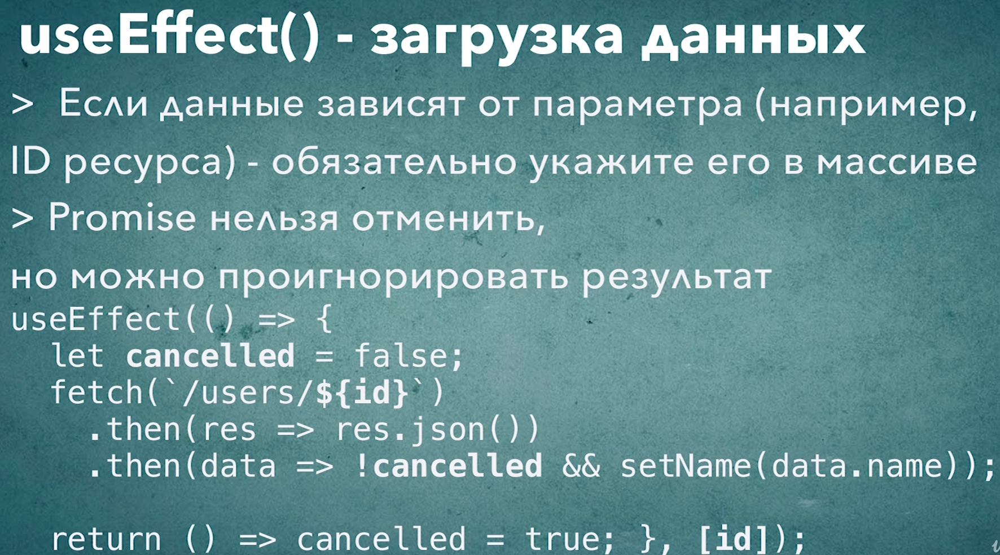

# 006_useEffect-загрузка_данных

Давайте создадим функциональный компонент который отображает название планеты с заданным id.

Создаю компонент PlanetInfo

```js
import React from "react";

const PlanetInfo = ({ id }) => {
  return <div>{id} - Planet Name</div>;
};

export default PlanetInfo;

```

```js
import React, { useState } from "react";
import PlanetInfo from "../PlanetInfo/PlanetInfo";

const App = () => {
  const [value, setValue] = useState(0);
  const [visible, setVisible] = useState(true);

  if (visible) {
    return (
      <div>
        <button onClick={() => setValue((value) => value + 1)}>+</button>
        <button onClick={() => setVisible(false)}>hide</button>
        <PlanetInfo id={value} />
      </div>
    );
  } else {
    return <button onClick={() => setVisible(true)}>show</button>;
  }
};

export default App;

```

и так вот сам написал. Еще изменил начало счетчика.

```js
import React, { useEffect, useState } from "react";

const PlanetInfo = ({ id }) => {
    const [planet, setPlanet] = useState(null);
    useEffect(() => {
        fetch(`https://swapi.dev/api/planets/${id}`)
            .then((result) => result.json())
            .then((data) => {
                setPlanet(data.name);
            });
    }, [id]);
    return (
        <div>
            {id} - {planet}
        </div>
    );
};

export default PlanetInfo;

```

```js
import React, { useState } from "react";
import PlanetInfo from "../PlanetInfo/PlanetInfo";

const App = () => {
  const [value, setValue] = useState(1);
  const [visible, setVisible] = useState(true);

  if (visible) {
    return (
      <div>
        <button onClick={() => setValue((value) => value + 1)}>+</button>
        <button onClick={() => setVisible(false)}>hide</button>
        <PlanetInfo id={value} />
      </div>
    );
  } else {
    return <button onClick={() => setVisible(true)}>show</button>;
  }
};

export default App;

```


Казалось бы все можно переходить к следующей задаче. 

Но давайте представим на секунду что мы начали загружать первую планету, и загрузка данных скажем занимает секунд пять. Но через секунду мы решили что нам не интересно загружать первую планету и мы переключились на загрузку второй планеты. 

Вот когда мы переключились на загрузку второй планеты, callback все равно отработает когда загрузяться данные первой планеты.

И вот здесь происходит интересный пмомент. Когда вы переключились на вторую планету, а первая еще не загружена, у нас случается так называемый array condition. У нас есть два запроса которые прямо сейчас идит к серверу. И в зависимости от того какой из этих запросов вернется первым, наш компонент отобразит либо правильные данные, либо не правильные данные. Когда у нас будет id от одной планеты а название еще от другой планеты.

Для того что бы это исправить нам достаточно отменить promise который получает данные планеты, но к сожалению в JS promise отменить нельзя.

По этому нам придется придумать свой собственный способ очищать этот эффект.

Добавляю переменную let cancelled и по умолчанию она будет false. cancelled - это будет флаг который будет говорить нужноли нам применять результат promise или нет. Или мы решили что этот promise не имеет смысла и результат этот promise нужно игнорировать.

```js
import React, { useEffect, useState } from "react";

const PlanetInfo = ({ id }) => {
  const [planet, setPlanet] = useState(null);
  useEffect(() => {
    let cancelled = false;
    fetch(`https://swapi.dev/api/planets/${id}`)
      .then((result) => result.json())
      .then((data) => {
        !cancelled && setPlanet(data.name);
      });
    // функция очистки
    return () => (cancelled = true);
  }, [id]);
  return (
    <div>
      {id} - {planet}
    </div>
  );
};

export default PlanetInfo;

```

Таким образом мы запускаем эффект. Мы обновляем нашу планету. Начинается загрузка данных, если еще раз в этот момент мы обновим id планеты, мы заново начнем грузить данные, но для предыдущего эффекта выполнится вот эта функция return () => (cancelled = true); И когда тот предыдущий эффект закончит загружать данные мы будем знать что несмотря на то что у нас есть данные мы ничего не хотим с ними делать потому что мы решили их игнорировать !canceled.

Кстати точно такой же проблемой страдает наша реализация в StarDB.




