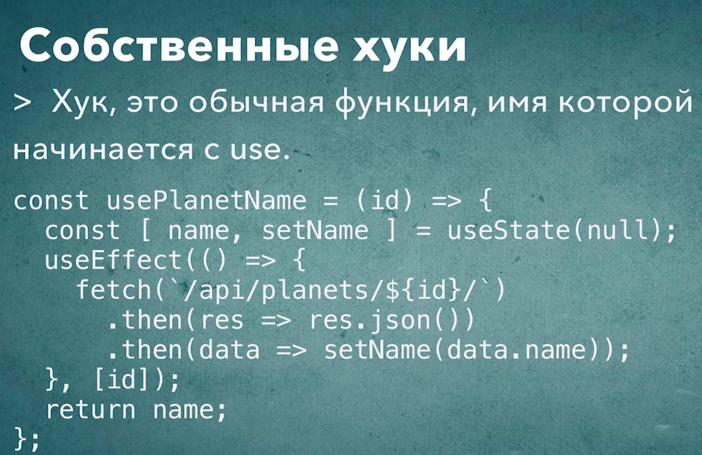

# 007_Создание_собственных_хуков

Если помните раньше мы говорили что хуки в React это точно такой же паттерн переиспользования кода как к примеру компоненты высшего порядка.

И в этом видео мы посмотрим как создать свой собственный хук.

Если вы сейчас вспомнили все те уроки по созданию компонентов высшего порядка, все эти сложные конструкции которые нам приходилось писать, то не волнуйтесь, создание собственного хука намного проще чем создание компонента высшего порядка.

Ваш собственных хук - это любая функция которая начинается с ключевого слова use, и может использовать другие хуки.

Вынесем блок логики который отвечает за загрузку планеты и за сохранение имени планеты в state в свой собственный хук.

создаю папку myHooks, ну что бы отличалось от имени проекта. А так в своих проектах можно назвать hooks, это я от себя. А в папке создаю usePlanetInfo.

создаю функцию usePlanetInfo, для работы этой функции понадобится id той планеты которую мы будем загружать.

```js
//src/myHooks/usePlanetInfo.js
import { useEffect, useState } from "react";

const usePlanetInfo = (id) => {
    const [name, setName] = useState(null);

    useEffect(() => {
        let cancelled = false;
        fetch(`https://swapi.dev/api/planets/${id}`)
            .then((result) => result.json())
            .then((data) => {
                !cancelled && setName(data.name);
            });
        // функция очистки
        return () => (cancelled = true);
    }, [id]);
    return name;
};

export default usePlanetInfo;


```

Использовать хук проще простого.

```js
import React from "react";
import usePlanetInfo from "../../myHooks/usePlanetInfo";

const PlanetInfo = ({ id }) => {
  const name = usePlanetInfo(id);
  return (
    <div>
      {id} - {name}
    </div>
  );
};

export default PlanetInfo;

```


Теперь нашему компоненту PlanetInfo абсолютно не важно каким именно способом загружается планета или как сохраняется результат загрузки этой планеты.

Согласитесь такая модель работы с переиспользуемым кодом намного проще чем компоненты высшего порядка.



