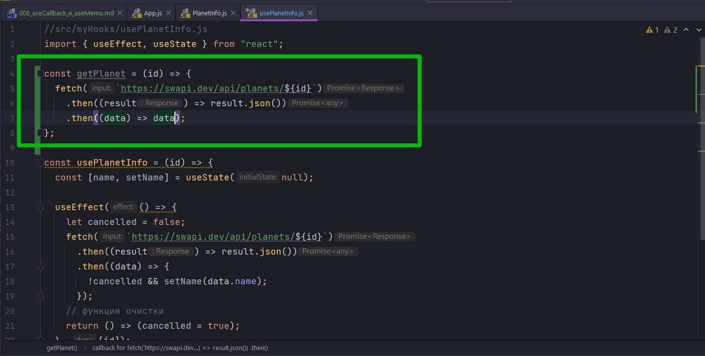

# 008_useCallback_и_useMemo

В прошлых уроках мы рассмотрели как создавать свои собственные просты хуки.

Но а теперь пришло время рассмотреть работу с хуками и работу с данными в хуках немножечко глубже. Мы будет продолжать туже тему. Мы будем получать данные с swapi.dev.

Только в этот раз мы разделим хук usePlanetInfo на несколько более гибких и универсальных хуков.

Если вы помните, когда мы создавали приложение StarDB, мы выделили отдельный класс сервис в котором методы отвечали за получение конкретных данных. И этот подход оправдывает себя в средних и крупных приложениях поскольку он позволяет абстрагировать получения данных. Т.е. ваше приложение не знает откуда именно приходят данные и как они обрабатываются до тех пор пока они не попадают собственно в приложение.


Давайте создадим более универсальный хук который может получить данные совершенно из любой асинхронной функции.

В качестве примера мы возьмем туже функцию которая получает данные о планете. Создадим getPlanet. Эта функция будет принимать id планеты и запускать все тот же зпрос при помощи fetch.



Функция getPlanet будет просто возвращать все данные. Это пример асинхронной функци которая получает как-то данные.

А теперь нам нужен хук который может взять любую асинхронную функцию и получить из нее данные. При этом мы сделаем так что бы этот хук учитывал значение cancelled что бы мы могли отменить обработку этих самых данных. Создаю хук который будет называться useRequest. И он будет принимать функция request

```js
//src/myHooks/useRequest.js
import { useEffect, useState } from "react";

const useRequest = (request) => {
    const [dataState, setDataState] = useState(null);

    useEffect(() => {
        let cancelled = false;
        request().then((data) => !cancelled && setDataState(data));
        // функция очистки
        return () => (cancelled = true);
    }, [request]);
    return dataState;
};

export default useRequest;

```

И так опишу подробнее. И так в состоянии заменяю состояние на dataState и функцию изменнения состояния назову setDataState.

Вместо fetch запроса я вызываю функцию request, функция в которой будет содержаться результат запроса fetch. Затем когда мы получим данные мы точно так же как и раньше  будем проверять значение cancelled и если мы не !cancelled т.е. false, мы будем использовать setDataState(data) и передавать туда данные. И затем возвращать данные из этого хука.


Теперь у нас с вами появился довольно мощный хук который может получать данные из совершенно любой асинхронной функции, из либой функции которая возвращает promise.

И осталось самая малость. Давайте обновим код PlanetInfo. 

Все что мне теперь нужно сделать это создать функцию запрос, функцию request. Эта функция будет выглядеть как getPlanet c заданным id. И возвращаю useRequest(request) в который помещаю функцию request.

```js
import React from "react";
import usePlanetInfo from "../../myHooks/usePlanetInfo";

const PlanetInfo = ({ id }) => {
  const data = usePlanetInfo(id);
  return (
    <div>
      {id} - {data && data.name}
    </div>
  );
};

export default PlanetInfo;

```

```js
//src/requestsAPI/requestsAPI.js
const getPlanet = (id) => {
  return fetch(`https://swapi.dev/api/planets/${id}`)
    .then((result) => result.json())
    .then((data) => data);
};

export { getPlanet };

```

```js
//src/myHooks/usePlanetInfo.js
import useRequest from "./useRequest";
import { getPlanet } from "../requestsAPI/requestsAPI";

const usePlanetInfo = (id) => {
  const request = getPlanet(id);
  return useRequest(request);
};

export default usePlanetInfo;

```

```js
//src/myHooks/useRequest.js
import { useEffect, useState } from "react";

const useRequest = (request) => {
  const [dataState, setDataState] = useState(null);

  useEffect(() => {
    let cancelled = false;
    request.then((data) => !cancelled && setDataState(data));
    // функция очистки
    return () => (cancelled = true);
  }, [request]);
  return dataState;
};

export default useRequest;

```


Перед тем как продолжать зайдем в devTools Network и посмотрим что творится здесь.


Как видим запросы постоянно отправляются. Судя по всему в нашем приложении идет фикл отправки этих запросов на сервер. При чем мы каждый раз мы отправляем один и тот же запрос.

Когда вы видите в вашем приложении поведение такого рода, когда что-то обновляется чаще чем оно обновляется, чаще всего ошибка происходит в useEffect.

Все дело в том как работают зависимости в useEffect. В нашем случае проблема находится вот здесь.


Дело в том что каждый раз когда мы запускаем usePlanetInfo, request создается заново. Т.е. каждый раз мы создаем функцию request, передаем ее в useRequest(request). 


useRequest передает эту функцию в качестве зависимости в useEffect


Наш хук затем определяет в списке зависимостей useEffect что request изменился, и считает что нужно перезапустить наш useEffect. Он перезапускает заново useEffect, мы отправляем заново данные, мы получаем данные вызываем setDataState который изменяет state, а поскольку state изменился мы снова обновляем компонент и снова идем по тому же кругу. И так до бесконечности.

Нам нужно как-то сделать так что бы вот эта функция


не пересоздавалась заново если id не изменился.

И для того что бы это сделать нужно использовать еще один React Hook.


## useCallback

useCallback - принимает функцию, нашу функцию callback. А в качесве второго аргумента useCallback принимает точно так же как useEffect массив зависимостей. В списке зависимостей указываю id.

```js
//src/myHooks/usePlanetInfo.js
import useRequest from "./useRequest";
import { getPlanet } from "../requestsAPI/requestsAPI";
import { useCallback } from "react";

const usePlanetInfo = (id) => {
  const request = useCallback(() => getPlanet(id), [id]);

  return useRequest(request);
};

export default usePlanetInfo;

```


Все проблема решена. Этот паттерн используется довольно часто когда ваши хуки зависят от функций. Пересозавать функцию каждый раз как правило не имеет смысла. Более того это может привести к неправильной работе приложения.

Нам нужно использовать useCallback который запоминает значение функции которую мы в него передали, и обновляет ее только тогда когда данные в массиве зависимостей изменились с прошлого вызова. Этот паттерн, когда мы как бы кэшируем значение, называется Memo, и довольно часто используется в React.

<br/>
<br/>
<br/>

## Отслеживание состояния загрузки

Ну а теперь сделаем наш хук useRequest еще более мощным. Давайте сделаем так что бы этот хук отслеживал состояние загрузки. Что бы у нас был loading. И состояние если у нас вдруг происходит ошибка, состояние error.


Если вы помните, когда мы создавали starDB у нас был отдельный флаг data:null это данные. У нас был отдельный флаг который назывался loading:true - если он true то это означает что мы сейчас загружаем данные и мы пока не знаем получим мы данные или получим ошибку. И error:null - это состояие когда у нас есть ошибка и в этом поле будет храниться объект ошибки.


Теперь обновим useEffect. В первую очередь когда мы начинаем загружать данные установим первоначальное состояние.

Читай код

```js
//src/myHooks/useRequest.js
import { useEffect, useState } from "react";

const useRequest = (request) => {
  const [dataState, setDataState] = useState({
    data: null,
    loading: true,
    error: null,
  });

  useEffect(() => {
    //Начало загрузки, первоначальное состояние
    setDataState({
      data: null,
      loading: true,
      error: null,
    });
    //Получаю данные
    let cancelled = false;
    request()
      .then(
        (data) =>
          !cancelled && setDataState({ data, loading: false, error: null })
      )
      .catch(
        (error) =>
          !cancelled && setDataState({ data: null, loading: false, error })
      );
    // функция очистки
    // Если request изменился а данные еще не загружены, то срабатывает функция очистки
    //надеюсь не ошибаюсь
    return () => (cancelled = true);
  }, [request]);
  return dataState;
};

export default useRequest;

```

Ну и теперь нам нужно немного обновить тот компонент который получает дынные.

Теперь мы получаем не просто данные data, но еще и loading и error.

```js
import React from "react";
import usePlanetInfo from "../../myHooks/usePlanetInfo";

const PlanetInfo = ({ id }) => {
  const { data, loading, error } = usePlanetInfo(id);
  //Если получаем ошибку
  if (error) {
    return <div>Something is wrong</div>;
  }
  //Если мы сейчас загружаем данные
  if (loading) {
    return <div>Loading...</div>;
  }
  
  // Если есть данные то возвращаю данные
  return (
    <div>
      {id} - {data.name}
    </div>
  );
};

export default PlanetInfo;

```


<br/>
<br/>
<br/>

И давайте посмотрим еще на один маленький момент.  Смотрите два одинаковых блока кода.


Первый блок кода это наше начальное состояние. Второй блок кода это когда мы начинаем загружать наши данные. Сначало мы устанавливаем state, затем как только мы начинаем загружать данные мы сбрасываем первоначальный state. ВСПОМНИ ЧТО В ФУНКЦИОНАЛЬНОМ ПРОГРАММИРОВАНИИ ТЫ НЕ МОЖЕШЬ МЕНЯТЬ ОТДЕЛЬНОЕ ПОЛЕ state, ТЫ МЕНЯЕШЬ ВЕСЬ state ЦЕЛИКОМ, НЕ ТАК КАК В ООП ПРИ ИСПОЛЬЗОВАНИИ КЛАССОВЫХ КОМПОНЕНТОВ!!!! ПО ЭТОМУ ПРИХОДИТСЯ ДУБЛИРОВАТЬ КОД, ЧТО БЫ НЕ ПОТЕРЯТЬ КАКОЕ_НИбУДЬ ПОЛЕ ИЗ state.

Естественно будет лючше вынести значение state в отдельную переменную. ДАВАЙТЕ ПОПРОБУЕМ СДЕЛАТЬ ЭТО НАИВНЫМ СПОСОБОМ.


И теперь я могу использовать initialState в самом useEffect.


```js
//src/myHooks/useRequest.js
import { useEffect, useState } from "react";

const useRequest = (request) => {
  //Инициализация состояния
  const initialState = {
    data: null,
    loading: true,
    error: null,
  };
  const [dataState, setDataState] = useState(initialState);

  useEffect(() => {
    //Начало загрузки, первоначальное состояние
    setDataState(initialState);

    //Получаю данные
    let cancelled = false;
    request()
      .then(
        (data) =>
          !cancelled && setDataState({ data, loading: false, error: null })
      )
      .catch(
        (error) =>
          !cancelled && setDataState({ data: null, loading: false, error })
      );
    // функция очистки
    // Если request изменился а данные еще не загружены, то срабатывает функция очистки
    //надеюсь не ошибаюсь
    return () => (cancelled = true);
  }, [request]);
  return dataState;
};

export default useRequest;

```


Посмотрите на этот код и подумайте есть ли в этом коде какая-нибудь проблема? Что здесь может пойти не так?

У него выдает предупреждение, а у меня нет, хотя warning выставлен в devTools.


Это помтому что initialState нет в списке зависимостей useEffect. Ок, пробую добавить.


И вот оно опять. Постоянно один и тот же запрос в первому id, и так по кругу до бесконечности.

Мы каждый раз создаем объект initialState. В списке зависимостей useEffect мы указали что мы зависим от нашего initialState. Ну и соответственно как только мы создаем новый объект useEffect перезапускается и мы заново переходим в тот же цикл. У нас перезапускается функция useRequest, в useRequest создается новый объект initialState, новый initialState передается в useEffect, useEffect считает что у нас изменились данные и перезапускаем useEffect и так до бесконечности.

Первую такую же проблему мы решили через useCallback, который как бы запоминал значение функции и возвращал одну и туже ссылку на функцию до тех пор пока id указанный в списке зависимостей не изменялся.


Так вот для работы с объектами есть еще один хук который называется useMemo(). useMemo() - принимает функцию которая возвращает наше значение, эта функция будет возвращать наше состояние, наш initialState. И вторым аргументом указываю список зависимостей от которых наши данные зависят. Если мы укажем пустой массив, то наше значение не зависит не от каких данных и оно будет вычисляться только один раз.

```js
//src/myHooks/useRequest.js
import { useEffect, useState, useMemo } from "react";

const useRequest = (request) => {
  //Инициализация состояния
  const initialState = useMemo(
    () => ({
      data: null,
      loading: true,
      error: null,
    }),
    []
  );
  const [dataState, setDataState] = useState(initialState);

  useEffect(() => {
    //Начало загрузки, первоначальное состояние
    setDataState(initialState);

    //Получаю данные
    let cancelled = false;
    request()
      .then(
        (data) =>
          !cancelled && setDataState({ data, loading: false, error: null })
      )
      .catch(
        (error) =>
          !cancelled && setDataState({ data: null, loading: false, error })
      );
    // функция очистки
    // Если request изменился а данные еще не загружены, то срабатывает функция очистки
    //надеюсь не ошибаюсь
    return () => (cancelled = true);
  }, [request, initialState]);
  return dataState;
};

export default useRequest;

```


Теперь мы как и положено посылаем по одному запросу.


Хук useMemo работает практически так же как и useCallback. только useCallback кэширует само значение, т.е. функцию, НАВЕРНОЕ ЕЕ РЕЗУЛЬТАТ.

А useMemo - кэширует результат вложеннй в него функции, функции которая возвращает объект состояния.

В остальном эти хуки работают абсолютно одинаково. И соответственно у них абсолютно одинаковый паттерн использования.

Если в вашем хуке вам нужно создавать какое-нибудь значение, которое вы затем будете передавать в useEffect, useEffect будет использовать это состояние что бы сравнить старое состояние и новое


то нам нужно кэшировать значение, поскольку если вы создаете новый объект, даже если все значения внутри объекта одинаковые - это все рано является новым объектом. И при сравненни двух разных объектов с абсолютно одинаковыми полями useEffect будет говорить что это разные объекты и нам нужно перезапустить useEffect.


Обратите внимание на очень важный блок документации по хуку useMemo ну и по хуку useCallback <https://reactjs.org/docs/hooks-reference.html#usememo>


