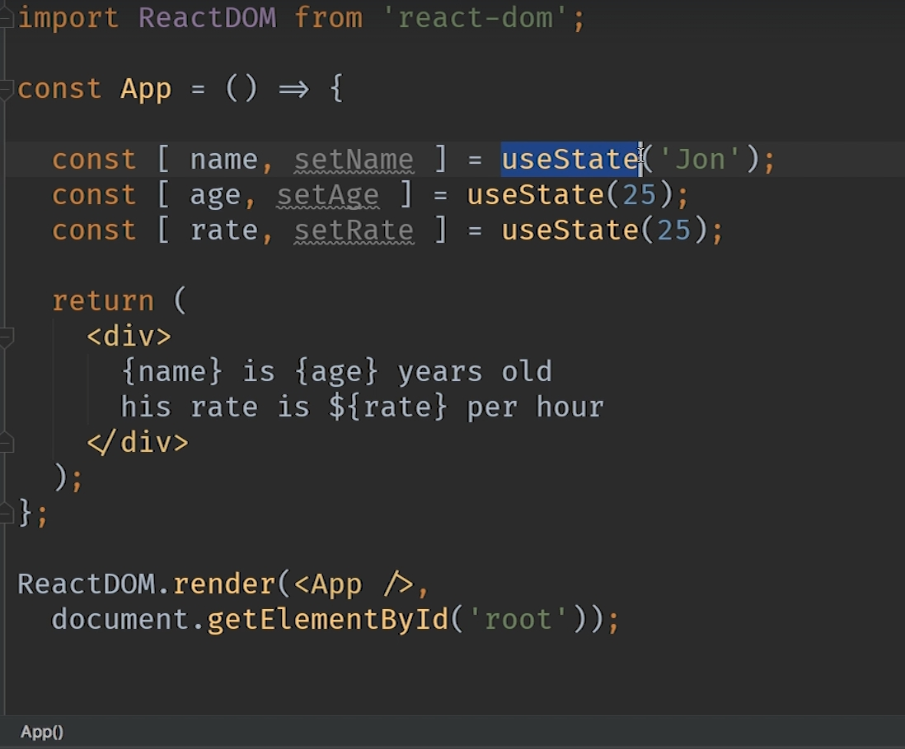
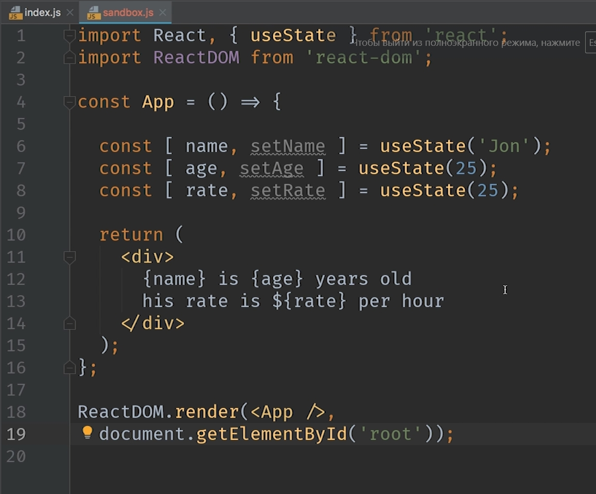
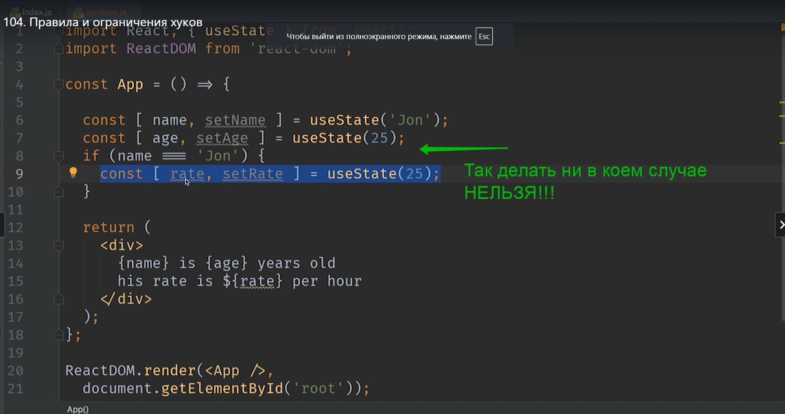
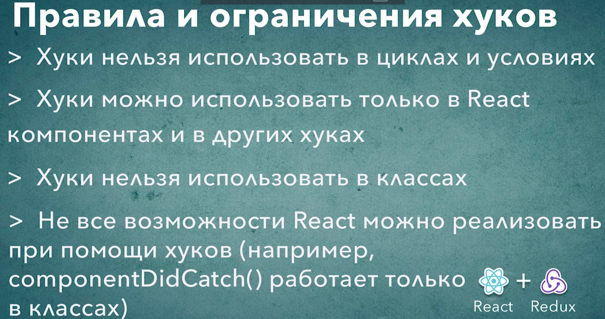

# 009_Правила_и_ограничения_хуков

Вы уже наверняка задумывались как React определяет что вот этот  useState относится имеенно к name? А вот этот useState к age? И как useState age отличается от rate если они используют абсолютно одинаковое значение по умолчанию? Ведь функция useState это обычная JS фунция. Она ни как не может знать каким переменным мы присваиваем ее результат.

На самом дле здесь нет ни какой магии и все работает очень просто. Для каждого экземпляра компонента React будет использовать обычный массив для того что бы сохранять значения которые нужны для работы хуков.

Если сильно упростить эту модель

Когда мы запустим это приложение где то в React появится массив из трех элементов. В первом элементе будет значение 'Jon', во втором элементе 25, и в третьем элементе тоже 25. 

И до тех пор пока мы будем вызывать наши хуки строго последовательно, не изменять порядок вызовов, и не пропускать вызовы все будет работать замечательно.

Но как только в нашем коде эта последовательность будет нарушена хуки перестанут нормально работать.

1. Из этого следует первое самое главное правило использования хуков. Когда мы используем хуки мы например не можем ставить условное выражение. Поскольку мы каждый раз когда вызываем хуки для нашего компонента мы должны вызывать их строго последовательно.

Тоже самое касается и циклов. Хуки нельзя запускать в цикле, поскольку каждый раз когда React будет вызывать функцию компонента, хуки должны вызываться одинаковое количество раз и в одинаковой последовательности. Таким образом если у нашего цикла будет переменное количество итераций, то хуки тоже сломаются. Соответственно хуки нельзя вызывать в условных операторах, хуки нельзя вызывать в циклах. 
Хуки можно вызывать только в компонентах функциях на верхнем уровне и только так что бы их последовательность была одинаковой для каждого вызова этой функции.

2. Второе правило тоже довольно очевидное. Хуки можно вызывать только в React компонентах или в друих собственных хуках. Хуками нельзя пользоваться в обычных функциях которые не являются React компонентами. ПРИЧИНА ДЛЯ ЭТОГО ПРАВИЛА ОЧЕНЬ ПРОСТАЯ. React связывает то состояние которое мы сохраняем в хуках с конкретным экземпляром конкретного компонента. Если у нас нет компонента, если мы пытаемся вызвать хук из обычной функции, которая не является React компонентом, то React не будет знать каким образом сохранить эти данные, а затем корректно вернуть их обратно.

Еще раз. Хуки можно использовать только в React функциях  или в собственных хуках.

Хуки работают в функциональных компонентах. Хуки не работают в классах.

Что это означает на практике?

Например если  вас есть большой компонент класс. Вы не можете перевести часть работы этого класса на хуки, а другую часть оставить в классе. ТАК РАБОТАТЬ НЕ БУДЕТ.  Если вам нужно перевести компонент класс на хуки, вам придется перевести полностью весь компонент и сделать его полностью функциональным.

НЕ ВСЕ МЕТОДЫ ЖИЗНЕННОГО ЦИКЛА КОМПОНЕНТА ПОКРЫВАЮТСЯ ХУКАМИ!!! Например при помощи хука нельзя создать componentDidCatch т.е. нельзя создать ErrorBoundary, для этого все еще придется использовать класс.

