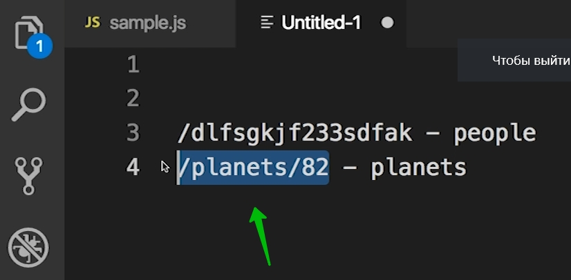

# 001_Что_такое_роутинг

И так для начало обновил React в starDB до версии 18.0.0.

И так в этом разделе еще буду пробовать использовать новую версию React-Router отличающуюся от того что будет в курсе. Постараюсь описать и тот и тот подход.

Этот раздел посвящен роутингу и библиотеке React-Router. В этом раздеде мы научимся как разбить наше приложение на страницы, так что бы Персонажи, Планеты и Космические корабли отображались каждый на своей собственной странице. 

Мы вместе посмотрим на библиотеку React-Router которая позволяет это довольно просто сделать. И посмотрим разные стратегии того как можно разбивать приложение на страницы.

Перед тем как устанавливать библиотеку React-Router и начинать писать код. Давайте немножечко подробнее остановимся на том что именно мы подразумеваем под словом Роутинг, что бы у нас с вами было точно одинаковое понимание и одинаковые цели на этот раздел.

UI - приложения как правило довольно сложные. И для того что бы их упростить их проще разбить на некие блоки которые будут по очереди отображаться. Все равно что страницы на обычном класическом вэб-сайте. Только мы с вами делаем не обычный сайт. А мы делаем Single Page Application т.е. одностраничное приложение. Это значит что пользователь загружает одну страницу и затем он остается на этой странице. И когда мы говорим про переход между страницами, в React приложении, мы имеем ввиду что мы будем скрывать или отображать какие-нибудь блоки этого приложения которые соответствуют этой странице. Не перезагружая при этом все приложение.

Представим себе что мы пишем довольно большое приложение. Скажем там десятки или даже сотни страниц. И у вас появляется задача переключать эти страницы когда пользователь нажимает на определенные ссылки.

Когда в вашем приложении появляется понятие страницы. У ва появляется задача как-нибудь эти задачи индентифицировать или называть. И давать индентификаторы страницам можно совершенно по разному.  

К примеру вы можете сказать что у каждой страницы будет свой id и это будет число.

Но така стратегия не очень удобная. Есть стратегии намного лучше.

Мы можем в качестве адресов или индентификаторов страниц использовать структуру которая похожа на структуру url.

К примеру страница people будет индентифицироваться вот так.

Таким способом эти уникальные id страниц читать намного проще. Мы можем развить эту идею и закодировать в адресе страницы еще и id ресурса который сейчас отображается.

такое вот подражание структуре url это не строгое требование. Точно так же вы могли бы называть страницу персонажа с id=1 к примеру people-1, или дать этой странице какой-нибудь индентификатор из ничего обозначающего набора символов и цифр

Главное что если у вас есть способ сказать что по этому id нужно отобразить страницу, к примеру people, то вы можете реализовать правило роутинга.

Тем не менее на практике, когда нужно реализовать роутинг вот такая структура используется чаще всего. Даже не в браузерных приложениях.

И так когда мы говорим о Роутинге в контексте Single Page Application, мы имеем ввиду функционал приложения который позволяет пользователю переключать странцы. И Router это тот компонент который зная id страницы

может сказать какие именно компоненты приложения сейчас нужно отобразить на экране.

Кстати в Single Page Application id страницы называется словом Route скорее по историческим причинам. Это название пришло еще с тех времен когда страницы были статичными файлами на сервере. И тогла что бы загрузить страницу нужно было пройти по этому пути что бы найти нужный файл в дереве папок на сервере, в файловой системе на сервере. Отсюда и название Route. Ну и сам функционал переключения страниц на сервере называется словом Routing.

Именно эту функциональность и реализует библиотека React Router. Эта библиотека по сути делает всего две вещи:

1. Прочитав текущий url эта библиотека может выбрать какие именно компоненты сейчас нужно отобразить пользователю.
2. Когда пользователь переходит на новую страницу это библиотека обновляет url так что бы новый url отображал эту новую страницу на которую перешел пользователь.

Для нас понятие страниц и переходов это чисто виртуальное понятие которых на самом деле не существует.

Мы создаем Single Page Application, по этому у нас на самом деле одна страница. И когда мы говорим с вами что переходим со стриницы people на страницу planets - это означает что мы открываем компоненты которые нужны были для страницы people и отображаем компоненты которые нужны для страницы planets. Но все это происходит в рамках одной и тоже страницы браузера.

