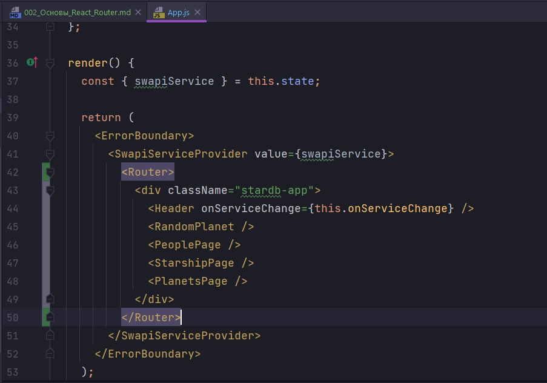
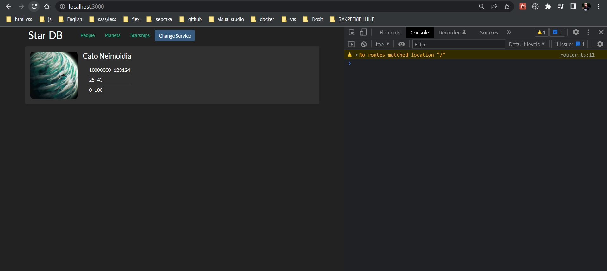
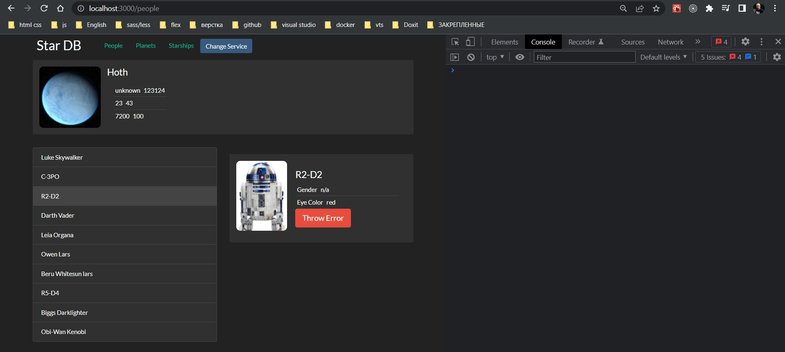
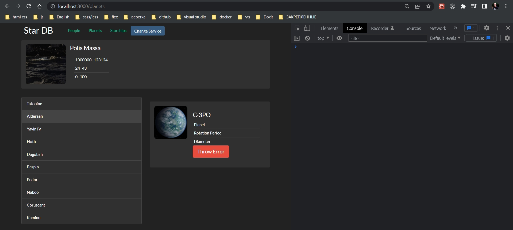
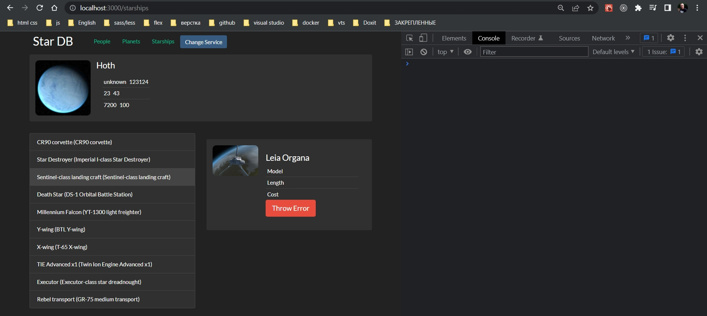
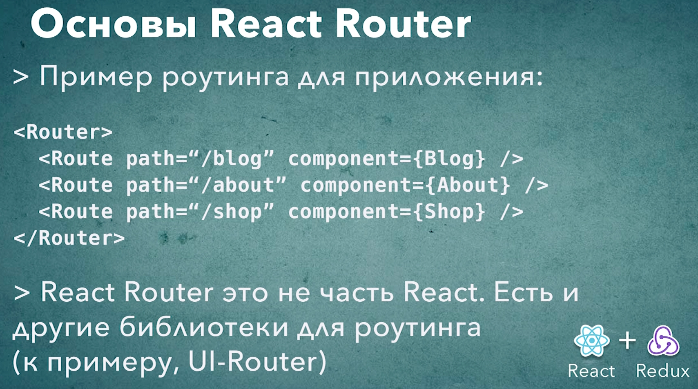

# 002_Основы_React_Router

```shell
npm install react-router-dom
```

React Router пошел по тому же пути что и React. Разбил свою библиотеку на несколько версий. 

react-router-dom - это версия для браузера.

Кроме того есть версия для React Native.

И так пока в компоненте App проимпортирую несколько полезных вещей BrowserRouter который переименовываю просто в Router.

И второй компонент который мне понадобится это компонент Route.
Используя эти компоненты мы сможем сконфигурировать страницы для нашего приложения.


Перейдем в функцию render. Для того что бы сконфигурировать наши страницы нам нужно обернуть наше приложение в компонент Router.    


Прямо сейчас мы отображаем все три страницы одну за другой. Мы можем пока что удалить эти компоненты PeoplePage, StarshipPage,PlanetsPage. 

Вместо них я использую компонент Route для того что бы сконфигурировать какие именно компоненты будут отображаться в зависимости от того какой адрес вводит пользователь.

Для того что бы сконфигурировать Route ему нужно передать два свойства:

1. path - то какой путь будет у это страницы
2. component - это то какой именно компонент будет отображаться(используется до v6 после этот параметр называется element ).

<https://reactrouter.com/docs/en/v6/getting-started/overview>


```js
//src/component/app?App.js
import React, { Component } from "react";
import Header from "../header/header";
import "./App.css";
import SwapiService from "../../services/SwapiService";
import ErrorBoundary from "../errorBoundary/errorBoundary";
import { SwapiServiceProvider } from "../swapiServiceContext/swapiServiceContext";
import DummySwapiService from "../../services/dummySwapiService";
import RandomPlanet from "../randomPlanet/randomPlanet";
import PeoplePage from "../pages/peoplePage/peoplePage";
import PlanetsPage from "../pages/planetsPage/planetsPage";
import StarshipPage from "../pages/starshipPage/starshipPage";

import { BrowserRouter as Router, Routes, Route } from "react-router-dom";

class App extends Component {
    state = {
        swapiService: new SwapiService(),
    };

    //Функция переключения сервисов API
    onServiceChange = () => {
        this.setState(({ swapiService }) => {
            //Наш новый сервис зависит от того какой тип у текущего сервиса
            const Service =
                swapiService instanceof SwapiService ? DummySwapiService : SwapiService;
            // Проверяю переключение
            console.log("switched to", Service.name);
            //Возвращаю обновленную часть состояния
            return {
                swapiService: new Service(),
            };
        });
    };

    render() {
        const { swapiService } = this.state;

        return (
            <ErrorBoundary>
                <SwapiServiceProvider value={swapiService}>
                    <Router>
                        <div className="stardb-app">
                            <Header onServiceChange={this.onServiceChange} />
                            <RandomPlanet />

                            <Routes>
                                <Route path="/people" element={<PeoplePage />} />
                                <Route path="/planets" element={<PlanetsPage />} />
                                <Route path="/starships" element={<StarshipPage />} />
                            </Routes>
                        </div>
                    </Router>
                </SwapiServiceProvider>
            </ErrorBoundary>
        );
    }
}

export default App;

```

Главная страница нешего приложения стала пустой.


Это произошло потому что у каждой нашей страницы теперь есть собственный адрес. У нас нет ни какого контента для главной страницы.







Для того что бы разбить наше приложение на страницы Мы сделали всего две вещи. Мы обернули наше приложение в компонент Router. Обернули в корневой элемент Routes для того что бы можно было поместить в его тело множество компонентов Route.

ЧИТАЙ ВНИМАТЕЛЬНО СТАТЬЮ Т.К. ЕСТЬ ИЗМЕНЕНИЯ В V6

