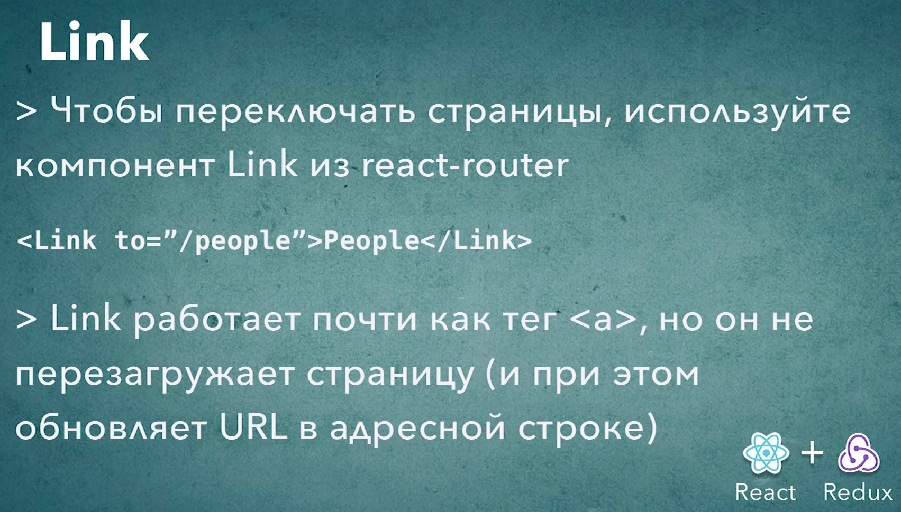

# 003_Link

Для перехода по ссылкам мы должны использовать специальный компонент Link

```js
//src/component/header/header.js
import React from "react";
import { Link } from "react-router-dom";
import "./header.css";

const Header = ({ onServiceChange }) => {
  return (
    <div className="header d-flex">
      <h3>
        <a href="#">Star DB</a>
      </h3>
      <ul className="d-flex">
        <li>
          <Link to="/people">People</Link>
        </li>
        <li>
          <Link to="/planets">Planets</Link>
        </li>
        <li>
          <Link to="/starships">Starships</Link>
        </li>
      </ul>
      <button className="btn btn-primary bt-sm" onClick={onServiceChange}>
        Change Service
      </button>
    </div>
  );
};

export default Header;

```

И наша навигация работает. 

Возникает только один вопрос. Зачем нужно было использовать специальный компонент Link а не просто обычную ссылку, тег a?

Все дело в том что если мы поставим обычную ссылку, то клик по этой ссылке будет перезагружать всю страницу, поскольку это переход на новую страницу в браузере. Но поскольку мы с вами делаем Single Page Application,  то мы не хотим что бы пользователь в действительности покидал нашу страницу.

Компонент Link это немного более умный компонент. Он использует history API браузера для того что бы обновить адрес в адресной строке, но при этом не перезагружает страницу.

Если вы посмотрите внуть Link через devTools то увидите тег а href, только он дополнительно обрабатывается так что бы страница браузера не перезагружалась.



