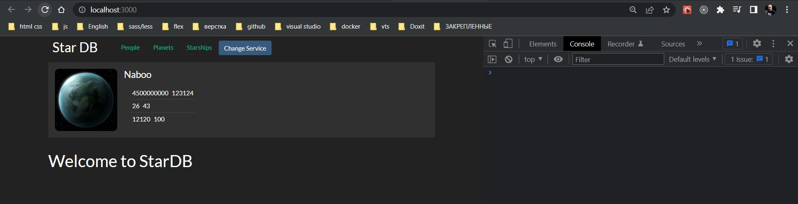

# 004_Как_работает_Route

Прямо сейчас главная страница нашего приложения выглядит довольно одиноко. На ней нет ни какого содержимого. Было бы хорошо добавить хот какой-то приветственный текст.

Для этого создадим отдельный path который будет указывать на корень, на начальную страницу приложения.

Создаю Route c корневым путем. Так же я могу передать render функцию. Функцию render в V6 убрали. По этому просто использую element и передаю не функцию, а React-элемент

```js
//src/component/app?App.js
import React, { Component } from "react";
import Header from "../header/header";
import "./App.css";
import SwapiService from "../../services/SwapiService";
import ErrorBoundary from "../errorBoundary/errorBoundary";
import { SwapiServiceProvider } from "../swapiServiceContext/swapiServiceContext";
import DummySwapiService from "../../services/dummySwapiService";
import RandomPlanet from "../randomPlanet/randomPlanet";
import PeoplePage from "../pages/peoplePage/peoplePage";
import PlanetsPage from "../pages/planetsPage/planetsPage";
import StarshipPage from "../pages/starshipPage/starshipPage";

import { BrowserRouter as Router, Routes, Route } from "react-router-dom";

class App extends Component {
  state = {
    swapiService: new SwapiService(),
  };

  //Функция переключения сервисов API
  onServiceChange = () => {
    this.setState(({ swapiService }) => {
      //Наш новый сервис зависит от того какой тип у текущего сервиса
      const Service =
        swapiService instanceof SwapiService ? DummySwapiService : SwapiService;
      // Проверяю переключение
      console.log("switched to", Service.name);
      //Возвращаю обновленную часть состояния
      return {
        swapiService: new Service(),
      };
    });
  };

  render() {
    const { swapiService } = this.state;

    return (
      <ErrorBoundary>
        <SwapiServiceProvider value={swapiService}>
          <Router>
            <div className="stardb-app">
              <Header onServiceChange={this.onServiceChange} />
              <RandomPlanet />

              <Routes>
                <Route path="/" element={<h2>Welcome to StarDB</h2>} />
                <Route path="/people" element={<PeoplePage />} />
                <Route path="/planets" element={<PlanetsPage />} />
                <Route path="/starships" element={<StarshipPage />} />
              </Routes>
            </div>
          </Router>
        </SwapiServiceProvider>
      </ErrorBoundary>
    );
  }
}

export default App;

```



Но смотрите что происходит.

 Лично у него происходит такая проблема что при переход на другие страницы контент главного роута остается и отображается по другим роутам. В V6 такого нет.

По версиям ниже V6. Когда React Router выбирает какие компоненты отобразить, то он отвечает на вопрос содержит ли текущий адрес тот путь который указат в path. Именно содержит а не в точности является. Прямой слеш содержится в любом пути.

Что бы исправить это нужно указать параметр exact который говорит что адрес должен в точности совпадать.


